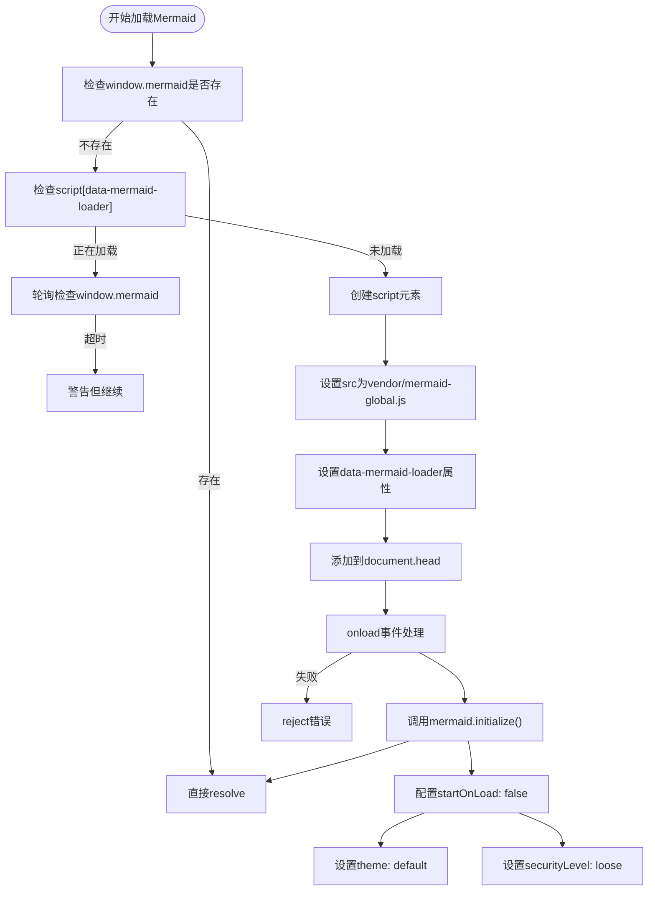
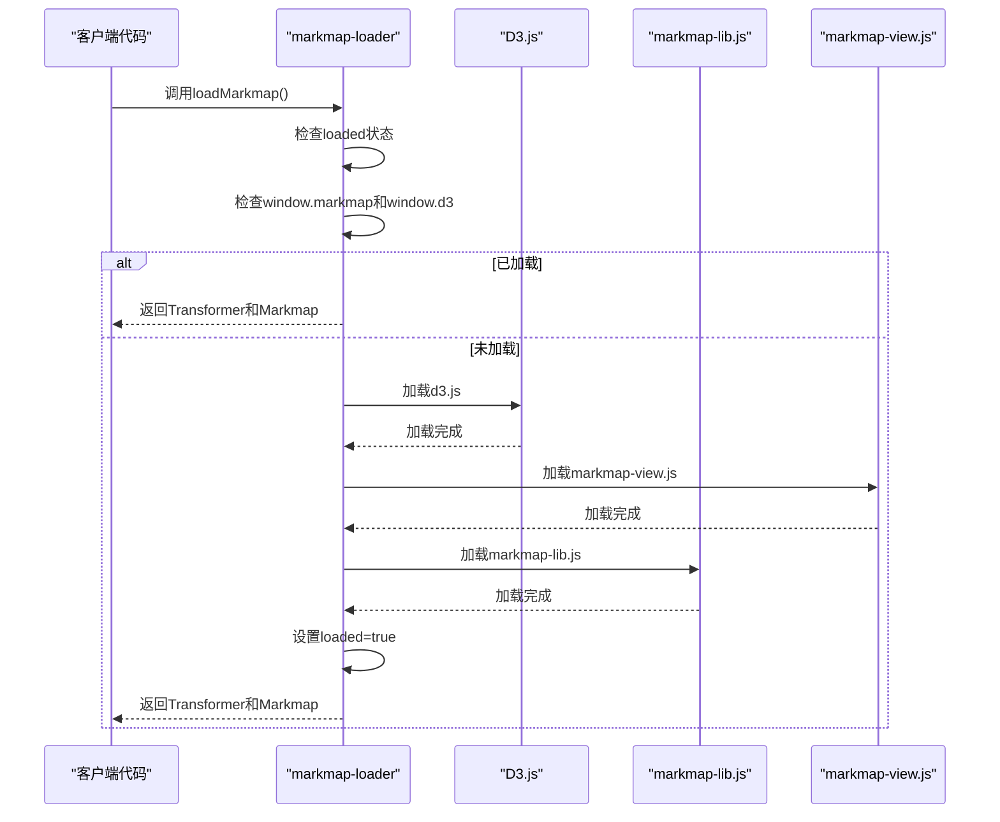
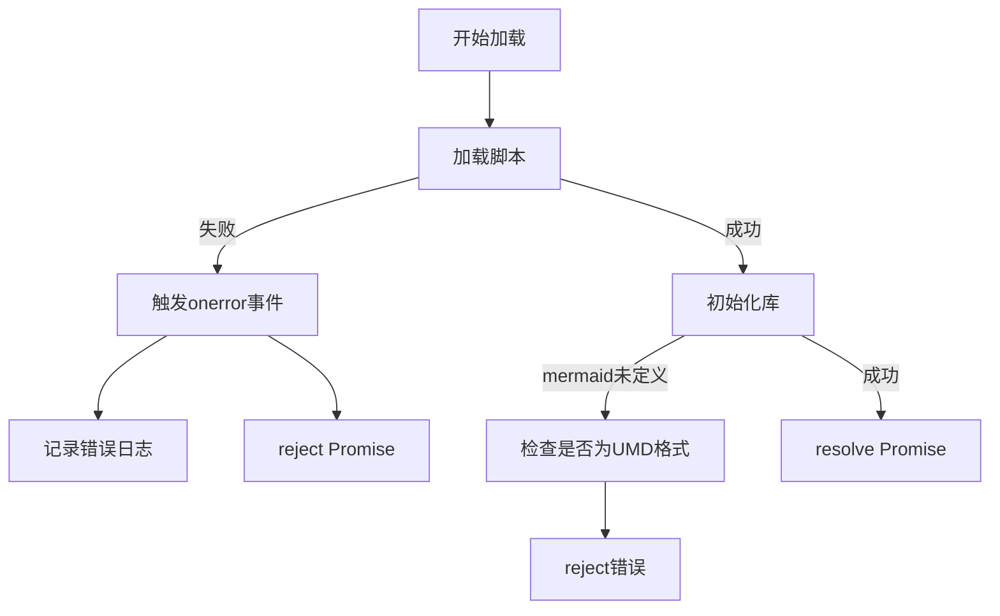

# 图表集成

<cite>
**本文档引用的文件**
- [mermaid-loader.js](file://sandbox/libs/mermaid-loader.js)
- [markmap-loader.js](file://sandbox/libs/markmap-loader.js)
- [pipeline.js](file://sandbox/render/pipeline.js)
- [config.js](file://sandbox/render/config.js)
- [message.js](file://sandbox/render/message.js)
- [content.js](file://sandbox/render/content.js)
- [math_utils.js](file://sandbox/render/math_utils.js)
- [theme_init.js](file://sandbox/theme_init.js)
</cite>

## 目录
1. [引言](#引言)
2. [Mermaid流程图集成方案](#mermaid流程图集成方案)
3. [Markmap思维导图集成方案](#markmap思维导图集成方案)
4. [图表语法检测与隔离机制](#图表语法检测与隔离机制)
5. [主题与布局配置](#主题与布局配置)
6. [性能优化策略](#性能优化策略)
7. [错误处理机制](#错误处理机制)
8. [结论](#结论)

## 引言
本系统实现了Mermaid流程图与Markmap思维导图的完整集成方案，通过异步加载、动态渲染和错误处理机制，确保图表功能的稳定性和用户体验。系统采用模块化设计，将图表加载器、渲染管道和配置管理分离，实现了高内聚低耦合的架构。

## Mermaid流程图集成方案

### 动态加载与初始化
`mermaid-loader.js`实现了Mermaid库的动态加载和初始化机制。该模块通过`loadMermaid()`函数返回Promise，确保异步加载的可靠性。

加载流程包含三个关键阶段：
1. **状态检查**：首先检查`window.mermaid`是否已存在，避免重复加载
2. **竞态条件处理**：通过`data-mermaid-loader`属性标记的脚本元素检测加载状态，防止并发加载
3. **脚本注入**：创建script元素加载`vendor/mermaid-global.js`资源



**图表来源**
- [mermaid-loader.js](file://sandbox/libs/mermaid-loader.js#L3-L53)

**本节来源**
- [mermaid-loader.js](file://sandbox/libs/mermaid-loader.js#L1-L54)

### 异步渲染回调处理
Mermaid加载器实现了完善的异步回调处理机制，确保在各种网络和加载情况下都能正确响应。

关键特性包括：
- **Promise封装**：使用Promise模式处理异步操作，便于链式调用
- **超时保护**：设置5秒超时，避免无限等待
- **错误处理**：捕获onerror事件，提供详细的错误信息
- **幂等性保证**：通过全局检查确保同一时间只有一个加载实例

## Markmap思维导图集成方案

### 库集成方式
`markmap-loader.js`采用分步加载策略集成markmap-lib库，确保依赖关系的正确处理。



**图表来源**
- [markmap-loader.js](file://sandbox/libs/markmap-loader.js#L4-L49)

**本节来源**
- [markmap-loader.js](file://sandbox/libs/markmap-loader.js#L1-L50)

### 树状结构数据转换逻辑
Markmap的树状结构转换通过`Transformer`类实现，将Markdown文本转换为层次化的JSON数据结构。

转换流程：
1. **源数据获取**：从`.markmap-source`元素获取隐藏的Markdown内容
2. **结构转换**：使用`Transformer.transform()`方法将Markdown转换为树形数据
3. **容器创建**：生成包含SVG的容器元素
4. **交互渲染**：调用`Markmap.create()`方法渲染可交互的思维导图

## 图表语法检测与隔离机制

### 语法检测流程
`pipeline.js`和`config.js`协同工作，实现图表语法的检测与隔离。

```mermaid
flowchart TD
RawText["原始文本"] --> MathProtect["保护数学公式块"]
MathProtect --> MarkdownParse["解析Markdown"]
MarkdownParse --> MathRestore["恢复数学公式块"]
MathRestore --> HtmlOutput["输出HTML"]
subgraph "图表语法处理"
CodeBlock["代码块"] --> MermaidCheck["检查lang === 'mermaid'"]
MermaidCheck --> |是| MermaidDiv["生成<div class=\"mermaid\">"]
CodeBlock --> MarkmapCheck["检查lang === 'markmap'"]
MarkmapCheck --> |是| MarkmapDiv["生成隐藏的markmap-source"]
end
HtmlOutput --> RenderContent["renderContent()"]
RenderContent --> ProcessContent["processRenderedContent()"]
ProcessContent --> MermaidRender["渲染Mermaid图表"]
ProcessContent --> MarkmapRender["渲染Markmap思维导图"]
```

**图表来源**
- [pipeline.js](file://sandbox/render/pipeline.js#L10-L44)
- [config.js](file://sandbox/render/config.js#L19-L65)
- [message.js](file://sandbox/render/message.js#L331-L526)

**本节来源**
- [pipeline.js](file://sandbox/render/pipeline.js#L1-L44)
- [config.js](file://sandbox/render/config.js#L1-L80)
- [message.js](file://sandbox/render/message.js#L327-L591)

### 隔离机制实现
系统通过以下方式确保非图表内容不受影响：

1. **代码块处理器**：在`config.js`中重写`renderer.code`方法
2. **语言标识检测**：通过`lang`参数识别mermaid和markmap语法
3. **特殊容器生成**：
   - Mermaid：生成`<div class="mermaid">`直接容器
   - Markmap：生成隐藏的`<div class="markmap-source">`用于后续处理

## 主题与布局配置

### Mermaid主题定制
Mermaid主题在初始化时通过`initialize()`方法配置：

```javascript
window.mermaid.initialize({
    startOnLoad: false,
    theme: 'default',
    securityLevel: 'loose'
});
```

**本节来源**
- [mermaid-loader.js](file://sandbox/libs/mermaid-loader.js#L35-L39)

### Markmap布局配置
Markmap布局通过`theme_init.js`中的系统主题检测进行配置：

```javascript
const systemDark = window.matchMedia('(prefers-color-scheme: dark)').matches;
if (theme === 'dark' || (theme === 'system' && systemDark)) {
    document.documentElement.setAttribute('data-theme', 'dark');
}
```

**本节来源**
- [theme_init.js](file://sandbox/theme_init.js#L8-L11)

## 性能优化策略

### 大型图表处理
系统采用多种策略优化大型图表的性能：

1. **懒加载**：图表在需要时才进行渲染
2. **缓存机制**：已加载的库不会重复加载
3. **异步处理**：所有图表操作都在异步队列中执行
4. **资源预加载**：关键依赖库提前加载

### 渲染性能优化
通过以下方式提升渲染性能：

- **批量处理**：`processRenderedContent()`一次性处理所有图表
- **DOM操作最小化**：减少重排和重绘
- **事件委托**：合理管理事件监听器
- **内存管理**：及时清理不再需要的对象

## 错误处理机制

### 语法错误提示
系统实现了多层次的错误处理：

1. **加载错误**：捕获script的onerror事件
2. **解析错误**：在highlight.js失败时使用转义回退
3. **运行时错误**：通过try-catch捕获异常



**图表来源**
- [mermaid-loader.js](file://sandbox/libs/mermaid-loader.js#L46-L49)
- [markmap-loader.js](file://sandbox/libs/markmap-loader.js#L46-L48)

**本节来源**
- [mermaid-loader.js](file://sandbox/libs/mermaid-loader.js#L1-L54)
- [markmap-loader.js](file://sandbox/libs/markmap-loader.js#L1-L50)

### 渲染超时降级策略
系统实现了超时降级机制：

1. **5秒超时**：在`mermaid-loader.js`中设置5秒超时
2. **静默降级**：超时后继续执行，不影响主流程
3. **警告提示**：记录警告但不中断应用

## 结论
本系统通过模块化设计和异步处理机制，实现了Mermaid流程图与Markmap思维导图的高效集成。核心优势包括：
- **可靠性**：完善的错误处理和降级策略
- **性能**：优化的加载和渲染流程
- **可维护性**：清晰的代码结构和职责分离
- **用户体验**：平滑的交互和及时的反馈

该集成方案为复杂图表的渲染提供了稳定可靠的基础架构。