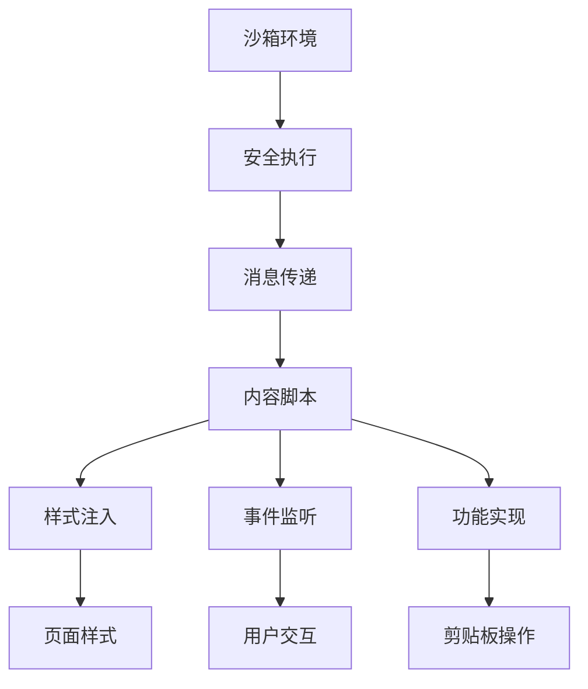
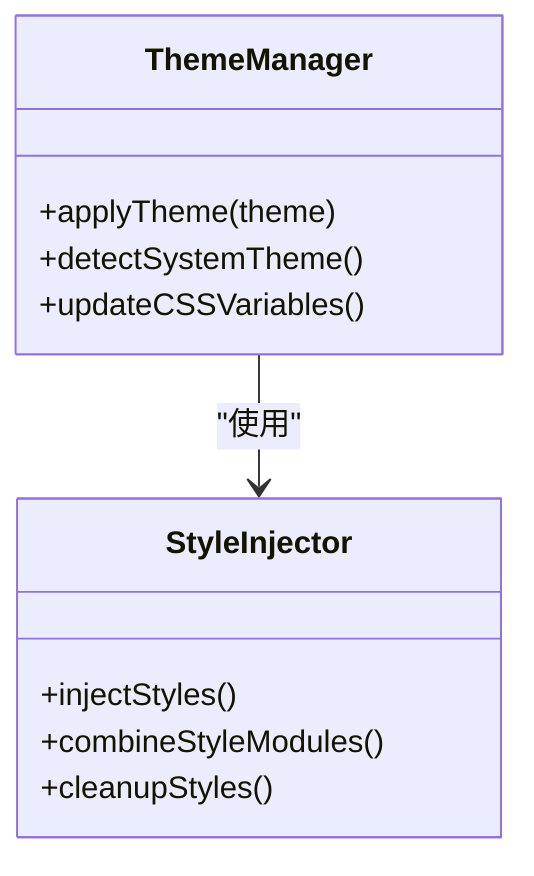
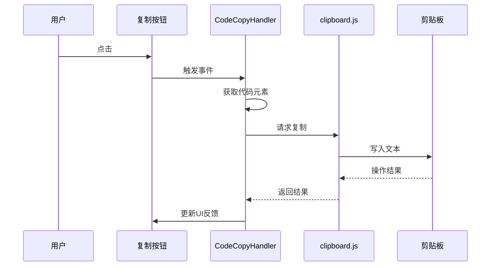
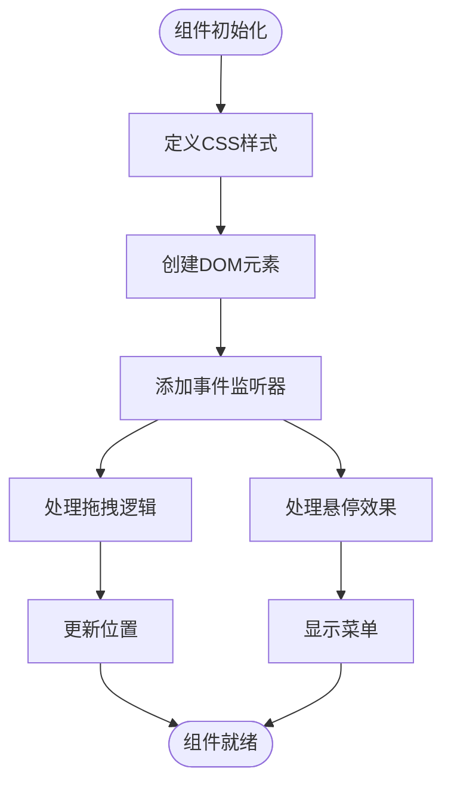
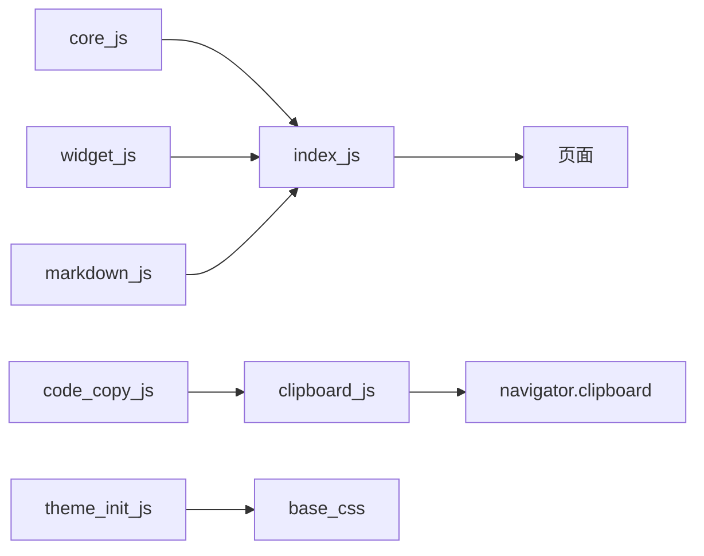

# 样式扩展

<cite>
**本文档中引用的文件**  
- [core.js](file://content/toolbar/styles/core.js)
- [widget.js](file://content/toolbar/styles/widget.js)
- [code_copy.js](file://content/toolbar/ui/code_copy.js)
- [theme_init.js](file://sandbox/theme_init.js)
- [base.css](file://css/base.css)
- [chat.css](file://css/chat.css)
- [components.css](file://css/components.css)
- [markdown.js](file://content/toolbar/styles/markdown.js)
- [index.js](file://content/toolbar/styles/index.js)
- [clipboard.js](file://sandbox/render/clipboard.js)
- [manifest.json](file://manifest.json)
</cite>

## 目录
1. [简介](#简介)
2. [项目结构](#项目结构)
3. [核心组件](#核心组件)
4. [架构概述](#架构概述)
5. [详细组件分析](#详细组件分析)
6. [依赖分析](#依赖分析)
7. [性能考虑](#性能考虑)
8. [故障排除指南](#故障排除指南)
9. [结论](#结论)

## 简介
本文档全面介绍沙箱环境中的样式扩展能力与交互增强机制。重点阐述CSS变量注入、动态主题切换、可复用UI组件样式定义、代码块复制功能的技术实现，以及自定义CSS注入指南和无障碍访问支持。

## 项目结构
该项目是一个Chrome扩展，主要包含以下目录：
- `background`：后台脚本，处理扩展的后台逻辑
- `content`：内容脚本，注入到网页中执行
- `css`：全局CSS样式文件
- `sandbox`：沙箱环境，用于安全执行代码
- `services`：服务模块，处理API调用等
- `sidepanel`：侧边栏界面

核心样式和交互功能主要集中在`content/toolbar/styles`和`content/toolbar/ui`目录中。

```mermaid
graph TB
subgraph "核心样式"
core_js[core.js]
widget_js[widget.js]
markdown_js[markdown.js]
index_js[index.js]
end
subgraph "交互功能"
code_copy_js[code_copy.js]
clipboard_js[clipboard.js]
end
subgraph "主题管理"
theme_init_js[theme_init.js]
base_css[base.css]
chat_css[chat.css]
end
core_js --> index_js
widget_js --> index_js
markdown_js --> index_js
index_js --> "注入样式"
code_copy_js --> clipboard_js
theme_init_js --> base_css
```

**Diagram sources**
- [core.js](file://content/toolbar/styles/core.js)
- [widget.js](file://content/toolbar/styles/widget.js)
- [code_copy.js](file://content/toolbar/ui/code_copy.js)
- [theme_init.js](file://sandbox/theme_init.js)
- [base.css](file://css/base.css)

**Section sources**
- [core.js](file://content/toolbar/styles/core.js)
- [widget.js](file://content/toolbar/styles/widget.js)
- [code_copy.js](file://content/toolbar/ui/code_copy.js)

## 核心组件
本项目的核心组件包括样式注入系统、UI组件库和代码复制功能。样式系统通过JavaScript字符串模板定义CSS规则，并在运行时注入到页面中。UI组件提供可复用的工具栏和交互元素。代码复制功能实现了跨沙箱环境的剪贴板操作。

**Section sources**
- [core.js](file://content/toolbar/styles/core.js)
- [widget.js](file://content/toolbar/styles/widget.js)
- [code_copy.js](file://content/toolbar/ui/code_copy.js)

## 架构概述
系统采用模块化架构，将样式定义与功能实现分离。样式通过内容脚本注入，功能通过事件监听和API调用实现。沙箱环境确保安全执行，同时通过消息传递与主页面通信。



**Diagram sources**
- [manifest.json](file://manifest.json)
- [core.js](file://content/toolbar/styles/core.js)
- [code_copy.js](file://content/toolbar/ui/code_copy.js)

## 详细组件分析

### 样式注入与主题切换
系统通过`core.js`和`widget.js`定义CSS变量，并在运行时注入。`theme_init.js`根据URL参数或系统偏好设置主题。



**Diagram sources**
- [core.js](file://content/toolbar/styles/core.js)
- [theme_init.js](file://sandbox/theme_init.js)
- [index.js](file://content/toolbar/styles/index.js)

### 代码复制功能实现
`code_copy.js`使用Selection API获取代码内容，通过`clipboard.js`处理剪贴板权限和格式化文本生成。



**Diagram sources**
- [code_copy.js](file://content/toolbar/ui/code_copy.js)
- [clipboard.js](file://sandbox/render/clipboard.js)

### 可复用UI组件
`widget.js`定义了工具栏、按钮、下拉菜单等可复用UI组件，支持拖拽和悬停效果。



**Diagram sources**
- [widget.js](file://content/toolbar/styles/widget.js)
- [drag.js](file://content/toolbar/utils/drag.js)

## 依赖分析
系统依赖关系清晰，样式模块相互独立，通过`index.js`统一注入。功能模块通过明确的接口通信，降低了耦合度。



**Diagram sources**
- [index.js](file://content/toolbar/styles/index.js)
- [manifest.json](file://manifest.json)

**Section sources**
- [index.js](file://content/toolbar/styles/index.js)
- [manifest.json](file://manifest.json)

## 性能考虑
样式注入采用字符串模板而非动态创建CSS规则，提高了性能。事件监听器使用事件委托，减少了内存占用。图片加载采用懒加载策略，优化了初始加载时间。

## 故障排除指南
常见问题包括样式未生效、复制功能失败等。检查内容脚本是否正确注入，确认权限配置是否完整，验证沙箱环境设置是否正确。

**Section sources**
- [code_copy.js](file://content/toolbar/ui/code_copy.js)
- [clipboard.js](file://sandbox/render/clipboard.js)

## 结论
该系统通过模块化的样式管理和健壮的交互机制，实现了强大的样式扩展能力。动态主题切换和代码复制功能提升了用户体验，而清晰的架构设计确保了系统的可维护性和可扩展性。