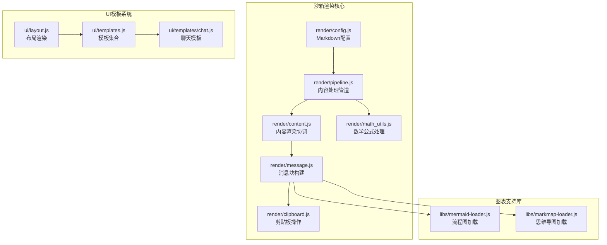
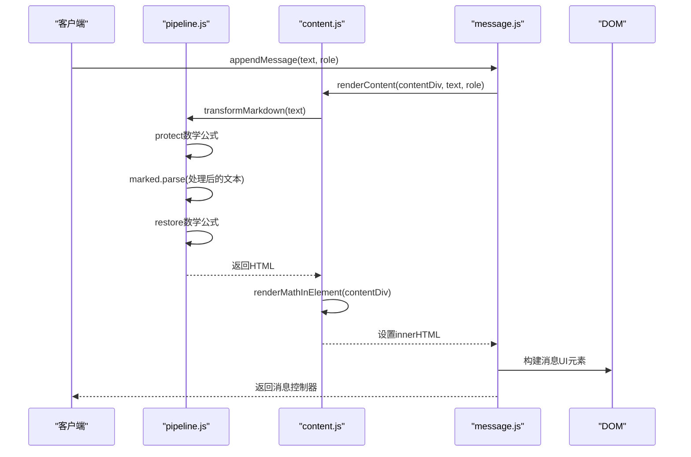
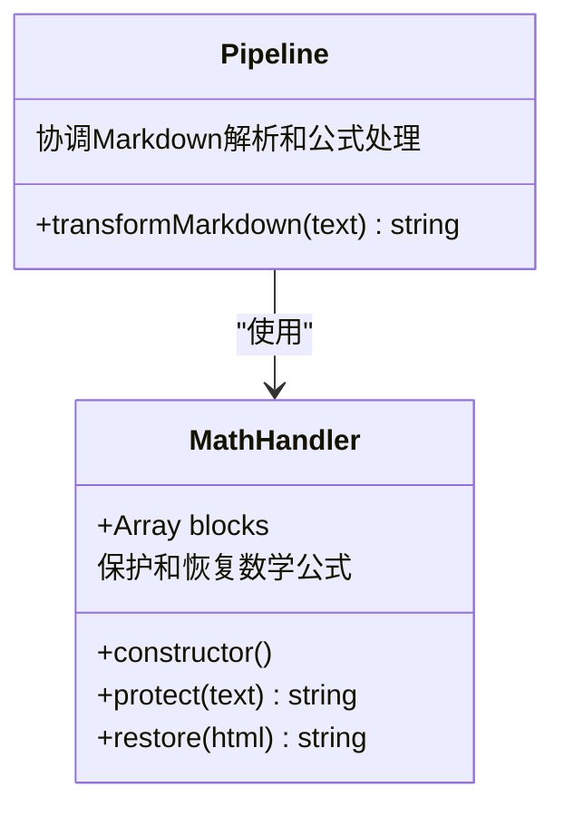
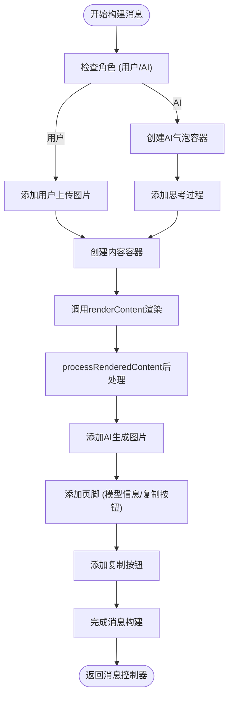
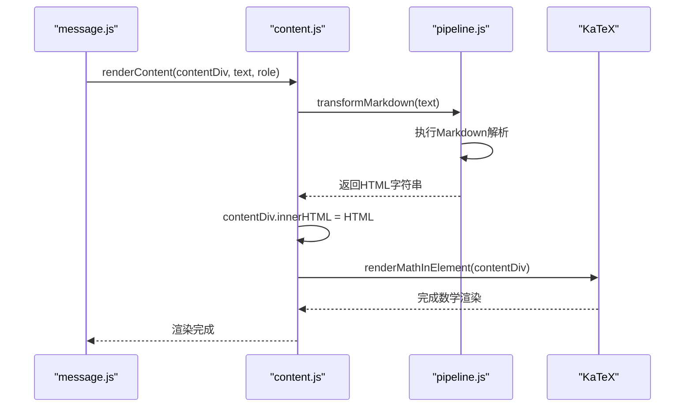
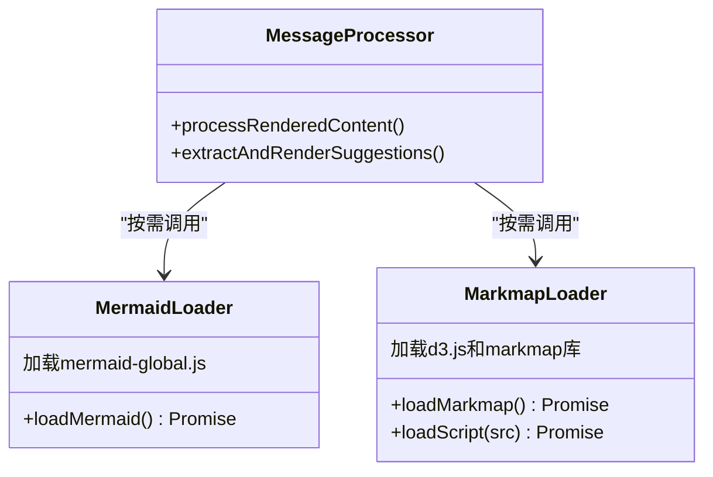
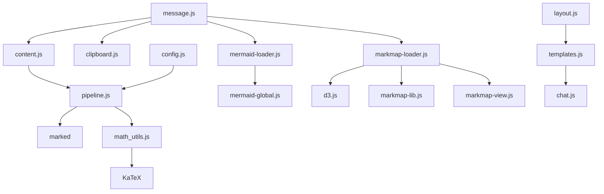

# 沙箱渲染组件

<cite>
**本文档引用的文件**
- [pipeline.js](file://sandbox/render/pipeline.js)
- [message.js](file://sandbox/render/message.js)
- [content.js](file://sandbox/render/content.js)
- [math_utils.js](file://sandbox/render/math_utils.js)
- [mermaid-loader.js](file://sandbox/libs/mermaid-loader.js)
- [markmap-loader.js](file://sandbox/libs/markmap-loader.js)
- [clipboard.js](file://sandbox/render/clipboard.js)
- [code_copy.js](file://content/toolbar/ui/code_copy.js)
- [config.js](file://sandbox/render/config.js)
- [templates.js](file://sandbox/ui/templates.js)
- [layout.js](file://sandbox/ui/layout.js)
- [chat.js](file://sandbox/ui/templates/chat.js)
- [renderer.js](file://sandbox/boot/renderer.js)
- [theme_init.js](file://sandbox/theme_init.js)
</cite>

## 目录
1. [简介](#简介)
2. [项目结构](#项目结构)
3. [核心组件](#核心组件)
4. [架构概述](#架构概述)
5. [详细组件分析](#详细组件分析)
6. [依赖分析](#依赖分析)
7. [性能考虑](#性能考虑)
8. [故障排除指南](#故障排除指南)
9. [结论](#结论)

## 简介
本文档详细阐述了沙箱渲染组件的技术架构，重点说明在安全渲染环境下如何处理Markdown内容、数学公式、流程图和思维导图。文档分析了`render/pipeline.js`如何协调内容解析、语法高亮、公式渲染（math_utils）和图表生成（mermaid-loader/markmap-loader）；描述了`message.js`中消息块的构建与`content.js`的渲染协调机制；解释了模板系统（templates.js）在聊天界面生成中的作用。同时提供了自定义样式注入、代码块复制功能（code_copy.js）和富文本输出的最佳实践，并包含mermaid流程图和markmap思维导图集成的具体配置示例。

## 项目结构
沙箱渲染组件位于`sandbox/`目录下，其核心渲染逻辑集中在`render/`子目录中。该组件通过模块化设计实现了安全的内容渲染，支持多种富文本格式的解析与展示。

**图表来源**
- [pipeline.js](file://sandbox/render/pipeline.js#L1-L44)
- [message.js](file://sandbox/render/message.js#L1-L657)
- [content.js](file://sandbox/render/content.js#L1-L34)
- [math_utils.js](file://sandbox/render/math_utils.js#L1-L63)
- [mermaid-loader.js](file://sandbox/libs/mermaid-loader.js#L1-L54)
- [markmap-loader.js](file://sandbox/libs/markmap-loader.js#L1-L50)
- [config.js](file://sandbox/render/config.js#L1-L80)
- [templates.js](file://sandbox/ui/templates.js#L1-L9)
- [layout.js](file://sandbox/ui/layout.js#L1-L16)
- [chat.js](file://sandbox/ui/templates/chat.js#L1-L4)

**章节来源**
- [pipeline.js](file://sandbox/render/pipeline.js#L1-L44)
- [message.js](file://sandbox/render/message.js#L1-L657)
- [content.js](file://sandbox/render/content.js#L1-L34)
- [math_utils.js](file://sandbox/render/math_utils.js#L1-L63)
- [mermaid-loader.js](file://sandbox/libs/mermaid-loader.js#L1-L54)
- [markmap-loader.js](file://sandbox/libs/markmap-loader.js#L1-L50)
- [config.js](file://sandbox/render/config.js#L1-L80)
- [templates.js](file://sandbox/ui/templates.js#L1-L9)
- [layout.js](file://sandbox/ui/layout.js#L1-L16)
- [chat.js](file://sandbox/ui/templates/chat.js#L1-L4)

## 核心组件
沙箱渲染组件的核心由`pipeline.js`、`content.js`和`message.js`三个文件构成。`pipeline.js`负责将原始文本转换为HTML，同时保护和恢复数学公式；`content.js`作为渲染协调器，调用管道处理内容并执行后续的数学渲染；`message.js`则负责构建完整的消息块，包括内容、图片、思考过程和操作按钮等元素。

**章节来源**
- [pipeline.js](file://sandbox/render/pipeline.js#L1-L44)
- [content.js](file://sandbox/render/content.js#L1-L34)
- [message.js](file://sandbox/render/message.js#L1-L657)

## 架构概述
沙箱渲染组件采用分层架构设计，从原始文本输入到最终的UI展示，经过多个处理阶段。首先，`pipeline.js`通过`transformMarkdown`函数将Markdown文本转换为HTML，期间使用`MathHandler`类保护数学公式不被Markdown解析器破坏。然后，`content.js`中的`renderContent`函数调用此管道，并在HTML插入DOM后触发KaTeX数学渲染。最后，`message.js`的`appendMessage`函数构建完整的消息UI，包括内容区域、图片展示、思考过程和操作按钮。

**图表来源**
- [pipeline.js](file://sandbox/render/pipeline.js#L1-L44)
- [content.js](file://sandbox/render/content.js#L1-L34)
- [message.js](file://sandbox/render/message.js#L1-L657)

## 详细组件分析

### 渲染管道分析
`render/pipeline.js`是整个渲染流程的起点，它实现了安全的Markdown到HTML转换，同时确保数学公式能够正确渲染。

#### 渲染管道类图

**图表来源**
- [pipeline.js](file://sandbox/render/pipeline.js#L1-L44)
- [math_utils.js](file://sandbox/render/math_utils.js#L1-L63)

**章节来源**
- [pipeline.js](file://sandbox/render/pipeline.js#L1-L44)
- [math_utils.js](file://sandbox/render/math_utils.js#L1-L63)

### 消息构建分析
`render/message.js`负责构建完整的聊天消息UI，它协调了内容渲染、图片展示、思考过程和用户交互元素。

#### 消息构建流程图

**图表来源**
- [message.js](file://sandbox/render/message.js#L1-L657)

**章节来源**
- [message.js](file://sandbox/render/message.js#L1-L657)

### 内容渲染协调
`render/content.js`作为内容渲染的协调者，它根据消息角色决定渲染策略，并确保数学公式得到正确处理。

#### 内容渲染序列图

**图表来源**
- [content.js](file://sandbox/render/content.js#L1-L34)
- [pipeline.js](file://sandbox/render/pipeline.js#L1-L44)

**章节来源**
- [content.js](file://sandbox/render/content.js#L1-L34)

### 图表集成分析
沙箱渲染组件通过异步加载的方式集成mermaid流程图和markmap思维导图，确保只有在需要时才加载相应的大型库。

#### 图表加载类图

**图表来源**
- [mermaid-loader.js](file://sandbox/libs/mermaid-loader.js#L1-L54)
- [markmap-loader.js](file://sandbox/libs/markmap-loader.js#L1-L50)
- [message.js](file://sandbox/render/message.js#L1-L657)

**章节来源**
- [mermaid-loader.js](file://sandbox/libs/mermaid-loader.js#L1-L54)
- [markmap-loader.js](file://sandbox/libs/markmap-loader.js#L1-L50)

## 依赖分析
沙箱渲染组件的依赖关系清晰，核心渲染逻辑不直接依赖外部大型库，而是通过异步加载的方式按需引入。这种设计减少了初始加载时间，提高了性能。

**图表来源**
- [pipeline.js](file://sandbox/render/pipeline.js#L1-L44)
- [content.js](file://sandbox/render/content.js#L1-L34)
- [message.js](file://sandbox/render/message.js#L1-L657)
- [math_utils.js](file://sandbox/render/math_utils.js#L1-L63)
- [mermaid-loader.js](file://sandbox/libs/mermaid-loader.js#L1-L54)
- [markmap-loader.js](file://sandbox/libs/markmap-loader.js#L1-L50)
- [config.js](file://sandbox/render/config.js#L1-L80)
- [templates.js](file://sandbox/ui/templates.js#L1-L9)
- [layout.js](file://sandbox/ui/layout.js#L1-L16)
- [chat.js](file://sandbox/ui/templates/chat.js#L1-L4)

**章节来源**
- [pipeline.js](file://sandbox/render/pipeline.js#L1-L44)
- [content.js](file://sandbox/render/content.js#L1-L34)
- [message.js](file://sandbox/render/message.js#L1-L657)
- [math_utils.js](file://sandbox/render/math_utils.js#L1-L63)
- [mermaid-loader.js](file://sandbox/libs/mermaid-loader.js#L1-L54)
- [markmap-loader.js](file://sandbox/libs/markmap-loader.js#L1-L50)
- [config.js](file://sandbox/render/config.js#L1-L80)
- [templates.js](file://sandbox/ui/templates.js#L1-L9)
- [layout.js](file://sandbox/ui/layout.js#L1-L16)
- [chat.js](file://sandbox/ui/templates/chat.js#L1-L4)

## 性能考虑
沙箱渲染组件在性能方面做了多项优化。首先，通过异步加载大型库（如mermaid、markmap）避免了初始加载的性能瓶颈。其次，`MathHandler`类采用占位符机制，在Markdown解析前后保护和恢复数学公式，避免了复杂的正则表达式冲突。此外，剪贴板操作实现了优雅降级，优先使用现代API，失败时回退到传统方法，确保在各种环境下都能正常工作。

## 故障排除指南
当遇到渲染问题时，可以按照以下步骤进行排查：
1. 检查控制台是否有JavaScript错误，特别是库加载失败的错误。
2. 确认`marked`库是否已正确加载，这是Markdown解析的基础。
3. 对于数学公式不显示的问题，检查KaTeX是否已正确初始化。
4. 如果mermaid或markmap图表不渲染，确认相应的loader是否成功加载了外部库。
5. 剪贴板功能失败时，检查是否在沙箱环境中，可能需要使用回退方案。

**章节来源**
- [pipeline.js](file://sandbox/render/pipeline.js#L1-L44)
- [message.js](file://sandbox/render/message.js#L1-L657)
- [content.js](file://sandbox/render/content.js#L1-L34)
- [clipboard.js](file://sandbox/render/clipboard.js#L1-L43)

## 结论
沙箱渲染组件通过模块化设计和分层架构，实现了安全、高效的内容渲染。它不仅支持基本的Markdown和数学公式，还通过异步加载的方式集成了复杂的图表功能。组件间的职责清晰，`pipeline.js`负责内容转换，`content.js`协调渲染流程，`message.js`构建完整的UI元素。这种设计既保证了功能的完整性，又兼顾了性能和安全性，为用户提供流畅的交互体验。