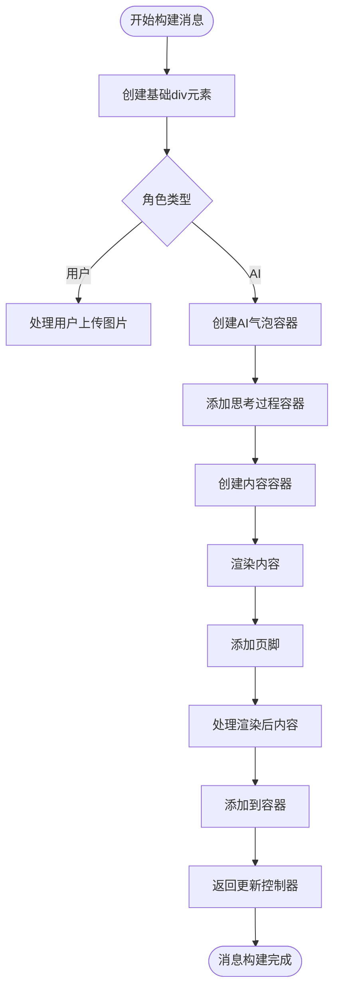
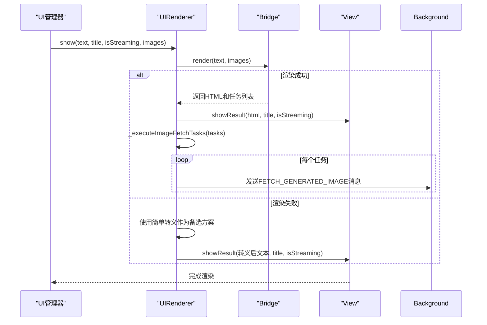
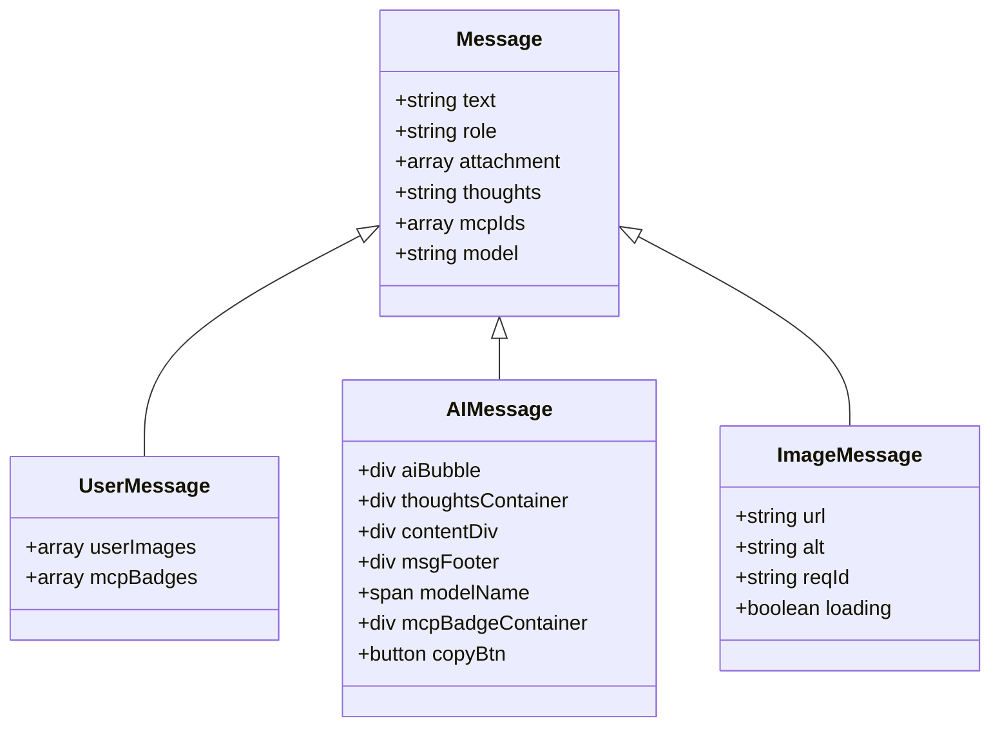
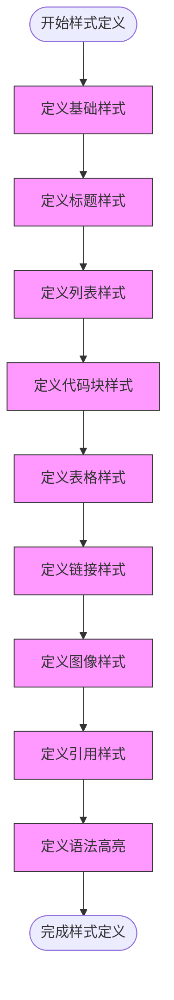
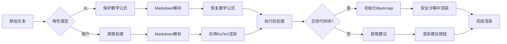
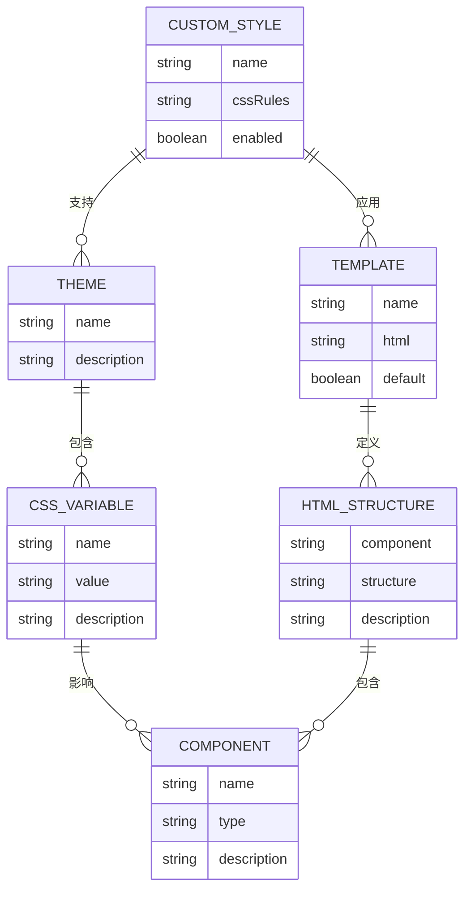

# 消息格式化

<cite>
**本文档中引用的文件**
- [message.js](file://sandbox/render/message.js)
- [content.js](file://sandbox/render/content.js)
- [pipeline.js](file://sandbox/render/pipeline.js)
- [templates.js](file://content/toolbar/ui/templates.js)
- [markdown.js](file://content/toolbar/styles/markdown.js)
- [renderer.js](file://content/toolbar/ui/renderer.js)
- [generated_image.js](file://sandbox/render/generated_image.js)
- [ui.js](file://content/toolbar/ui/manager.js)
</cite>

## 目录
1. [消息对象构建过程](#消息对象构建过程)
2. [UI模板系统协同机制](#ui模板系统协同机制)
3. [消息类型与结构化数据模型](#消息类型与结构化数据模型)
4. [Markdown样式规则定义](#markdown样式规则定义)
5. [富文本渲染安全策略](#富文本渲染安全策略)
6. [自定义消息样式与模板](#自定义消息样式与模板)

## 消息对象构建过程

消息对象的构建由`appendMessage`函数负责，该函数位于`sandbox/render/message.js`中。此函数接收多个参数，包括容器元素、文本内容、角色类型、附件、思考过程、MCP服务器ID和模型信息。

消息构建过程首先根据角色类型（用户或AI）创建相应的DOM结构。对于用户消息，会处理上传的图片附件并创建图片网格；对于AI消息，则创建包含思考过程、内容区域和页脚的气泡式布局。

消息构建过程中使用了闭包来维护当前状态，包括文本内容、思考过程、MCP ID和模型信息。这种设计允许后续通过返回的控制器对象更新消息内容，支持流式传输场景下的内容动态更新。

**Diagram sources**
- [message.js](file://sandbox/render/message.js#L14-L324)

**Section sources**
- [message.js](file://sandbox/render/message.js#L14-L324)

## UI模板系统协同机制

UI模板系统通过`renderer.js`和`templates.js`文件实现，位于`content/toolbar/ui/`目录下。系统采用桥接模式，将渲染逻辑与UI展示分离，确保核心渲染功能可以在不同环境中复用。

模板系统的工作流程始于`UIRenderer`类的`show`方法，该方法接收文本内容、标题、流式传输状态和图片数组。系统首先通过桥接器（bridge）处理内容，然后将生成的HTML传递给视图组件进行展示。

在渲染过程中，系统会执行额外的任务处理，如图像获取任务。这些任务通过`_executeImageFetchTasks`方法异步执行，确保图像资源的高效加载和显示。

**Diagram sources**
- [renderer.js](file://content/toolbar/ui/renderer.js#L18-L44)
- [manager.js](file://content/toolbar/ui/manager.js#L173-L188)

**Section sources**
- [renderer.js](file://content/toolbar/ui/renderer.js#L8-L86)
- [manager.js](file://content/toolbar/ui/manager.js#L59-L60)

## 消息类型与结构化数据模型

系统支持多种消息类型，包括文本、代码、图像和工具调用等。每种消息类型都有相应的结构化数据模型和渲染处理逻辑。

文本消息通过`renderContent`函数处理，该函数位于`content.js`中。函数根据角色类型决定是否应用Markdown转换，AI消息和用户消息都支持Markdown语法。

代码块通过`code-block-wrapper`类进行样式化，包含代码头、语言标识和复制按钮。系统使用highlight.js进行语法高亮，支持多种编程语言。

图像消息分为用户上传图像和AI生成图像两种类型。用户上传图像直接显示在消息中，而AI生成图像通过`createGeneratedImage`函数创建，该函数生成带有加载状态的图像元素，并通过后台服务获取高分辨率版本。

**Diagram sources**
- [message.js](file://sandbox/render/message.js#L14-L324)
- [generated_image.js](file://sandbox/render/generated_image.js#L6-L41)

**Section sources**
- [message.js](file://sandbox/render/message.js#L14-L324)
- [content.js](file://sandbox/render/content.js#L6-L33)
- [generated_image.js](file://sandbox/render/generated_image.js#L6-L41)

## Markdown样式规则定义

Markdown样式规则在`content/toolbar/styles/markdown.js`文件中定义，通过`window.GeminiStyles.Markdown`变量存储CSS字符串。这些样式确保了与主页面样式的一致性。

样式定义涵盖了各种Markdown元素，包括段落、标题、列表、代码块、表格、链接和图像。代码块使用`.code-block-wrapper`类进行容器化，包含代码头和复制按钮，背景色为浅灰色，边框圆角为8px。

链接样式使用蓝色（#0b57d0）作为主色调，与悬停时的下划线效果相结合，提供良好的用户体验。表格样式采用简洁的设计，表头背景为浅灰色，偶数行有轻微的背景色差异，提高可读性。

生成的图像采用网格布局（`.generated-images-grid`），使用CSS Grid实现响应式设计，每列最小宽度为180px，自动适应容器大小。图像本身具有圆角边框和浅色背景，确保视觉一致性。

**Diagram sources**
- [markdown.js](file://content/toolbar/styles/markdown.js#L1-L191)

**Section sources**
- [markdown.js](file://content/toolbar/styles/markdown.js#L1-L191)

## 富文本渲染安全策略

系统实施了多层次的安全策略来防止XSS攻击、验证链接并限制资源域。这些策略贯穿于消息渲染的整个流程。

在内容渲染层面，系统使用`marked`库将Markdown转换为HTML，该库默认会转义潜在的危险HTML标签。对于AI生成的内容，系统通过`transformMarkdown`函数进行处理，该函数在`pipeline.js`中定义。

链接验证通过CSS样式和JavaScript事件处理实现。所有链接使用`target="_blank"`和`rel="noopener noreferrer"`属性，防止目标页面访问原页面的window对象。同时，链接样式通过CSS统一定义，确保视觉一致性。

资源域限制通过后台服务代理实现。当需要加载外部资源时，系统会通过`sendToBackground`函数发送消息到后台脚本，由后台脚本处理资源获取。这种方式可以有效防止CORS问题，并对资源来源进行控制。

**Diagram sources**
- [pipeline.js](file://sandbox/render/pipeline.js#L10-L44)
- [content.js](file://sandbox/render/content.js#L6-L33)
- [message.js](file://sandbox/render/message.js#L331-L625)

**Section sources**
- [pipeline.js](file://sandbox/render/pipeline.js#L10-L44)
- [content.js](file://sandbox/render/content.js#L6-L33)
- [message.js](file://sandbox/render/message.js#L331-L625)

## 自定义消息样式与模板

系统提供了灵活的机制来实现自定义消息样式和模板，支持动态主题适配。这些功能通过CSS变量和JavaScript配置实现。

自定义样式可以通过扩展`window.GeminiStyles`对象来实现。开发者可以添加新的CSS规则或覆盖现有规则，系统会在渲染时应用这些样式。对于动态主题适配，系统使用CSS变量（如`--text-tertiary`和`--border-color`）来定义颜色和间距。

模板自定义主要通过`templates.js`文件实现。该文件定义了各种UI组件的HTML结构，包括主结构、工具栏、对话窗口等。开发者可以通过修改这些模板来改变UI布局和外观。

最佳实践建议使用模块化的方式进行自定义，将样式和模板分离，便于维护和更新。同时，建议使用CSS变量而不是硬编码颜色值，以确保与不同主题的兼容性。

**Diagram sources**
- [templates.js](file://content/toolbar/ui/templates.js)
- [markdown.js](file://content/toolbar/styles/markdown.js#L1-L191)
- [dom.js](file://content/toolbar/view/dom.js#L1-L50)

**Section sources**
- [templates.js](file://content/toolbar/ui/templates.js)
- [markdown.js](file://content/toolbar/styles/markdown.js#L1-L191)
- [dom.js](file://content/toolbar/view/dom.js#L1-L50)