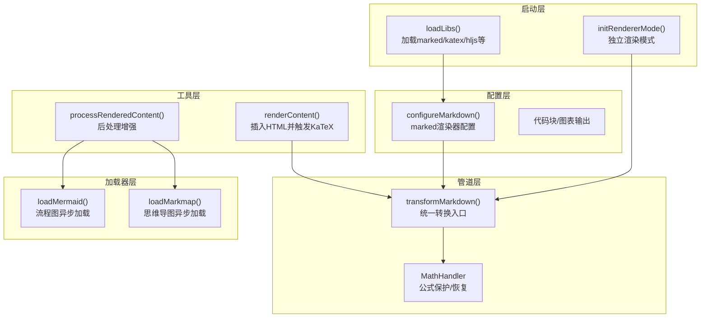
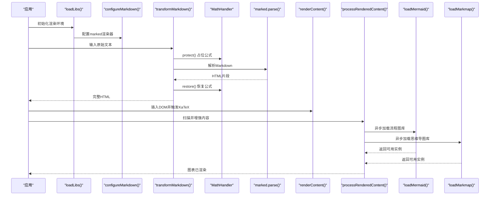
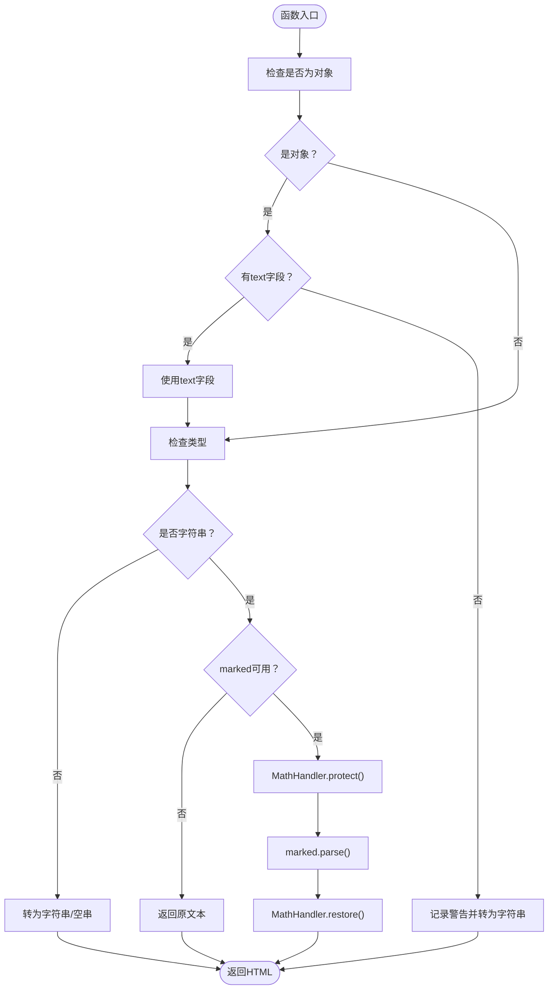
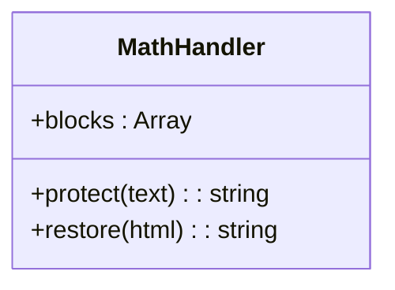
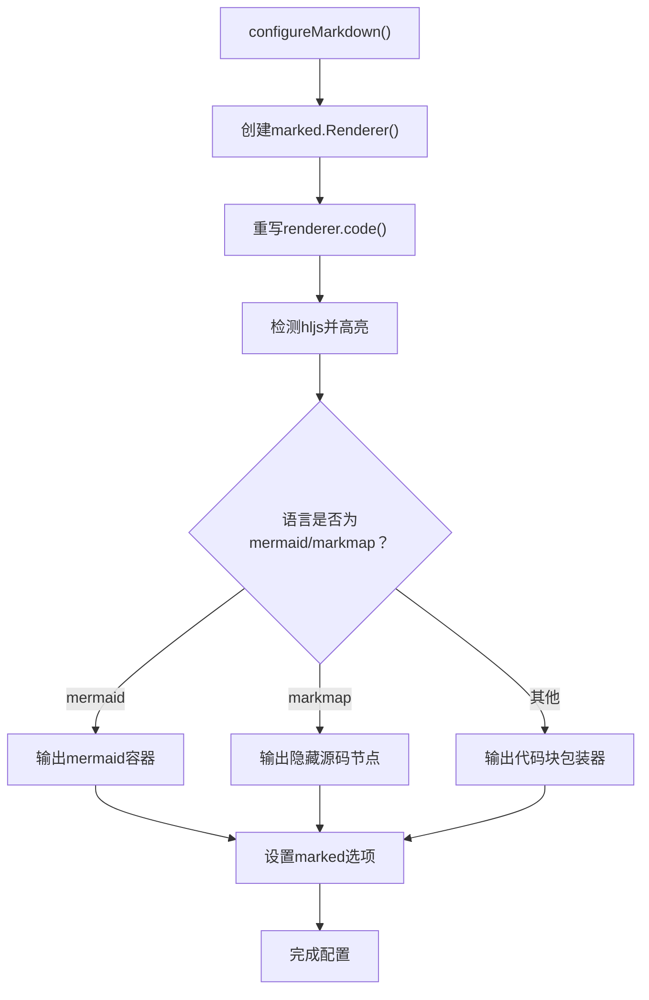
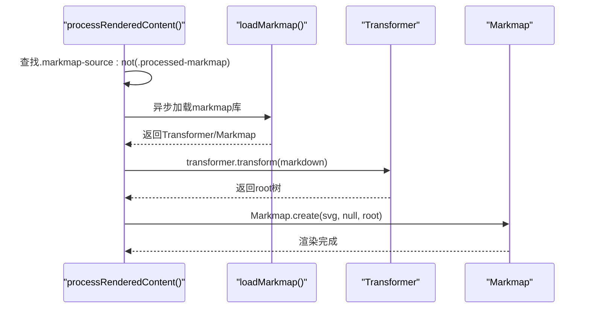
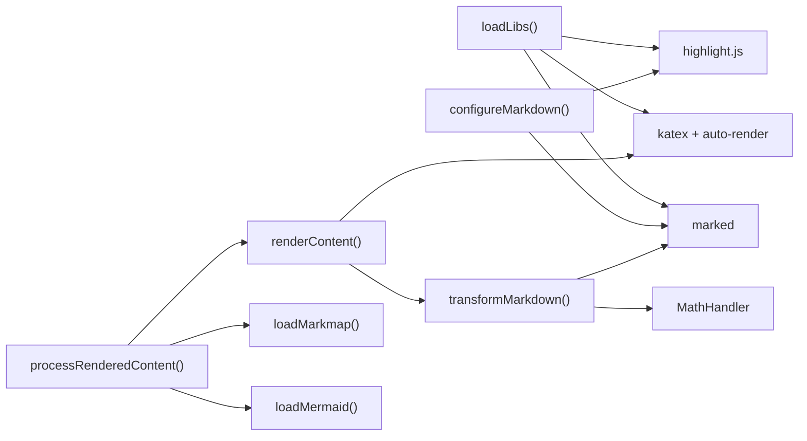

# 渲染管道

<cite>
**本文引用的文件**
- [sandbox/render/pipeline.js](file://sandbox/render/pipeline.js)
- [sandbox/render/config.js](file://sandbox/render/config.js)
- [sandbox/render/math_utils.js](file://sandbox/render/math_utils.js)
- [sandbox/render/content.js](file://sandbox/render/content.js)
- [sandbox/render/message.js](file://sandbox/render/message.js)
- [sandbox/libs/mermaid-loader.js](file://sandbox/libs/mermaid-loader.js)
- [sandbox/libs/markmap-loader.js](file://sandbox/libs/markmap-loader.js)
- [sandbox/boot/loader.js](file://sandbox/boot/loader.js)
- [sandbox/boot/renderer.js](file://sandbox/boot/renderer.js)
</cite>

## 目录
1. [简介](#简介)
2. [项目结构](#项目结构)
3. [核心组件](#核心组件)
4. [架构总览](#架构总览)
5. [详细组件分析](#详细组件分析)
6. [依赖关系分析](#依赖关系分析)
7. [性能考量](#性能考量)
8. [故障排查指南](#故障排查指南)
9. [结论](#结论)
10. [附录](#附录)

## 简介
本文件深入解析 sandbox/render/pipeline.js 中的渲染管道架构，阐明其作为内容处理中枢的角色。文档将详细说明管道如何协调解析流程：从原始消息数据输入，经过内容类型识别、Markdown 解析、代码块提取、数学公式标记到图表语法检测的完整链路；解释 pipeline 如何集成 math_utils 进行 LaTeX 公式处理，调用 mermaid-loader 和 markmap-loader 实现流程图与思维导图的异步渲染；描述 config.js 中渲染配置项对管道行为的控制机制，包括安全过滤规则、资源加载策略和错误降级处理；最后提供自定义渲染中间件的开发示例，展示如何扩展管道以支持新内容类型。

## 项目结构
渲染子系统围绕“管道 + 配置 + 工具 + 加载器”的分层设计组织：
- 管道层：负责统一的文本到 HTML 转换，确保数学公式不被破坏
- 配置层：通过 marked 渲染器定制代码块、图表语言输出与高亮策略
- 工具层：MathHandler 提供数学公式占位与恢复机制
- 加载器层：异步加载 mermaid/markmap 及其依赖库
- 启动层：统一加载第三方库并初始化渲染环境

**图表来源**
- [sandbox/boot/loader.js](file://sandbox/boot/loader.js#L21-L47)
- [sandbox/boot/renderer.js](file://sandbox/boot/renderer.js#L8-L31)
- [sandbox/render/pipeline.js](file://sandbox/render/pipeline.js#L10-L44)
- [sandbox/render/math_utils.js](file://sandbox/render/math_utils.js#L4-L62)
- [sandbox/render/config.js](file://sandbox/render/config.js#L4-L79)
- [sandbox/render/content.js](file://sandbox/render/content.js#L6-L33)
- [sandbox/render/message.js](file://sandbox/render/message.js#L331-L526)
- [sandbox/libs/mermaid-loader.js](file://sandbox/libs/mermaid-loader.js#L3-L53)
- [sandbox/libs/markmap-loader.js](file://sandbox/libs/markmap-loader.js#L16-L49)

**章节来源**
- [sandbox/boot/loader.js](file://sandbox/boot/loader.js#L1-L48)
- [sandbox/render/pipeline.js](file://sandbox/render/pipeline.js#L1-L44)
- [sandbox/render/config.js](file://sandbox/render/config.js#L1-L80)

## 核心组件
- 渲染管道 transformMarkdown：统一入口，先保护数学公式，再解析 Markdown，最后恢复公式，保证公式在 marked 处理前后不被破坏
- 数学公式处理器 MathHandler：维护公式块列表，使用占位符隔离公式，避免被 marked 或 KaTeX 错误解析
- Markdown 配置 configureMarkdown：定制代码块渲染逻辑，识别 mermaid/markmap 语言，输出专用容器或隐藏源码节点
- 内容渲染 renderContent：将 HTML 插入 DOM，并通过 KaTeX 自动渲染数学公式
- 消息后处理 processRenderedContent：扫描 DOM，发现 markmap 源码节点，异步加载 markmap 并渲染为交互式思维导图；同时提取建议数组并渲染按钮
- 异步加载器：loadMermaid/loadMarkmap 提供幂等、防重复加载、超时与错误处理的异步加载能力

**章节来源**
- [sandbox/render/pipeline.js](file://sandbox/render/pipeline.js#L10-L44)
- [sandbox/render/math_utils.js](file://sandbox/render/math_utils.js#L4-L62)
- [sandbox/render/config.js](file://sandbox/render/config.js#L4-L79)
- [sandbox/render/content.js](file://sandbox/render/content.js#L6-L33)
- [sandbox/render/message.js](file://sandbox/render/message.js#L331-L526)
- [sandbox/libs/mermaid-loader.js](file://sandbox/libs/mermaid-loader.js#L3-L53)
- [sandbox/libs/markmap-loader.js](file://sandbox/libs/markmap-loader.js#L16-L49)

## 架构总览
渲染管道采用“保护-解析-恢复”的三段式策略，确保数学公式在 Markdown 解析过程中保持原样，随后由 KaTeX 进行最终渲染。配置层通过 marked 的自定义渲染器实现代码块高亮、mermaid/markmap 输出容器化，以及回退到手动转义的安全策略。消息后处理阶段负责发现并渲染图表类内容，实现异步加载与交互增强。

**图表来源**
- [sandbox/boot/loader.js](file://sandbox/boot/loader.js#L21-L47)
- [sandbox/render/config.js](file://sandbox/render/config.js#L4-L79)
- [sandbox/render/pipeline.js](file://sandbox/render/pipeline.js#L10-L44)
- [sandbox/render/math_utils.js](file://sandbox/render/math_utils.js#L9-L45)
- [sandbox/render/content.js](file://sandbox/render/content.js#L6-L33)
- [sandbox/render/message.js](file://sandbox/render/message.js#L331-L526)
- [sandbox/libs/mermaid-loader.js](file://sandbox/libs/mermaid-loader.js#L3-L53)
- [sandbox/libs/markmap-loader.js](file://sandbox/libs/markmap-loader.js#L16-L49)

## 详细组件分析

### 渲染管道 transformMarkdown
- 输入容错：若传入对象则尝试读取 text 字段，否则警告并返回字符串
- 空值处理：非字符串输入统一转为字符串，null 返回空串
- 异步库检测：若 marked 未就绪，直接返回原文本，避免污染控制台
- 三段式流程：
  1) MathHandler.protect：扫描并占位所有数学公式（支持多种定界符）
  2) marked.parse：标准 Markdown 解析
  3) MathHandler.restore：将占位符替换回安全的公式文本

**图表来源**
- [sandbox/render/pipeline.js](file://sandbox/render/pipeline.js#L10-L44)
- [sandbox/render/math_utils.js](file://sandbox/render/math_utils.js#L9-L45)

**章节来源**
- [sandbox/render/pipeline.js](file://sandbox/render/pipeline.js#L10-L44)

### 数学公式处理器 MathHandler
- 数据结构：内部维护 blocks 数组，保存每个公式块的占位符 ID、原始内容与显示/内联标识
- 保护算法：按顺序匹配多种数学公式定界符，使用唯一占位符替换，避免嵌套与边界问题
- 恢复算法：遍历 blocks，对内容进行 HTML 转义，然后根据显示/内联模式插入标准 KaTeX 定界符

**图表来源**
- [sandbox/render/math_utils.js](file://sandbox/render/math_utils.js#L4-L62)

**章节来源**
- [sandbox/render/math_utils.js](file://sandbox/render/math_utils.js#L4-L62)

### Markdown 配置 configureMarkdown
- 渲染器定制：重写 renderer.code，兼容 Marked v13+ 的 token 参数变化
- 语法高亮：优先使用 highlight.js，失败时回退到手动转义
- 图表语言输出：
  - mermaid：输出带类名的容器，等待后续初始化
  - markmap：输出隐藏的源码节点，供 message.js 后处理发现并渲染
- marked 配置：支持自动换行与 GitHub 风格，使用自定义渲染器

**图表来源**
- [sandbox/render/config.js](file://sandbox/render/config.js#L4-L79)

**章节来源**
- [sandbox/render/config.js](file://sandbox/render/config.js#L4-L79)

### 内容渲染 renderContent
- AI 角色：使用共享管道生成 HTML，插入 DOM 后调用 KaTeX 自动渲染，支持多类定界符
- 用户角色：启用 Markdown 支持链接等基础格式
- 渲染策略：统一通过 transformMarkdown 获取 HTML，确保公式一致性

**章节来源**
- [sandbox/render/content.js](file://sandbox/render/content.js#L6-L33)

### 消息后处理 processRenderedContent
- Markmap 处理：
  - 查找未处理的 .markmap-source 节点并标记防止重复处理
  - 异步加载 markmap 库，使用 Transformer 将 Markdown 转换为树形数据
  - 创建 SVG 容器与工具栏（下载 PNG、复制层级文本），渲染交互式思维导图
- 建议提取：
  - 在 DOM 文本末尾查找显式标签或隐式 JSON 数组
  - 解析成功后隐藏对应 DOM 节点并渲染建议按钮
- 流程图处理：通过 .mermaid 容器等待外部初始化（如 mermaid-loader）

**图表来源**
- [sandbox/render/message.js](file://sandbox/render/message.js#L331-L526)
- [sandbox/libs/markmap-loader.js](file://sandbox/libs/markmap-loader.js#L16-L49)

**章节来源**
- [sandbox/render/message.js](file://sandbox/render/message.js#L331-L526)

### 异步加载器
- mermaid-loader：检测全局实例与重复加载，避免竞态；加载完成后显式 initialize
- markmap-loader：先加载 d3，再加载 markmap-view 与 markmap-lib，提供幂等返回

**章节来源**
- [sandbox/libs/mermaid-loader.js](file://sandbox/libs/mermaid-loader.js#L3-L53)
- [sandbox/libs/markmap-loader.js](file://sandbox/libs/markmap-loader.js#L16-L49)

## 依赖关系分析
- 管道依赖：pipeline 依赖 math_utils；content 依赖 pipeline；message 依赖 content 与 markmap-loader
- 配置依赖：config 依赖 marked 与 highlight.js；loader 在启动时加载这些库
- 后处理依赖：message 依赖 markmap-loader 与 mermaid-loader（通过 DOM 发现与异步加载）

**图表来源**
- [sandbox/boot/loader.js](file://sandbox/boot/loader.js#L21-L47)
- [sandbox/render/config.js](file://sandbox/render/config.js#L4-L79)
- [sandbox/render/pipeline.js](file://sandbox/render/pipeline.js#L10-L44)
- [sandbox/render/content.js](file://sandbox/render/content.js#L6-L33)
- [sandbox/render/message.js](file://sandbox/render/message.js#L331-L526)
- [sandbox/libs/mermaid-loader.js](file://sandbox/libs/mermaid-loader.js#L3-L53)
- [sandbox/libs/markmap-loader.js](file://sandbox/libs/markmap-loader.js#L16-L49)

**章节来源**
- [sandbox/boot/loader.js](file://sandbox/boot/loader.js#L21-L47)
- [sandbox/render/pipeline.js](file://sandbox/render/pipeline.js#L10-L44)
- [sandbox/render/content.js](file://sandbox/render/content.js#L6-L33)
- [sandbox/render/message.js](file://sandbox/render/message.js#L331-L526)

## 性能考量
- 异步加载：marked、KaTeX、highlight.js、mermaid、markmap 均采用懒加载，减少首屏负担
- 防重复加载：markmap-loader 与 mermaid-loader 检测全局存在与重复脚本，避免重复请求
- 占位符策略：MathHandler 使用固定长度占位符，避免正则替换开销过大
- DOM 扫描：processRenderedContent 仅扫描未处理节点，避免重复渲染
- 回退策略：highlight.js 失败时手动转义，确保渲染稳定性

[本节为通用性能讨论，无需特定文件来源]

## 故障排查指南
- marked 未就绪：pipeline 直接返回原文本，检查 loadLibs 是否正确加载 marked
- KaTeX 渲染异常：renderContent 对 KaTeX 抛错进行吞吐，检查 katex 与 auto-render 是否加载
- markmap 加载失败：loadMarkmap 记录错误并抛出异常，检查 d3 与 markmap-view/lib 是否可访问
- mermaid 加载超时：loadMermaid 设置 5 秒超时并告警，检查网络与 vendor 文件路径
- 代码高亮失败：configureMarkdown 回退到手动转义，确认 hljs 语言包是否存在

**章节来源**
- [sandbox/render/pipeline.js](file://sandbox/render/pipeline.js#L26-L30)
- [sandbox/render/content.js](file://sandbox/render/content.js#L14-L26)
- [sandbox/libs/markmap-loader.js](file://sandbox/libs/markmap-loader.js#L45-L48)
- [sandbox/libs/mermaid-loader.js](file://sandbox/libs/mermaid-loader.js#L21-L24)
- [sandbox/render/config.js](file://sandbox/render/config.js#L32-L42)

## 结论
该渲染管道通过“保护-解析-恢复”机制确保数学公式在 Markdown 流程中的完整性，结合 marked 的自定义渲染器与异步加载器，实现了对 mermaid/markmap 等图表类型的无缝集成。配置层提供了安全与可扩展的渲染策略，后处理阶段进一步增强了用户体验。整体架构清晰、职责分离明确，具备良好的可维护性与扩展性。

[本节为总结性内容，无需特定文件来源]

## 附录

### 自定义渲染中间件开发示例
目标：扩展管道以支持新的图表类型（例如 plantuml）。
步骤：
1) 在 config.js 的 renderer.code 中增加对新语言的判断与输出容器
2) 在 message.js 的 processRenderedContent 中添加对该容器的发现与异步加载逻辑
3) 在 loadLibs 中预加载新库或在异步加载器中实现懒加载
4) 在 pipeline 中保持公式保护/恢复的完整性，避免新中间件破坏数学公式

参考路径：
- 新语言输出容器：[sandbox/render/config.js](file://sandbox/render/config.js#L44-L52)
- 后处理增强：[sandbox/render/message.js](file://sandbox/render/message.js#L331-L526)
- 异步加载模板：[sandbox/libs/mermaid-loader.js](file://sandbox/libs/mermaid-loader.js#L3-L53)

**章节来源**
- [sandbox/render/config.js](file://sandbox/render/config.js#L44-L52)
- [sandbox/render/message.js](file://sandbox/render/message.js#L331-L526)
- [sandbox/libs/mermaid-loader.js](file://sandbox/libs/mermaid-loader.js#L3-L53)