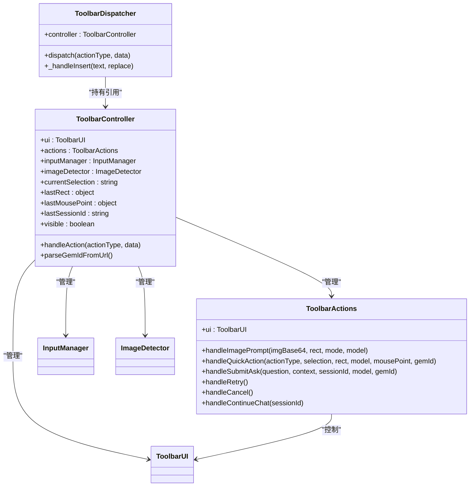

# 动作分发机制

<cite>
**本文档引用的文件**   
- [dispatch.js](file://content/toolbar/dispatch.js)
- [controller.js](file://content/toolbar/controller.js)
- [actions.js](file://content/toolbar/actions.js)
- [actions_delegate.js](file://content/toolbar/ui/actions_delegate.js)
- [selection.js](file://content/selection.js)
- [session_manager.js](file://background/managers/session_manager.js)
- [quick_ask_handler.js](file://background/handlers/session/quick_ask_handler.js)
- [prompt_handler.js](file://background/handlers/session/prompt_handler.js)
</cite>

## 目录
1. [简介](#简介)
2. [核心组件](#核心组件)
3. [动作分发流程](#动作分发流程)
4. [快速操作处理](#快速操作处理)
5. [错误处理与边界情况](#错误处理与边界情况)
6. [性能考虑与资源管理](#性能考虑与资源管理)
7. [结论](#结论)

## 简介
本文件详细说明了Gemini Nexus扩展中的动作分发机制，重点分析了`ToolbarDispatcher`类中`dispatch`方法的实现逻辑。该机制负责处理用户在网页上触发的各种AI辅助操作，包括文本处理、图像分析和快速问答等功能。系统通过控制器协调UI状态、用户选择内容和动作处理器之间的交互，实现高效的动作路由和执行。

## 核心组件

动作分发机制由多个核心组件构成，这些组件协同工作以实现完整的功能链路。`ToolbarDispatcher`作为核心分发器，接收来自UI的各种动作请求并根据动作类型进行路由。`ToolbarController`作为中央控制器，管理UI状态、用户选择和各种子模块的生命周期。`ToolbarActions`类封装了具体动作的业务逻辑，而`SelectionObserver`则负责监控用户的选择行为。

**Section sources**
- [dispatch.js](file://content/toolbar/dispatch.js#L5-L172)
- [controller.js](file://content/toolbar/controller.js#L7-L301)
- [actions.js](file://content/toolbar/actions.js#L4-L197)
- [selection.js](file://content/selection.js#L5-L63)

## 动作分发流程

### 分发器实现逻辑
`ToolbarDispatcher`类的`dispatch`方法是整个动作分发机制的核心，它通过switch语句处理多种动作类型。分发器通过控制器访问UI状态和当前选中内容，并调用相应的动作处理器。每个动作类型都有特定的处理逻辑和前置条件检查。

**Diagram sources**
- [dispatch.js](file://content/toolbar/dispatch.js#L16-L149)

### 动作类型处理分支
分发机制支持多种动作类型，每种类型都有特定的业务逻辑：

- **文本复制** (`copy_selection`): 检查是否存在当前选中内容，如果有则尝试复制到剪贴板，并通过UI反馈操作结果
- **图像分析** (`image_analyze`, `image_chat`, `image_describe`): 检测当前图像元素，获取其URL和位置信息，然后调用图像提示处理
- **图像提取** (`image_extract`): 专门用于OCR文本提取的图像处理模式
- **图像编辑** (`image_remove_bg`, `image_remove_text`, `image_upscale`, `image_expand`): 各种图像处理操作，根据具体动作类型设置处理模式
- **翻译/解释/总结** (`translate`, `explain`, `summarize`): 对选中文本进行语义处理，需要有选中内容才能执行
- **语法修正** (`grammar`): 特殊的文本处理模式，会设置语法修正状态
- **询问** (`ask`): 显示询问窗口，允许用户基于选中内容提问

**Section sources**
- [dispatch.js](file://content/toolbar/dispatch.js#L19-L149)

### 控制器与状态访问
分发器通过控制器实例访问各种状态和功能模块。控制器维护了当前选中内容(`currentSelection`)、最后选中区域(`lastRect`)、最后鼠标位置(`lastMousePoint`)和最后会话ID(`lastSessionId`)等关键状态。分发器还通过控制器访问UI组件、动作处理器、输入管理器和图像检测器等子模块。

**Diagram sources**
- [controller.js](file://content/toolbar/controller.js#L7-L301)
- [dispatch.js](file://content/toolbar/dispatch.js#L5-L172)
- [actions.js](file://content/toolbar/actions.js#L4-L197)

## 快速操作处理

### Gem ID注入机制
`handleAction`方法实现了Gem ID的自动注入逻辑。系统首先尝试从当前页面URL解析Gem ID（匹配`/gem/GEM_ID`模式），如果失败则使用用户在设置中存储的Gem ID。如果成功获取到Gem ID，它会被添加到动作数据中，然后传递给分发器。

**Diagram sources**
- [controller.js](file://content/toolbar/controller.js#L223-L233)
- [actions.js](file://content/toolbar/actions.js#L130-L136)

### 快速操作流程
快速操作（如翻译、解释、总结）的处理流程包括：隐藏当前工具栏、显示询问窗口、设置加载状态、准备提示词并发送请求。系统使用本地化字符串生成适当的提示词和界面文本，确保用户体验的一致性。

**Diagram sources**
- [dispatch.js](file://content/toolbar/dispatch.js#L98-L108)
- [actions.js](file://content/toolbar/actions.js#L92-L140)

## 错误处理与边界情况

### 保护性逻辑
系统实现了多层保护性逻辑来处理边界情况：

- **无选中内容**: 在需要选中内容的动作（如翻译、解释）中，系统会首先检查`currentSelection`是否存在，如果为空则直接返回，避免执行无效操作
- **无图像检测**: 图像相关动作会检查`getCurrentImage()`的返回值，如果为null则不执行后续操作
- **剪贴板访问**: 复制操作使用Promise处理，成功时显示正面反馈，失败时显示负面反馈并记录错误
- **输入插入**: 插入操作会检查是否有可编辑的输入源，如果没有则尝试复制到剪贴板并给出相应提示

### 错误处理策略
系统采用分层的错误处理策略：

- **前端处理**: UI组件捕获并显示操作错误，如复制失败或插入失败
- **后台处理**: `session_manager.js`中的`handleSendPrompt`方法包含完整的错误处理逻辑，能够识别各种错误类型（未登录、频率限制、空响应等）并生成适当的用户反馈
- **重试机制**: 对于认证错误，系统会尝试轮换账户并重试请求
- **取消机制**: 使用`AbortController`实现请求取消功能，确保资源及时释放

**Section sources**
- [dispatch.js](file://content/toolbar/dispatch.js#L21-L28)
- [dispatch.js](file://content/toolbar/dispatch.js#L36-L37)
- [dispatch.js](file://content/toolbar/dispatch.js#L152-L157)
- [session_manager.js](file://background/managers/session_manager.js#L149-L199)

## 性能考虑与资源管理

### 避免重复分发
系统通过多种机制避免重复分发和不必要的操作：

- **状态检查**: 在执行关键操作前检查相关状态，如`lastSessionId`和`currentSelection`
- **单例模式**: 控制器和分发器采用单例模式，确保全局状态一致性
- **事件去抖**: 选择观察器使用10ms延迟来确保选择操作完成后再处理
- **资源清理**: 取消请求时会清理`abortController`引用，防止内存泄漏

### 资源清理机制
系统实现了完善的资源清理机制：

- **请求取消**: `cancelCurrentRequest`方法会中止当前请求并清理控制器引用
- **状态重置**: 执行某些操作（如取消询问）后会重置相关状态变量
- **内存管理**: 使用WeakMap和适当的对象引用管理来避免内存泄漏
- **事件监听**: 组件销毁时会移除事件监听器

**Diagram sources**
- [session_manager.js](file://background/managers/session_manager.js#L204-L211)
- [controller.js](file://content/toolbar/controller.js#L250-L254)

## 结论
Gemini Nexus的动作分发机制是一个精心设计的系统，它通过清晰的组件分离和责任划分实现了高效、可靠的动作处理。机制的核心优势在于其灵活性和健壮性，能够处理多种类型的用户操作，同时具备完善的错误处理和资源管理能力。通过Gem ID自动注入和上下文感知，系统能够提供个性化的用户体验。整体架构遵循了良好的软件工程原则，具有良好的可维护性和扩展性。