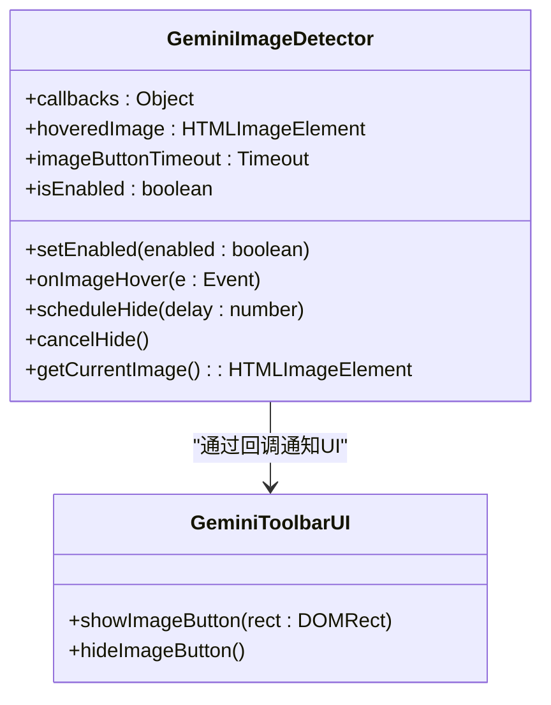
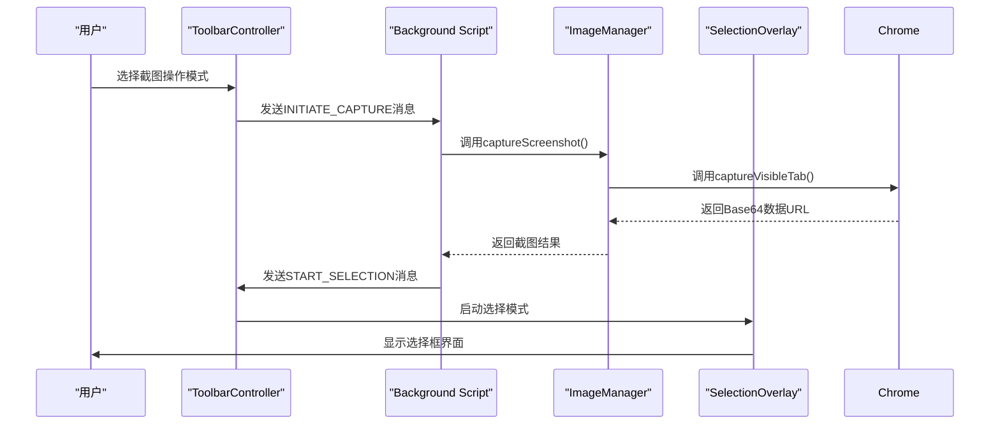
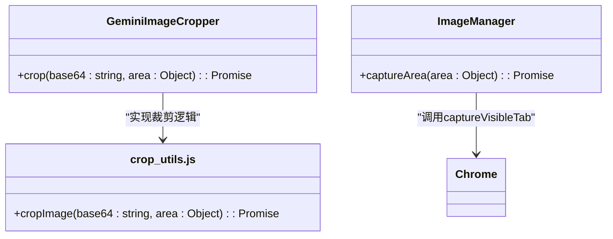
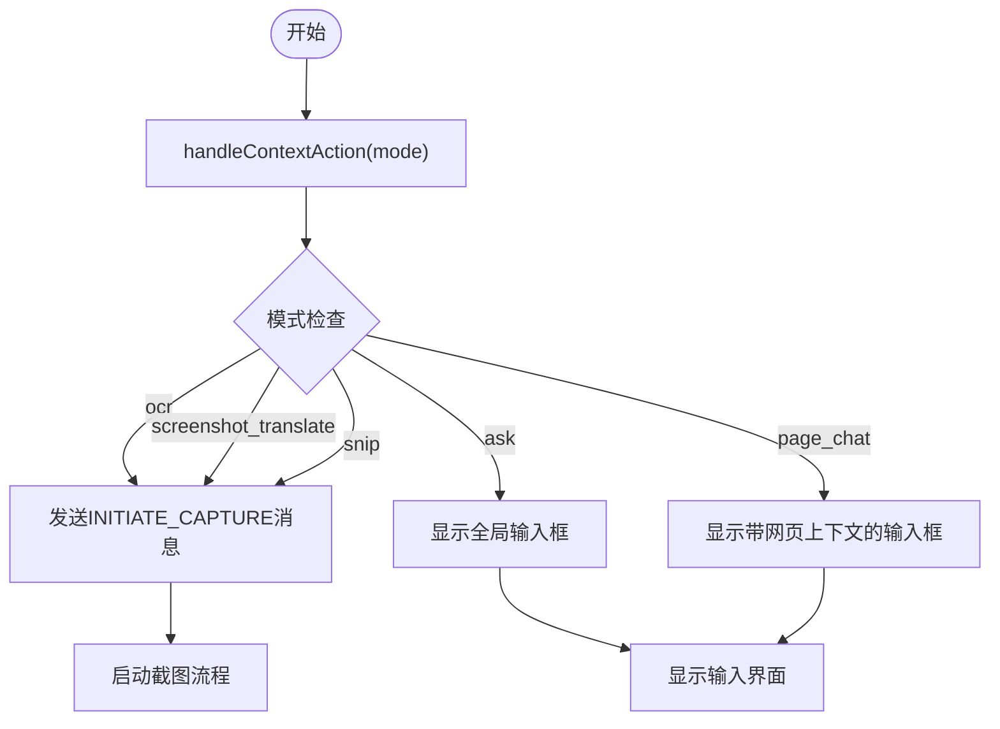
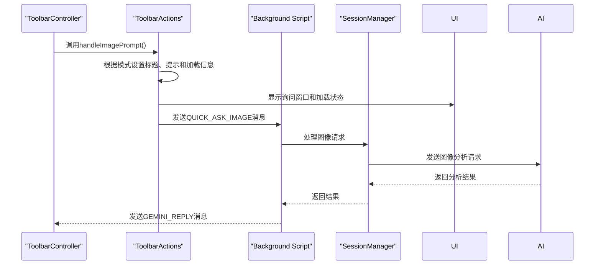

# 图像操作处理

<cite>
**本文档引用的文件**
- [image.js](file://content/toolbar/image.js)
- [crop.js](file://content/toolbar/crop.js)
- [controller.js](file://content/toolbar/controller.js)
- [actions.js](file://content/toolbar/actions.js)
- [image_manager.js](file://background/managers/image_manager.js)
- [ui.js](file://background/handlers/ui.js)
- [quick_ask_handler.js](file://background/handlers/session/quick_ask_handler.js)
- [message_handler.js](file://sandbox/controllers/message_handler.js)
- [crop_utils.js](file://lib/crop_utils.js)
</cite>

## 目录
1. [简介](#简介)
2. [图像检测机制](#图像检测机制)
3. [截图功能处理流程](#截图功能处理流程)
4. [客户端裁剪实现](#客户端裁剪实现)
5. [图像操作模式分发](#图像操作模式分发)
6. [图像分析请求构建](#图像分析请求构建)
7. [用户体验设计考量](#用户体验设计考量)

## 简介
本文档全面解析Gemini扩展中的图像操作处理机制，涵盖从图像元素识别、截图捕获到图像分析请求发送的完整流程。文档详细说明了系统如何通过GeminiImageDetector识别页面中的图像元素并显示操作按钮，以及handleContextAction中截图模式的处理逻辑。同时解释了客户端裁剪功能如何通过GeminiImageCropper实现，以及各种图像操作模式（ocr、screenshot_translate、snip）的分发策略。

## 图像检测机制

GeminiImageDetector类负责识别页面中的图像元素并在用户悬停时显示操作按钮。该机制通过监听页面的mouseover和mouseout事件来检测图像元素。

当用户启用图像工具时，GeminiImageDetector会绑定事件监听器，监控页面上所有IMG标签的悬停状态。系统会忽略尺寸小于100x100像素的小型图像（如图标或占位符），以避免在不重要的图像上显示操作按钮。

**图示来源**
- [image.js](file://content/toolbar/image.js#L5-L79)

**本节来源**
- [image.js](file://content/toolbar/image.js#L5-L79)

## 截图功能处理流程

截图功能的处理流程始于INITIATE_CAPTURE消息的发送，该消息由handleContextAction方法触发。当用户选择OCR、截图翻译或截图分析等操作模式时，系统会启动截图流程。

后台脚本中的ui.js处理器接收到INITIATE_CAPTURE消息后，会先捕获当前标签页的可见区域，然后通过content script向页面发送START_SELECTION消息，启动选择模式。在启动选择模式前，系统会隐藏所有浮动UI元素，以防止这些UI被包含在截图中。

**图示来源**
- [controller.js](file://content/toolbar/controller.js#L103-L114)
- [ui.js](file://background/handlers/ui.js#L88-L102)
- [image_manager.js](file://background/managers/image_manager.js#L63-L78)

**本节来源**
- [controller.js](file://content/toolbar/controller.js#L103-L114)
- [ui.js](file://background/handlers/ui.js#L88-L102)
- [image_manager.js](file://background/managers/image_manager.js#L63-L78)

## 客户端裁剪实现

客户端裁剪功能通过GeminiImageCropper对象实现，该对象提供了一个crop方法用于从完整截图中提取选定区域。裁剪过程在客户端完成，利用HTML5 Canvas API进行图像处理。

GeminiImageCropper的crop方法接收Base64编码的图像数据和区域信息作为参数，创建一个Image对象加载图像，然后使用Canvas的drawImage方法将指定区域绘制到新的Canvas上，最后将Canvas转换为新的Base64数据URL返回。

在高DPI设备上，系统会考虑像素比率（pixelRatio）来确保裁剪的准确性。area对象包含CSS像素坐标，而图像数据是设备像素，因此需要根据pixelRatio进行坐标缩放。

**图示来源**
- [crop.js](file://content/toolbar/crop.js#L5-L27)
- [crop_utils.js](file://lib/crop_utils.js#L4-L28)
- [image_manager.js](file://background/managers/image_manager.js#L82-L95)

**本节来源**
- [crop.js](file://content/toolbar/crop.js#L5-L27)
- [crop_utils.js](file://lib/crop_utils.js#L4-L28)
- [image_manager.js](file://background/managers/image_manager.js#L82-L95)

## 图像操作模式分发

系统支持多种图像操作模式，包括OCR识别、截图翻译和通用截图分析（snip）。这些模式通过handleContextAction方法进行分发处理。

当用户通过右键菜单选择不同的操作模式时，ToolbarController的handleContextAction方法会根据传入的模式参数进行相应处理。对于需要截图的操作模式（ocr、screenshot_translate、snip），系统会发送INITIATE_CAPTURE消息启动截图流程；对于文本操作模式，则直接显示相应的输入界面。

**图示来源**
- [controller.js](file://content/toolbar/controller.js#L103-L114)
- [actions.js](file://content/toolbar/actions.js#L21-L75)

**本节来源**
- [controller.js](file://content/toolbar/controller.js#L103-L114)
- [actions.js](file://content/toolbar/actions.js#L21-L75)

## 图像分析请求构建

图像分析请求的构建过程涉及图像数据传递、模型选择和会话管理。当截图完成后，系统会根据当前操作模式构建相应的请求并发送给AI服务。

ToolbarActions类的handleImagePrompt方法负责处理图像提示，根据不同的操作模式设置相应的标题、提示文本和加载信息。然后创建包含图像Base64数据、提示文本和模型名称的QUICK_ASK_IMAGE消息并发送。

后台的QuickAskHandler接收到请求后，会通过ImageManager获取图像数据，重置会话上下文，并调用SessionManager的handleSendPrompt方法发送包含图像文件的请求。

**图示来源**
- [actions.js](file://content/toolbar/actions.js#L21-L90)
- [quick_ask_handler.js](file://background/handlers/session/quick_ask_handler.js#L46-L97)
- [controller.js](file://content/toolbar/controller.js#L119-L153)

**本节来源**
- [actions.js](file://content/toolbar/actions.js#L21-L90)
- [quick_ask_handler.js](file://background/handlers/session/quick_ask_handler.js#L46-L97)
- [controller.js](file://content/toolbar/controller.js#L119-L153)

## 用户体验设计考量

系统在用户体验设计方面考虑了多个方面，包括加载状态反馈和错误处理机制，以提供流畅的用户交互体验。

当用户启动截图操作时，系统会立即显示相应的状态提示，如"选择要OCR的区域"或"选择要翻译的区域"，让用户清楚当前的操作模式。在图像处理过程中，系统会显示加载状态，告知用户操作正在进行中。

对于错误处理，系统实现了多层次的容错机制。如果截图失败，系统会返回错误信息并在控制台记录错误。如果裁剪失败，系统会使用原始图像作为备选方案。在图像加载过程中，如果水印移除失败，系统会使用原始图像数据。

此外，系统还考虑了高DPI设备的适配问题，在裁剪时会根据pixelRatio进行坐标缩放，确保在不同设备上都能准确裁剪用户选择的区域。

**本节来源**
- [message_handler.js](file://sandbox/controllers/message_handler.js#L319-L340)
- [crop.js](file://content/toolbar/crop.js#L136-L140)
- [overlay.js](file://content/overlay.js#L51-L74)