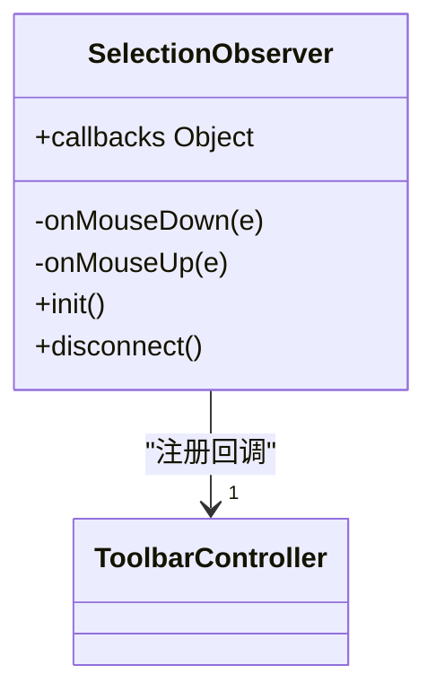
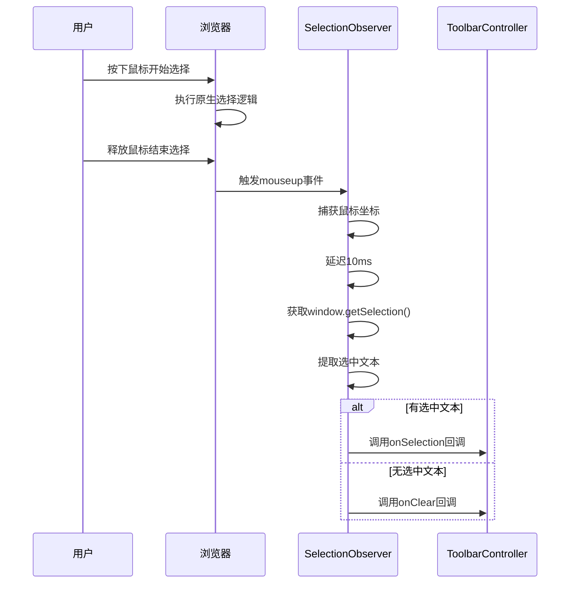
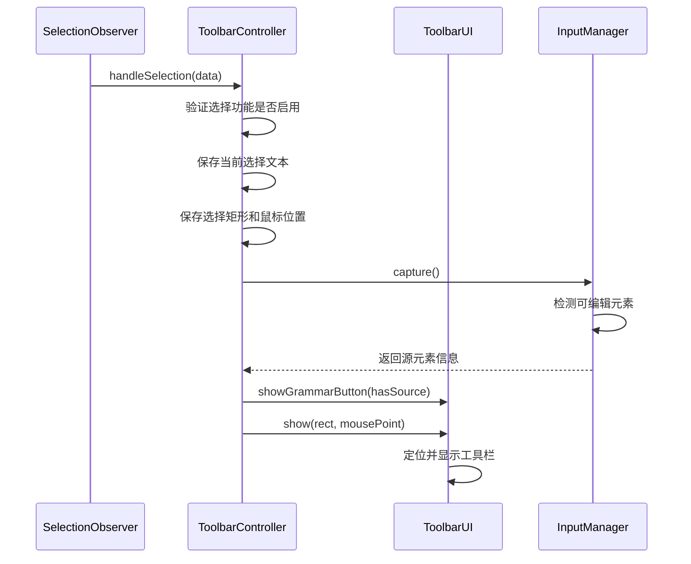
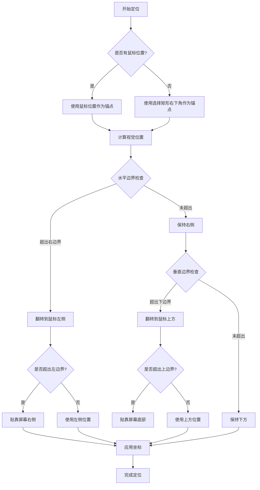
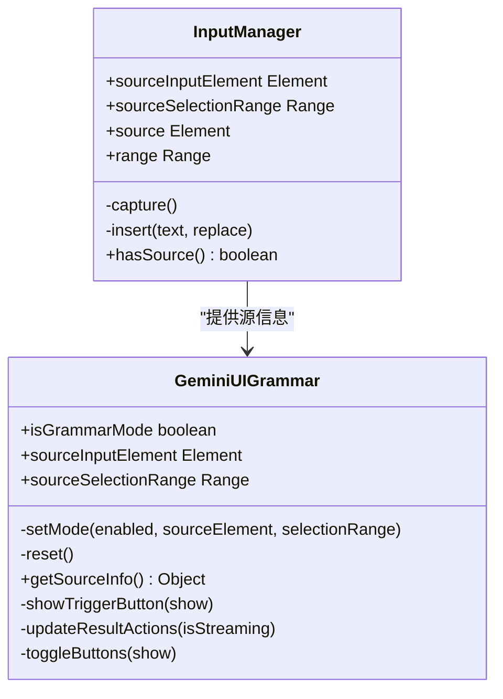
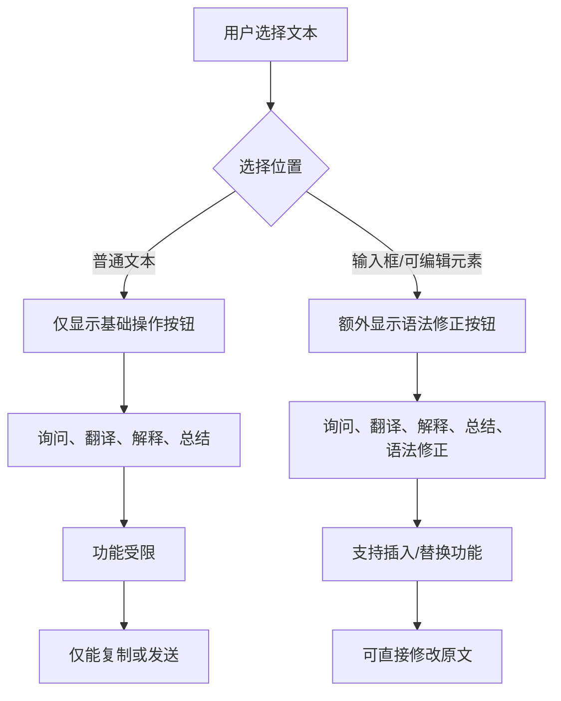

# 文本选择交互

<cite>
**本文档引用的文件**
- [selection.js](file://content/selection.js)
- [controller.js](file://content/toolbar/controller.js)
- [manager.js](file://content/toolbar/ui/manager.js)
- [grammar.js](file://content/toolbar/ui/grammar.js)
- [input.js](file://content/toolbar/utils/input.js)
- [widget.js](file://content/toolbar/view/widget.js)
- [utils.js](file://content/toolbar/view/utils.js)
</cite>

## 目录
1. [简介](#简介)
2. [核心组件](#核心组件)
3. [选择观察器机制](#选择观察器机制)
4. [控制器处理流程](#控制器处理流程)
5. [工具栏显示策略](#工具栏显示策略)
6. [语法修正按钮逻辑](#语法修正按钮逻辑)
7. [不同内容类型的行为差异](#不同内容类型的行为差异)
8. [性能优化措施](#性能优化措施)
9. [常见问题排查](#常见问题排查)
10. [附录](#附录)

## 简介
本文档详细解析了Gemini Nexus扩展中文本选择交互的完整实现机制。重点分析了`handleSelection`与`handleSelectionClear`方法的调用链路，以及SelectionObserver如何检测用户选择行为并触发相应回调。文档还涵盖了控制器如何处理选中文本、更新UI状态和定位工具栏的完整流程。

## 核心组件

本文档涉及的核心组件包括选择观察器(SelectionObserver)、工具栏控制器(ToolbarController)、输入管理器(InputManager)和UI管理器(ToolbarUI)。这些组件协同工作，实现了从用户选择文本到显示交互工具栏的完整流程。

**本节来源**
- [selection.js](file://content/selection.js#L5-L61)
- [controller.js](file://content/toolbar/controller.js#L7-L300)
- [manager.js](file://content/toolbar/ui/manager.js#L21-L277)

## 选择观察器机制

**图示来源**
- [selection.js](file://content/selection.js#L5-L61)

SelectionObserver类负责监听用户的鼠标事件，检测文本选择行为。它通过监听`mousedown`和`mouseup`事件来捕获用户的选择操作。

当用户释放鼠标按钮时，`onMouseUp`方法会被触发。该方法首先立即捕获鼠标坐标，然后使用`setTimeout`延迟10毫秒执行选择处理逻辑。这个短暂的延迟是为了确保浏览器的原生选择机制已经完成。

**图示来源**
- [selection.js](file://content/selection.js#L24-L51)

如果检测到有效选择（文本长度大于0），则通过`getSelection().getRangeAt(0)`获取选择范围，并通过`getBoundingClientRect()`获取其边界矩形。然后调用注册的`onSelection`回调，传递包含文本内容、选择范围、边界矩形和鼠标坐标的对象。

如果选择被清除（文本长度为0），则调用`onClear`回调。这种设计确保了选择状态的准确检测和及时响应。

**本节来源**
- [selection.js](file://content/selection.js#L24-L51)

## 控制器处理流程

**图示来源**
- [controller.js](file://content/toolbar/controller.js#L189-L205)
- [input.js](file://content/toolbar/utils/input.js#L12-L132)

`handleSelection`方法是文本选择交互的核心处理函数。当SelectionObserver检测到有效选择时，会调用此方法。处理流程如下：

1. 首先检查`isSelectionEnabled`标志，确保选择功能已启用
2. 保存选中的文本内容、选择矩形和鼠标位置到实例变量中
3. 调用`inputManager.capture()`方法检测选择是否发生在可编辑元素内
4. 根据`inputManager.hasSource()`的结果决定是否显示语法修正按钮
5. 调用`ui.show()`方法显示工具栏

`handleSelectionClear`方法在选择被清除时调用，主要执行以下操作：
- 检查询问窗口是否可见，如果不可见则继续隐藏逻辑
- 清空当前选择文本
- 重置输入管理器的状态
- 隐藏工具栏

这种设计确保了UI状态与用户选择行为的同步。

**本节来源**
- [controller.js](file://content/toolbar/controller.js#L189-L214)

## 工具栏显示策略

**图示来源**
- [utils.js](file://content/toolbar/view/utils.js#L11-L103)
- [widget.js](file://content/toolbar/view/widget.js#L14-L18)

工具栏的定位算法基于鼠标位置和选择矩形，采用"鼠标右下角"的默认定位策略。算法首先确定锚点位置，优先使用鼠标释放时的坐标，其次使用选择矩形的右下角。

定位过程包含智能的边界检测和自动调整：
- 水平方向：如果工具栏超出屏幕右边界，则翻转到鼠标左侧；如果左侧也超出边界，则贴靠屏幕右侧
- 垂直方向：如果工具栏超出屏幕下边界，则翻转到鼠标上方；如果上方也超出边界，则贴靠屏幕底部

对于小型工具栏，还会根据定位结果添加`placed-bottom`或`placed-top`CSS类，以显示相应的箭头指示器。这种响应式布局确保工具栏始终在可视区域内，提供良好的用户体验。

**本节来源**
- [utils.js](file://content/toolbar/view/utils.js#L11-L103)

## 语法修正按钮逻辑

**图示来源**
- [input.js](file://content/toolbar/utils/input.js#L4-L132)
- [grammar.js](file://content/toolbar/ui/grammar.js#L6-L62)

语法修正按钮的显示逻辑由`GeminiInputManager`和`GeminiUIGrammar`两个类协同实现。`InputManager`负责检测选择是否发生在可编辑元素内，而`GrammarManager`负责管理语法修正模式的UI状态。

`InputManager.capture()`方法通过以下步骤检测可编辑元素：
1. 检查活动元素是否为INPUT或TEXTAREA，并且有选中文本
2. 如果不是表单元素，则遍历选择范围的共同祖先容器
3. 向上遍历DOM树，查找具有`isContentEditable`属性的元素
4. 找到后保存该元素和选择范围

当`handleSelection`被调用时，控制器会调用`inputManager.hasSource()`来判断是否显示语法按钮。如果返回true，则调用`ui.showGrammarButton(true)`显示按钮。

语法修正模式激活后，当AI返回结果且流式传输结束时，会显示"插入"和"替换"按钮，允许用户将修正后的文本插入到原始位置。

**本节来源**
- [input.js](file://content/toolbar/utils/input.js#L12-L54)
- [grammar.js](file://content/toolbar/ui/grammar.js#L14-L48)

## 不同内容类型的行为差异

**图示来源**
- [controller.js](file://content/toolbar/controller.js#L201-L204)
- [input.js](file://content/toolbar/utils/input.js#L12-L54)

系统对不同内容类型的选择行为有明显差异：

**普通文本选择**：
- 仅显示基础操作按钮（询问、翻译、解释、总结）
- 功能相对简单，主要支持将选中文本作为提示发送给AI
- 不支持直接修改原文的功能

**输入框/可编辑元素内选择**：
- 额外显示语法修正按钮
- 支持"插入"和"替换"操作按钮
- 可以直接将AI生成的文本插入或替换到原始位置
- 保持了原始的选择范围信息，确保精确的文本替换

这种差异化设计确保了在普通网页内容和可编辑内容场景下都能提供最合适的交互体验。对于可编辑内容，系统提供了更强大的文本修正功能；对于普通内容，则保持界面简洁。

**本节来源**
- [controller.js](file://content/toolbar/controller.js#L201-L204)

## 性能优化措施

系统实现了多项性能优化措施来确保流畅的用户体验：

**事件节流**：通过在`onMouseUp`中使用`setTimeout`延迟10毫秒处理选择，避免了在选择过程中频繁触发UI更新。这符合浏览器的原生选择行为，确保选择操作完全结束后才进行处理。

**选择状态缓存**：控制器使用`currentSelection`、`lastRect`和`lastMousePoint`等实例变量缓存选择状态，避免了重复计算和DOM查询。这些缓存值在`handleSelection`和`handleSelectionClear`方法中被及时更新和清除。

**条件性UI更新**：只有当选择状态真正改变时才会触发UI更新。例如，语法按钮的显示状态仅在`inputManager.hasSource()`结果变化时才更新，减少了不必要的DOM操作。

**资源预加载**：UI组件在初始化时就构建好DOM结构，避免了每次显示工具栏时都重新创建元素，显著提高了响应速度。

这些优化措施共同确保了文本选择交互的流畅性和响应性。

**本节来源**
- [selection.js](file://content/selection.js#L30-L31)
- [controller.js](file://content/toolbar/controller.js#L37-L39)

## 常见问题排查

**工具栏不显示的可能原因及解决方案**：

1. **选择功能被禁用**
   - 检查`isSelectionEnabled`标志是否为true
   - 确认没有通过设置或其他方式禁用了选择功能

2. **选择文本过短或为空**
   - 系统要求选择文本长度大于0才会触发工具栏显示
   - 确保选择了足够长度的文本

3. **事件监听器未正确注册**
   - 检查SelectionObserver的`init()`方法是否被调用
   - 确认`mouseup`和`mousedown`事件监听器已添加

4. **UI构建失败**
   - 确认`ToolbarUI.build()`方法已成功执行
   - 检查shadow DOM是否正确创建

5. **样式问题**
   - 检查工具栏元素的CSS类是否正确应用
   - 确认`visible`类被正确添加

6. **定位问题**
   - 检查`lastRect`和`lastMousePoint`是否正确获取
   - 确认定位算法没有因边界条件而失败

通过检查这些常见问题点，可以快速定位和解决工具栏不显示的问题。

**本节来源**
- [controller.js](file://content/toolbar/controller.js#L189-L205)
- [selection.js](file://content/selection.js#L34-L45)

## 附录

本文档详细分析了Gemini Nexus扩展中文本选择交互的完整实现。从选择检测、状态处理到UI显示的各个环节都进行了深入解析，为理解和维护这一核心功能提供了全面的参考。

**本节来源**
- [selection.js](file://content/selection.js#L5-L61)
- [controller.js](file://content/toolbar/controller.js#L7-L300)
- [manager.js](file://content/toolbar/ui/manager.js#L21-L277)
- [input.js](file://content/toolbar/utils/input.js#L4-L132)
- [grammar.js](file://content/toolbar/ui/grammar.js#L6-L62)
- [utils.js](file://content/toolbar/view/utils.js#L11-L103)
- [widget.js](file://content/toolbar/view/widget.js#L14-L18)