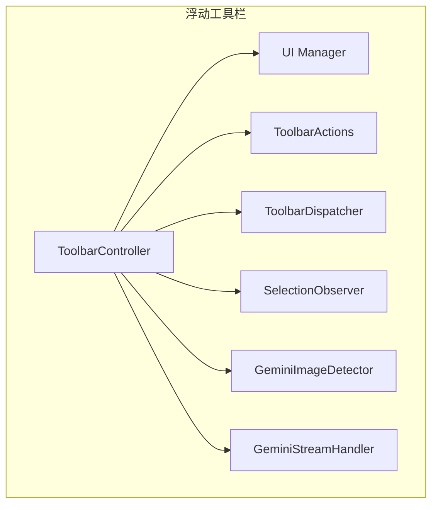
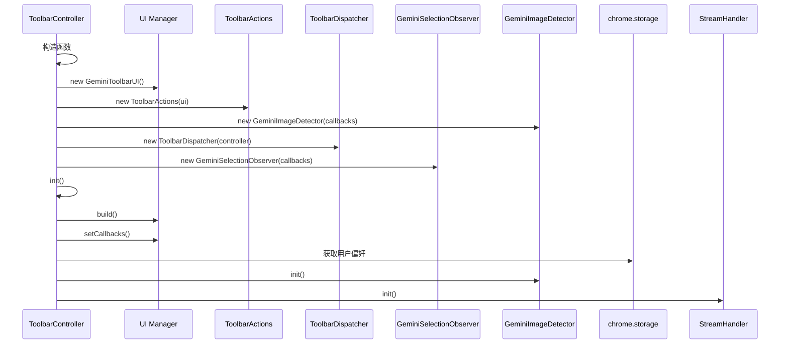
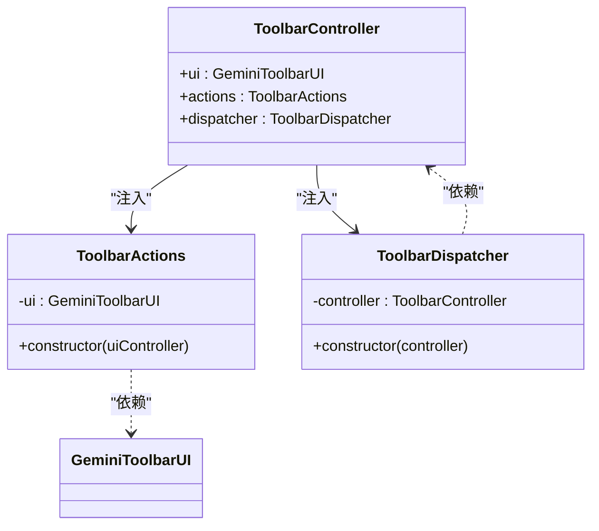
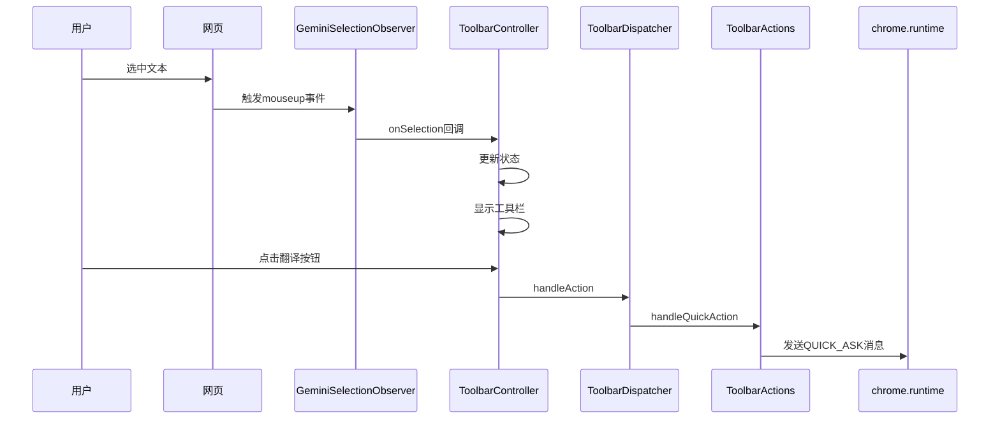
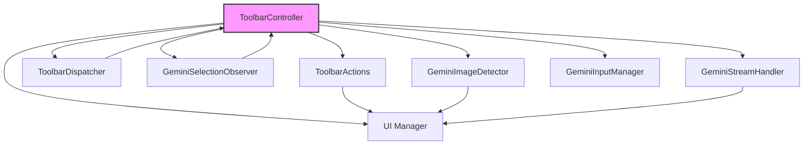

# 架构设计

<cite>
**本文档引用的文件**
- [controller.js](file://content/toolbar/controller.js)
- [actions.js](file://content/toolbar/actions.js)
- [dispatch.js](file://content/toolbar/dispatch.js)
- [selection.js](file://content/selection.js)
- [image.js](file://content/toolbar/image.js)
- [stream.js](file://content/toolbar/stream.js)
- [ui/manager.js](file://content/toolbar/ui/manager.js)
- [ui/renderer.js](file://content/toolbar/ui/renderer.js)
- [bridge.js](file://content/toolbar/bridge.js)
- [crop.js](file://content/toolbar/crop.js)
</cite>

## 目录
1. [简介](#简介)
2. [项目结构](#项目结构)
3. [核心组件](#核心组件)
4. [架构概述](#架构概述)
5. [详细组件分析](#详细组件分析)
6. [依赖分析](#依赖分析)
7. [性能考虑](#性能考虑)
8. [故障排除指南](#故障排除指南)
9. [结论](#结论)

## 简介
本文档详细阐述了浮动工具栏的架构设计，重点分析了`ToolbarController`如何作为核心协调者整合UI、Actions、Dispatcher和SelectionObserver等模块。文档详细说明了模块间的依赖注入机制、UI组件初始化流程、事件回调注册以及状态管理策略。同时，解释了控制器与GeminiImageDetector、GeminiSelectionObserver等子模块的交互契约，描述了整个工具栏的生命周期管理，从init()初始化到各模块的协同工作。通过组件协作时序图和模块依赖关系图，帮助开发者理解整体架构。文档还讨论了设计模式的应用，如观察者模式在选择事件处理中的使用，以及依赖注入在模块解耦中的作用。

## 项目结构
浮动工具栏的主要功能实现在`content/toolbar/`目录下，该目录包含了控制器、UI、动作处理、事件分发等核心模块。工具栏的UI组件分为样式、视图和工具类，分别位于`styles/`、`view/`和`utils/`子目录中。`controller.js`作为核心协调者，整合了所有模块的功能。



**图表来源**
- [controller.js](file://content/toolbar/controller.js#L7-L48)

**章节来源**
- [controller.js](file://content/toolbar/controller.js#L7-L48)
- [project_structure](file://#L1-L10)

## 核心组件
浮动工具栏的核心组件包括`ToolbarController`、`ToolbarActions`、`ToolbarDispatcher`和`GeminiSelectionObserver`。`ToolbarController`作为核心协调者，负责初始化和协调所有其他模块。`ToolbarActions`处理各种用户动作，如文本翻译、摘要生成等。`ToolbarDispatcher`负责根据用户动作分发相应的处理逻辑。`GeminiSelectionObserver`监控用户的选择事件，当用户选中文本时触发相应的处理流程。

**章节来源**
- [controller.js](file://content/toolbar/controller.js#L7-L48)
- [actions.js](file://content/toolbar/actions.js#L4-L8)
- [dispatch.js](file://content/toolbar/dispatch.js#L5-L8)
- [selection.js](file://content/selection.js#L5-L8)

## 架构概述
浮动工具栏采用模块化架构设计，`ToolbarController`作为核心协调者，通过依赖注入的方式整合各个功能模块。这种设计模式实现了高内聚低耦合，使得各个模块可以独立开发和测试。控制器负责管理工具栏的生命周期，从初始化到销毁的整个过程。

```mermaid
classDiagram
class ToolbarController {
+ui : GeminiToolbarUI
+actions : ToolbarActions
+imageDetector : GeminiImageDetector
+streamHandler : GeminiStreamHandler
+inputManager : GeminiInputManager
+dispatcher : ToolbarDispatcher
+selectionObserver : GeminiSelectionObserver
+init() : void
+handleSelection(data) : void
+handleSelectionClear() : void
+handleClick(e) : void
+handleAction(actionType, data) : void
}
class ToolbarActions {
+ui : GeminiToolbarUI
+handleImagePrompt(imgBase64, rect, mode, model) : Promise~void~
+handleQuickAction(actionType, selection, rect, model, mousePoint, gemId) : Promise~void~
+handleSubmitAsk(question, context, sessionId, model, gemId) : void
+handleRetry() : void
+handleCancel() : void
+handleContinueChat(sessionId) : void
}
class ToolbarDispatcher {
+controller : ToolbarController
+dispatch(actionType, data) : void
+_handleInsert(text, replace) : void
}
class GeminiSelectionObserver {
+callbacks : {onSelection, onClear, onClick}
+init() : void
+onMouseUp(e) : void
+onMouseDown(e) : void
+disconnect() : void
}
class GeminiImageDetector {
+callbacks : {onShow, onHide}
+hoveredImage : HTMLImageElement
+imageButtonTimeout : number
+isEnabled : boolean
+init() : void
+setEnabled(enabled) : void
+onImageHover(e) : void
+scheduleHide(delay) : void
+cancelHide() : void
+getCurrentImage() : HTMLImageElement
}
class GeminiStreamHandler {
+ui : GeminiToolbarUI
+callbacks : {onSessionId}
+init() : void
+handleStreamMessage(request, sender, sendResponse) : void
}
ToolbarController --> ToolbarActions : "使用"
ToolbarController --> ToolbarDispatcher : "使用"
ToolbarController --> GeminiSelectionObserver : "使用"
ToolbarController --> GeminiImageDetector : "使用"
ToolbarController --> GeminiStreamHandler : "使用"
ToolbarController --> "UI Manager" : "使用"
ToolbarActions --> "UI Manager" : "使用"
ToolbarDispatcher --> ToolbarController : "访问"
ToolbarDispatcher --> "UI Manager" : "访问"
ToolbarDispatcher --> GeminiInputManager : "访问"
ToolbarDispatcher --> GeminiImageDetector : "访问"
```

**图表来源**
- [controller.js](file://content/toolbar/controller.js#L7-L48)
- [actions.js](file://content/toolbar/actions.js#L4-L8)
- [dispatch.js](file://content/toolbar/dispatch.js#L5-L8)
- [selection.js](file://content/selection.js#L5-L8)
- [image.js](file://content/toolbar/image.js#L5-L8)
- [stream.js](file://content/toolbar/stream.js#L5-L8)

## 详细组件分析
### ToolbarController分析
`ToolbarController`是浮动工具栏的核心协调者，负责初始化和协调所有其他模块。它通过构造函数注入的方式获取对UI、Actions、Dispatcher等模块的引用，实现了依赖注入模式。控制器的`init()`方法负责初始化UI和各个子模块，设置事件回调，并从本地存储中恢复用户偏好设置。



**图表来源**
- [controller.js](file://content/toolbar/controller.js#L8-L50)

**章节来源**
- [controller.js](file://content/toolbar/controller.js#L8-L50)

### 依赖注入机制
工具栏采用依赖注入模式来管理模块间的依赖关系。`ToolbarController`在构造函数中创建所有子模块的实例，并将必要的引用传递给它们。这种设计模式使得模块间的耦合度降低，提高了代码的可测试性和可维护性。例如，`ToolbarActions`需要访问UI组件来更新界面状态，因此在构造函数中注入了UI控制器的引用。



**图表来源**
- [controller.js](file://content/toolbar/controller.js#L10-L12)
- [actions.js](file://content/toolbar/actions.js#L5-L6)
- [dispatch.js](file://content/toolbar/dispatch.js#L6-L7)

**章节来源**
- [controller.js](file://content/toolbar/controller.js#L10-L12)
- [actions.js](file://content/toolbar/actions.js#L5-L6)
- [dispatch.js](file://content/toolbar/dispatch.js#L6-L7)

### 事件处理流程
工具栏的事件处理流程基于观察者模式实现。`GeminiSelectionObserver`监控用户的鼠标事件，当用户选中文本时，通过回调函数通知`ToolbarController`。控制器接收到选择事件后，更新内部状态并显示工具栏。用户与工具栏交互时，事件通过UI组件传递给`ToolbarDispatcher`，由分发器根据动作类型调用相应的处理逻辑。



**图表来源**
- [selection.js](file://content/selection.js#L24-L52)
- [controller.js](file://content/toolbar/controller.js#L190-L205)
- [dispatch.js](file://content/toolbar/dispatch.js#L16-L149)
- [actions.js](file://content/toolbar/actions.js#L92-L140)

**章节来源**
- [selection.js](file://content/selection.js#L24-L52)
- [controller.js](file://content/toolbar/controller.js#L190-L205)
- [dispatch.js](file://content/toolbar/dispatch.js#L16-L149)
- [actions.js](file://content/toolbar/actions.js#L92-L140)

## 依赖分析
浮动工具栏的模块间依赖关系清晰，`ToolbarController`作为核心协调者依赖于所有其他模块，而其他模块之间的直接依赖较少。这种星型依赖结构降低了模块间的耦合度，使得系统更加稳定和易于维护。`ToolbarDispatcher`通过控制器间接访问其他模块，避免了直接依赖，进一步降低了耦合度。



**图表来源**
- [controller.js](file://content/toolbar/controller.js#L10-L26)
- [dispatch.js](file://content/toolbar/dispatch.js#L10-L15)
- [actions.js](file://content/toolbar/actions.js#L6)
- [selection.js](file://content/selection.js#L6)
- [image.js](file://content/toolbar/image.js#L6)
- [stream.js](file://content/toolbar/stream.js#L6)

**章节来源**
- [controller.js](file://content/toolbar/controller.js#L10-L26)

## 性能考虑
工具栏在性能方面做了多项优化。首先，采用延迟加载策略，只有在用户选中文本时才显示工具栏，减少了不必要的DOM操作。其次，使用ResizeObserver监控窗口大小变化，自动保存用户调整的窗口尺寸，提升了用户体验。此外，图片处理等耗时操作通过iframe在后台线程中执行，避免阻塞主线程。

**章节来源**
- [controller.js](file://content/toolbar/controller.js#L243-L254)
- [events.js](file://content/toolbar/events.js#L141-L163)
- [bridge.js](file://content/toolbar/bridge.js#L14-L18)

## 故障排除指南
当工具栏无法正常工作时，可以按照以下步骤进行排查：首先检查浏览器控制台是否有JavaScript错误；其次确认扩展是否已正确安装并启用；然后检查本地存储中的用户偏好设置是否正确；最后尝试清除缓存并重新加载页面。对于图片处理功能，需要确保background脚本能够正常接收和处理消息。

**章节来源**
- [controller.js](file://content/toolbar/controller.js#L137-L141)
- [dispatch.js](file://content/toolbar/dispatch.js#L22-L27)
- [bridge.js](file://content/toolbar/bridge.js#L47-L48)
- [renderer.js](file://content/toolbar/ui/renderer.js#L31-L34)

## 结论
浮动工具栏采用模块化架构设计，通过`ToolbarController`作为核心协调者整合各个功能模块。依赖注入模式和观察者模式的应用使得系统具有高内聚低耦合的特点，易于维护和扩展。事件分发机制清晰，性能优化措施有效，为用户提供流畅的交互体验。整体架构设计合理，符合现代前端应用的最佳实践。