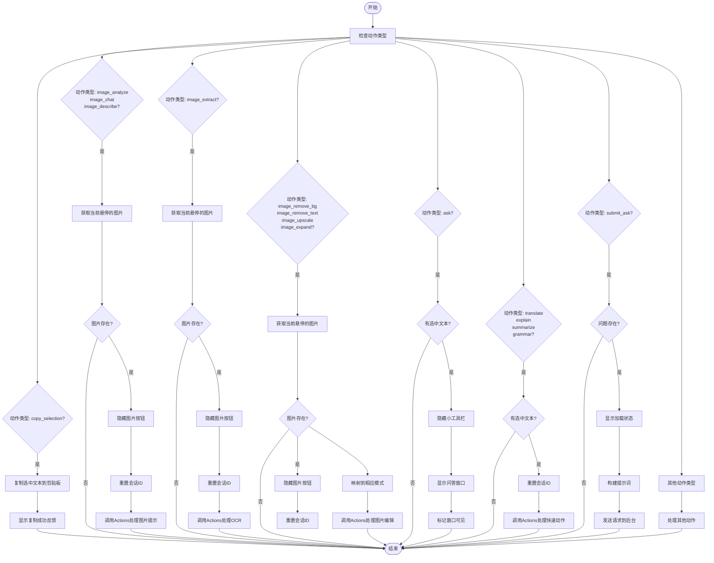

# 浮动工具栏

<cite>
**本文档引用的文件**   
- [controller.js](file://content/toolbar/controller.js)
- [dispatch.js](file://content/toolbar/dispatch.js)
- [selection.js](file://content/toolbar/selection.js)
- [actions.js](file://content/toolbar/actions.js)
- [manager.js](file://content/toolbar/ui/manager.js)
- [widget.js](file://content/toolbar/view/widget.js)
- [events.js](file://content/toolbar/events.js)
- [image.js](file://content/toolbar/image.js)
- [actions_delegate.js](file://content/toolbar/ui/actions_delegate.js)
- [index.js](file://content/toolbar/view/index.js)
- [utils.js](file://content/toolbar/view/utils.js)
- [stream.js](file://content/toolbar/stream.js)
- [crop.js](file://content/toolbar/crop.js)
</cite>

## 目录
1. [简介](#简介)
2. [项目结构](#项目结构)
3. [核心组件](#核心组件)
4. [架构概述](#架构概述)
5. [详细组件分析](#详细组件分析)
6. [依赖分析](#依赖分析)
7. [性能考虑](#性能考虑)
8. [故障排除指南](#故障排除指南)
9. [结论](#结论)

## 简介
本文档全面解析了浮动工具栏的实现机制，重点分析了文本选中后工具栏的显示策略、事件绑定机制和用户交互流程。文档详细说明了`ToolbarController`如何协调UI、Actions、Dispatcher和SelectionObserver模块协同工作，描述了`handleSelection`与`handleAction`方法的调用链路，并解释了`dispatch.js`中各类动作（翻译、总结、语法修正）的分发逻辑。同时提供了工具栏定位、气泡窗口展示、按钮状态管理的技术实现细节。

## 项目结构
浮动工具栏功能主要位于`content/toolbar`目录下，采用模块化设计，各组件职责分明。核心模块包括控制器、分发器、UI管理器、视图组件和事件处理等。

**图表来源**
- [controller.js](file://content/toolbar/controller.js#L7-L300)
- [dispatch.js](file://content/toolbar/dispatch.js#L5-L171)
- [actions.js](file://content/toolbar/actions.js#L4-L196)
- [manager.js](file://content/toolbar/ui/manager.js#L21-L277)
- [index.js](file://content/toolbar/view/index.js#L8-L132)

**本节来源**
- [controller.js](file://content/toolbar/controller.js#L1-L301)
- [project_structure](file://workspace_path)

## 核心组件
浮动工具栏的核心组件包括`ToolbarController`、`ToolbarDispatcher`、`ToolbarActions`和`SelectionObserver`。`ToolbarController`作为主控制器，协调各个模块的工作；`ToolbarDispatcher`负责动作分发；`ToolbarActions`处理具体业务逻辑；`SelectionObserver`监听用户选择事件。

**本节来源**
- [controller.js](file://content/toolbar/controller.js#L7-L300)
- [dispatch.js](file://content/toolbar/dispatch.js#L5-L171)
- [actions.js](file://content/toolbar/actions.js#L4-L196)
- [selection.js](file://content/toolbar/selection.js#L5-L61)

## 架构概述
浮动工具栏采用分层架构设计，从下至上分别为事件监听层、控制层、业务逻辑层和UI展示层。这种设计模式实现了关注点分离，提高了代码的可维护性和可扩展性。

**图表来源**
- [controller.js](file://content/toolbar/controller.js#L7-L300)
- [dispatch.js](file://content/toolbar/dispatch.js#L5-L171)
- [actions.js](file://content/toolbar/actions.js#L4-L196)
- [selection.js](file://content/toolbar/selection.js#L5-L61)
- [manager.js](file://content/toolbar/ui/manager.js#L21-L277)

## 详细组件分析
### ToolbarController分析
`ToolbarController`是浮动工具栏的核心控制器，负责协调各个模块的工作。它初始化UI、动作处理器、图像检测器等子模块，并处理用户交互事件。

#### 类图

**图表来源**
- [controller.js](file://content/toolbar/controller.js#L7-L300)
- [manager.js](file://content/toolbar/ui/manager.js#L21-L277)
- [actions.js](file://content/toolbar/actions.js#L4-L196)
- [dispatch.js](file://content/toolbar/dispatch.js#L5-L171)
- [selection.js](file://content/toolbar/selection.js#L5-L61)
- [image.js](file://content/toolbar/image.js#L5-L78)

**本节来源**
- [controller.js](file://content/toolbar/controller.js#L7-L300)

### 事件处理流程分析
当用户选中文本时，浮动工具栏的显示和交互流程如下：

#### 序列图

**图表来源**
- [selection.js](file://content/toolbar/selection.js#L24-L51)
- [controller.js](file://content/toolbar/controller.js#L189-L205)
- [dispatch.js](file://content/toolbar/dispatch.js#L16-L148)
- [actions.js](file://content/toolbar/actions.js#L92-L140)
- [manager.js](file://content/toolbar/ui/manager.js#L135-L137)
- [utils.js](file://content/toolbar/view/utils.js#L11-L103)

**本节来源**
- [selection.js](file://content/toolbar/selection.js#L5-L61)
- [controller.js](file://content/toolbar/controller.js#L189-L205)
- [dispatch.js](file://content/toolbar/dispatch.js#L16-L148)

### 动作分发机制分析
`ToolbarDispatcher`负责将用户动作分发到相应的处理逻辑，实现了控制与业务逻辑的解耦。

#### 流程图

**图表来源**
- [dispatch.js](file://content/toolbar/dispatch.js#L16-L148)
- [actions.js](file://content/toolbar/actions.js#L92-L140)
- [manager.js](file://content/toolbar/ui/manager.js#L162-L164)

**本节来源**
- [dispatch.js](file://content/toolbar/dispatch.js#L5-L171)

## 依赖分析
浮动工具栏模块依赖于多个内部和外部组件，形成了复杂的依赖关系网络。

**图表来源**
- [controller.js](file://content/toolbar/controller.js#L7-L300)
- [manager.js](file://content/toolbar/ui/manager.js#L21-L277)
- [dispatch.js](file://content/toolbar/dispatch.js#L5-L171)
- [actions.js](file://content/toolbar/actions.js#L4-L196)
- [events.js](file://content/toolbar/events.js#L4-L172)

**本节来源**
- [controller.js](file://content/toolbar/controller.js#L68-L82)
- [dispatch.js](file://content/toolbar/dispatch.js#L22-L27)
- [actions.js](file://content/toolbar/actions.js#L89-L90)

## 性能考虑
浮动工具栏在设计时考虑了多项性能优化措施，确保在各种场景下都能流畅运行。

### 事件节流
通过在`SelectionObserver`中使用`setTimeout`延迟10ms处理选择事件，避免了在选择过程中频繁触发工具栏显示，提高了性能。

### DOM懒加载
工具栏的DOM元素采用按需创建的策略，在首次调用`build`方法时才创建完整的DOM结构，减少了初始加载时间。

### 内存泄漏防范
通过在组件销毁时移除事件监听器和清理定时器，有效防止了内存泄漏问题。例如，`SelectionObserver`的`disconnect`方法会移除所有事件监听器。

### 图片处理优化
图像检测功能通过忽略小于100x100像素的图片来减少不必要的处理，提高了性能。同时，图片按钮的显示和隐藏使用了定时器进行节流控制。

**本节来源**
- [selection.js](file://content/toolbar/selection.js#L30-L31)
- [manager.js](file://content/toolbar/ui/manager.js#L44-L46)
- [image.js](file://content/toolbar/image.js#L43-L44)
- [image.js](file://content/toolbar/image.js#L58-L65)

## 故障排除指南
### 工具栏不显示
1. 检查`isSelectionEnabled`状态是否为`true`
2. 确认`SelectionObserver`已正确初始化并添加了事件监听器
3. 检查选中的文本长度是否大于0

### 图片按钮不显示
1. 确认`setImageToolsEnabled`已被调用且参数为`true`
2. 检查悬停的图片尺寸是否大于100x100像素
3. 确认`onShow`回调是否正确设置

### 动作无响应
1. 检查`handleAction`回调是否正确绑定
2. 确认`dispatcher.dispatch`方法是否被正确调用
3. 检查Chrome Runtime消息发送是否成功

### 内存泄漏
1. 确保在组件销毁时调用`disconnect`方法
2. 检查定时器是否在适当时候被清除
3. 验证事件监听器是否被正确移除

**本节来源**
- [controller.js](file://content/toolbar/controller.js#L89-L94)
- [image.js](file://content/toolbar/image.js#L21-L33)
- [events.js](file://content/toolbar/events.js#L165-L169)
- [selection.js](file://content/toolbar/selection.js#L54-L57)

## 结论
浮动工具栏通过精心设计的模块化架构，实现了高效、可维护的用户交互功能。`ToolbarController`作为核心协调者，通过`SelectionObserver`监听用户选择，利用`ToolbarDispatcher`分发动作，最终由`ToolbarActions`执行具体业务逻辑。UI层采用Shadow DOM技术，确保了样式的隔离性和组件的可复用性。整个系统通过事件驱动的方式工作，响应迅速且资源占用低。未来可以进一步优化性能，例如引入Web Worker处理复杂的图片操作，或使用Intersection Observer优化可见性检测。