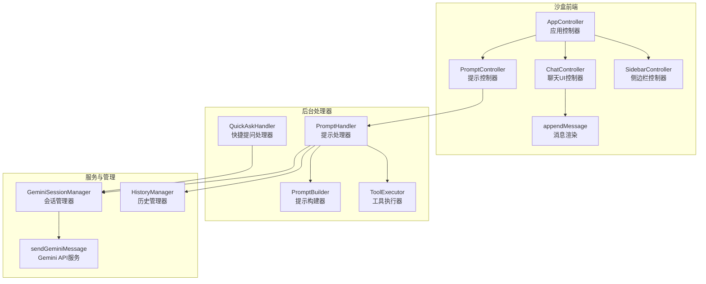
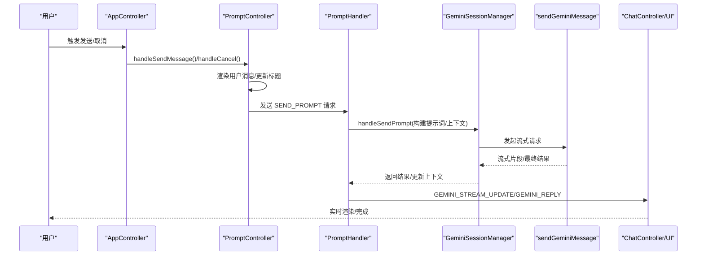
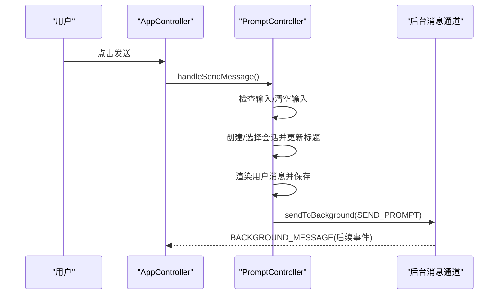
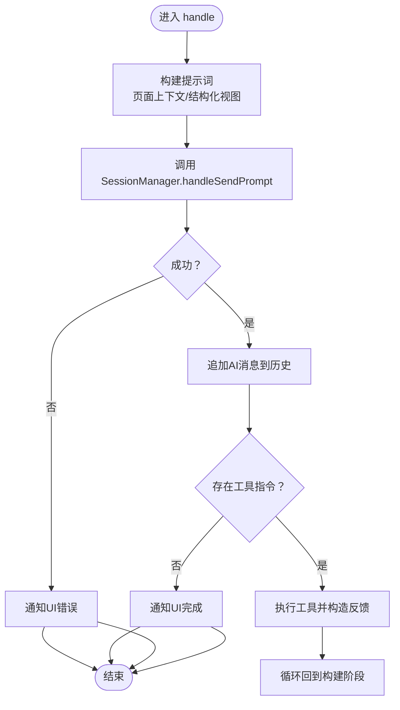
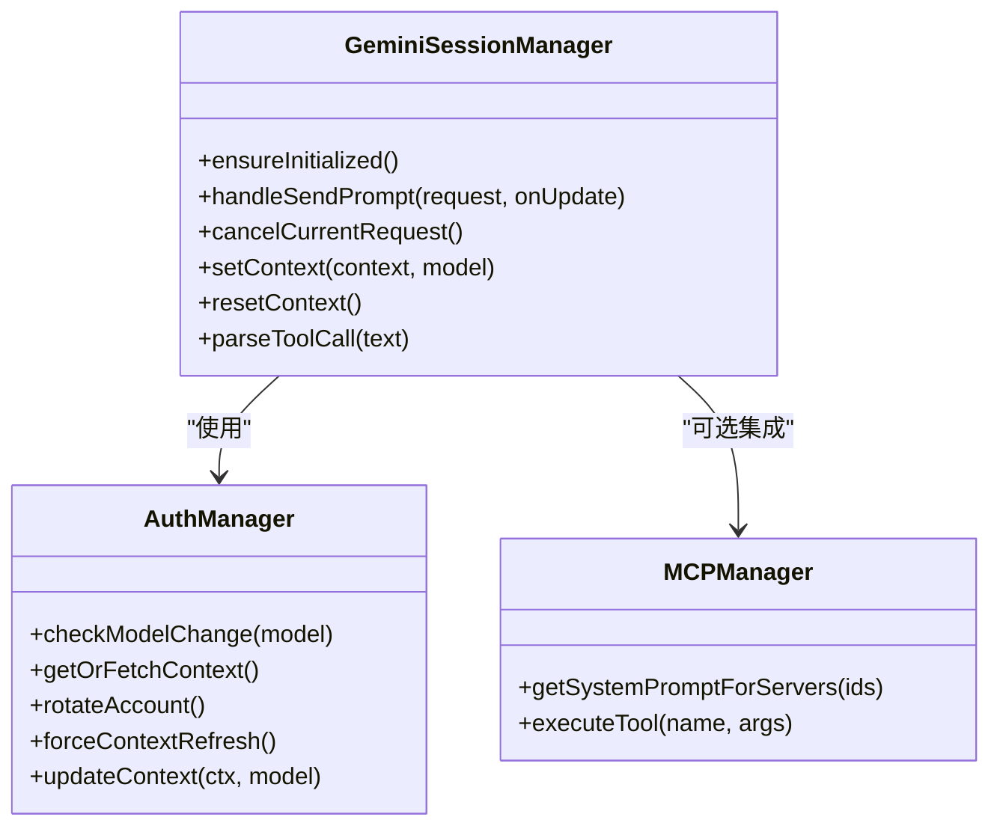
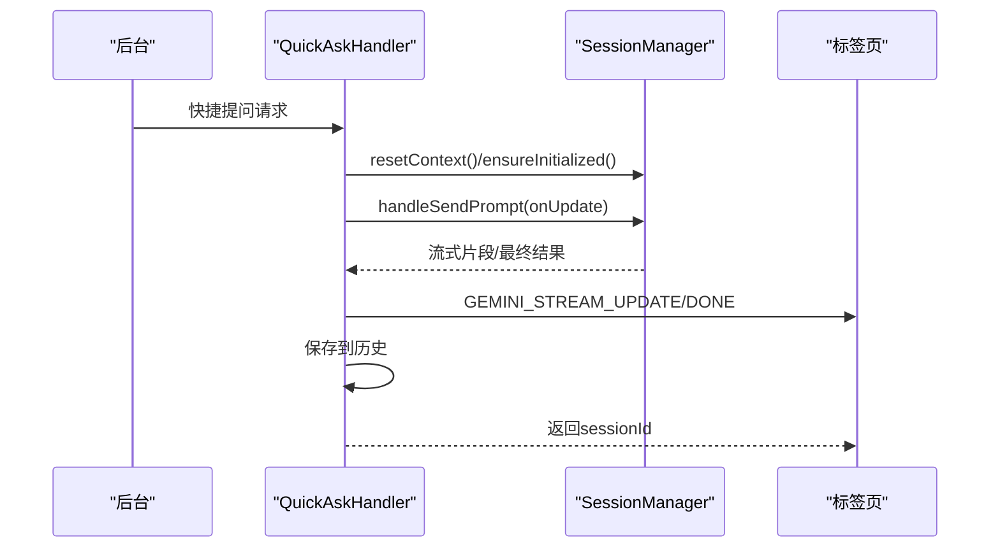
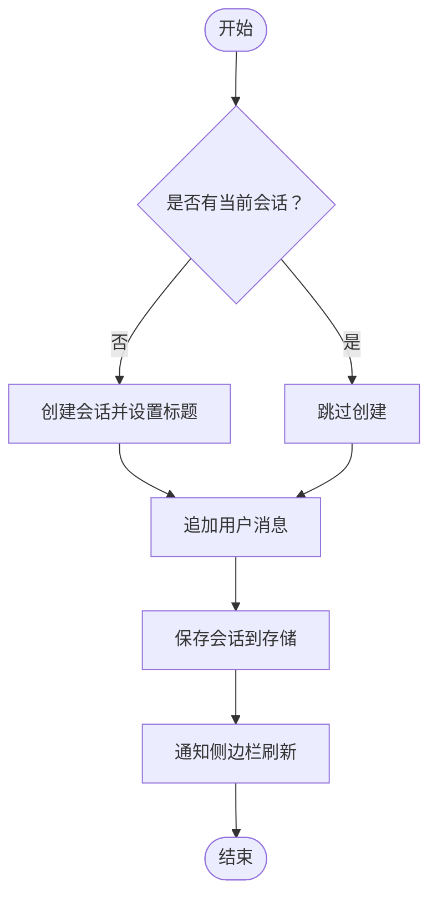
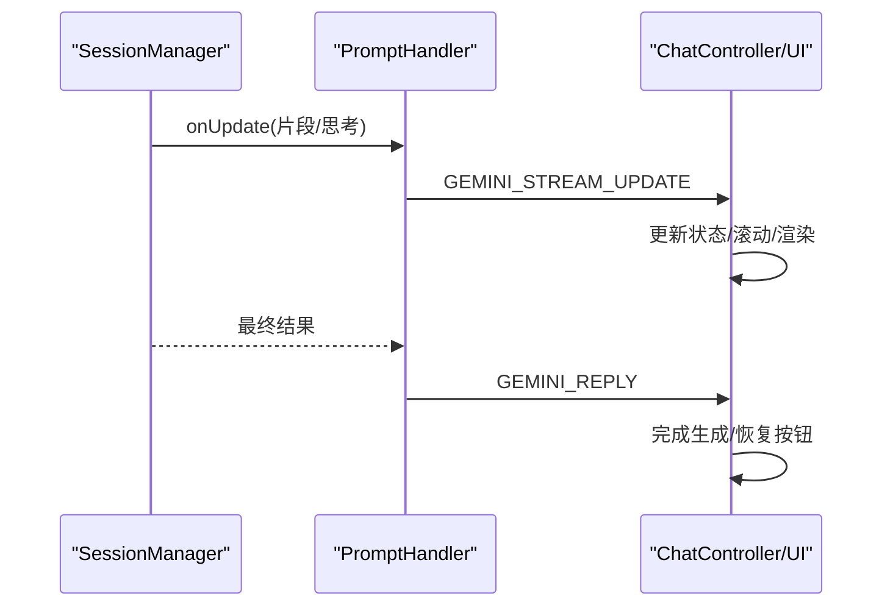
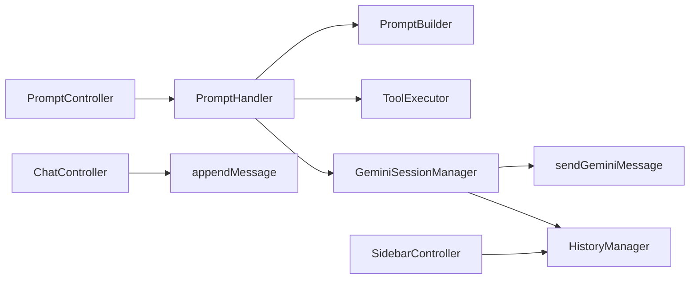

# AI对话

<cite>
**本文引用的文件**
- [sandbox/controllers/app_controller.js](file://sandbox/controllers/app_controller.js)
- [sandbox/controllers/prompt.js](file://sandbox/controllers/prompt.js)
- [background/handlers/session/prompt_handler.js](file://background/handlers/session/prompt_handler.js)
- [background/handlers/session/quick_ask_handler.js](file://background/handlers/session/quick_ask_handler.js)
- [background/handlers/session/prompt/builder.js](file://background/handlers/session/prompt/builder.js)
- [background/handlers/session/prompt/tool_executor.js](file://background/handlers/session/prompt/tool_executor.js)
- [background/handlers/session/utils.js](file://background/handlers/session/utils.js)
- [background/managers/session_manager.js](file://background/managers/session_manager.js)
- [background/managers/history_manager.js](file://background/managers/history_manager.js)
- [services/gemini_api.js](file://services/gemini_api.js)
- [sandbox/ui/chat.js](file://sandbox/ui/chat.js)
- [sandbox/ui/sidebar.js](file://sandbox/ui/sidebar.js)
- [sandbox/render/message.js](file://sandbox/render/message.js)
- [lib/messaging.js](file://lib/messaging.js)
</cite>

## 目录
1. [简介](#简介)
2. [项目结构](#项目结构)
3. [核心组件](#核心组件)
4. [架构总览](#架构总览)
5. [详细组件分析](#详细组件分析)
6. [依赖关系分析](#依赖关系分析)
7. [性能考量](#性能考量)
8. [故障排查指南](#故障排查指南)
9. [结论](#结论)
10. [附录：使用示例与最佳实践](#附录使用示例与最佳实践)

## 简介
本文件面向“侧边栏聊天”和“快捷提问”的AI对话功能，系统性说明从用户输入到Gemini API的完整链路，涵盖：
- AppController如何通过PromptController处理用户输入
- PromptHandler在后台如何构建请求并调用Gemini API
- 会话管理机制（SessionManager）如何管理会话的创建、消息添加与上下文更新
- 流式响应处理与错误处理（含认证失败时的账户轮换）
- 会话标题的自动更新与消息模型的存储

## 项目结构
该仓库采用“沙盒前端 + 后台处理器 + 服务层”的分层设计：
- 沙盒前端负责UI渲染、用户交互与消息转发
- 后台处理器负责业务编排（构建提示词、工具执行、循环反馈）
- 服务层封装Gemini API调用与流式读取
- 管理器负责会话状态、历史持久化与上下文维护

图表来源
- [sandbox/controllers/app_controller.js](file://sandbox/controllers/app_controller.js#L10-L36)
- [sandbox/controllers/prompt.js](file://sandbox/controllers/prompt.js#L7-L13)
- [background/handlers/session/prompt_handler.js](file://background/handlers/session/prompt_handler.js#L6-L11)
- [background/handlers/session/prompt/builder.js](file://background/handlers/session/prompt/builder.js#L5-L8)
- [background/handlers/session/prompt/tool_executor.js](file://background/handlers/session/prompt/tool_executor.js#L4-L7)
- [background/handlers/session/quick_ask_handler.js](file://background/handlers/session/quick_ask_handler.js#L5-L9)
- [background/managers/session_manager.js](file://background/managers/session_manager.js#L6-L11)
- [background/managers/history_manager.js](file://background/managers/history_manager.js#L12-L63)
- [services/gemini_api.js](file://services/gemini_api.js#L26-L230)
- [sandbox/render/message.js](file://sandbox/render/message.js#L8-L324)

章节来源
- [sandbox/controllers/app_controller.js](file://sandbox/controllers/app_controller.js#L10-L36)
- [sandbox/controllers/prompt.js](file://sandbox/controllers/prompt.js#L7-L13)
- [background/handlers/session/prompt_handler.js](file://background/handlers/session/prompt_handler.js#L6-L11)
- [background/handlers/session/prompt/builder.js](file://background/handlers/session/prompt/builder.js#L5-L8)
- [background/handlers/session/prompt/tool_executor.js](file://background/handlers/session/prompt/tool_executor.js#L4-L7)
- [background/handlers/session/quick_ask_handler.js](file://background/handlers/session/quick_ask_handler.js#L5-L9)
- [background/managers/session_manager.js](file://background/managers/session_manager.js#L6-L11)
- [background/managers/history_manager.js](file://background/managers/history_manager.js#L12-L63)
- [services/gemini_api.js](file://services/gemini_api.js#L26-L230)
- [sandbox/render/message.js](file://sandbox/render/message.js#L8-L324)

## 核心组件
- AppController：应用入口，协调子控制器、消息路由与侧边栏恢复行为
- PromptController：接收用户输入，渲染消息，准备上下文与模型，向后台发送请求
- PromptHandler：后台编排，构建提示词、调用Gemini API、处理工具执行与循环反馈
- GeminiSessionManager：会话管理，上下文维护、账户轮换、错误分类与流式结果返回
- QuickAskHandler：快捷提问入口，支持图片与纯文本两种模式
- HistoryManager：历史持久化，保存/追加消息与上下文
- ChatController/SidebarController：UI控制，滚动、加载态切换、搜索与会话列表
- appendMessage：消息渲染，支持多图、思考过程、复制与MCP徽章

章节来源
- [sandbox/controllers/app_controller.js](file://sandbox/controllers/app_controller.js#L10-L36)
- [sandbox/controllers/prompt.js](file://sandbox/controllers/prompt.js#L7-L13)
- [background/handlers/session/prompt_handler.js](file://background/handlers/session/prompt_handler.js#L6-L11)
- [background/managers/session_manager.js](file://background/managers/session_manager.js#L6-L11)
- [background/handlers/session/quick_ask_handler.js](file://background/handlers/session/quick_ask_handler.js#L5-L9)
- [background/managers/history_manager.js](file://background/managers/history_manager.js#L12-L63)
- [sandbox/ui/chat.js](file://sandbox/ui/chat.js#L6-L15)
- [sandbox/ui/sidebar.js](file://sandbox/ui/sidebar.js#L5-L25)
- [sandbox/render/message.js](file://sandbox/render/message.js#L8-L324)

## 架构总览
端到端流程概览（从用户输入到Gemini响应）：

图表来源
- [sandbox/controllers/app_controller.js](file://sandbox/controllers/app_controller.js#L123-L125)
- [sandbox/controllers/prompt.js](file://sandbox/controllers/prompt.js#L15-L33)
- [background/handlers/session/prompt_handler.js](file://background/handlers/session/prompt_handler.js#L13-L101)
- [background/managers/session_manager.js](file://background/managers/session_manager.js#L21-L202)
- [services/gemini_api.js](file://services/gemini_api.js#L26-L230)
- [sandbox/ui/chat.js](file://sandbox/ui/chat.js#L94-L118)

## 详细组件分析

### AppController 与 PromptController 的交互
- AppController作为顶层协调者，将“新建会话/切换会话/删除会话”等操作委托给SessionFlowController；将“发送消息/取消生成”委托给PromptController
- PromptController在发送前决定是否需要创建新会话、更新会话标题、渲染用户消息、保存会话并转发请求至后台

图表来源
- [sandbox/controllers/app_controller.js](file://sandbox/controllers/app_controller.js#L123-L125)
- [sandbox/controllers/prompt.js](file://sandbox/controllers/prompt.js#L15-L33)
- [lib/messaging.js](file://lib/messaging.js#L4-L9)

章节来源
- [sandbox/controllers/app_controller.js](file://sandbox/controllers/app_controller.js#L123-L125)
- [sandbox/controllers/prompt.js](file://sandbox/controllers/prompt.js#L15-L33)
- [lib/messaging.js](file://lib/messaging.js#L4-L9)

### PromptHandler：构建请求与调用Gemini API
- 构建阶段：根据是否启用页面上下文与浏览器控制，拼接系统前言与结构化视图
- 执行阶段：调用SessionManager发送请求，接收流式片段并回传UI
- 工具执行：若响应包含工具指令，则执行工具并把输出作为下一步提示词反馈给模型
- 结果落盘：成功后将AI回复追加到历史，通知UI完成

图表来源
- [background/handlers/session/prompt_handler.js](file://background/handlers/session/prompt_handler.js#L13-L101)
- [background/handlers/session/prompt/builder.js](file://background/handlers/session/prompt/builder.js#L10-L43)
- [background/handlers/session/prompt/tool_executor.js](file://background/handlers/session/prompt/tool_executor.js#L9-L47)
- [background/managers/history_manager.js](file://background/managers/history_manager.js#L71-L106)

章节来源
- [background/handlers/session/prompt_handler.js](file://background/handlers/session/prompt_handler.js#L13-L101)
- [background/handlers/session/prompt/builder.js](file://background/handlers/session/prompt/builder.js#L10-L43)
- [background/handlers/session/prompt/tool_executor.js](file://background/handlers/session/prompt/tool_executor.js#L9-L47)
- [background/managers/history_manager.js](file://background/managers/history_manager.js#L71-L106)

### GeminiSessionManager：会话与上下文管理
- 上下文维护：每次成功响应后更新contextIds，确保后续请求延续对话
- 账户轮换：当检测到登录错误且配置了多个账户时，自动轮换并重试
- 错误分类：针对未登录、限流、空响应、无效响应等进行本地化提示
- 流式处理：通过onUpdate回调将片段实时推送到UI

图表来源
- [background/managers/session_manager.js](file://background/managers/session_manager.js#L6-L11)
- [background/managers/session_manager.js](file://background/managers/session_manager.js#L21-L202)

章节来源
- [background/managers/session_manager.js](file://background/managers/session_manager.js#L21-L202)

### QuickAskHandler：快捷提问
- 支持纯文本与带图片两种模式
- 重置上下文以保证独立问答
- 将结果保存为历史并通知对应标签页

图表来源
- [background/handlers/session/quick_ask_handler.js](file://background/handlers/session/quick_ask_handler.js#L11-L44)
- [background/handlers/session/quick_ask_handler.js](file://background/handlers/session/quick_ask_handler.js#L46-L97)

章节来源
- [background/handlers/session/quick_ask_handler.js](file://background/handlers/session/quick_ask_handler.js#L11-L44)
- [background/handlers/session/quick_ask_handler.js](file://background/handlers/session/quick_ask_handler.js#L46-L97)

### 会话管理与历史存储
- 会话创建：首次发送时自动创建
- 标题更新：第一条消息到达时根据输入截断生成标题
- 历史追加：AI消息与用户消息分别追加，保持时间戳与上下文同步
- 存储通知：每次变更通过runtime消息通知侧边栏刷新

图表来源
- [sandbox/controllers/prompt.js](file://sandbox/controllers/prompt.js#L44-L73)
- [background/managers/history_manager.js](file://background/managers/history_manager.js#L12-L63)
- [background/managers/history_manager.js](file://background/managers/history_manager.js#L115-L148)

章节来源
- [sandbox/controllers/prompt.js](file://sandbox/controllers/prompt.js#L44-L73)
- [background/managers/history_manager.js](file://background/managers/history_manager.js#L12-L63)
- [background/managers/history_manager.js](file://background/managers/history_manager.js#L115-L148)

### 流式响应与UI渲染
- 流式更新：SessionManager在读取到片段时通过onUpdate回调推送
- PromptHandler将片段转发给UI，ChatController切换加载态与按钮
- appendMessage支持增量更新文本、思考过程、复制与MCP徽章

图表来源
- [background/handlers/session/prompt_handler.js](file://background/handlers/session/prompt_handler.js#L13-L22)
- [background/managers/session_manager.js](file://background/managers/session_manager.js#L66-L127)
- [sandbox/ui/chat.js](file://sandbox/ui/chat.js#L94-L118)
- [sandbox/render/message.js](file://sandbox/render/message.js#L266-L324)

章节来源
- [background/handlers/session/prompt_handler.js](file://background/handlers/session/prompt_handler.js#L13-L22)
- [background/managers/session_manager.js](file://background/managers/session_manager.js#L66-L127)
- [sandbox/ui/chat.js](file://sandbox/ui/chat.js#L94-L118)
- [sandbox/render/message.js](file://sandbox/render/message.js#L266-L324)

## 依赖关系分析
- 控制层依赖UI层与管理器，UI层负责渲染与交互，管理器负责状态与持久化
- 后台处理器依赖构建器、工具执行器与会话管理器
- 服务层仅暴露sendGeminiMessage，屏蔽具体协议细节
- 消息通道统一通过postMessage与runtime转发

图表来源
- [sandbox/controllers/prompt.js](file://sandbox/controllers/prompt.js#L7-L13)
- [background/handlers/session/prompt_handler.js](file://background/handlers/session/prompt_handler.js#L6-L11)
- [background/handlers/session/prompt/builder.js](file://background/handlers/session/prompt/builder.js#L5-L8)
- [background/handlers/session/prompt/tool_executor.js](file://background/handlers/session/prompt/tool_executor.js#L4-L7)
- [background/managers/session_manager.js](file://background/managers/session_manager.js#L6-L11)
- [services/gemini_api.js](file://services/gemini_api.js#L26-L230)
- [background/managers/history_manager.js](file://background/managers/history_manager.js#L12-L63)
- [sandbox/ui/chat.js](file://sandbox/ui/chat.js#L6-L15)
- [sandbox/render/message.js](file://sandbox/render/message.js#L8-L324)
- [sandbox/ui/sidebar.js](file://sandbox/ui/sidebar.js#L5-L25)

章节来源
- [sandbox/controllers/prompt.js](file://sandbox/controllers/prompt.js#L7-L13)
- [background/handlers/session/prompt_handler.js](file://background/handlers/session/prompt_handler.js#L6-L11)
- [background/handlers/session/prompt/builder.js](file://background/handlers/session/prompt/builder.js#L5-L8)
- [background/handlers/session/prompt/tool_executor.js](file://background/handlers/session/prompt/tool_executor.js#L4-L7)
- [background/managers/session_manager.js](file://background/managers/session_manager.js#L6-L11)
- [services/gemini_api.js](file://services/gemini_api.js#L26-L230)
- [background/managers/history_manager.js](file://background/managers/history_manager.js#L12-L63)
- [sandbox/ui/chat.js](file://sandbox/ui/chat.js#L6-L15)
- [sandbox/render/message.js](file://sandbox/render/message.js#L8-L324)
- [sandbox/ui/sidebar.js](file://sandbox/ui/sidebar.js#L5-L25)

## 性能考量
- 并行上传：多模态文件上传采用Promise.all并发，缩短等待时间
- 取消与重入：AbortController确保重复请求被及时中止，避免资源浪费
- 流式渲染：UI按片段增量更新，降低首屏延迟
- 侧边栏搜索：使用Fuse进行会话标题与消息内容的模糊匹配，提升查找效率

章节来源
- [services/gemini_api.js](file://services/gemini_api.js#L46-L55)
- [background/managers/session_manager.js](file://background/managers/session_manager.js#L21-L27)
- [sandbox/ui/sidebar.js](file://sandbox/ui/sidebar.js#L62-L75)

## 故障排查指南
- 认证失败与账户轮换
  - 现象：出现“未登录/会话过期”类错误
  - 处理：SessionManager检测到登录错误时自动轮换账户并强制刷新上下文，最多重试一次
  - 建议：确认已配置多个账户索引，或手动打开登录页刷新会话
- 限流与空响应
  - 现象：频繁请求导致限流或服务器无响应
  - 处理：本地化提示“请求过于频繁/服务器无响应”，建议稍后再试
- 无效响应
  - 现象：响应解析失败
  - 处理：提示刷新Gemini页面后重试
- 工具执行失败
  - 现象：工具返回错误信息
  - 处理：将错误信息附加到最终响应文本中，便于用户查看

章节来源
- [background/managers/session_manager.js](file://background/managers/session_manager.js#L129-L198)
- [background/handlers/session/prompt_handler.js](file://background/handlers/session/prompt_handler.js#L89-L98)

## 结论
该系统通过清晰的分层与职责划分，实现了从用户输入到Gemini API的稳定链路。PromptHandler负责复杂的自动化循环与工具执行，SessionManager承担上下文与账户管理，HistoryManager保障数据持久化。UI层以流式渲染提升交互体验，同时提供便捷的侧边栏会话管理与快捷提问能力。

## 附录：使用示例与最佳实践

### 用户开始对话
- 在侧边栏点击“新建会话”
- 输入框自动聚焦，输入问题后点击发送
- 首条消息到达时自动生成会话标题

章节来源
- [sandbox/controllers/app_controller.js](file://sandbox/controllers/app_controller.js#L77-L79)
- [sandbox/controllers/prompt.js](file://sandbox/controllers/prompt.js#L44-L56)

### 发送消息与流式响应
- 输入文本或上传图片，点击发送
- ChatController切换为“停止生成”按钮，实时显示流式片段
- 完成后恢复按钮状态，支持复制与查看生成图像

章节来源
- [sandbox/controllers/prompt.js](file://sandbox/controllers/prompt.js#L15-L33)
- [sandbox/ui/chat.js](file://sandbox/ui/chat.js#L94-L118)
- [sandbox/render/message.js](file://sandbox/render/message.js#L266-L324)

### 管理会话
- 侧边栏展示历史会话，支持搜索、重命名、删除
- 切换会话时自动恢复上下文与滚动位置
- 会话标题随第一条消息自动更新

章节来源
- [sandbox/ui/sidebar.js](file://sandbox/ui/sidebar.js#L93-L111)
- [background/managers/history_manager.js](file://background/managers/history_manager.js#L12-L63)

### 快捷提问
- 通过快捷提问入口快速发起问答
- 支持带图片的快捷提问，自动重置上下文
- 结果保存为历史并通知标签页

章节来源
- [background/handlers/session/quick_ask_handler.js](file://background/handlers/session/quick_ask_handler.js#L11-L44)
- [background/handlers/session/quick_ask_handler.js](file://background/handlers/session/quick_ask_handler.js#L46-L97)

### 错误处理与账户轮换
- 当检测到登录错误且配置多个账户时，自动轮换并重试
- 对限流、空响应、无效响应进行本地化提示
- 提供登录页与刷新页链接，引导用户修复

章节来源
- [background/managers/session_manager.js](file://background/managers/session_manager.js#L129-L198)