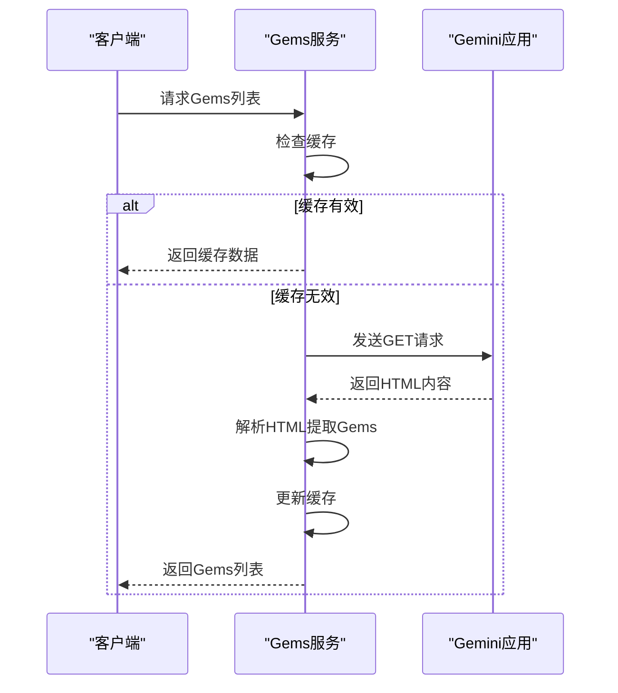
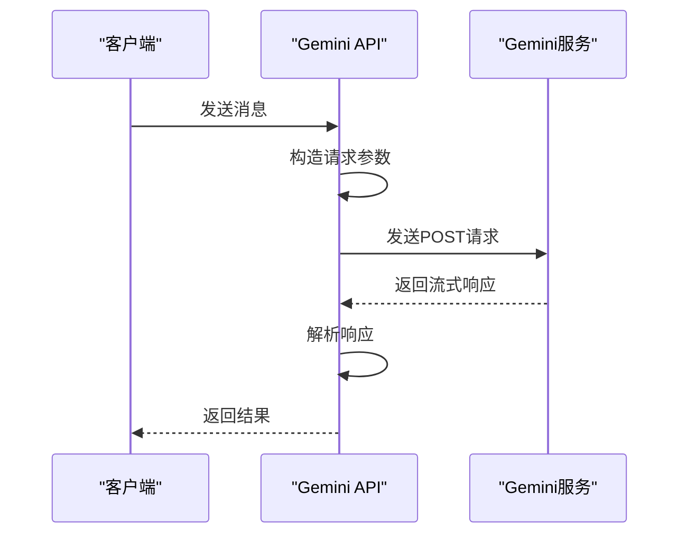
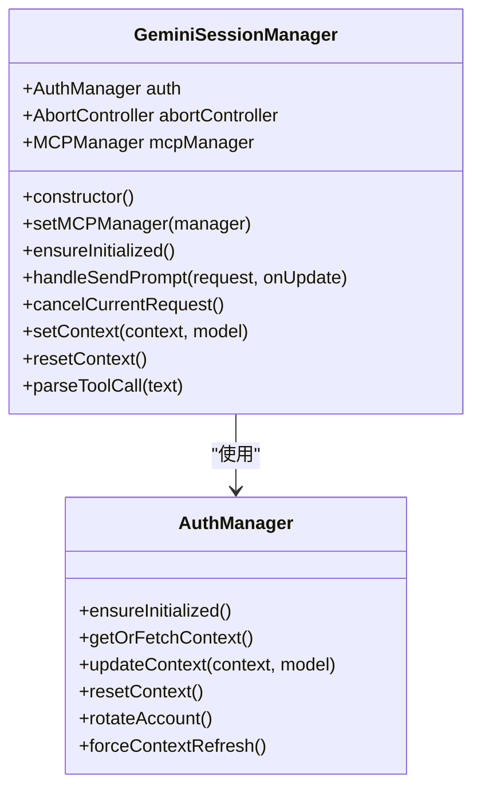
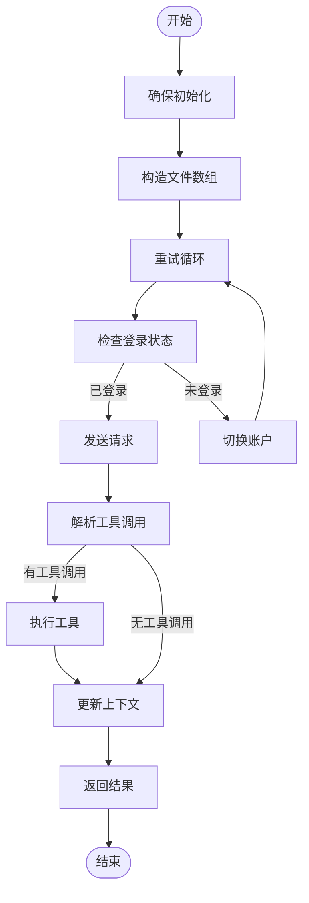
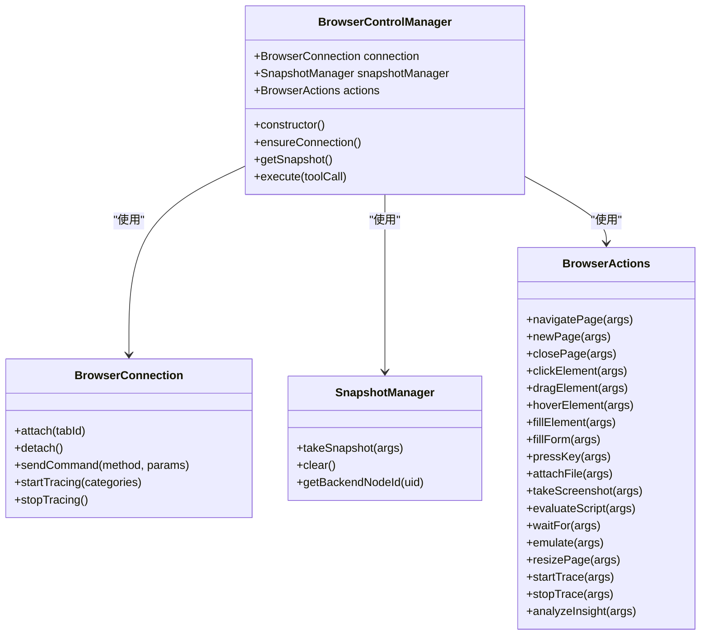

# Gem 模型支持

<cite>
**本文档引用的文件**   
- [README.md](file://README.md)
- [manifest.json](file://manifest.json)
- [package.json](file://package.json)
- [background/index.js](file://background/index.js)
- [content/index.js](file://content/index.js)
- [sandbox/index.js](file://sandbox/index.js)
- [services/gems.js](file://services/gems.js)
- [services/gemini_api.js](file://services/gemini_api.js)
- [services/gems_api.js](file://services/gems_api.js)
- [background/managers/session_manager.js](file://background/managers/session_manager.js)
- [background/managers/control_manager.js](file://background/managers/control_manager.js)
- [background/managers/mcp_manager.js](file://background/managers/mcp_manager.js)
- [background/handlers/session/prompt_handler.js](file://background/handlers/session/prompt_handler.js)
- [background/handlers/session/context_handler.js](file://background/handlers/session/context_handler.js)
- [services/parser.js](file://services/parser.js)
- [background/control/actions.js](file://background/control/actions.js)
- [background/control/connection.js](file://background/control/connection.js)
- [background/control/snapshot.js](file://background/control/snapshot.js)
</cite>

## 目录
1. [简介](#简介)
2. [项目结构](#项目结构)
3. [核心组件](#核心组件)
4. [架构概述](#架构概述)
5. [详细组件分析](#详细组件分析)
6. [依赖分析](#依赖分析)
7. [性能考虑](#性能考虑)
8. [故障排除指南](#故障排除指南)
9. [结论](#结论)

## 简介
Gemini Nexus 是一款由 Google Gemini 驱动的强大 AI 助手 Chrome 扩展。该扩展提供侧边栏对话、智能总结、图像分析、文本选中工具、浏览器控制、会话管理、深色/浅色主题和中英双语支持等多种功能。本项目通过集成 Google Gemini 的 Gem 模型，为用户提供了一个高效、智能的浏览器交互体验。

## 项目结构
项目结构清晰，分为多个主要目录，每个目录负责不同的功能模块。

```mermaid
graph TB
subgraph "根目录"
background[background/] --> "后台服务 (API调用、会话管理)"
content[content/] --> "内容脚本 (浮动工具栏)"
sandbox[sandbox/] --> "沙盒环境 (Markdown渲染)"
sidepanel[sidepanel/] --> "侧边栏主界面"
services[services/] --> "Gemini API服务"
css[css/] --> "样式文件"
end
```

**图源**
- [README.md](file://README.md#L50-L65)

**本节来源**
- [README.md](file://README.md#L50-L65)
- [manifest.json](file://manifest.json#L1-L93)

## 核心组件
核心组件包括后台服务、内容脚本、沙盒环境、侧边栏主界面和 API 服务。这些组件协同工作，实现了扩展的主要功能。

**本节来源**
- [background/index.js](file://background/index.js#L1-L30)
- [content/index.js](file://content/index.js#L1-L190)
- [sandbox/index.js](file://sandbox/index.js#L1-L12)

## 架构概述
系统架构分为前端和后端两大部分。前端包括侧边栏主界面和内容脚本，后端包括后台服务和 API 服务。前后端通过消息传递机制进行通信。

```mermaid
graph TB
subgraph "前端"
sidepanel[sidepanel/index.html] --> "侧边栏主界面"
content[content/index.js] --> "内容脚本"
end
subgraph "后端"
background[background/index.js] --> "后台服务"
services[services/gemini_api.js] --> "Gemini API服务"
end
sidepanel --> background
content --> background
background --> services
```

**图源**
- [background/index.js](file://background/index.js#L1-L30)
- [content/index.js](file://content/index.js#L1-L190)
- [services/gemini_api.js](file://services/gemini_api.js#L1-L245)

**本节来源**
- [background/index.js](file://background/index.js#L1-L30)
- [content/index.js](file://content/index.js#L1-L190)
- [services/gemini_api.js](file://services/gemini_api.js#L1-L245)

## 详细组件分析
### Gem 模型支持分析
Gem 模型支持是本项目的核心功能之一。通过 `services/gems.js` 和 `services/gemini_api.js` 文件，实现了对 Google Gems 的获取和管理。

#### Gem 模型获取
`services/gems.js` 文件中的 `fetchGemsList` 函数通过解析 Gemini 应用页面的 HTML 内容，提取出用户创建的 Gems 列表。该函数支持缓存机制，避免重复请求。



**图源**
- [services/gems.js](file://services/gems.js#L13-L46)

#### Gem 模型调用
`services/gemini_api.js` 文件中的 `sendGeminiMessage` 函数负责向 Gemini 发送消息并接收响应。该函数支持多种模型（如 Flash、Pro），并能处理文件上传和流式响应。



**图源**
- [services/gemini_api.js](file://services/gemini_api.js#L30-L245)

**本节来源**
- [services/gems.js](file://services/gems.js#L13-L46)
- [services/gemini_api.js](file://services/gemini_api.js#L30-L245)

### 会话管理分析
会话管理是确保用户与 AI 交互连续性的关键。`background/managers/session_manager.js` 文件中的 `GeminiSessionManager` 类负责管理会话状态。

#### 会话初始化
`GeminiSessionManager` 类在构造时初始化认证管理器和中断控制器，确保会话的稳定性和安全性。



**图源**
- [background/managers/session_manager.js](file://background/managers/session_manager.js#L6-L285)

#### 消息处理
`handleSendPrompt` 方法处理用户发送的消息，包括构造文件数组、重试机制和工具调用解析。该方法支持多账户切换和错误处理。



**图源**
- [background/managers/session_manager.js](file://background/managers/session_manager.js#L21-L202)

**本节来源**
- [background/managers/session_manager.js](file://background/managers/session_manager.js#L6-L285)

### 浏览器控制分析
浏览器控制功能允许 AI 直接操作浏览器执行任务。`background/managers/control_manager.js` 文件中的 `BrowserControlManager` 类负责管理这些操作。

#### 控制管理器
`BrowserControlManager` 类通过 `BrowserConnection`、`SnapshotManager` 和 `BrowserActions` 三个子模块实现对浏览器的全面控制。



**图源**
- [background/managers/control_manager.js](file://background/managers/control_manager.js#L11-L159)

#### 操作执行
`execute` 方法根据传入的工具调用参数，调用相应的操作方法。支持的操作包括导航、点击、填写表单、截图等。

```mermaid
flowchart TD
Start([开始]) --> EnsureConnection["确保连接"]
EnsureConnection --> GetSnapshot["获取快照"]
GetSnapshot --> ExecuteTool["执行工具"]
ExecuteTool --> |导航| NavigatePage["navigate_page"]
ExecuteTool --> |新页面| NewPage["new_page"]
ExecuteTool --> |关闭页面| ClosePage["close_page"]
ExecuteTool --> |截图| TakeScreenshot["take_screenshot"]
ExecuteTool --> |点击| ClickElement["click"]
ExecuteTool --> |拖拽| DragElement["drag_element"]
ExecuteTool --> |悬停| HoverElement["hover"]
ExecuteTool --> |填写| FillElement["fill"]
ExecuteTool --> |填写表单| FillForm["fill_form"]
ExecuteTool --> |按键| PressKey["press_key"]
ExecuteTool --> |处理对话框| HandleDialog["handle_dialog"]
ExecuteTool --> |等待| WaitFor["wait_for"]
ExecuteTool --> |评估脚本| EvaluateScript["evaluate_script"]
ExecuteTool --> |列出页面| ListPages["list_pages"]
ExecuteTool --> |选择页面| SelectPage["select_page"]
ExecuteTool --> |附加文件| AttachFile["attach_file"]
ExecuteTool --> |模拟| Emulate["emulate"]
ExecuteTool --> |调整大小| ResizePage["resize_page"]
ExecuteTool --> |开始跟踪| StartTrace["performance_start_trace"]
ExecuteTool --> |停止跟踪| StopTrace["performance_stop_trace"]
ExecuteTool --> |分析洞察| AnalyzeInsight["performance_analyze_insight"]
ExecuteTool --> |获取日志| GetLogs["get_logs"]
ExecuteTool --> |获取网络活动| GetNetworkActivity["get_network_activity"]
ExecuteTool --> |列出网络请求| ListNetworkRequests["list_network_requests"]
ExecuteTool --> |获取网络请求| GetNetworkRequest["get_network_request"]
ExecuteTool --> |获取快照| TakeSnapshot["take_snapshot"]
ExecuteTool --> |未知工具| UnknownTool["返回错误"]
UnknownTool --> ReturnError["返回错误信息"]
NavigatePage --> ReturnResult["返回结果"]
NewPage --> ReturnResult
ClosePage --> ReturnResult
TakeScreenshot --> ReturnResult
ClickElement --> ReturnResult
DragElement --> ReturnResult
HoverElement --> ReturnResult
FillElement --> ReturnResult
FillForm --> ReturnResult
PressKey --> ReturnResult
HandleDialog --> ReturnResult
WaitFor --> ReturnResult
EvaluateScript --> ReturnResult
ListPages --> ReturnResult
SelectPage --> ReturnResult
AttachFile --> ReturnResult
Emulate --> ReturnResult
ResizePage --> ReturnResult
StartTrace --> ReturnResult
StopTrace --> ReturnResult
AnalyzeInsight --> ReturnResult
GetLogs --> ReturnResult
GetNetworkActivity --> ReturnResult
ListNetworkRequests --> ReturnResult
GetNetworkRequest --> ReturnResult
TakeSnapshot --> ReturnResult
ReturnResult --> End([结束])
ReturnError --> End
```



**图源**
- [background/managers/control_manager.js](file://background/managers/control_manager.js#L43-L158)

**本节来源**
- [background/managers/control_manager.js](file://background/managers/control_manager.js#L11-L159)

## 依赖分析
项目依赖主要包括 Chrome 扩展 API、第三方库和内部模块。通过 `manifest.json` 文件定义了扩展所需的权限和资源。

```mermaid
graph TD
subgraph "外部依赖"
ChromeAPI[Chrome API] --> "扩展功能"
D3[d3] --> "数据可视化"
HTML2Canvas[html2canvas] --> "截图功能"
Markmap[markmap-lib] --> "思维导图"
Mermaid[mermaid] --> "图表生成"
end
subgraph "内部依赖"
Background[background/] --> "后台服务"
Content[content/] --> "内容脚本"
Sandbox[sandbox/] --> "沙盒环境"
Sidepanel[sidepanel/] --> "侧边栏主界面"
Services[services/] --> "API服务"
end
Background --> ChromeAPI
Content --> ChromeAPI
Sandbox --> D3
Sandbox --> HTML2Canvas
Sandbox --> Markmap
Sandbox --> Mermaid
Sidepanel --> ChromeAPI
Services --> ChromeAPI
```

**图源**
- [manifest.json](file://manifest.json#L6-L93)
- [package.json](file://package.json#L11-L16)

**本节来源**
- [manifest.json](file://manifest.json#L6-L93)
- [package.json](file://package.json#L11-L16)

## 性能考虑
为了提高性能，项目采用了多种优化策略，包括缓存机制、异步处理和资源管理。

- **缓存机制**：`services/gems.js` 和 `services/gemini_api.js` 文件中实现了缓存机制，避免重复请求。
- **异步处理**：所有网络请求和文件操作均采用异步方式，确保主线程不被阻塞。
- **资源管理**：通过 `BrowserConnection` 类管理调试器连接，确保资源的有效利用。

**本节来源**
- [services/gems.js](file://services/gems.js#L278-L311)
- [services/gemini_api.js](file://services/gemini_api.js#L174-L217)

## 故障排除指南
### 常见问题
- **未登录**：确保已在 [gemini.google.com](https://gemini.google.com) 登录 Google 账号。
- **请求过于频繁**：Gemini 暂时限制了访问，请等待几分钟后再试。
- **服务器无响应**：检查网络连接，刷新 Gemini 页面后重试。

### 错误处理
- **登录错误**：自动切换账户并重试。
- **网络错误**：捕获并处理网络异常，提供友好的错误提示。
- **解析错误**：验证响应格式，确保数据正确解析。

**本节来源**
- [background/managers/session_manager.js](file://background/managers/session_manager.js#L129-L198)

## 结论
Gemini Nexus 通过集成 Google Gemini 的 Gem 模型，为用户提供了一个强大、智能的浏览器扩展。项目结构清晰，功能丰富，性能优化良好。通过详细的文档和示例，开发者可以轻松理解和使用该项目。