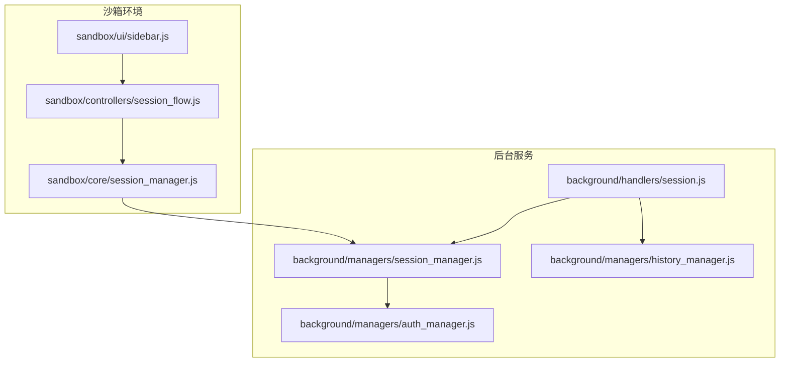
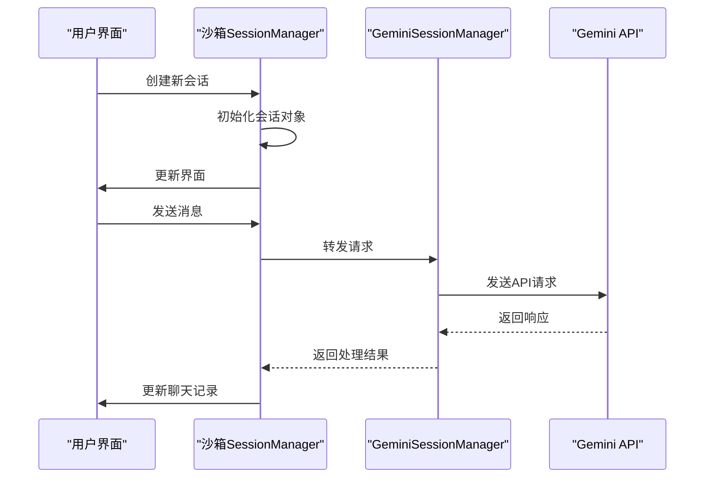
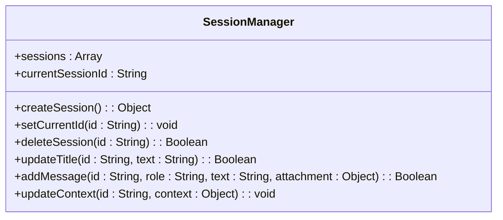
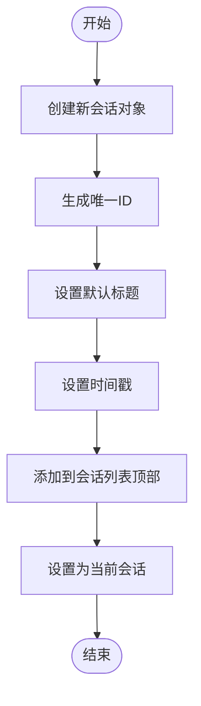
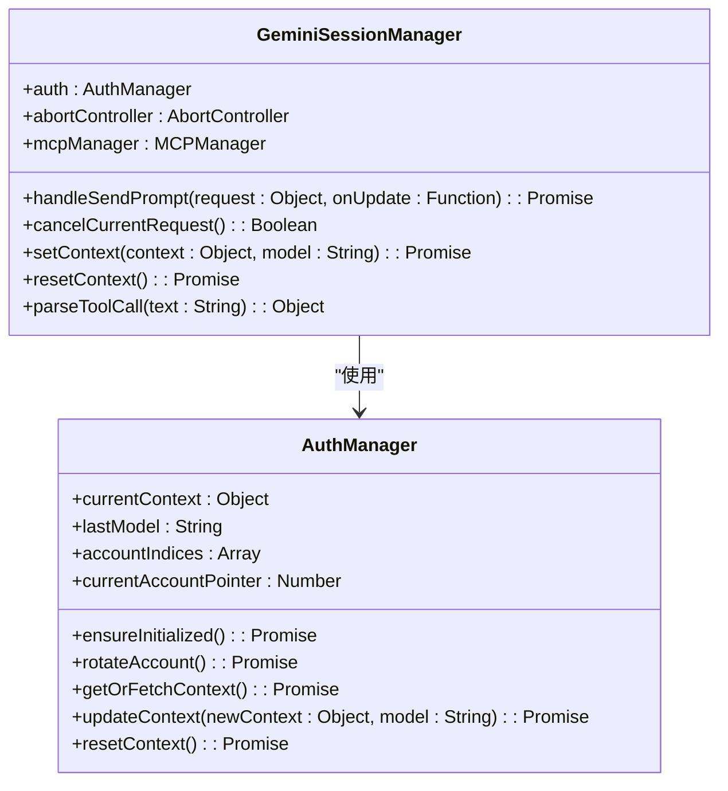
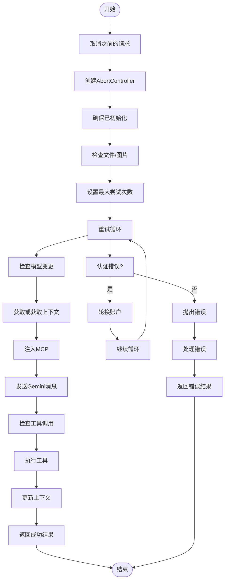
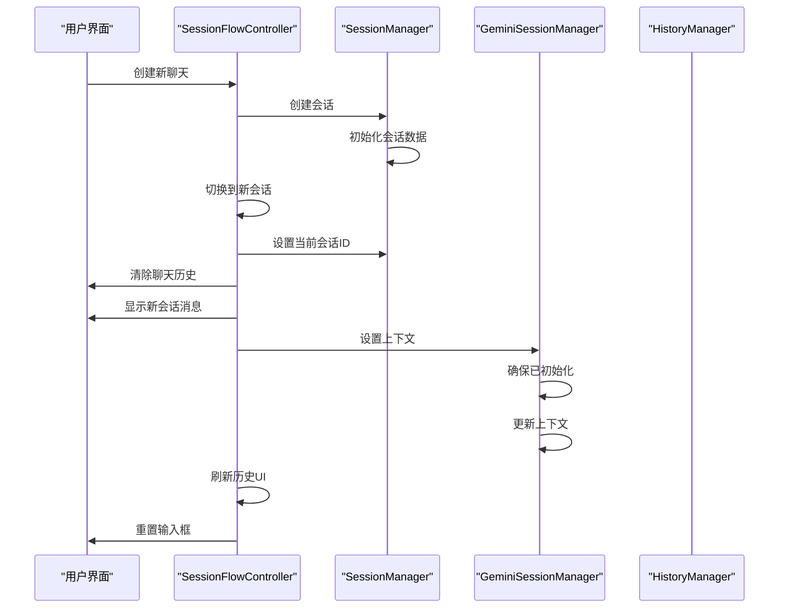
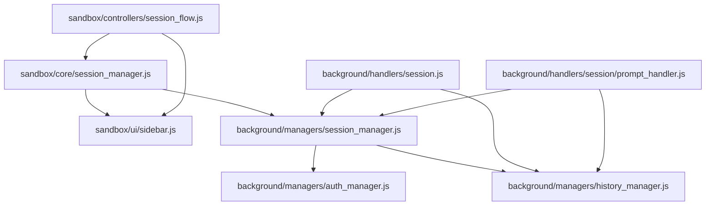

# 会话管理

<cite>
**本文档引用的文件**
- [session_manager.js](file://sandbox/core/session_manager.js)
- [session_manager.js](file://background/managers/session_manager.js)
- [session_flow.js](file://sandbox/controllers/session_flow.js)
- [session.js](file://background/handlers/session.js)
- [context_handler.js](file://background/handlers/session/context_handler.js)
- [prompt_handler.js](file://background/handlers/session/prompt_handler.js)
- [auth_manager.js](file://background/managers/auth_manager.js)
- [history_manager.js](file://background/managers/history_manager.js)
- [messaging.js](file://lib/messaging.js)
- [sidebar.js](file://sandbox/ui/sidebar.js)
- [app.js](file://sandbox/boot/app.js)
</cite>

## 目录
1. [简介](#简介)
2. [项目结构](#项目结构)
3. [核心组件](#核心组件)
4. [架构概述](#架构概述)
5. [详细组件分析](#详细组件分析)
6. [依赖分析](#依赖分析)
7. [性能考虑](#性能考虑)
8. [故障排除指南](#故障排除指南)
9. [结论](#结论)

## 简介
本文件详细说明了Gemini Nexus扩展中的会话管理功能，涵盖沙箱环境和后台服务中的双重实现机制。文档解释了沙箱端SessionManager如何管理会话的创建、切换、删除和消息存储，以及后台GeminiSessionManager如何处理认证上下文、模型切换和请求重试。阐述了会话数据在UI、沙箱控制器和后台服务之间的同步流程，包括会话标题的自动更新和时间戳维护。提供了创建新会话、切换会话和持久化会话列表的实际示例。说明了会话恢复行为（自动/恢复/新建）的配置逻辑，以及在页面上下文激活时的会话处理策略。讨论了多账户环境下的会话上下文轮换机制和错误恢复策略。

## 项目结构
Gemini Nexus项目的会话管理功能分布在多个目录中，主要分为沙箱环境和后台服务两大部分。沙箱环境负责用户界面交互和本地会话管理，而后台服务处理与Gemini API的通信和认证管理。

**图示来源**
- [session_manager.js](file://sandbox/core/session_manager.js)
- [session_manager.js](file://background/managers/session_manager.js)
- [session_flow.js](file://sandbox/controllers/session_flow.js)
- [session.js](file://background/handlers/session.js)
- [auth_manager.js](file://background/managers/auth_manager.js)
- [history_manager.js](file://background/managers/history_manager.js)
- [sidebar.js](file://sandbox/ui/sidebar.js)

**本节来源**
- [session_manager.js](file://sandbox/core/session_manager.js)
- [session_manager.js](file://background/managers/session_manager.js)

## 核心组件
会话管理功能的核心组件包括沙箱端的SessionManager和后台的GeminiSessionManager。沙箱端SessionManager负责管理本地会话的创建、切换、删除和消息存储，而GeminiSessionManager处理与Gemini API的通信、认证上下文管理和请求重试。

**本节来源**
- [session_manager.js](file://sandbox/core/session_manager.js)
- [session_manager.js](file://background/managers/session_manager.js)

## 架构概述
会话管理系统的架构分为前端沙箱环境和后台服务两个主要部分。沙箱环境中的SessionManager负责管理用户界面中的会话状态，包括会话的创建、切换和删除。后台服务中的GeminiSessionManager负责处理与Gemini API的通信，包括发送请求、处理响应和管理认证上下文。

**图示来源**
- [session_manager.js](file://sandbox/core/session_manager.js)
- [session_manager.js](file://background/managers/session_manager.js)
- [session_flow.js](file://sandbox/controllers/session_flow.js)

## 详细组件分析
### 沙箱端SessionManager分析
沙箱端的SessionManager负责管理本地会话的生命周期。它提供了创建、切换、删除会话以及更新会话标题和消息存储的功能。

#### 类图

**图示来源**
- [session_manager.js](file://sandbox/core/session_manager.js)

#### 会话创建流程

**图示来源**
- [session_manager.js](file://sandbox/core/session_manager.js)

**本节来源**
- [session_manager.js](file://sandbox/core/session_manager.js)
- [session_flow.js](file://sandbox/controllers/session_flow.js)

### 后台GeminiSessionManager分析
后台的GeminiSessionManager负责处理与Gemini API的通信，包括认证上下文管理、模型切换和请求重试。

#### 类图

**图示来源**
- [session_manager.js](file://background/managers/session_manager.js)
- [auth_manager.js](file://background/managers/auth_manager.js)

#### 请求处理流程

**图示来源**
- [session_manager.js](file://background/managers/session_manager.js)
- [auth_manager.js](file://background/managers/auth_manager.js)

**本节来源**
- [session_manager.js](file://background/managers/session_manager.js)
- [auth_manager.js](file://background/managers/auth_manager.js)
- [prompt_handler.js](file://background/handlers/session/prompt_handler.js)

### 会话同步流程分析
会话数据在UI、沙箱控制器和后台服务之间的同步流程确保了用户界面与后端状态的一致性。

#### 数据同步流程

**图示来源**
- [session_flow.js](file://sandbox/controllers/session_flow.js)
- [session_manager.js](file://sandbox/core/session_manager.js)
- [session_manager.js](file://background/managers/session_manager.js)
- [context_handler.js](file://background/handlers/session/context_handler.js)

**本节来源**
- [session_flow.js](file://sandbox/controllers/session_flow.js)
- [session_manager.js](file://sandbox/core/session_manager.js)
- [session_manager.js](file://background/managers/session_manager.js)
- [context_handler.js](file://background/handlers/session/context_handler.js)

## 依赖分析
会话管理功能的组件之间存在复杂的依赖关系。沙箱端的SessionManager依赖于UI组件来更新界面状态，同时依赖于后台的GeminiSessionManager来处理API请求。后台的GeminiSessionManager依赖于AuthManager来管理认证上下文，并依赖于HistoryManager来持久化会话数据。

**图示来源**
- [session_manager.js](file://sandbox/core/session_manager.js)
- [session_manager.js](file://background/managers/session_manager.js)
- [session_flow.js](file://sandbox/controllers/session_flow.js)
- [session.js](file://background/handlers/session.js)
- [prompt_handler.js](file://background/handlers/session/prompt_handler.js)
- [auth_manager.js](file://background/managers/auth_manager.js)
- [history_manager.js](file://background/managers/history_manager.js)
- [sidebar.js](file://sandbox/ui/sidebar.js)

**本节来源**
- [session_manager.js](file://sandbox/core/session_manager.js)
- [session_manager.js](file://background/managers/session_manager.js)
- [session_flow.js](file://sandbox/controllers/session_flow.js)
- [session.js](file://background/handlers/session.js)
- [prompt_handler.js](file://background/handlers/session/prompt_handler.js)
- [auth_manager.js](file://background/managers/auth_manager.js)
- [history_manager.js](file://background/managers/history_manager.js)
- [sidebar.js](file://sandbox/ui/sidebar.js)

## 性能考虑
会话管理功能在设计时考虑了性能优化。沙箱端的SessionManager使用内存中的数据结构来管理会话，避免了频繁的存储操作。后台的GeminiSessionManager实现了请求重试机制和账户轮换策略，以提高请求的成功率。AuthManager缓存了认证上下文，减少了重复的认证请求。

## 故障排除指南
### 认证错误处理
当遇到认证错误时，系统会自动尝试轮换账户并重试请求。如果所有账户都失败，系统会清除本地上下文并提示用户登录。

**本节来源**
- [session_manager.js](file://background/managers/session_manager.js)
- [auth_manager.js](file://background/managers/auth_manager.js)

### 请求频率限制
当遇到请求频率限制时，系统会向用户显示友好的错误消息，建议等待几分钟后再试。

**本节来源**
- [session_manager.js](file://background/managers/session_manager.js)

## 结论
Gemini Nexus的会话管理功能通过沙箱环境和后台服务的协同工作，实现了高效、可靠的会话管理。沙箱端负责用户界面交互和本地状态管理，而后台服务处理与Gemini API的通信和认证管理。这种分离的设计使得系统既能够提供流畅的用户体验，又能够处理复杂的后端逻辑。