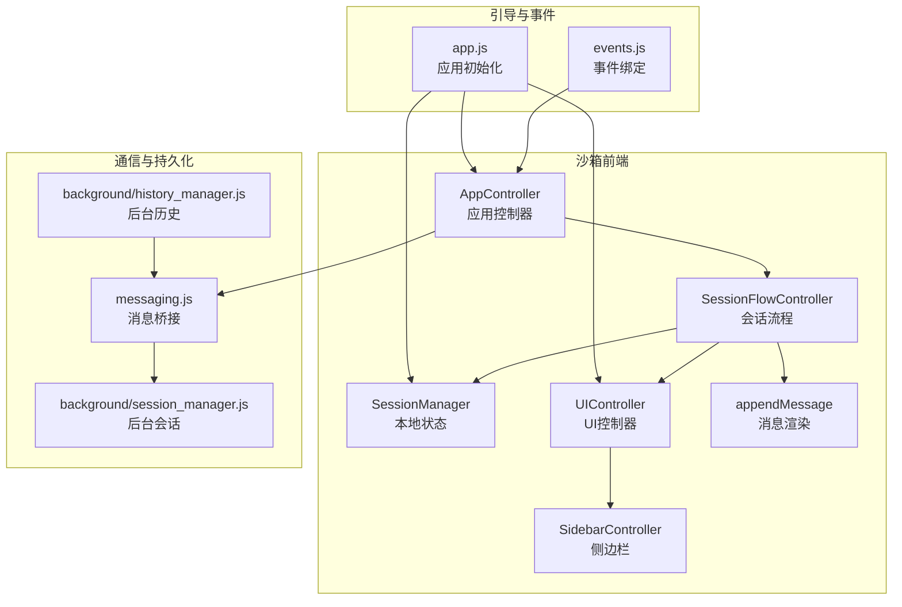
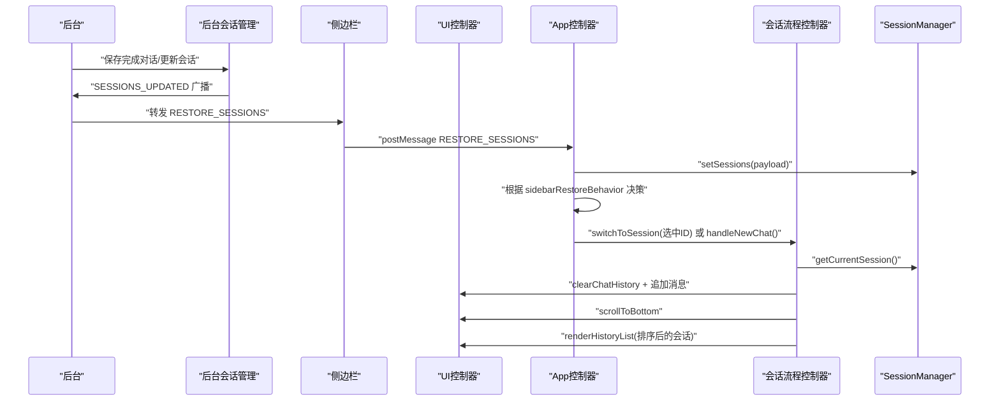
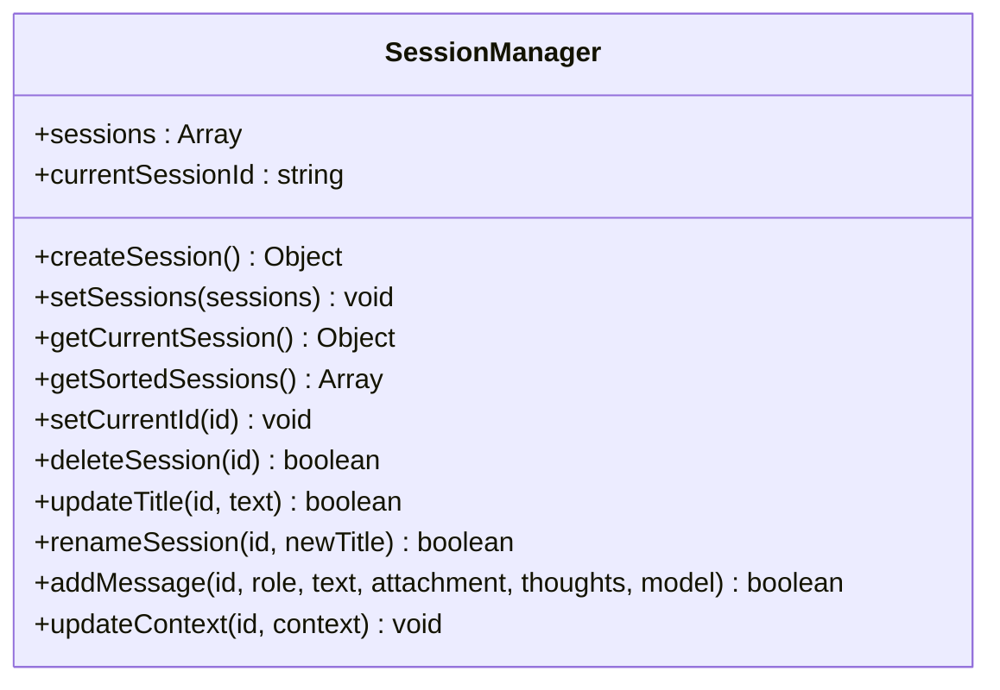
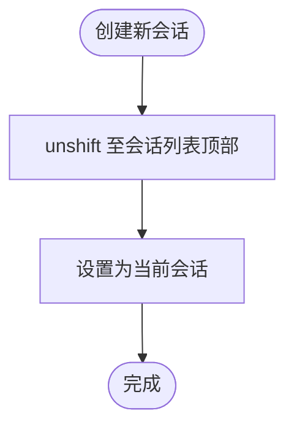
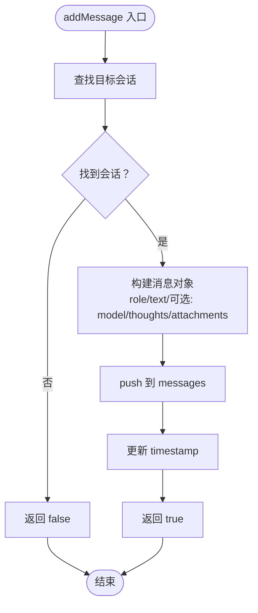
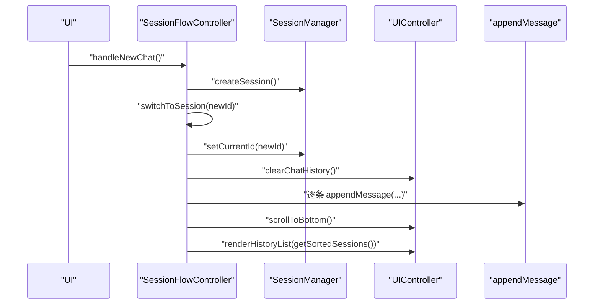
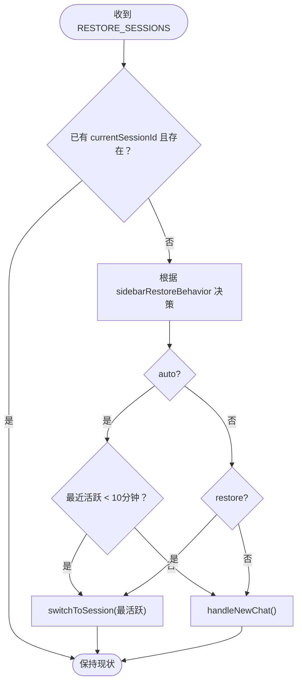
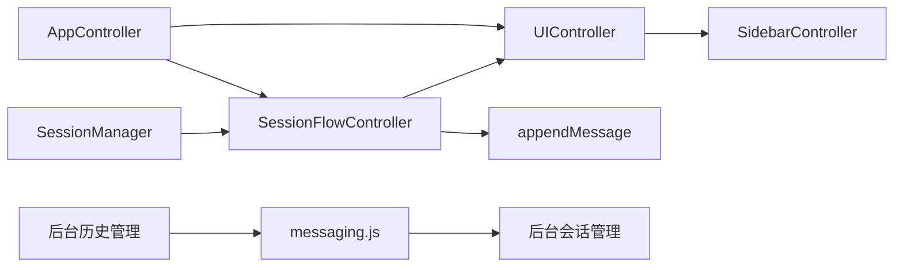

# 前端会话管理

<cite>
**本文档引用的文件**
- [sandbox/core/session_manager.js](file://sandbox/core/session_manager.js)
- [sandbox/controllers/app_controller.js](file://sandbox/controllers/app_controller.js)
- [sandbox/controllers/session_flow.js](file://sandbox/controllers/session_flow.js)
- [sandbox/ui/ui_controller.js](file://sandbox/ui/ui_controller.js)
- [sandbox/ui/sidebar.js](file://sandbox/ui/sidebar.js)
- [sandbox/render/message.js](file://sandbox/render/message.js)
- [sandbox/boot/app.js](file://sandbox/boot/app.js)
- [sandbox/boot/events.js](file://sandbox/boot/events.js)
- [lib/messaging.js](file://lib/messaging.js)
- [background/managers/history_manager.js](file://background/managers/history_manager.js)
- [background/managers/session_manager.js](file://background/managers/session_manager.js)
</cite>

## 目录
1. [简介](#简介)
2. [项目结构](#项目结构)
3. [核心组件](#核心组件)
4. [架构总览](#架构总览)
5. [详细组件分析](#详细组件分析)
6. [依赖关系分析](#依赖关系分析)
7. [性能考量](#性能考量)
8. [故障排查指南](#故障排查指南)
9. [结论](#结论)
10. [附录](#附录)

## 简介
本文件面向沙箱环境中的前端会话管理，系统性阐述 SessionManager 的本地状态管理机制，包括会话生命周期管理（创建、删除、当前会话切换）、会话列表排序、消息添加与标题更新策略、会话数据模型字段语义、自动置顶与时间戳更新策略。同时结合 AppController 与 SessionFlowController 的联动机制，说明 UI 操作与会话状态变更的交互流程，覆盖页面上下文激活时的会话恢复行为（auto/restore/new），并提供创建新会话、删除会话、重命名会话的实际调用路径示例，最后讨论错误边界处理与边界情况（如空会话列表）。

## 项目结构
围绕会话管理的关键模块分布如下：
- 沙箱核心
  - SessionManager：负责会话本地状态的增删改查与消息维护
  - AppController：应用控制器，协调消息处理、会话恢复与 UI 更新
  - SessionFlowController：会话流程控制，负责切换会话、渲染历史、删除与重命名
  - UIController/SidebarController：UI 控制器与侧边栏控制器，负责历史列表渲染与交互
  - Message 渲染：负责消息 DOM 追加与滚动控制
- 引导与事件
  - app.js：应用初始化，加载依赖并注入控制器
  - events.js：绑定 DOM 事件，触发应用层操作
- 通信与持久化
  - messaging.js：前后台消息桥接与存储通知
  - background/history_manager.js：后台历史持久化与会话更新广播
  - background/session_manager.js：后台会话管理与错误处理

图表来源
- [sandbox/boot/app.js](file://sandbox/boot/app.js#L35-L88)
- [sandbox/controllers/app_controller.js](file://sandbox/controllers/app_controller.js#L10-L36)
- [sandbox/controllers/session_flow.js](file://sandbox/controllers/session_flow.js#L7-L12)
- [sandbox/ui/ui_controller.js](file://sandbox/ui/ui_controller.js#L8-L33)
- [sandbox/ui/sidebar.js](file://sandbox/ui/sidebar.js#L5-L25)
- [sandbox/render/message.js](file://sandbox/render/message.js#L8-L14)
- [lib/messaging.js](file://lib/messaging.js#L4-L16)
- [background/managers/history_manager.js](file://background/managers/history_manager.js#L12-L14)
- [background/managers/session_manager.js](file://background/managers/session_manager.js#L6-L11)

章节来源
- [sandbox/boot/app.js](file://sandbox/boot/app.js#L11-L88)
- [sandbox/controllers/app_controller.js](file://sandbox/controllers/app_controller.js#L10-L36)

## 核心组件
- SessionManager
  - 负责会话数组与当前会话 ID 的本地状态管理
  - 提供创建会话、设置会话列表、获取当前会话、按时间倒序排序、设置当前 ID、删除会话、更新标题、重命名、添加消息、更新上下文等方法
- AppController
  - 组合消息处理器、会话流程控制器、提示词控制器、MCP 控制器
  - 处理页面上下文开关、模型选择、会话恢复（auto/restore/new）
- SessionFlowController
  - 新建会话、切换会话、刷新历史 UI、重命名、删除会话
- UIController/SidebarController
  - 渲染历史列表、处理重命名/删除/切换回调
- appendMessage
  - 将消息追加到聊天历史，支持用户图片、AI 思维过程、模型信息与复制按钮等

章节来源
- [sandbox/core/session_manager.js](file://sandbox/core/session_manager.js#L5-L104)
- [sandbox/controllers/app_controller.js](file://sandbox/controllers/app_controller.js#L10-L36)
- [sandbox/controllers/session_flow.js](file://sandbox/controllers/session_flow.js#L7-L95)
- [sandbox/ui/ui_controller.js](file://sandbox/ui/ui_controller.js#L8-L65)
- [sandbox/ui/sidebar.js](file://sandbox/ui/sidebar.js#L5-L248)
- [sandbox/render/message.js](file://sandbox/render/message.js#L8-L324)

## 架构总览
会话管理采用“沙箱前端状态 + 后台持久化”的双层架构：
- 沙箱前端：SessionManager 维护内存状态；UIController/SidebarController 负责渲染；SessionFlowController 协调切换与操作
- 后台持久化：history_manager 负责将完成的对话写入本地存储并通过 runtime 广播；messaging.js 用于跨窗口通信
- 应用控制器：AppController 接收来自后台的消息（如 RESTORE_SESSIONS），根据 sidebarRestoreBehavior 决定是否恢复最近会话或新建

图表来源
- [background/managers/history_manager.js](file://background/managers/history_manager.js#L12-L14)
- [background/managers/history_manager.js](file://background/managers/history_manager.js#L94-L97)
- [sidepanel/index.js](file://sidepanel/index.js#L405-L424)
- [sandbox/controllers/app_controller.js](file://sandbox/controllers/app_controller.js#L139-L176)
- [sandbox/controllers/session_flow.js](file://sandbox/controllers/session_flow.js#L24-L58)

## 详细组件分析

### SessionManager 类与会话生命周期
- 数据模型字段
  - id：会话唯一标识
  - title：会话标题（默认“New Chat”，可更新）
  - timestamp：时间戳（用于排序与恢复判断）
  - messages：消息数组（含 role、text、可选 image/generatedImages/thoughts/model）
  - context：上下文 ID（用于 Gemini 对话上下文同步）
- 生命周期方法
  - createSession：生成 UUID，构造新会话对象，unshift 至顶部，设置为当前会话
  - setSessions：批量设置会话列表
  - getCurrentSession：按 currentSessionId 查找当前会话
  - getSortedSessions：按 timestamp 倒序返回副本
  - setCurrentId：设置当前会话 ID
  - deleteSession：过滤掉指定 ID 的会话；若删除的是当前会话，自动切换到列表首项或置空
  - updateTitle：仅当标题仍为默认值时更新为输入文本前 30 字符（带省略号）
  - renameSession：强制重命名，限制长度为 50
  - addMessage：构建消息对象，兼容用户附件（单字符串 base64）与 AI 生成图片（数组），追加至 messages，更新 timestamp
  - updateContext：更新会话上下文

图表来源
- [sandbox/core/session_manager.js](file://sandbox/core/session_manager.js#L5-L104)

章节来源
- [sandbox/core/session_manager.js](file://sandbox/core/session_manager.js#L11-L104)

### 会话列表排序与自动置顶策略
- 自动置顶：createSession 使用 unshift 将新会话置于列表首位，确保最新会话优先显示
- 时间戳更新：每次 addMessage 成功都会更新该会话的 timestamp，保证排序的时效性
- 排序策略：getSortedSessions 返回按 timestamp 倒序的副本，不修改原数组，避免副作用

图表来源
- [sandbox/core/session_manager.js](file://sandbox/core/session_manager.js#L20-L23)

章节来源
- [sandbox/core/session_manager.js](file://sandbox/core/session_manager.js#L20-L35)
- [sandbox/core/session_manager.js](file://sandbox/core/session_manager.js#L69-L96)

### 消息添加与标题更新逻辑
- addMessage
  - 构造消息对象，按角色处理附件：用户角色支持单张 base64 图片；AI 角色支持生成图片数组
  - 可选字段：model、thoughts
  - 成功添加后更新会话 timestamp
- updateTitle
  - 仅在标题仍为默认值“New Chat”时进行替换，限制长度并带省略号
- renameSession
  - 强制重命名，限制长度为 50 字符

图表来源
- [sandbox/core/session_manager.js](file://sandbox/core/session_manager.js#L69-L96)

章节来源
- [sandbox/core/session_manager.js](file://sandbox/core/session_manager.js#L51-L67)
- [sandbox/core/session_manager.js](file://sandbox/core/session_manager.js#L69-L96)

### UI 操作与会话状态变更联动
- 新建会话
  - AppController.handleNewChat -> SessionFlowController.handleNewChat -> SessionManager.createSession -> 切换到新会话
- 切换会话
  - SidebarController/SessionFlowController.switchToSession -> SessionManager.setCurrentId -> 清空历史并逐条追加消息 -> 滚动到底部 -> 发送上下文到后台
- 删除会话
  - SidebarController.handleDeleteSession -> SessionFlowController.handleDeleteSession -> SessionManager.deleteSession -> 若删除的是当前会话则自动切换或新建
- 重命名会话
  - SidebarController.rename -> SessionFlowController.handleRenameSession -> SessionManager.renameSession -> 保存到存储并刷新历史

图表来源
- [sandbox/controllers/session_flow.js](file://sandbox/controllers/session_flow.js#L14-L58)
- [sandbox/ui/sidebar.js](file://sandbox/ui/sidebar.js#L192-L218)
- [sandbox/render/message.js](file://sandbox/render/message.js#L8-L44)

章节来源
- [sandbox/controllers/session_flow.js](file://sandbox/controllers/session_flow.js#L14-L95)
- [sandbox/ui/sidebar.js](file://sandbox/ui/sidebar.js#L192-L234)

### 页面上下文激活时的会话恢复行为
- 恢复策略
  - auto：若最近一次活跃会话在 10 分钟内，则恢复；否则新建
  - restore：总是恢复
  - new：总是新建
- 行为配置
  - AppController.handleIncomingMessage 监听 RESTORE_SESSIONS，读取 sidebarRestoreBehavior 并据此决定恢复或新建
  - 通过 messaging.js 与后台通信，接收历史会话列表并设置到 SessionManager

图表来源
- [sandbox/controllers/app_controller.js](file://sandbox/controllers/app_controller.js#L139-L176)

章节来源
- [sandbox/controllers/app_controller.js](file://sandbox/controllers/app_controller.js#L21-L22)
- [sandbox/controllers/app_controller.js](file://sandbox/controllers/app_controller.js#L139-L176)

### 实际代码示例（调用路径）
- 创建新会话
  - 触发：点击“新建会话”按钮
  - 路径：events.js -> AppController.handleNewChat -> SessionFlowController.handleNewChat -> SessionManager.createSession
  - 参考路径：[sandbox/boot/events.js](file://sandbox/boot/events.js#L8), [sandbox/controllers/session_flow.js](file://sandbox/controllers/session_flow.js#L14-L22), [sandbox/core/session_manager.js](file://sandbox/core/session_manager.js#L11-L23)
- 删除会话
  - 触发：侧边栏删除按钮
  - 路径：SidebarController.handleDeleteSession -> SessionFlowController.handleDeleteSession -> SessionManager.deleteSession
  - 参考路径：[sandbox/ui/sidebar.js](file://sandbox/ui/sidebar.js#L229-L234), [sandbox/controllers/session_flow.js](file://sandbox/controllers/session_flow.js#L81-L94), [sandbox/core/session_manager.js](file://sandbox/core/session_manager.js#L41-L49)
- 重命名会话
  - 触发：侧边栏重命名输入框回车或失焦
  - 路径：SidebarController.rename -> SessionFlowController.handleRenameSession -> SessionManager.renameSession
  - 参考路径：[sandbox/ui/sidebar.js](file://sandbox/ui/sidebar.js#L192-L218), [sandbox/controllers/session_flow.js](file://sandbox/controllers/session_flow.js#L72-L79), [sandbox/core/session_manager.js](file://sandbox/core/session_manager.js#L60-L67)

## 依赖关系分析
- 组件耦合
  - SessionFlowController 依赖 SessionManager 与 UIController
  - AppController 依赖 SessionFlowController、UIController、MessageHandler
  - UIController 依赖 SidebarController 与 ChatController
  - Messaging 层负责跨窗口通信，连接沙箱前端与后台
- 外部依赖
  - 后台历史管理器负责持久化与广播
  - 后台会话管理器负责错误处理与上下文更新

图表来源
- [sandbox/controllers/session_flow.js](file://sandbox/controllers/session_flow.js#L7-L12)
- [sandbox/ui/ui_controller.js](file://sandbox/ui/ui_controller.js#L8-L33)
- [lib/messaging.js](file://lib/messaging.js#L4-L16)
- [background/managers/history_manager.js](file://background/managers/history_manager.js#L12-L14)
- [background/managers/session_manager.js](file://background/managers/session_manager.js#L6-L11)

章节来源
- [sandbox/controllers/session_flow.js](file://sandbox/controllers/session_flow.js#L7-L12)
- [sandbox/ui/ui_controller.js](file://sandbox/ui/ui_controller.js#L8-L33)
- [lib/messaging.js](file://lib/messaging.js#L4-L16)

## 性能考量
- 列表排序：getSortedSessions 返回副本，避免原数组被就地修改，减少不必要的 UI 重绘
- 消息渲染：appendMessage 支持增量更新与图片延迟插入，避免重复渲染
- 自动滚动：切换会话时先清空再逐条追加，最后滚动到底部，保证可见区域稳定
- 存储通知：删除/重命名后统一保存到存储，减少多次 IO

## 故障排查指南
- 空会话列表
  - 现象：切换会话时无消息，历史为空
  - 处理：检查 RESTORE_SESSIONS 是否正确下发；确认 sidebarRestoreBehavior 设置；必要时调用 handleNewChat
  - 参考路径：[sandbox/controllers/app_controller.js](file://sandbox/controllers/app_controller.js#L139-L176), [sandbox/controllers/session_flow.js](file://sandbox/controllers/session_flow.js#L88-L94)
- 删除当前会话后未自动切换
  - 现象：删除当前会话后 UI 无变化
  - 处理：确认 deleteSession 返回值；若返回 true，需手动 switchToSession 或 handleNewChat
  - 参考路径：[sandbox/core/session_manager.js](file://sandbox/core/session_manager.js#L41-L49), [sandbox/controllers/session_flow.js](file://sandbox/controllers/session_flow.js#L85-L91)
- 标题未更新
  - 现象：发送第一条消息后标题仍为“New Chat”
  - 处理：updateTitle 仅在默认标题下生效；若标题已被用户修改，需使用 renameSession
  - 参考路径：[sandbox/core/session_manager.js](file://sandbox/core/session_manager.js#L51-L58), [sandbox/core/session_manager.js](file://sandbox/core/session_manager.js#L60-L67)
- 附件显示异常
  - 现象：用户上传图片或 AI 生成图片未显示
  - 处理：确认 addMessage 中的附件类型与角色匹配；检查 appendMessage 的附件分支
  - 参考路径：[sandbox/core/session_manager.js](file://sandbox/core/session_manager.js#L69-L96), [sandbox/render/message.js](file://sandbox/render/message.js#L24-L63), [sandbox/render/message.js](file://sandbox/render/message.js#L150-L164)

章节来源
- [sandbox/controllers/app_controller.js](file://sandbox/controllers/app_controller.js#L139-L176)
- [sandbox/controllers/session_flow.js](file://sandbox/controllers/session_flow.js#L81-L94)
- [sandbox/core/session_manager.js](file://sandbox/core/session_manager.js#L51-L67)
- [sandbox/render/message.js](file://sandbox/render/message.js#L24-L63)

## 结论
SessionManager 在沙箱前端实现了轻量而高效的会话本地状态管理，配合 SessionFlowController 与 UI 控制器形成清晰的职责分层。通过自动置顶与时间戳更新策略，确保会话列表始终反映最新交互；通过 RESTORE_SESSIONS 与 sidebarRestoreBehavior，实现灵活的会话恢复策略。消息渲染与附件处理在 appendMessage 中得到统一管理，保障了 UI 的一致性与可扩展性。整体设计兼顾易用性与可维护性，适合在复杂交互场景中稳定运行。

## 附录
- 会话数据模型字段说明
  - id：会话唯一标识
  - title：会话标题（默认“New Chat”，可更新/重命名）
  - timestamp：时间戳（用于排序与恢复判断）
  - messages：消息数组（role、text、可选 image/generatedImages/thoughts/model）
  - context：上下文 ID（用于 Gemini 对话上下文同步）