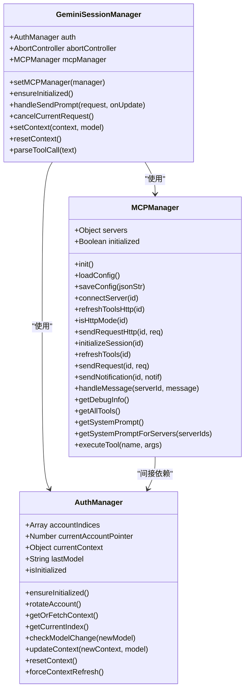
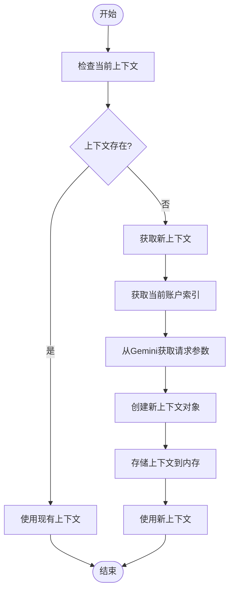
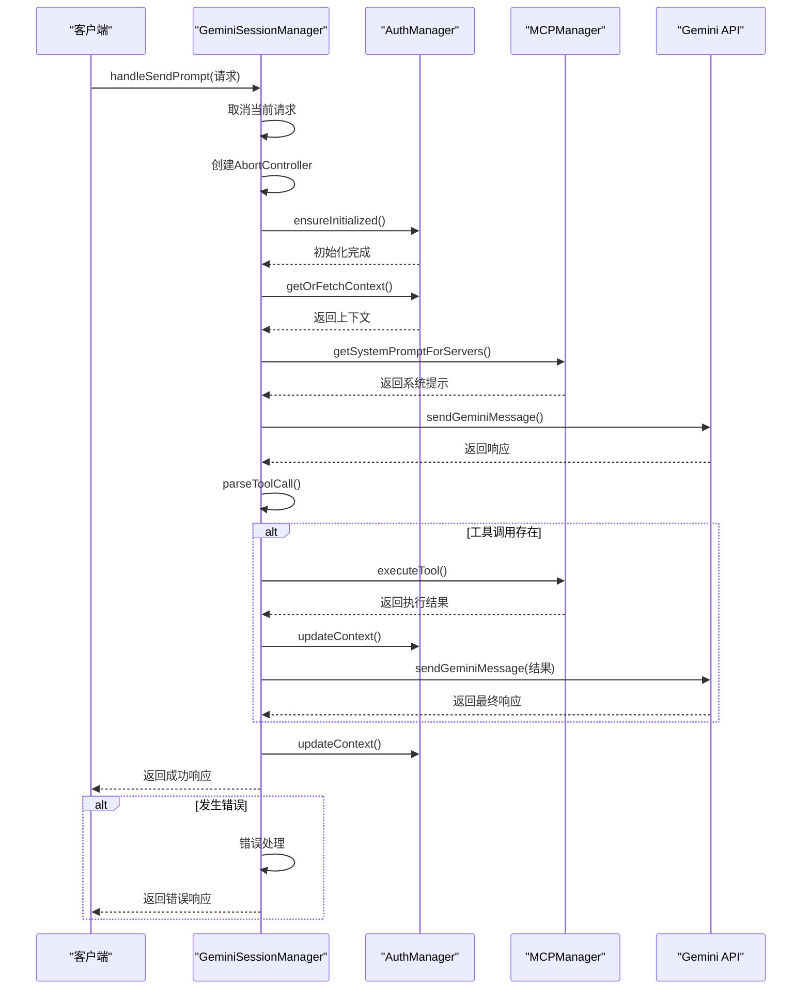
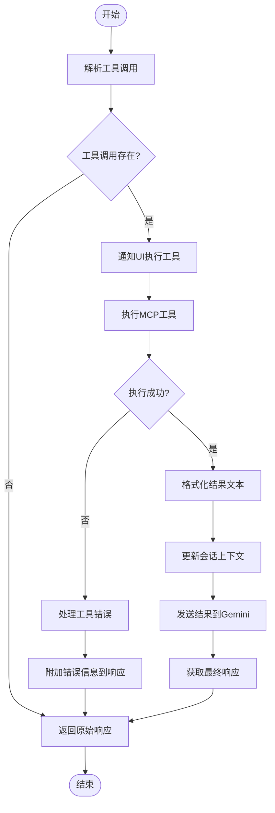
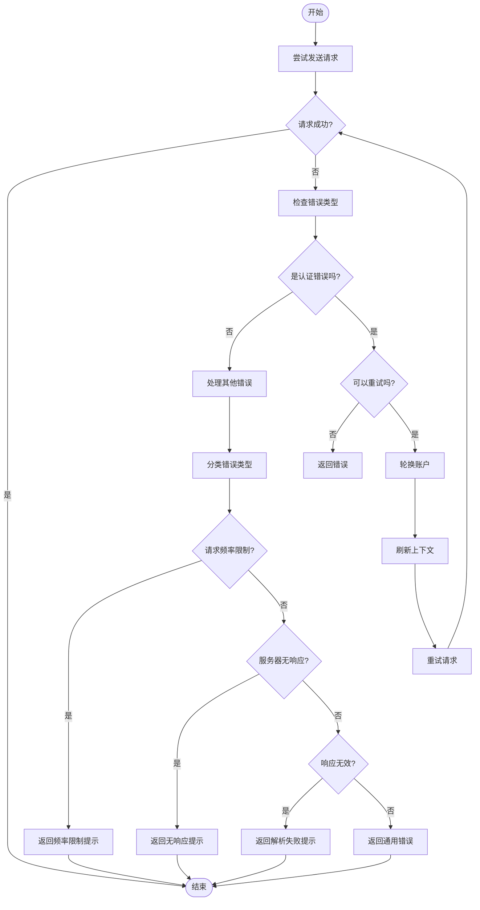
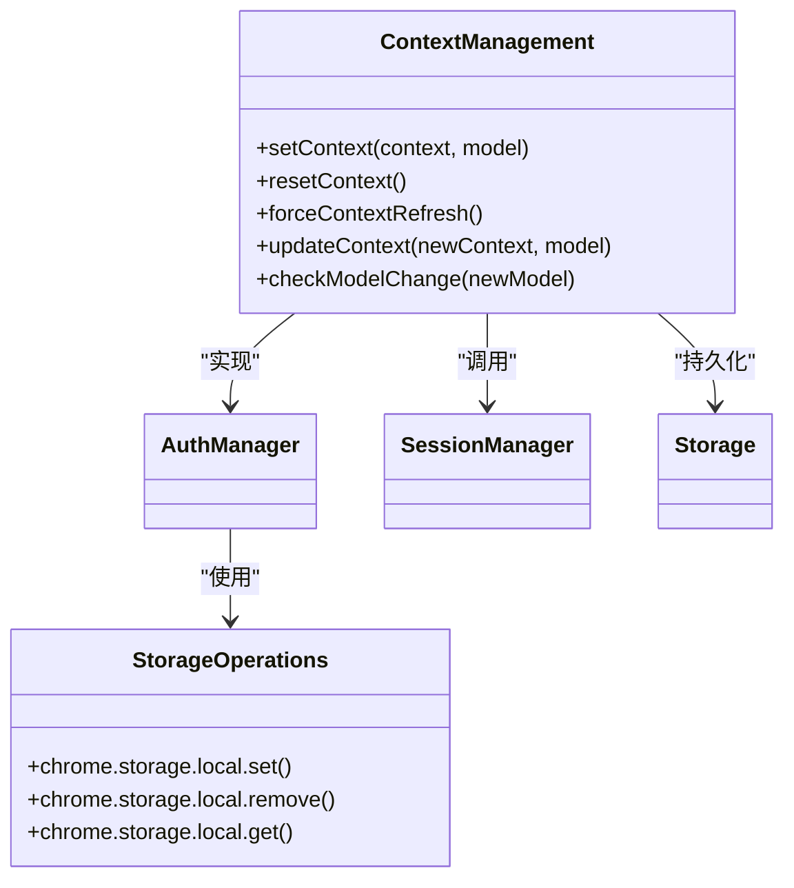
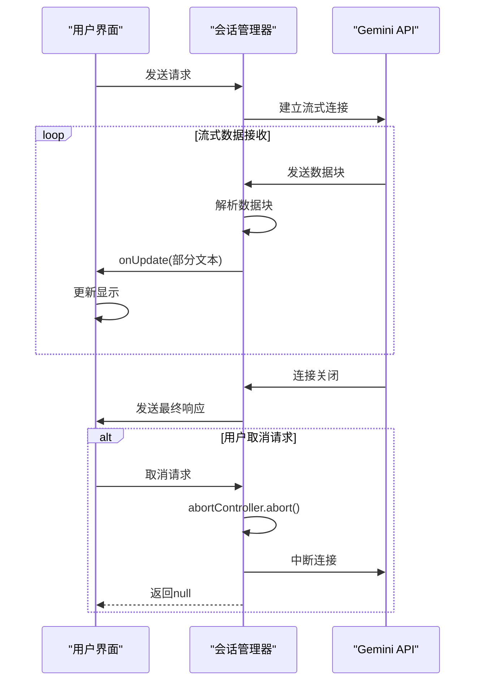
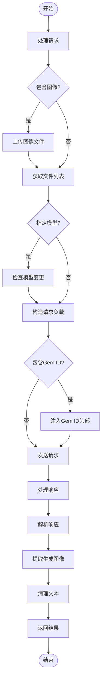

# 后端会话处理

<cite>
**本文档引用的文件**   
- [session_manager.js](file://background/managers/session_manager.js)
- [auth_manager.js](file://background/managers/auth_manager.js)
- [mcp_manager.js](file://background/managers/mcp_manager.js)
- [gemini_api.js](file://services/gemini_api.js)
- [prompt_handler.js](file://background/handlers/session/prompt_handler.js)
- [context_handler.js](file://background/handlers/session/context_handler.js)
- [tool_executor.js](file://background/handlers/session/prompt/tool_executor.js)
- [auth.js](file://services/auth.js)
- [parser.js](file://services/parser.js)
</cite>

## 目录
1. [引言](#引言)
2. [核心组件](#核心组件)
3. [会话管理器架构](#会话管理器架构)
4. [远程上下文同步机制](#远程上下文同步机制)
5. [请求处理流程](#请求处理流程)
6. [MCP工具执行循环](#mcp工具执行循环)
7. [错误处理与账户轮换](#错误处理与账户轮换)
8. [上下文管理方法](#上下文管理方法)
9. [流式响应与请求取消](#流式响应与请求取消)
10. [高级功能实现](#高级功能实现)

## 引言
本文档深入解析Gemini Nexus扩展的后端会话处理机制，重点阐述GeminiSessionManager如何协调认证管理、MCP工具调用和Gemini API通信。文档详细说明了请求重试逻辑、错误处理策略以及上下文管理机制，为开发者提供全面的技术参考。

## 核心组件
Gemini Nexus的后端会话处理系统由多个核心组件构成，包括会话管理器、认证管理器、MCP管理器和API服务等。这些组件协同工作，实现了复杂的会话管理和远程通信功能。

**Section sources**
- [session_manager.js](file://background/managers/session_manager.js#L6-L285)
- [auth_manager.js](file://background/managers/auth_manager.js#L5-L130)
- [mcp_manager.js](file://background/managers/mcp_manager.js#L2-L530)

## 会话管理器架构
GeminiSessionManager是整个会话处理系统的核心，负责协调各个组件的工作流程。它通过依赖注入的方式与AuthManager和MCPManager进行交互，确保会话状态的一致性和安全性。

**Diagram sources **
- [session_manager.js](file://background/managers/session_manager.js#L6-L285)
- [auth_manager.js](file://background/managers/auth_manager.js#L5-L130)
- [mcp_manager.js](file://background/managers/mcp_manager.js#L2-L530)

**Section sources**
- [session_manager.js](file://background/managers/session_manager.js#L6-L285)
- [auth_manager.js](file://background/managers/auth_manager.js#L5-L130)
- [mcp_manager.js](file://background/managers/mcp_manager.js#L2-L530)

## 远程上下文同步机制
GeminiSessionManager通过AuthManager实现远程上下文的同步和管理。当会话需要与Gemini服务器通信时，系统会自动获取或刷新认证上下文，确保请求的合法性和连续性。

### 上下文获取流程

**Diagram sources **
- [session_manager.js](file://background/managers/session_manager.js#L52-L88)
- [auth_manager.js](file://background/managers/auth_manager.js#L75-L91)

**Section sources**
- [session_manager.js](file://background/managers/session_manager.js#L52-L88)
- [auth_manager.js](file://background/managers/auth_manager.js#L75-L91)

## 请求处理流程
handleSendPrompt方法是会话处理的核心，它协调认证管理、MCP工具调用和Gemini API通信，实现完整的请求处理流程。

### 请求处理序列图

**Diagram sources **
- [session_manager.js](file://background/managers/session_manager.js#L21-L148)
- [gemini_api.js](file://services/gemini_api.js#L26-L230)

**Section sources**
- [session_manager.js](file://background/managers/session_manager.js#L21-L148)
- [gemini_api.js](file://services/gemini_api.js#L26-L230)

## MCP工具执行循环
MCP EXECUTION LOOP是系统的核心功能之一，它实现了Gemini与外部工具的交互能力。该循环通过解析工具调用、执行工具和反馈结果三个步骤完成。

### 工具执行循环流程

**Diagram sources **
- [session_manager.js](file://background/managers/session_manager.js#L76-L115)
- [mcp_manager.js](file://background/managers/mcp_manager.js#L479-L525)

**Section sources**
- [session_manager.js](file://background/managers/session_manager.js#L76-L115)
- [mcp_manager.js](file://background/managers/mcp_manager.js#L479-L525)

## 错误处理与账户轮换
系统实现了完善的错误处理机制，特别是针对401/403认证失败的账户轮换策略。当检测到认证错误时，系统会自动轮换账户并重试请求。

### 错误处理流程

**Diagram sources **
- [session_manager.js](file://background/managers/session_manager.js#L129-L193)
- [auth_manager.js](file://background/managers/auth_manager.js#L53-L69)

**Section sources**
- [session_manager.js](file://background/managers/session_manager.js#L129-L193)
- [auth_manager.js](file://background/managers/auth_manager.js#L53-L69)

## 上下文管理方法
系统提供了setContext和resetContext等方法来维护Gemini对话上下文的一致性。这些方法通过AuthManager与本地存储交互，确保上下文状态的持久化。

### 上下文管理操作

**Diagram sources **
- [session_manager.js](file://background/managers/session_manager.js#L213-L219)
- [auth_manager.js](file://background/managers/auth_manager.js#L105-L128)

**Section sources**
- [session_manager.js](file://background/managers/session_manager.js#L213-L219)
- [auth_manager.js](file://background/managers/auth_manager.js#L105-L128)

## 流式响应与请求取消
系统通过AbortController实现请求取消功能，并通过onUpdate回调机制支持流式响应更新。这使得用户界面能够实时显示Gemini的响应过程。

### 流式响应处理

**Diagram sources **
- [session_manager.js](file://background/managers/session_manager.js#L25-L30)
- [gemini_api.js](file://services/gemini_api.js#L159-L207)

**Section sources**
- [session_manager.js](file://background/managers/session_manager.js#L25-L30)
- [gemini_api.js](file://services/gemini_api.js#L159-L207)

## 高级功能实现
系统实现了处理图像附件、模型切换和Gem ID传递等高级功能，并提供了针对请求频率限制和服务器无响应等异常情况的用户友好提示。

### 高级功能处理

**Diagram sources **
- [session_manager.js](file://background/managers/session_manager.js#L31-L41)
- [gemini_api.js](file://services/gemini_api.js#L42-L112)

**Section sources**
- [session_manager.js](file://background/managers/session_manager.js#L31-L41)
- [gemini_api.js](file://services/gemini_api.js#L42-L112)