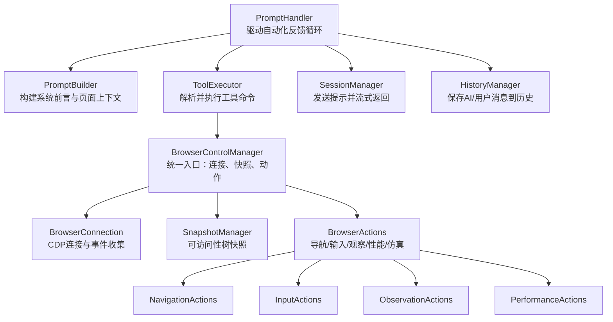
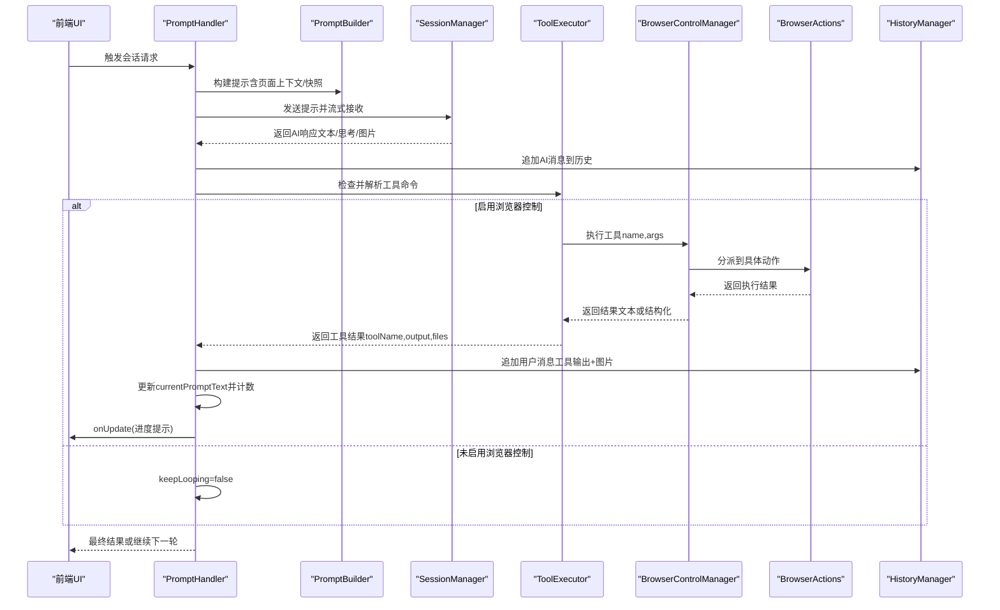
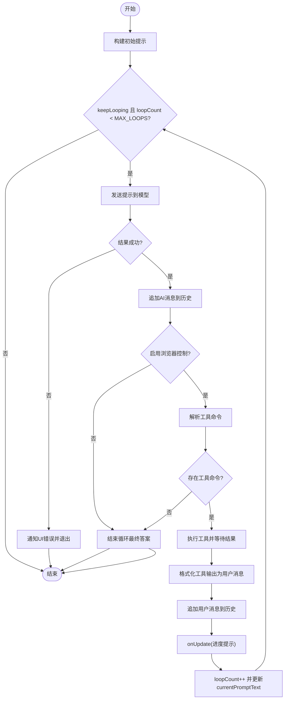
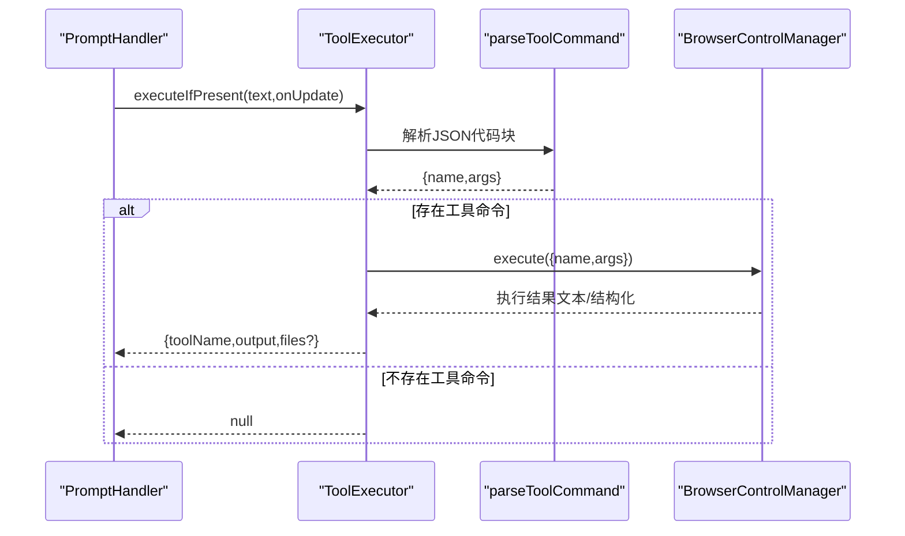
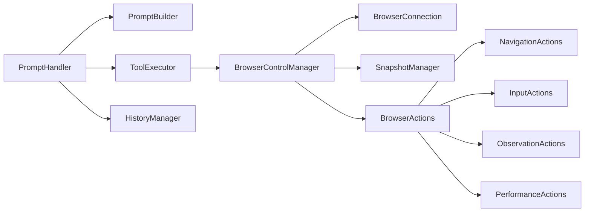

# 工具执行集成

<cite>
**本文引用的文件**
- [prompt_handler.js](file://background/handlers/session/prompt_handler.js)
- [tool_executor.js](file://background/handlers/session/prompt/tool_executor.js)
- [builder.js](file://background/handlers/session/prompt/builder.js)
- [preamble.js](file://background/handlers/session/prompt/preamble.js)
- [utils.js](file://background/handlers/session/utils.js)
- [control_manager.js](file://background/managers/control_manager.js)
- [history_manager.js](file://background/managers/history_manager.js)
- [actions.js](file://background/control/actions.js)
- [navigation.js](file://background/control/actions/navigation.js)
- [input.js](file://background/control/actions/input.js)
- [observation.js](file://background/control/actions/observation.js)
- [performance.js](file://background/control/actions/performance.js)
- [connection.js](file://background/control/connection.js)
- [snapshot.js](file://background/control/snapshot.js)
</cite>

## 目录
1. [简介](#简介)
2. [项目结构](#项目结构)
3. [核心组件](#核心组件)
4. [架构总览](#架构总览)
5. [详细组件分析](#详细组件分析)
6. [依赖关系分析](#依赖关系分析)
7. [性能考量](#性能考量)
8. [故障排查指南](#故障排查指南)
9. [结论](#结论)

## 简介
本文件系统性阐述“工具执行集成”的工作机制，重点围绕自动化反馈循环（Automated Feedback Loop）展开，涵盖以下主题：
- PromptHandler 中 while 循环如何实现多轮交互，包括 MAX_LOOPS 限制与 keepLooping 控制逻辑
- ToolExecutor 如何解析 AI 响应中的工具调用指令并执行相应的浏览器控制操作
- 工具执行结果如何被格式化为新的用户消息（[Tool Output from ...]）并反馈给模型进行下一轮推理
- 工具执行结果在会话历史中的记录方式，包括工具输出的 Markdown 格式化与关联文件的处理
- 工具执行对 UI 状态的影响，onUpdate 回调如何更新状态提示以反映当前执行步骤
- 工具集成的安全考虑，如工具执行的条件控制（enableBrowserControl 标志）与执行结果的验证机制

## 项目结构
该功能位于后台处理器与控制管理器之间，通过 PromptBuilder 注入上下文，PromptHandler 驱动自动化反馈循环，ToolExecutor 解析并执行工具命令，BrowserControlManager 调度具体动作，最终由历史管理器持久化会话。

图表来源
- [prompt_handler.js](file://background/handlers/session/prompt_handler.js#L1-L103)
- [builder.js](file://background/handlers/session/prompt/builder.js#L1-L45)
- [tool_executor.js](file://background/handlers/session/prompt/tool_executor.js#L1-L49)
- [control_manager.js](file://background/managers/control_manager.js#L1-L159)
- [actions.js](file://background/control/actions.js#L1-L55)
- [connection.js](file://background/control/connection.js#L1-L147)
- [snapshot.js](file://background/control/snapshot.js#L1-L183)
- [history_manager.js](file://background/managers/history_manager.js#L1-L149)

章节来源
- [prompt_handler.js](file://background/handlers/session/prompt_handler.js#L1-L103)
- [builder.js](file://background/handlers/session/prompt/builder.js#L1-L45)
- [tool_executor.js](file://background/handlers/session/prompt/tool_executor.js#L1-L49)
- [control_manager.js](file://background/managers/control_manager.js#L1-L159)
- [actions.js](file://background/control/actions.js#L1-L55)
- [connection.js](file://background/control/connection.js#L1-L147)
- [snapshot.js](file://background/control/snapshot.js#L1-L183)
- [history_manager.js](file://background/managers/history_manager.js#L1-L149)

## 核心组件
- PromptHandler：负责构建初始提示、驱动自动化反馈循环、处理工具执行结果并将其注入下一轮对话；控制 MAX_LOOPS 与 keepLooping，以及 UI 状态更新。
- ToolExecutor：从 AI 响应中提取工具命令（JSON 代码块），调用 BrowserControlManager 执行，并将结果结构化返回。
- PromptBuilder：根据请求参数注入系统前言与页面上下文（含快照），并在启用浏览器控制时注入 BROWSER_CONTROL_PREAMBLE。
- BrowserControlManager：统一调度连接、快照与动作执行，按工具名分派到具体动作模块。
- BrowserActions：聚合导航、输入、观察、性能、仿真等子模块。
- HistoryManager：维护会话历史，支持追加 AI/用户消息与图片附件。

章节来源
- [prompt_handler.js](file://background/handlers/session/prompt_handler.js#L1-L103)
- [tool_executor.js](file://background/handlers/session/prompt/tool_executor.js#L1-L49)
- [builder.js](file://background/handlers/session/prompt/builder.js#L1-L45)
- [control_manager.js](file://background/managers/control_manager.js#L1-L159)
- [actions.js](file://background/control/actions.js#L1-L55)
- [history_manager.js](file://background/managers/history_manager.js#L1-L149)

## 架构总览
自动化反馈循环的关键流程如下：
- 构建提示：根据 includePageContext 与 enableBrowserControl 决定是否注入页面内容与浏览器控制前言，并自动注入当前页面快照。
- 发送请求：通过 SessionManager 发送提示，接收流式文本与思考过程。
- 工具解析：ToolExecutor 使用 parseToolCommand 从响应末尾的 JSON 代码块中提取工具名称与参数。
- 动作执行：BrowserControlManager 将工具名映射到具体动作，执行后返回文本或结构化结果（如截图）。
- 结果注入：将工具输出格式化为用户消息，附加新生成的图片（如有），并更新当前提示文本进入下一轮。
- 历史记录：每次 AI 响应与工具输出均写入历史，确保断线重连也能恢复上下文。
- UI 更新：onUpdate 回调用于向 UI 推送中间状态，便于用户感知执行进度。

图表来源
- [prompt_handler.js](file://background/handlers/session/prompt_handler.js#L13-L101)
- [tool_executor.js](file://background/handlers/session/prompt/tool_executor.js#L9-L47)
- [builder.js](file://background/handlers/session/prompt/builder.js#L10-L43)
- [control_manager.js](file://background/managers/control_manager.js#L43-L157)
- [actions.js](file://background/control/actions.js#L13-L54)
- [history_manager.js](file://background/managers/history_manager.js#L71-L148)

## 详细组件分析

### PromptHandler：自动化反馈循环与多轮交互
- while 循环控制
  - MAX_LOOPS 默认 10 次，防止无限循环
  - keepLooping 初始为 true，当无工具执行时置为 false，结束循环
  - 每次工具执行成功后 loopCount 自增，并将工具输出作为新的用户消息注入下一轮
- 工具执行条件
  - 仅当 request.enableBrowserControl 为真时才尝试解析并执行工具
- 历史记录
  - 追加 AI 消息与工具输出消息，支持图片附件（如截图）
- UI 状态更新
  - onUpdate 回调用于推送中间状态，包含“正在思考”和“观察到工具输出并规划下一步”的提示

图表来源
- [prompt_handler.js](file://background/handlers/session/prompt_handler.js#L24-L87)

章节来源
- [prompt_handler.js](file://background/handlers/session/prompt_handler.js#L24-L87)

### ToolExecutor：工具命令解析与执行
- 命令解析
  - 使用 parseToolCommand 从响应末尾查找 JSON 代码块，提取 "tool" 与 "args"
- 执行流程
  - 通过 BrowserControlManager.execute 执行工具
  - 若返回对象且包含 image 字段，则将 text 作为输出，image 作为 base64 图片并包装为文件数组
  - 异常时返回错误信息
- UI 提示
  - 在执行前通过 onUpdate 通知工具名称与处理状态

图表来源
- [tool_executor.js](file://background/handlers/session/prompt/tool_executor.js#L9-L47)
- [utils.js](file://background/handlers/session/utils.js#L4-L21)

章节来源
- [tool_executor.js](file://background/handlers/session/prompt/tool_executor.js#L9-L47)
- [utils.js](file://background/handlers/session/utils.js#L4-L21)

### PromptBuilder：系统前言与页面上下文注入
- 页面上下文
  - 当 includePageContext 为真时，通过 getActiveTabContent 获取页面内容并注入到提示前言
- 浏览器控制前言
  - 当 enableBrowserControl 为真时，注入 BROWSER_CONTROL_PREAMBLE，明确工具可用范围与输出规范
- 快照注入
  - 自动注入当前页面的可访问性树快照（结构化视觉），帮助模型基于 UID 与属性进行交互

章节来源
- [builder.js](file://background/handlers/session/prompt/builder.js#L10-L43)
- [preamble.js](file://background/handlers/session/prompt/preamble.js#L1-L109)
- [utils.js](file://background/handlers/session/utils.js#L23-L63)

### BrowserControlManager：统一入口与动作分派
- 连接管理
  - ensureConnection 保证当前标签页有效且非受限 URL，必要时建立 CDP 连接
- 快照能力
  - getSnapshot 自动注入快照，若失败则提示需要手动触发或导航到页面
- 工具分派
  - 根据工具名映射到具体动作（导航、输入、观察、性能、仿真、网络等）
  - 对于结构化结果（如截图），返回 {text,image} 形式，供上层封装为文件

章节来源
- [control_manager.js](file://background/managers/control_manager.js#L20-L157)
- [connection.js](file://background/control/connection.js#L60-L106)
- [snapshot.js](file://background/control/snapshot.js#L27-L181)

### BrowserActions：动作聚合与职责划分
- 导航类：navigatePage、newPage、closePage、listPages、selectPage
- 输入类：clickElement、dragElement、hoverElement、fillElement、fillForm、pressKey、attachFile、handleDialog
- 观察类：takeScreenshot、evaluateScript、waitFor
- 性能类：startTrace、stopTrace、analyzeInsight
- 仿真类：emulate、resizePage

章节来源
- [actions.js](file://background/control/actions.js#L13-L54)
- [navigation.js](file://background/control/actions/navigation.js#L1-L61)
- [input.js](file://background/control/actions/input.js#L1-L62)
- [observation.js](file://background/control/actions/observation.js#L1-L200)
- [performance.js](file://background/control/actions/performance.js#L1-L74)

### 历史管理：会话历史记录与工具输出格式化
- 追加 AI 消息：appendAiMessage
- 追加用户消息（含工具输出）：appendUserMessage
- 工具输出格式化
  - 文本：使用 Markdown 区块包裹工具输出，并附带“继续下一步”的提示
  - 图片：若工具返回截图等二进制数据，转换为 base64 并作为图片附件存储
- 历史结构
  - 每条消息包含 role、text、thoughts（可选）、generatedImages（可选）、image（可选）

章节来源
- [history_manager.js](file://background/managers/history_manager.js#L71-L148)
- [prompt_handler.js](file://background/handlers/session/prompt_handler.js#L64-L78)

## 依赖关系分析
- PromptHandler 依赖 PromptBuilder、ToolExecutor、HistoryManager 与 SessionManager
- ToolExecutor 依赖 BrowserControlManager 与工具解析函数
- BrowserControlManager 依赖 BrowserConnection、SnapshotManager 与 BrowserActions
- BrowserActions 依赖各子模块（Navigation/Input/Observation/Performance）
- HistoryManager 依赖本地存储与消息通知

图表来源
- [prompt_handler.js](file://background/handlers/session/prompt_handler.js#L1-L11)
- [tool_executor.js](file://background/handlers/session/prompt/tool_executor.js#L1-L7)
- [control_manager.js](file://background/managers/control_manager.js#L1-L16)
- [actions.js](file://background/control/actions.js#L1-L23)

章节来源
- [prompt_handler.js](file://background/handlers/session/prompt_handler.js#L1-L11)
- [tool_executor.js](file://background/handlers/session/prompt/tool_executor.js#L1-L7)
- [control_manager.js](file://background/managers/control_manager.js#L1-L16)
- [actions.js](file://background/control/actions.js#L1-L23)

## 性能考量
- 快照与连接
  - 快照生成涉及 DOM 与可访问性树查询，建议在必要时才触发，避免频繁快照导致性能开销
  - 连接建立与域启用（Network、Log、Runtime、Page、Audits）需谨慎，仅在需要时启用
- 工具执行
  - 复杂脚本执行（evaluate_script）可能阻塞页面，建议设置合理超时与异常处理
  - 截图与网络请求体下载可能产生大量数据，注意内存占用与存储空间
- 循环次数
  - MAX_LOOPS 限制为 10，可根据任务复杂度调整，但需平衡用户体验与资源消耗

[本节为通用指导，不直接分析具体文件]

## 故障排查指南
- 无法解析工具命令
  - 检查 AI 输出是否包含标准 JSON 代码块，且包含 "tool" 字段
  - 确认 parseToolCommand 的正则匹配是否正确
- 工具执行失败
  - 查看 BrowserControlManager 的默认分支返回值（未知工具名）
  - 检查 BrowserConnection 是否已成功 attach，以及目标标签页 URL 是否受限
- 截图未返回图片
  - 确认 takeScreenshot 是否返回结构化结果（包含 image 字段）
  - 检查图片下载或内联存储逻辑
- 历史记录异常
  - 确认 appendAiMessage 与 appendUserMessage 的 sessionId 是否正确
  - 检查本地存储权限与消息通知通道

章节来源
- [utils.js](file://background/handlers/session/utils.js#L4-L21)
- [control_manager.js](file://background/managers/control_manager.js#L147-L157)
- [connection.js](file://background/control/connection.js#L60-L106)
- [observation.js](file://background/control/actions/observation.js#L7-L55)
- [history_manager.js](file://background/managers/history_manager.js#L71-L148)

## 结论
本集成方案通过 PromptHandler 驱动的自动化反馈循环，实现了“模型-工具-浏览器”的闭环协作。其关键特性包括：
- 明确的多轮交互控制（MAX_LOOPS 与 keepLooping）
- 可靠的工具命令解析与执行路径
- 完整的历史记录与 UI 状态同步
- 安全的执行边界（受限 URL、enableBrowserControl 标志）
- 清晰的错误处理与回退策略

该设计既保证了自动化流程的稳定性，也为后续扩展更多工具与动作提供了清晰的接口与分层结构。