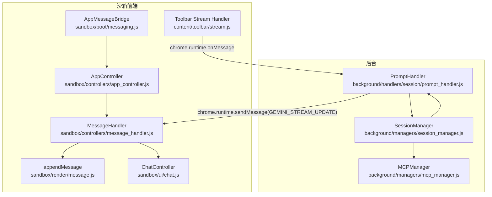
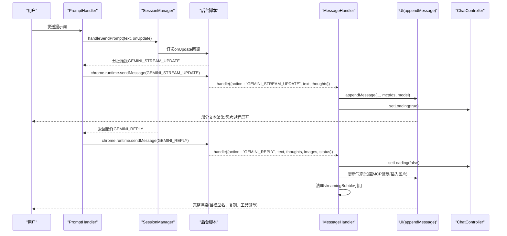
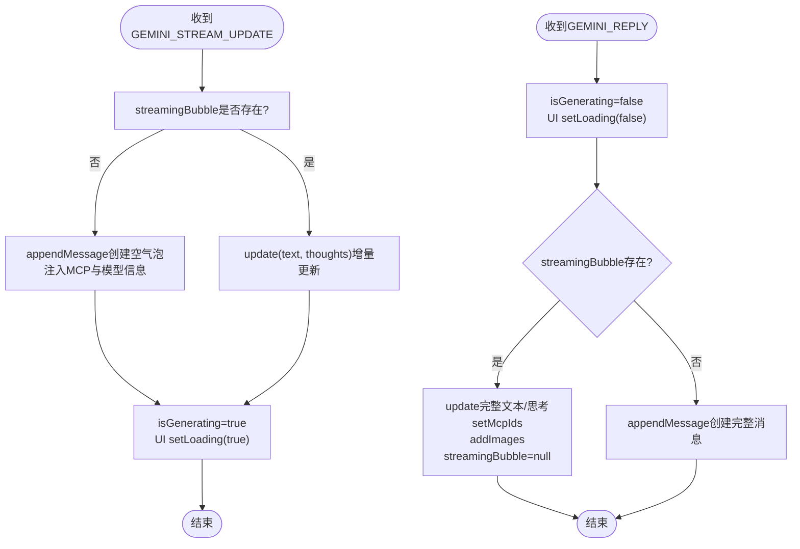
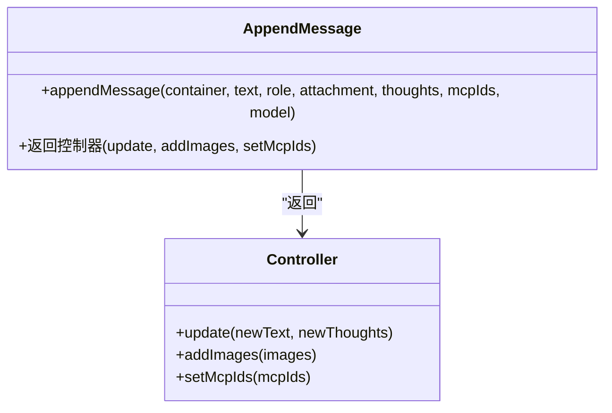
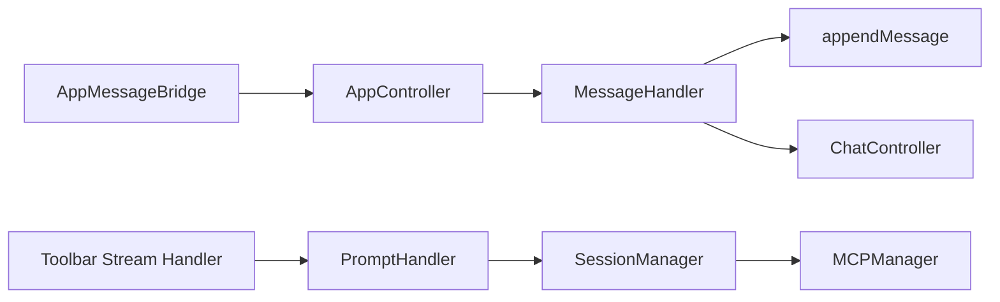

# 流式响应处理

<cite>
**本文档引用的文件**
- [prompt_handler.js](file://background/handlers/session/prompt_handler.js)
- [message_handler.js](file://sandbox/controllers/message_handler.js)
- [stream.js](file://content/toolbar/stream.js)
- [message.js](file://sandbox/render/message.js)
- [mcp_manager.js](file://background/managers/mcp_manager.js)
- [chat.js](file://sandbox/ui/chat.js)
- [app_controller.js](file://sandbox/controllers/app_controller.js)
- [session_manager.js](file://background/managers/session_manager.js)
- [messaging.js](file://sandbox/boot/messaging.js)
</cite>

## 目录
1. [简介](#简介)
2. [项目结构](#项目结构)
3. [核心组件](#核心组件)
4. [架构总览](#架构总览)
5. [详细组件分析](#详细组件分析)
6. [依赖关系分析](#依赖关系分析)
7. [性能考量](#性能考量)
8. [故障排查指南](#故障排查指南)
9. [结论](#结论)

## 简介
本文件系统性梳理从Gemini API流式响应到UI更新的完整处理链路，重点覆盖以下方面：
- PromptHandler中onUpdate回调如何通过chrome.runtime.sendMessage向沙箱环境发送GEMINI_STREAM_UPDATE消息
- MessageHandler中handleStreamUpdate()如何创建和更新流式消息气泡，包括首次创建时的MCP标识和模型信息注入
- MessageHandler中handleGeminiReply()如何处理最终响应，完成消息气泡的最终渲染，包括MCP工具徽章、生成图像和思考过程的展示
- 流式更新在UI上的视觉表现，如部分文本渲染和思考过程的展开/收起
- 流式处理中的状态管理，特别是streamingBubble引用的生命周期控制，以及在错误或取消操作时的清理机制

## 项目结构
该功能涉及后台脚本与沙箱前端的协作：后台负责构建请求、调用Gemini API并分发流式片段；沙箱前端负责接收消息、创建/更新消息气泡，并进行最终渲染。

图表来源
- [prompt_handler.js](file://background/handlers/session/prompt_handler.js#L13-L101)
- [session_manager.js](file://background/managers/session_manager.js#L21-L202)
- [message_handler.js](file://sandbox/controllers/message_handler.js#L17-L86)
- [message.js](file://sandbox/render/message.js#L8-L324)
- [chat.js](file://sandbox/ui/chat.js#L94-L118)
- [app_controller.js](file://sandbox/controllers/app_controller.js#L129-L192)
- [messaging.js](file://sandbox/boot/messaging.js#L29-L89)
- [stream.js](file://content/toolbar/stream.js#L16-L44)

章节来源
- [prompt_handler.js](file://background/handlers/session/prompt_handler.js#L1-L103)
- [session_manager.js](file://background/managers/session_manager.js#L1-L285)
- [message_handler.js](file://sandbox/controllers/message_handler.js#L1-L365)
- [message.js](file://sandbox/render/message.js#L1-L657)
- [chat.js](file://sandbox/ui/chat.js#L1-L120)
- [app_controller.js](file://sandbox/controllers/app_controller.js#L1-L207)
- [messaging.js](file://sandbox/boot/messaging.js#L1-L90)
- [stream.js](file://content/toolbar/stream.js#L1-L49)

## 核心组件
- PromptHandler：负责构建请求、调用SessionManager发送提示词、接收流式片段并通过chrome.runtime.sendMessage广播GEMINI_STREAM_UPDATE；在循环中处理工具执行反馈，最终发送GEMINI_REPLY
- SessionManager：封装Gemini API调用，支持MCP工具注入与执行，提供onUpdate回调以推送流式片段；支持取消请求（AbortController）
- MessageHandler：在沙箱端接收消息，根据action分派到handleStreamUpdate或handleGeminiReply；维护streamingBubble引用，控制UI加载态
- appendMessage：创建AI消息气泡，支持思考过程（details/summary）、MCP徽章、复制按钮、滚动行为等；返回可更新控制器
- ChatController：负责UI状态切换（加载/停止）、滚动、输入框高度自适应等
- AppController：桥接消息与子控制器，转发BACKGROUND_MESSAGE到MessageHandler
- AppMessageBridge：监听window.postMessage，将消息分发给AppController
- Toolbar Stream Handler：在内容脚本侧监听runtime消息，用于工具栏面板的实时展示

章节来源
- [prompt_handler.js](file://background/handlers/session/prompt_handler.js#L6-L101)
- [session_manager.js](file://background/managers/session_manager.js#L21-L202)
- [message_handler.js](file://sandbox/controllers/message_handler.js#L8-L86)
- [message.js](file://sandbox/render/message.js#L8-L324)
- [chat.js](file://sandbox/ui/chat.js#L94-L118)
- [app_controller.js](file://sandbox/controllers/app_controller.js#L129-L192)
- [messaging.js](file://sandbox/boot/messaging.js#L29-L89)
- [stream.js](file://content/toolbar/stream.js#L16-L44)

## 架构总览
下图展示从用户触发到最终UI渲染的关键交互序列。

图表来源
- [prompt_handler.js](file://background/handlers/session/prompt_handler.js#L13-L101)
- [session_manager.js](file://background/managers/session_manager.js#L21-L202)
- [message_handler.js](file://sandbox/controllers/message_handler.js#L17-L86)
- [message.js](file://sandbox/render/message.js#L8-L324)
- [chat.js](file://sandbox/ui/chat.js#L94-L118)

## 详细组件分析

### PromptHandler：流式更新的发起者
- 在handle方法中定义onUpdate回调，将partialText与partialThoughts封装为GEMINI_STREAM_UPDATE消息通过chrome.runtime.sendMessage发送
- 循环内调用SessionManager.handleSendPrompt，若返回非成功状态则通知UI并break
- 若启用浏览器控制，则尝试执行工具；工具输出作为下一轮提示词反馈给模型
- 最终通过chrome.runtime.sendMessage发送GEMINI_REPLY，替换流式气泡

章节来源
- [prompt_handler.js](file://background/handlers/session/prompt_handler.js#L13-L101)

### SessionManager：流式片段的生产者
- 确保初始化（认证上下文），构造文件数组，支持多账号轮换与重试
- 将请求文本与MCP系统提示拼接（若选中特定MCP服务器），调用sendGeminiMessage并传入onUpdate
- 支持MCP工具调用：解析响应中的工具调用，执行后将结果回推给模型，再返回最终响应
- 提供cancelCurrentRequest以中断当前请求

章节来源
- [session_manager.js](file://background/managers/session_manager.js#L21-L202)

### MessageHandler：流式气泡的创建与更新
- handleStreamUpdate
  - 首次收到GEMINI_STREAM_UPDATE时，若streamingBubble为空，则基于当前MCP选择与所选模型调用appendMessage创建空气泡
  - 使用update方法增量更新文本与思考过程内容
  - 若尚未处于生成态，设置isGenerating并调用UI setLoading(true)
- handleGeminiReply
  - 设置isGenerating=false并关闭加载态
  - 若存在streamingBubble，将其更新为完整文本与思考过程，设置MCP徽章，插入生成图像，最后清空引用
  - 若不存在流式气泡（短响应），直接调用appendMessage创建完整消息

图表来源
- [message_handler.js](file://sandbox/controllers/message_handler.js#L212-L280)
- [message.js](file://sandbox/render/message.js#L8-L324)

章节来源
- [message_handler.js](file://sandbox/controllers/message_handler.js#L17-L86)
- [message_handler.js](file://sandbox/controllers/message_handler.js#L212-L280)
- [message.js](file://sandbox/render/message.js#L8-L324)

### appendMessage：消息气泡的渲染与更新
- 创建AI气泡容器，支持思考过程(details/summary)，初始渲染Markdown内容
- 支持生成图像网格（首个生成图），并在复制按钮前插入
- 底部包含模型名称与MCP徽章容器，复制按钮支持一键复制
- 返回update/addImages/setMcpIds控制器方法，用于后续增量更新

图表来源
- [message.js](file://sandbox/render/message.js#L8-L324)

章节来源
- [message.js](file://sandbox/render/message.js#L8-L324)

### ChatController：UI状态与滚动控制
- setLoading切换发送/停止按钮图标与状态文案
- scrollToBottom优化滚动策略，确保新消息顶部可见

章节来源
- [chat.js](file://sandbox/ui/chat.js#L94-L118)

### AppController与AppMessageBridge：消息路由中枢
- AppController监听window.postMessage，将BACKGROUND_MESSAGE转交MessageHandler
- AppMessageBridge负责队列化消息，待app/ui就绪后批量分发

章节来源
- [app_controller.js](file://sandbox/controllers/app_controller.js#L129-L192)
- [messaging.js](file://sandbox/boot/messaging.js#L29-L89)

### Toolbar Stream Handler：内容脚本侧的流式展示
- 监听chrome.runtime消息，当action为GEMINI_STREAM_UPDATE时，调用UI显示部分文本；当为GEMINI_STREAM_DONE时，显示最终结果或错误

章节来源
- [stream.js](file://content/toolbar/stream.js#L16-L44)

## 依赖关系分析
- PromptHandler依赖SessionManager与MCPManager（通过SessionManager间接使用）
- SessionManager依赖AuthManager与Gemini API服务层
- MessageHandler依赖UI控制器（ChatController）与消息渲染器（appendMessage）
- AppController作为门面，协调各子控制器并将消息桥接到MessageHandler
- AppMessageBridge与Toolbar Stream Handler分别承担跨窗口消息与内容脚本侧的消息监听

图表来源
- [prompt_handler.js](file://background/handlers/session/prompt_handler.js#L6-L11)
- [session_manager.js](file://background/managers/session_manager.js#L13-L15)
- [message_handler.js](file://sandbox/controllers/message_handler.js#L8-L15)
- [app_controller.js](file://sandbox/controllers/app_controller.js#L24-L36)
- [messaging.js](file://sandbox/boot/messaging.js#L4-L23)
- [stream.js](file://content/toolbar/stream.js#L12-L14)

章节来源
- [prompt_handler.js](file://background/handlers/session/prompt_handler.js#L6-L11)
- [session_manager.js](file://background/managers/session_manager.js#L13-L15)
- [message_handler.js](file://sandbox/controllers/message_handler.js#L8-L15)
- [app_controller.js](file://sandbox/controllers/app_controller.js#L24-L36)
- [messaging.js](file://sandbox/boot/messaging.js#L4-L23)
- [stream.js](file://content/toolbar/stream.js#L12-L14)

## 性能考量
- 流式更新采用增量渲染：仅更新contentDiv与thoughtsContent，避免全量重绘
- 滚动策略优化：新消息插入后平滑滚动至顶部，便于用户从头阅读
- MCP徽章与生成图像按需注入，减少DOM变更次数
- 取消请求使用AbortController，避免长时间挂起导致的资源浪费

## 故障排查指南
- 流式不显示
  - 检查PromptHandler是否正确发送GEMINI_STREAM_UPDATE
  - 确认MessageHandler是否收到并调用handleStreamUpdate
  - 排查appendMessage是否成功创建气泡且update被调用
- 最终渲染缺失
  - 确认SessionManager是否返回GEMINI_REPLY
  - 检查MessageHandler.handleGeminiReply是否执行，streamingBubble是否被清空
- 错误或取消
  - SessionManager.cancelCurrentRequest会中止请求并返回空；MessageHandler.resetStream可清理残留引用
  - ChatController setLoading(false)确保UI回到正常状态

章节来源
- [prompt_handler.js](file://background/handlers/session/prompt_handler.js#L43-L98)
- [session_manager.js](file://background/managers/session_manager.js#L149-L211)
- [message_handler.js](file://sandbox/controllers/message_handler.js#L358-L363)
- [chat.js](file://sandbox/ui/chat.js#L94-L118)

## 结论
该流式响应处理链路清晰地分离了“数据生产”（后台）与“UI渲染”（沙箱），通过增量更新与状态机管理实现了流畅的用户体验。MCP工具集成与思考过程可视化进一步提升了交互价值。建议持续关注：
- 流式片段的边界与合并策略
- 多账号轮换与上下文一致性
- 错误恢复与重试策略的统一化