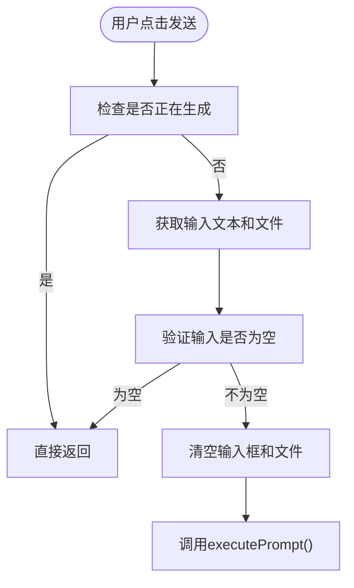
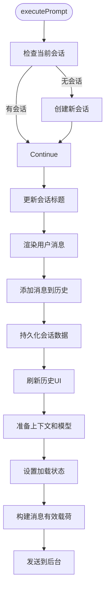
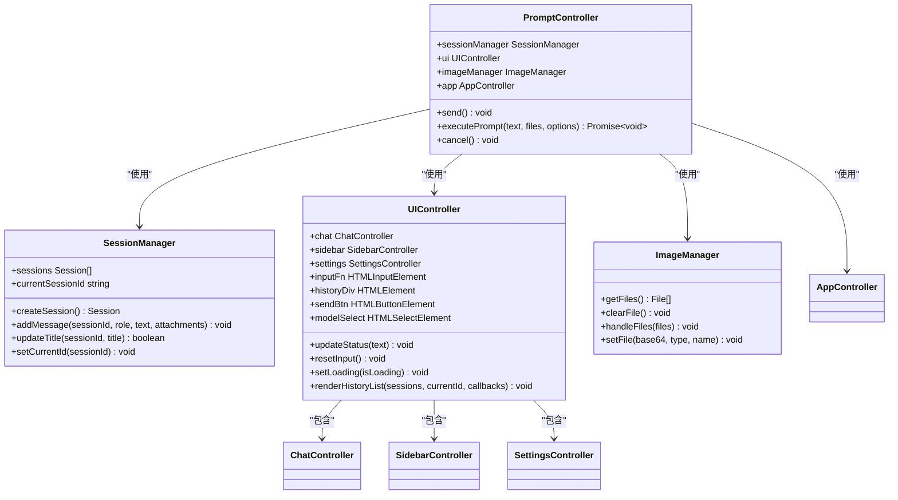
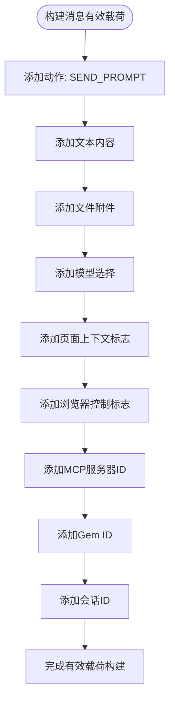
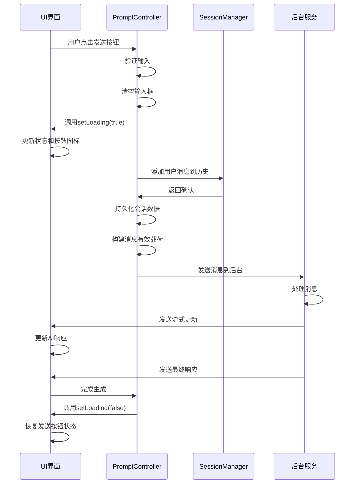
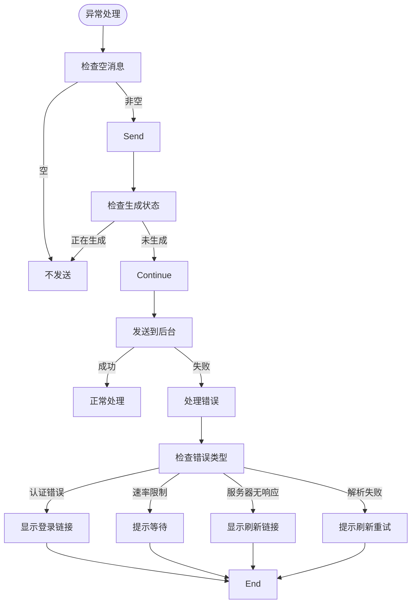
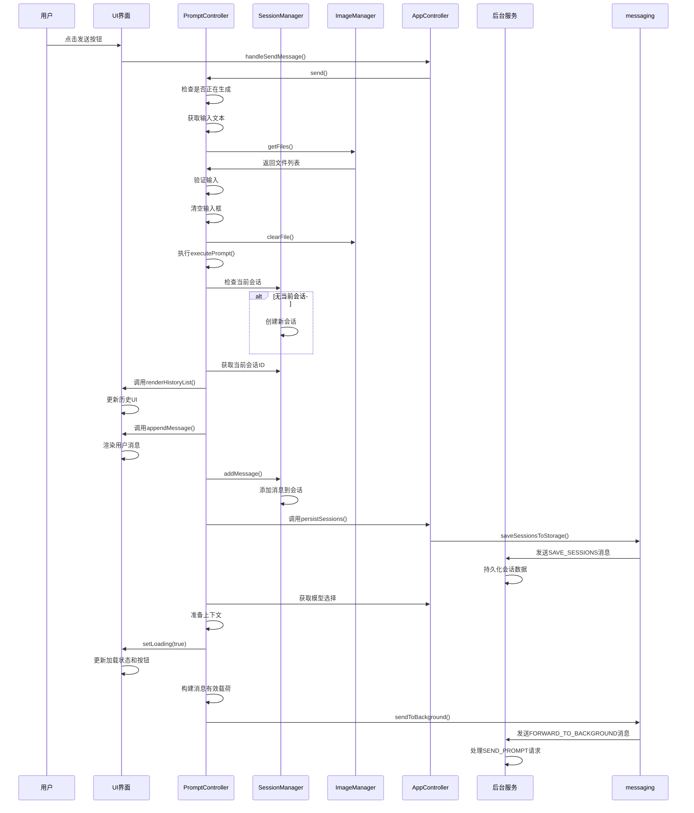

# 消息发送流程

<cite>
**本文档引用的文件**  
- [prompt.js](file://sandbox/controllers/prompt.js)
- [ui_controller.js](file://sandbox/ui/ui_controller.js)
- [chat.js](file://sandbox/ui/chat.js)
- [messaging.js](file://lib/messaging.js)
- [session_manager.js](file://background/managers/session_manager.js)
- [prompt_handler.js](file://background/handlers/session/prompt_handler.js)
- [builder.js](file://background/handlers/session/prompt/builder.js)
- [image_manager.js](file://background/managers/image_manager.js)
- [message.js](file://sandbox/render/message.js)
- [app_controller.js](file://sandbox/controllers/app_controller.js)
</cite>

## 目录
1. [简介](#简介)
2. [核心组件分析](#核心组件分析)
3. [消息发送流程详解](#消息发送流程详解)
4. [会话与消息历史管理](#会话与消息历史管理)
5. [消息有效载荷构建](#消息有效载荷构建)
6. [UI状态同步机制](#ui状态同步机制)
7. [异常处理与防护机制](#异常处理与防护机制)
8. [完整时序图](#完整时序图)
9. [结论](#结论)

## 简介
本文档详细说明了Gemini Nexus扩展中消息发送的完整流程。重点分析了`PromptController`如何处理用户输入和文件附件，`send()`方法的验证逻辑，`executePrompt()`中的会话管理、消息历史更新和UI状态同步，以及消息有效载荷的构建过程。文档还涵盖了会话数据持久化、UI加载状态更新和异常处理等关键机制。

## 核心组件分析

`PromptController`是消息发送流程的核心控制器，负责协调用户输入、会话管理、UI更新和后台通信。它通过依赖注入的方式与`sessionManager`、`uiController`、`imageManager`和`appController`等组件进行交互，确保消息发送过程的完整性和一致性。

**Section sources**
- [prompt.js](file://sandbox/controllers/prompt.js#L7-L13)

## 消息发送流程详解

### send()方法处理流程
`send()`方法是消息发送的入口点，负责处理用户点击发送按钮后的初始逻辑。该方法首先检查当前是否正在生成响应，以防止重复发送。然后获取用户输入的文本内容和已选择的文件附件，并进行空内容验证。如果文本和文件都为空，则直接返回，不进行后续处理。

**Diagram sources**
- [prompt.js](file://sandbox/controllers/prompt.js#L14-L32)

**Section sources**
- [prompt.js](file://sandbox/controllers/prompt.js#L14-L32)

### executePrompt()方法实现细节
`executePrompt()`方法是消息处理的核心，负责会话管理、消息历史更新和UI状态同步。当用户首次发送消息时，如果当前没有活动会话，该方法会创建一个新的会话。对于新会话，它会根据用户输入或默认标题更新会话标题。

该方法首先将用户消息渲染到聊天界面，然后通过`sessionManager.addMessage()`将消息添加到会话历史中。接着调用`saveSessionsToStorage()`将更新后的会话数据持久化到存储中，并通过`app.sessionFlow.refreshHistoryUI()`刷新历史记录UI。

**Diagram sources**
- [prompt.js](file://sandbox/controllers/prompt.js#L34-L103)

**Section sources**
- [prompt.js](file://sandbox/controllers/prompt.js#L34-L103)

## 会话与消息历史管理

会话管理是消息发送流程中的关键环节。`sessionManager`负责管理所有会话的创建、更新和删除。当用户发送消息时，`executePrompt()`方法会确保当前会话存在，并在必要时创建新会话。

消息历史记录通过`appendMessage()`函数在UI层面进行更新，同时通过`sessionManager.addMessage()`在数据层面进行记录。这种双重更新机制确保了UI显示和数据存储的一致性。会话数据的持久化通过`saveSessionsToStorage()`函数实现，该函数将完整的会话数组发送到后台进行存储。

**Diagram sources**
- [prompt.js](file://sandbox/controllers/prompt.js#L7-L115)
- [app_controller.js](file://sandbox/controllers/app_controller.js#L10-L36)
- [ui_controller.js](file://sandbox/ui/ui_controller.js#L8-L65)

**Section sources**
- [prompt.js](file://sandbox/controllers/prompt.js#L34-L73)
- [session_manager.js](file://background/managers/session_manager.js#L6-L285)

## 消息有效载荷构建

消息有效载荷的构建是消息发送流程中的关键步骤。`executePrompt()`方法在准备发送消息时，会构建一个包含所有必要信息的JSON对象。这个有效载荷包含了文本内容、文件附件、会话ID、模型选择和MCP工具配置等关键字段。

有效载荷的构建过程确保了所有相关信息都被正确传递到后台服务。文本内容和文件附件直接来自用户输入，会话ID来自当前活动会话，模型选择来自用户设置或默认值，MCP工具配置来自用户选择的MCP服务器。

**Diagram sources**
- [prompt.js](file://sandbox/controllers/prompt.js#L88-L98)

**Section sources**
- [prompt.js](file://sandbox/controllers/prompt.js#L88-L98)

## UI状态同步机制

UI状态同步是确保用户体验流畅的关键。`executePrompt()`方法通过调用`ui.setLoading(true)`来更新UI的加载状态，这会改变发送按钮的图标和状态，向用户反馈系统正在处理请求。

`setLoading()`方法的具体实现包括更新状态文本、切换发送按钮的图标（从发送图标变为停止图标）、添加生成中的CSS类等。这些视觉反馈帮助用户理解当前系统的状态，防止用户在消息生成过程中进行不必要的操作。

**Diagram sources**
- [prompt.js](file://sandbox/controllers/prompt.js#L86-L87)
- [chat.js](file://sandbox/ui/chat.js#L94-L117)

**Section sources**
- [prompt.js](file://sandbox/controllers/prompt.js#L86-L87)
- [chat.js](file://sandbox/ui/chat.js#L94-L117)

## 异常处理与防护机制

消息发送流程中包含了多种异常处理和防护机制。`send()`方法中的重复发送防护通过检查`app.isGenerating`标志来实现，防止用户在消息生成过程中多次点击发送按钮。

空消息验证机制确保只有包含文本或文件的消息才会被发送。此外，系统还处理了各种可能的异常情况，如网络错误、认证失败、速率限制等，并向用户提供相应的错误信息和解决方案。

**Diagram sources**
- [prompt.js](file://sandbox/controllers/prompt.js#L15-L21)
- [session_manager.js](file://background/managers/session_manager.js#L149-L198)

**Section sources**
- [prompt.js](file://sandbox/controllers/prompt.js#L15-L21)
- [session_manager.js](file://background/managers/session_manager.js#L149-L198)

## 完整时序图

以下时序图展示了从用户点击发送按钮到消息发送至后台服务的完整流程，包括所有关键步骤和组件交互。

**Diagram sources**
- [prompt.js](file://sandbox/controllers/prompt.js#L14-L103)
- [app_controller.js](file://sandbox/controllers/app_controller.js#L123-L125)
- [ui_controller.js](file://sandbox/ui/ui_controller.js#L47-L52)
- [messaging.js](file://lib/messaging.js#L4-L8)
- [session_manager.js](file://background/managers/session_manager.js#L21-L202)

## 结论
本文档详细分析了Gemini Nexus扩展中消息发送的完整流程。`PromptController`作为核心组件，协调了用户输入处理、会话管理、UI状态同步和后台通信等多个方面。通过`send()`和`executePrompt()`方法的配合，系统实现了从用户点击发送按钮到消息发送至后台服务的完整流程。

关键机制包括：输入验证防止空消息发送，会话管理确保消息历史的完整性，UI状态同步提供良好的用户体验，以及异常处理机制保障系统的稳定性。消息有效载荷的构建过程确保了所有必要信息都能正确传递到后台服务，为后续的消息处理奠定了基础。