# 消息流处理

<cite>
**本文档中引用的文件**  
- [builder.js](file://background/handlers/session/prompt/builder.js)
- [tool_executor.js](file://background/handlers/session/prompt/tool_executor.js)
- [prompt_handler.js](file://background/handlers/session/prompt_handler.js)
- [controller.js](file://content/toolbar/controller.js)
- [stream.js](file://content/toolbar/stream.js)
- [control_manager.js](file://background/managers/control_manager.js)
- [gemini_api.js](file://services/gemini_api.js)
- [session_manager.js](file://background/managers/session_manager.js)
- [renderer.js](file://content/toolbar/ui/renderer.js)
- [parser.js](file://services/parser.js)
- [utils.js](file://background/handlers/session/utils.js)
- [session.js](file://background/handlers/session.js)
</cite>

## 目录
1. [简介](#简介)
2. [消息处理流程总览](#消息处理流程总览)
3. [用户输入与请求构建](#用户输入与请求构建)
4. [流式响应处理机制](#流式响应处理机制)
5. [自动化反馈循环](#自动化反馈循环)
6. [错误处理与重试策略](#错误处理与重试策略)
7. [UI中的流式渲染](#ui中的流式渲染)
8. [消息附件处理](#消息附件处理)
9. [MCP工具调用处理](#mcp工具调用处理)
10. [结论](#结论)

## 简介
本文件详细说明了从用户输入到AI响应的完整消息处理流程。系统通过前端工具栏收集用户输入和附件，构建请求发送至Gemini API，并通过流式更新机制实时处理响应。自动化反馈循环允许工具执行结果作为新输入反馈给模型，实现多步推理。整个流程包含完善的错误处理机制和重试策略，确保在各种异常情况下仍能提供稳定服务。

## 消息处理流程总览
消息流处理系统由前端内容脚本和后台服务共同构成，实现从用户输入到AI响应的完整闭环。系统采用流式架构，支持实时更新和多轮交互。

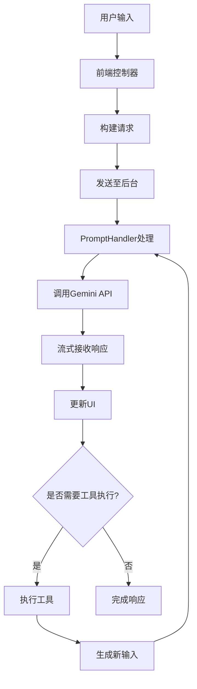

**Diagram sources**
- [controller.js](file://content/toolbar/controller.js#L1-L301)
- [prompt_handler.js](file://background/handlers/session/prompt_handler.js#L1-L103)

**Section sources**
- [controller.js](file://content/toolbar/controller.js#L1-L301)
- [prompt_handler.js](file://background/handlers/session/prompt_handler.js#L1-L103)

## 用户输入与请求构建
PromptController负责收集用户输入和附件，并构建完整的发送请求。系统支持多种输入模式，包括普通文本、网页上下文和截图输入。

### 输入收集机制
前端控制器通过多种方式收集用户输入：
- 文本选择：用户选择网页文本时自动显示工具栏
- 全局输入：通过右键菜单启动全局输入框
- 截图输入：支持OCR、翻译和截图问答等模式

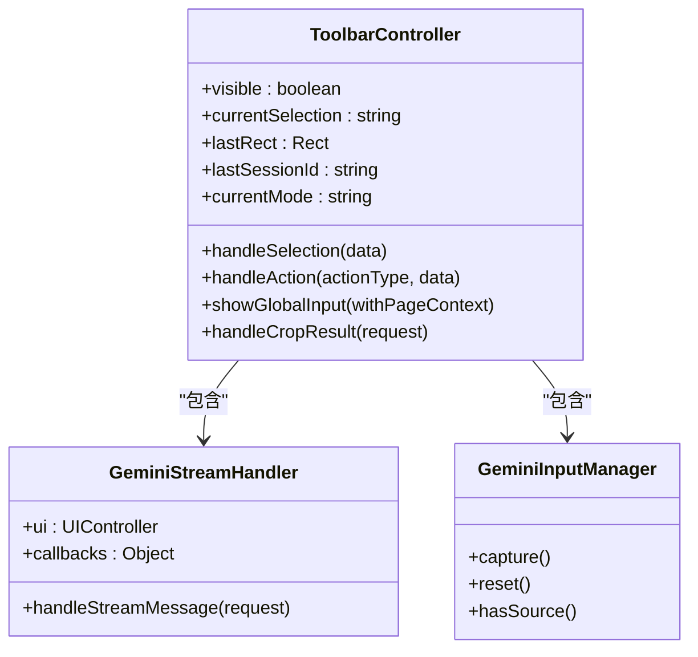

**Diagram sources**
- [controller.js](file://content/toolbar/controller.js#L1-L301)

**Section sources**
- [controller.js](file://content/toolbar/controller.js#L1-L301)

### 请求构建过程
PromptBuilder负责构建最终发送给AI的请求，包含系统前言和用户输入。

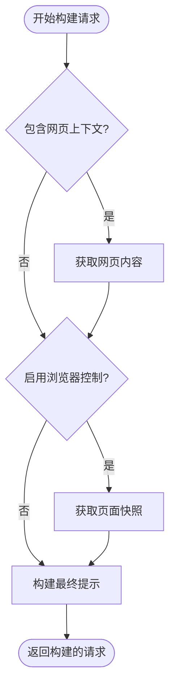

**Diagram sources**
- [builder.js](file://background/handlers/session/prompt/builder.js#L1-L45)

**Section sources**
- [builder.js](file://background/handlers/session/prompt/builder.js#L1-L45)

## 流式响应处理机制
系统通过流式更新机制处理Gemini API的响应，实现实时内容更新和思考过程展示。

### 后台处理流程
PromptHandler在后台处理Gemini API的流式响应，通过消息机制更新UI。

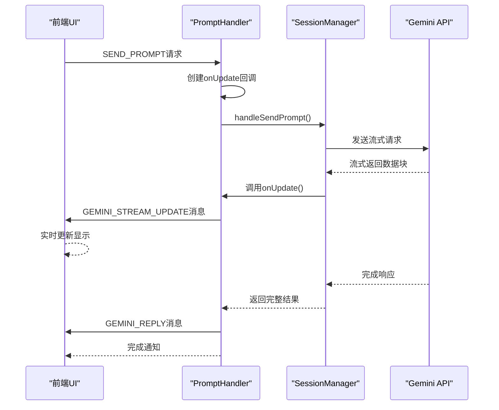

**Diagram sources**
- [prompt_handler.js](file://background/handlers/session/prompt_handler.js#L1-L103)
- [gemini_api.js](file://services/gemini_api.js#L1-L230)

**Section sources**
- [prompt_handler.js](file://background/handlers/session/prompt_handler.js#L1-L103)
- [gemini_api.js](file://services/gemini_api.js#L1-L230)

### 响应解析机制
系统通过parser.js解析Gemini API返回的流式数据，提取文本、思考过程和生成的图像。

```mermaid
flowchart TD
A[原始数据行] --> B{是否包含")]}''"?}
B --> |是| C[去除前缀]
B --> |否| D[直接处理]
C --> E[JSON解析]
D --> E
E --> F{是否为有效数组?}
F --> |否| G[返回null]
F --> |是| H[遍历查找有效载荷]
H --> I[提取文本内容]
H --> J[提取思考过程]
H --> K[递归查找生成图像]
I --> L[返回解析结果]
J --> L
K --> L
```

**Diagram sources**
- [parser.js](file://services/parser.js#L1-L157)

**Section sources**
- [parser.js](file://services/parser.js#L1-L157)

## 自动化反馈循环
系统实现了自动化反馈循环，允许工具执行结果作为新输入反馈给模型，实现多步推理和复杂任务处理。

### 反馈循环工作原理
自动化反馈循环通过多轮迭代处理实现复杂任务的自动执行。

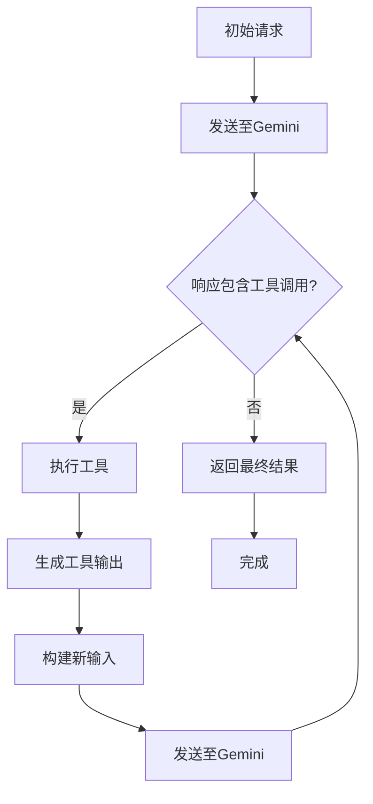

**Diagram sources**
- [prompt_handler.js](file://background/handlers/session/prompt_handler.js#L1-L103)

**Section sources**
- [prompt_handler.js](file://background/handlers/session/prompt_handler.js#L1-L103)

### 工具执行机制
ToolExecutor负责执行工具调用，并将结果格式化为新的输入。

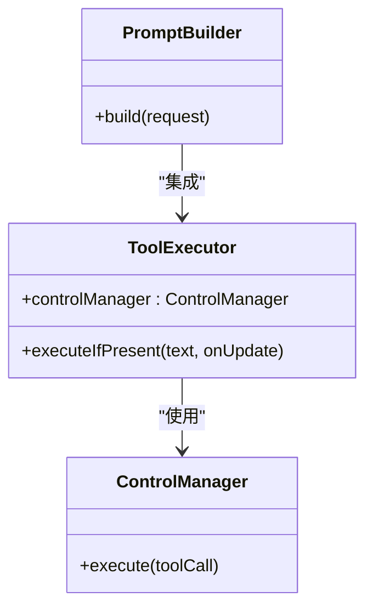

**Diagram sources**
- [tool_executor.js](file://background/handlers/session/prompt/tool_executor.js#L1-L49)
- [control_manager.js](file://background/managers/control_manager.js#L1-L159)

**Section sources**
- [tool_executor.js](file://background/handlers/session/prompt/tool_executor.js#L1-L49)
- [control_manager.js](file://background/managers/control_manager.js#L1-L159)

## 错误处理与重试策略
系统实现了完善的错误处理机制，在网络中断或认证失败时能够自动重试。

### 错误处理流程
系统在多个层级实现了错误处理和恢复机制。

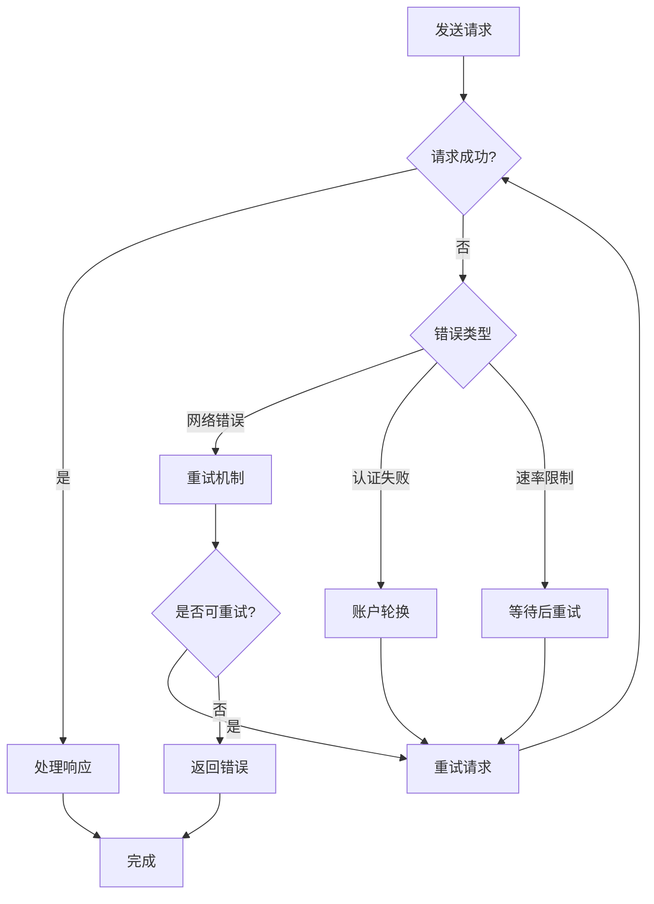

**Diagram sources**
- [session_manager.js](file://background/managers/session_manager.js#L1-L285)

**Section sources**
- [session_manager.js](file://background/managers/session_manager.js#L1-L285)

### 重试策略实现
SessionManager实现了智能重试策略，根据错误类型采取不同恢复措施。

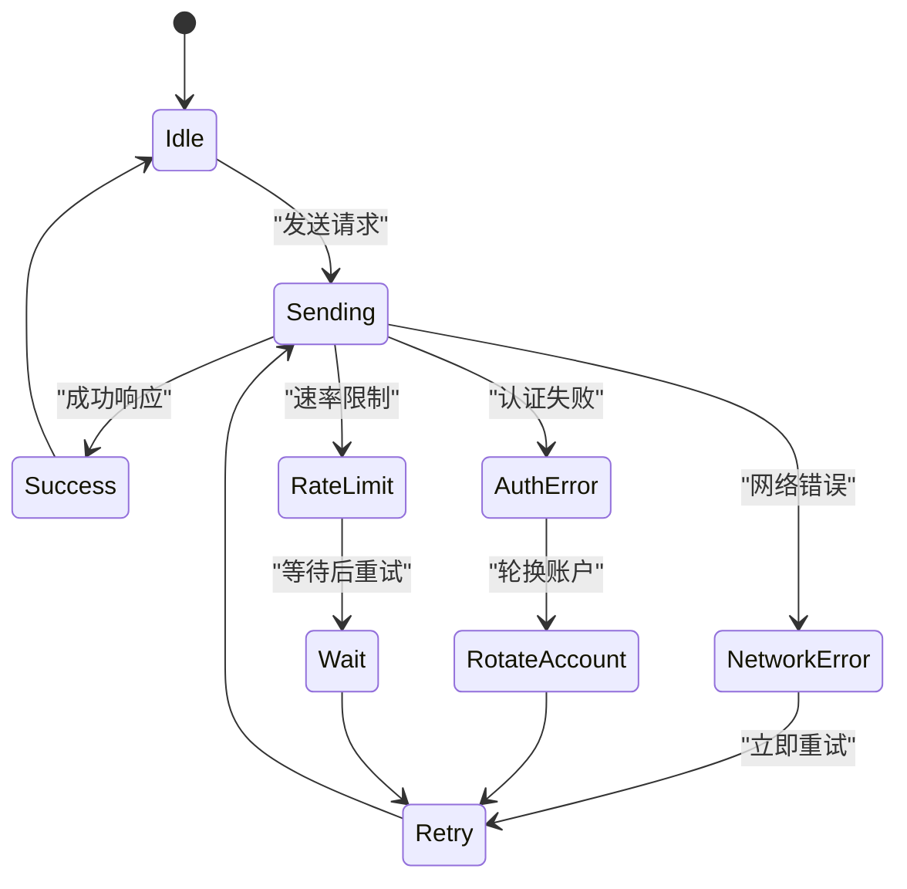

**Diagram sources**
- [session_manager.js](file://background/managers/session_manager.js#L1-L285)

**Section sources**
- [session_manager.js](file://background/managers/session_manager.js#L1-L285)

## UI中的流式渲染
系统在UI中实现了流式渲染，支持部分文本更新和思考过程展示。

### 渲染流程
前端通过StreamHandler接收流式更新，并实时渲染到UI中。

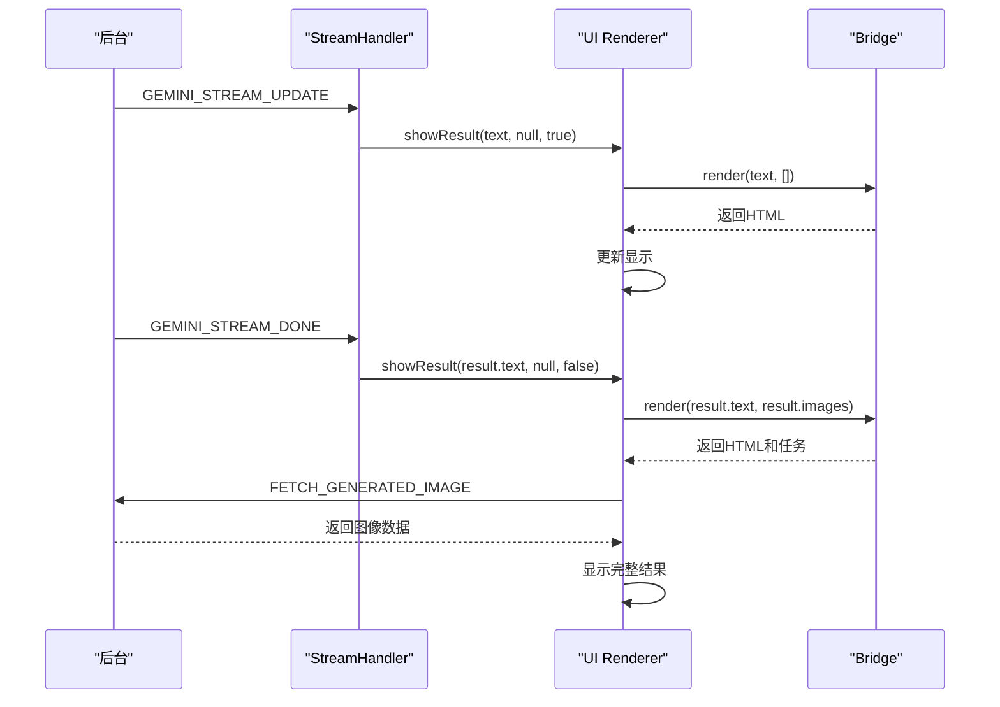

**Diagram sources**
- [stream.js](file://content/toolbar/stream.js#L1-L49)
- [renderer.js](file://content/toolbar/ui/renderer.js#L1-L87)

**Section sources**
- [stream.js](file://content/toolbar/stream.js#L1-L49)
- [renderer.js](file://content/toolbar/ui/renderer.js#L1-L87)

## 消息附件处理
系统支持消息附件的传输和处理，包括图像和其他文件类型。

### 附件传输流程
附件通过上传服务进行处理，并在请求中引用。

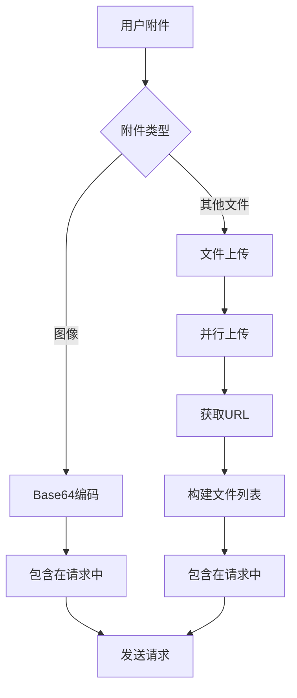

**Diagram sources**
- [gemini_api.js](file://services/gemini_api.js#L1-L230)

**Section sources**
- [gemini_api.js](file://services/gemini_api.js#L1-L230)

## MCP工具调用处理
MCP工具调用与普通对话消息有不同的处理方式，支持更复杂的交互。

### MCP处理机制
MCP工具调用通过专门的管理器进行处理。

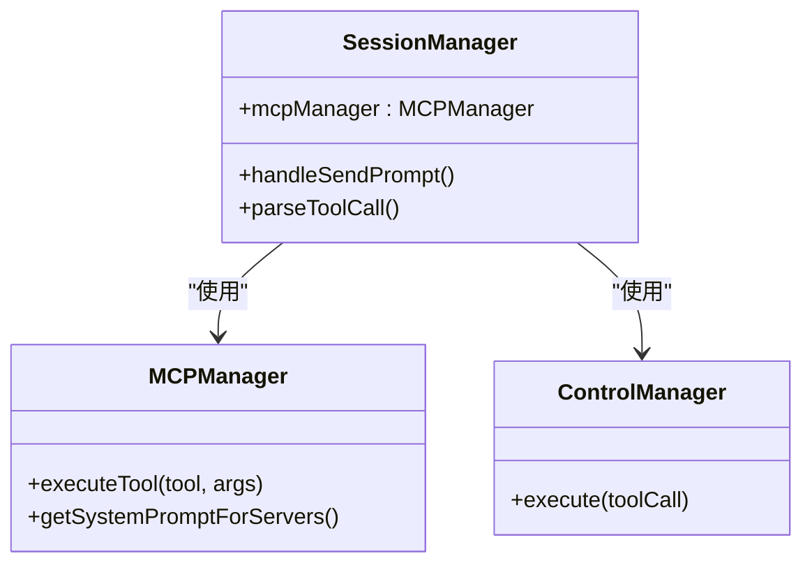

**Diagram sources**
- [session_manager.js](file://background/managers/session_manager.js#L1-L285)
- [control_manager.js](file://background/managers/control_manager.js#L1-L159)

**Section sources**
- [session_manager.js](file://background/managers/session_manager.js#L1-L285)
- [control_manager.js](file://background/managers/control_manager.js#L1-L159)

## 结论
本系统实现了完整的消息流处理功能，从用户输入收集、请求构建、流式响应处理到自动化反馈循环，形成了一个高效、稳定的AI交互系统。通过流式架构和智能错误处理机制，系统能够提供实时、可靠的AI服务。未来可进一步优化工具调用的并发处理和附件传输效率。