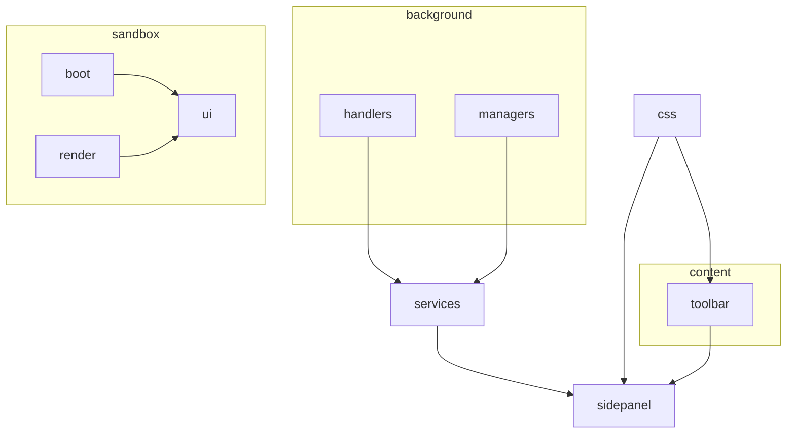
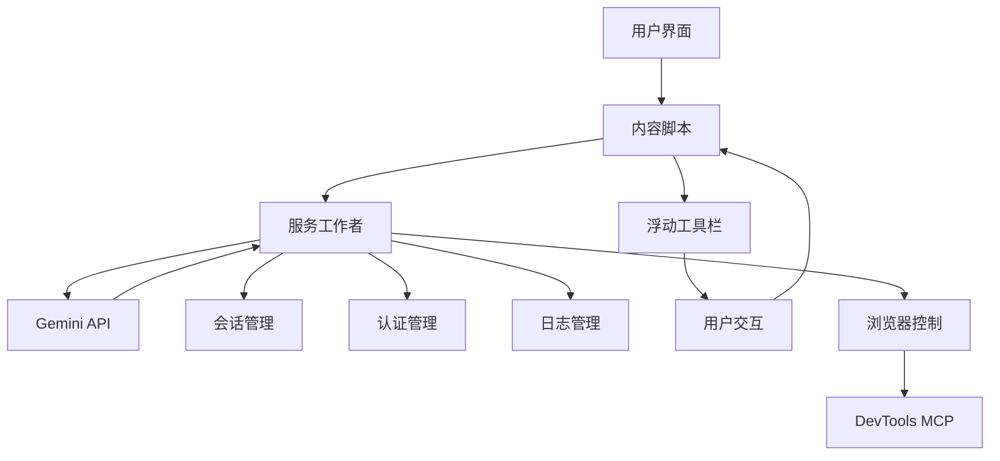
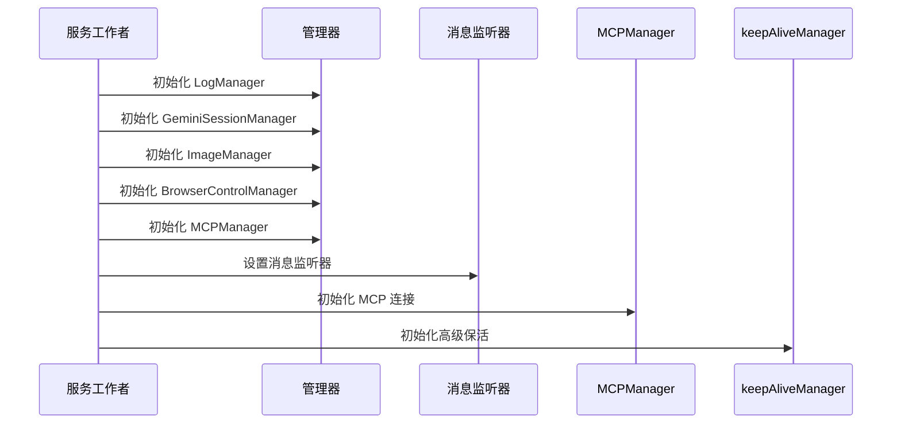
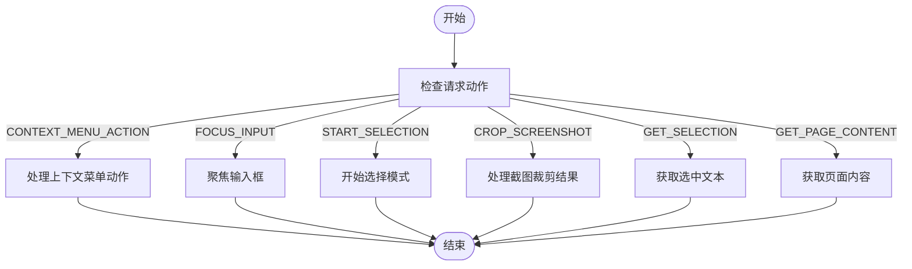
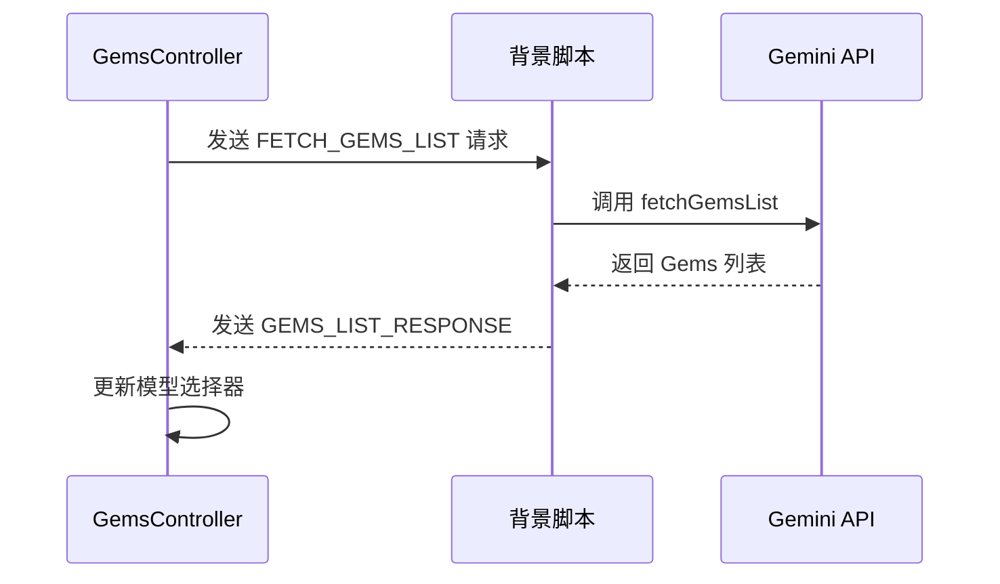
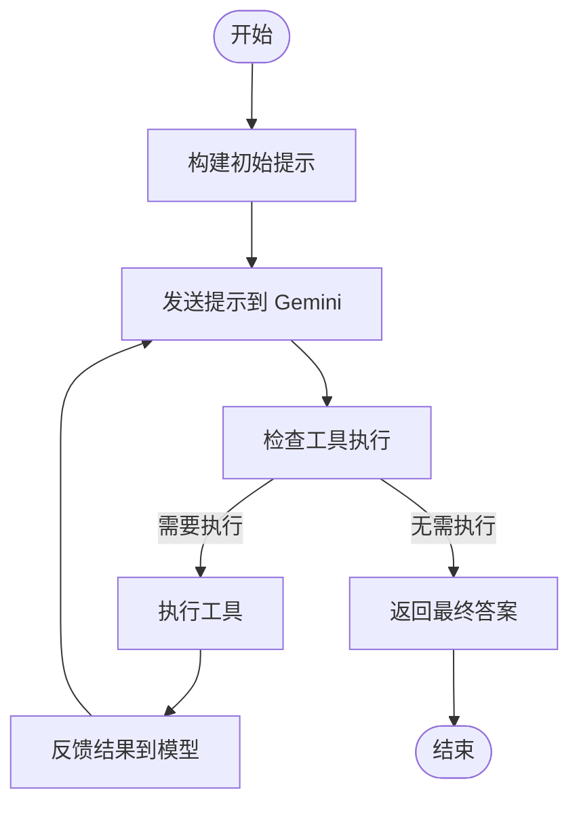
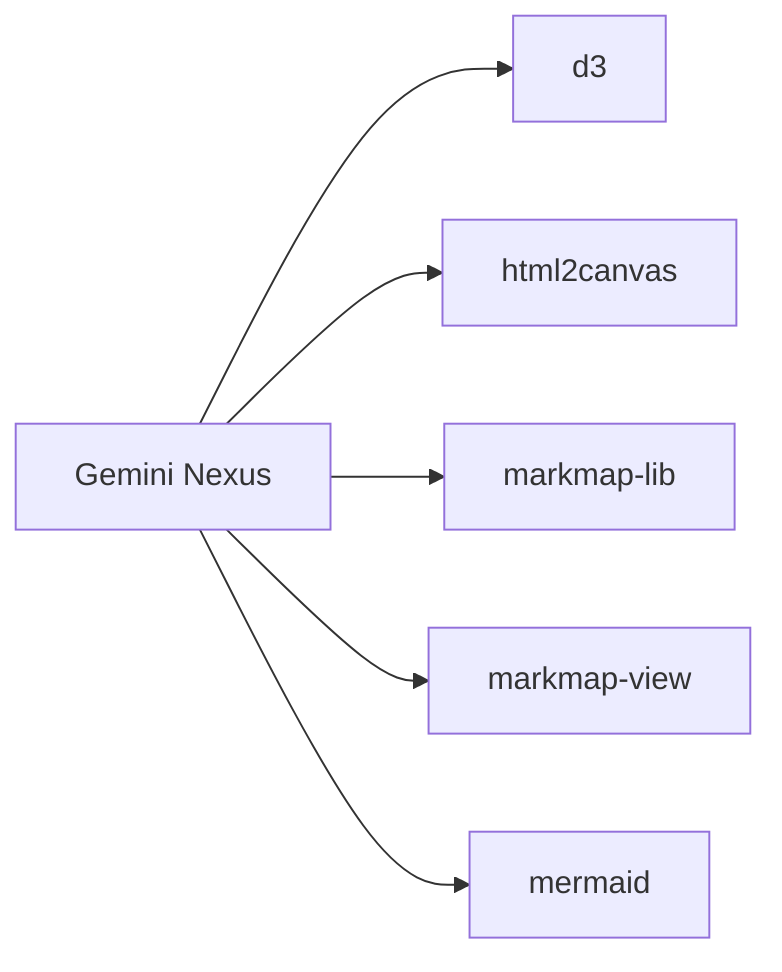

# Google Gems 集成

<cite>
**本文档中引用的文件**  
- [README.md](file://README.md)
- [manifest.json](file://manifest.json)
- [package.json](file://package.json)
- [background/index.js](file://background/index.js)
- [content/index.js](file://content/index.js)
- [sandbox/index.js](file://sandbox/index.js)
- [services/gems.js](file://services/gems.js)
- [services/gemini_api.js](file://services/gemini_api.js)
- [background/managers/session_manager.js](file://background/managers/session_manager.js)
- [background/managers/control_manager.js](file://background/managers/control_manager.js)
- [background/managers/mcp_manager.js](file://background/managers/mcp_manager.js)
- [content/toolbar/controller.js](file://content/toolbar/controller.js)
- [background/handlers/session/prompt_handler.js](file://background/handlers/session/prompt_handler.js)
- [background/messages.js](file://background/messages.js)
- [sandbox/controllers/gems_controller.js](file://sandbox/controllers/gems_controller.js)
- [content/toolbar/ui/manager.js](file://content/toolbar/ui/manager.js)
</cite>

## 目录
1. [简介](#简介)
2. [项目结构](#项目结构)
3. [核心组件](#核心组件)
4. [架构概述](#架构概述)
5. [详细组件分析](#详细组件分析)
6. [依赖分析](#依赖分析)
7. [性能考虑](#性能考虑)
8. [故障排除指南](#故障排除指南)
9. [结论](#结论)

## 简介

Gemini Nexus 是一款强大的 AI 助手 Chrome 扩展，由 Google Gemini 驱动。该扩展提供了一系列功能，包括侧边栏对话、智能总结、图像分析、文本选中工具、浏览器控制、会话管理、深色/浅色主题以及中英双语支持。用户可以通过快捷键或右键菜单快速访问这些功能。扩展通过与 Gemini API 交互，利用 Google 的 AI 模型来处理用户请求，并支持多账号切换和工具开关配置。

**本节来源**  
- [README.md](file://README.md)

## 项目结构

Gemini Nexus 项目具有清晰的模块化结构，主要分为以下几个部分：

- **background/**: 包含服务工作者（Service Worker）的代码，负责 API 调用和会话管理。
- **content/**: 包含内容脚本（Content Scripts），用于在网页上显示浮动工具栏。
- **sandbox/**: 包含沙盒环境，用于 Markdown 渲染。
- **sidepanel/**: 包含侧边栏主界面。
- **services/**: 包含与 Gemini API 交互的服务。
- **css/**: 包含样式文件。

这种结构使得代码组织清晰，便于维护和扩展。

**图表来源**  
- [README.md](file://README.md)

**本节来源**  
- [README.md](file://README.md)

## 核心组件

Gemini Nexus 的核心组件包括服务工作者、内容脚本、沙盒环境和侧边栏界面。这些组件协同工作，为用户提供无缝的 AI 交互体验。

**本节来源**  
- [README.md](file://README.md)
- [manifest.json](file://manifest.json)

## 架构概述

Gemini Nexus 的架构设计旨在提供高效、可扩展的 AI 助手功能。系统架构包括前端用户界面、后端服务和外部 API 交互。

**图表来源**  
- [manifest.json](file://manifest.json)
- [background/index.js](file://background/index.js)

## 详细组件分析

### 服务工作者分析

服务工作者是 Gemini Nexus 的核心，负责处理所有后台任务，包括 API 调用、会话管理和消息监听。

#### 服务工作者初始化

**图表来源**  
- [background/index.js](file://background/index.js)

**本节来源**  
- [background/index.js](file://background/index.js)

### 内容脚本分析

内容脚本负责在网页上注入浮动工具栏，并处理用户交互。

#### 内容脚本消息处理

**图表来源**  
- [content/index.js](file://content/index.js)

**本节来源**  
- [content/index.js](file://content/index.js)

### Google Gems 集成分析

Google Gems 集成是 Gemini Nexus 的关键功能之一，允许用户访问和使用 Google Gems。

#### Gems 列表获取流程

**图表来源**  
- [services/gems.js](file://services/gems.js)
- [sandbox/controllers/gems_controller.js](file://sandbox/controllers/gems_controller.js)

**本节来源**  
- [services/gems.js](file://services/gems.js)
- [sandbox/controllers/gems_controller.js](file://sandbox/controllers/gems_controller.js)

### 会话管理分析

会话管理器负责处理与 Gemini 的会话，包括发送提示、处理响应和管理上下文。

#### 会话处理流程

**图表来源**  
- [background/handlers/session/prompt_handler.js](file://background/handlers/session/prompt_handler.js)

**本节来源**  
- [background/handlers/session/prompt_handler.js](file://background/handlers/session/prompt_handler.js)

## 依赖分析

Gemini Nexus 依赖于多个外部库和服务，包括 d3、html2canvas、markmap-lib、markmap-view 和 mermaid。这些依赖项在 package.json 文件中定义。

**图表来源**  
- [package.json](file://package.json)

**本节来源**  
- [package.json](file://package.json)

## 性能考虑

Gemini Nexus 在设计时考虑了性能优化，例如使用缓存来避免重复获取 Gems 列表，以及使用异步操作来提高响应速度。此外，扩展还实现了高级保活机制，以确保长时间运行的会话不会中断。

## 故障排除指南

如果遇到问题，可以参考以下步骤进行排查：

1. 确保已在 [gemini.google.com](https://gemini.google.com) 登录 Google 账号。
2. 检查扩展是否已正确加载。
3. 查看日志以获取错误信息。
4. 尝试刷新 Gemini 页面后重试。

**本节来源**  
- [README.md](file://README.md)

## 结论

Gemini Nexus 是一款功能强大且设计精良的 Chrome 扩展，通过集成 Google Gems 提供了丰富的 AI 助手功能。其模块化架构和清晰的代码组织使得维护和扩展变得容易。未来可以进一步优化性能，并增加更多实用功能。