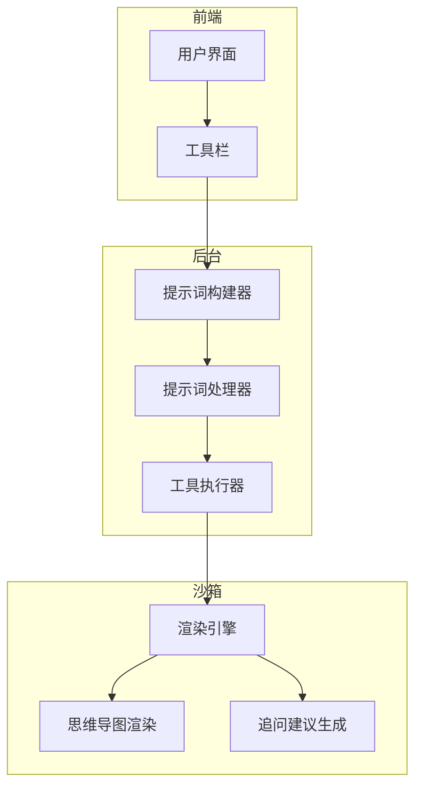
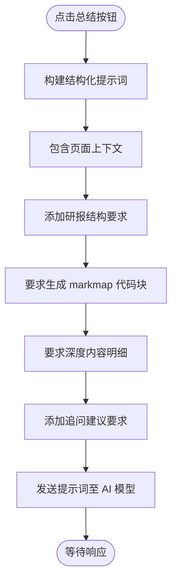
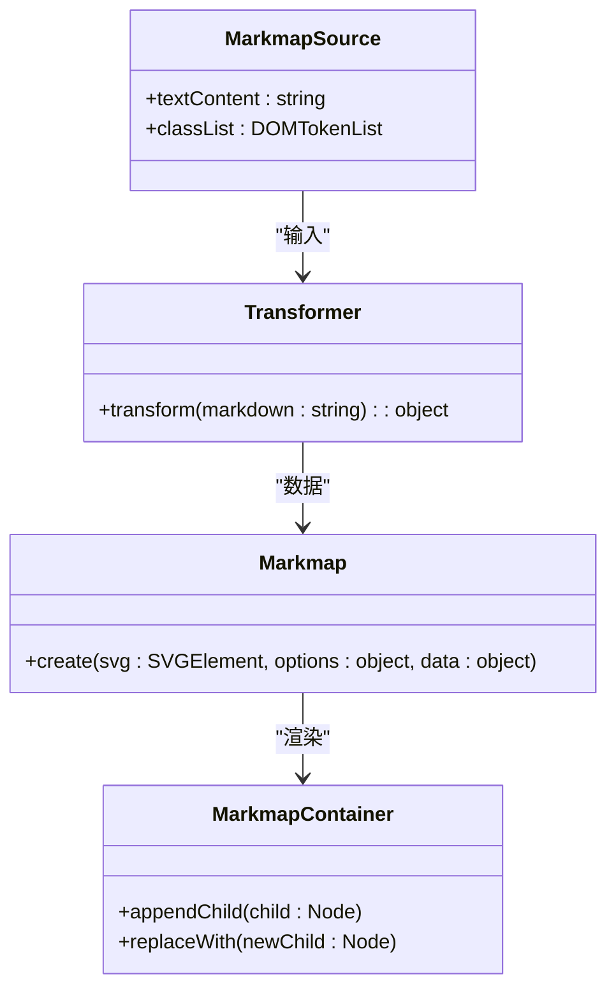
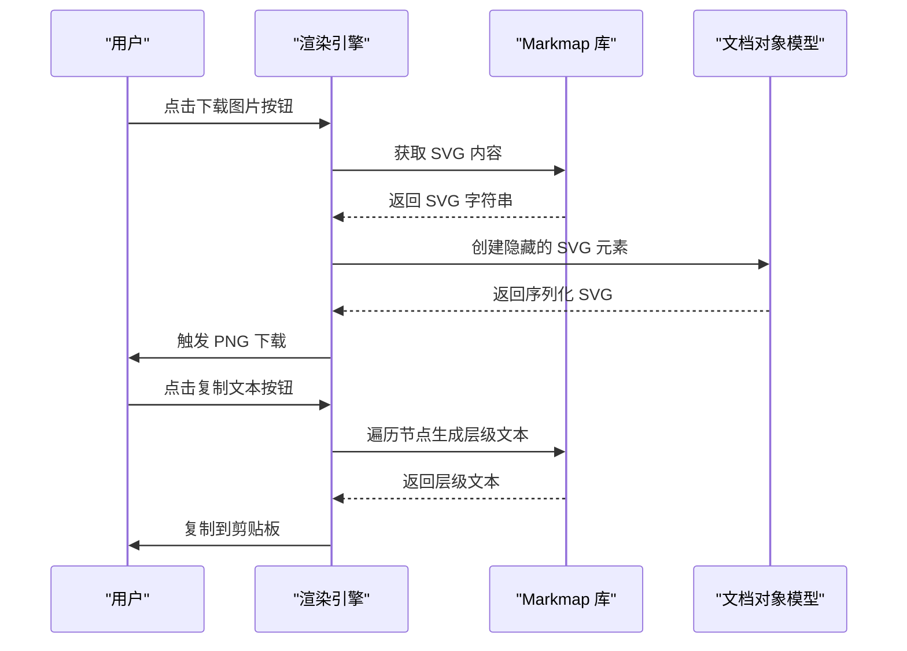
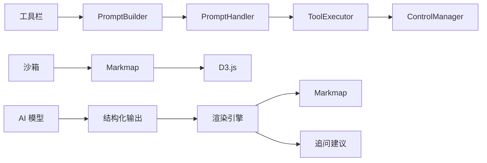

# 内容理解

<cite>
**本文档引用的文件**
- [builder.js](file://background/handlers/session/prompt/builder.js)
- [preamble.js](file://background/handlers/session/prompt/preamble.js)
- [tool_executor.js](file://background/handlers/session/prompt/tool_executor.js)
- [prompt_handler.js](file://background/handlers/session/prompt_handler.js)
- [context_handler.js](file://background/handlers/session/context_handler.js)
- [actions.js](file://content/toolbar/actions.js)
- [renderer.js](file://content/toolbar/ui/renderer.js)
- [markmap-loader.js](file://sandbox/libs/markmap-loader.js)
- [message.js](file://sandbox/render/message.js)
- [events.js](file://sandbox/boot/events.js)
- [footer.js](file://sandbox/ui/templates/footer.js)
- [content.js](file://sandbox/render/content.js)
- [code_copy.js](file://content/toolbar/ui/code_copy.js)
- [parser.js](file://services/parser.js)
</cite>

## 目录
1. [简介](#简介)
2. [项目结构](#项目结构)
3. [核心组件](#核心组件)
4. [架构概述](#架构概述)
5. [详细组件分析](#详细组件分析)
6. [依赖分析](#依赖分析)
7. [性能考虑](#性能考虑)
8. [故障排除指南](#故障排除指南)
9. [结论](#结论)

## 简介
本功能文档全面覆盖了智能总结与思维导图生成的工作流程。系统通过点击“总结”按钮触发，能够自动生成结构化研报提示词，包含核心摘要、知识脑图（markmap）和深度内容明细。系统利用 markmap-lib 将 Markdown 代码块渲染为交互式思维导图，并支持用户复制文本或下载为图片。此外，在回答末尾会生成三个追问建议问题，帮助用户深入探索内容。该功能适用于技术文章、新闻页面等多种场景。

## 项目结构
项目结构清晰地划分为多个模块，包括 background（后台逻辑）、content（内容脚本）、sandbox（沙箱环境）、services（服务接口）等。核心功能分布在这些模块中，实现了从用户交互到内容处理的完整流程。

**Section sources**
- [builder.js](file://background/handlers/session/prompt/builder.js)
- [actions.js](file://content/toolbar/actions.js)

## 核心组件
核心组件包括 PromptBuilder、PromptHandler、ToolExecutor 和 Markmap 渲染引擎。这些组件协同工作，实现从用户请求到结构化输出的全过程。

**Section sources**
- [builder.js](file://background/handlers/session/prompt/builder.js#L5-L43)
- [prompt_handler.js](file://background/handlers/session/prompt_handler.js#L6-L102)
- [tool_executor.js](file://background/handlers/session/tool_executor.js#L4-L48)

## 架构概述
系统采用分层架构，前端通过工具栏触发请求，后台处理器构建提示词并调用 AI 模型，沙箱环境负责渲染结果，包括思维导图和追问建议。

**Diagram sources**
- [events.js](file://sandbox/boot/events.js#L36-L101)
- [prompt_handler.js](file://background/handlers/session/prompt_handler.js#L13-L102)

## 详细组件分析

### 智能总结功能分析
当用户点击“总结”按钮时，系统会触发一个预设的提示词模板，要求 AI 模型按照特定格式输出结构化研报。

#### 提示词生成逻辑

**Diagram sources**
- [events.js](file://sandbox/boot/events.js#L43-L94)

#### 知识脑图生成流程
系统要求 AI 模型生成符合 markmap 格式的 Markdown 代码块，该代码块随后被渲染为交互式思维导图。

**Diagram sources**
- [message.js](file://sandbox/render/message.js#L334-L518)
- [markmap-loader.js](file://sandbox/libs/markmap-loader.js#L16-L48)

### 交互式思维导图渲染
markmap-lib 负责将 Markdown 代码块渲染为可交互的思维导图，支持缩放、展开/折叠节点等操作。

#### 渲染与交互功能

**Diagram sources**
- [message.js](file://sandbox/render/message.js#L419-L507)
- [code_copy.js](file://content/toolbar/ui/code_copy.js#L6-L28)

## 依赖分析
系统依赖多个外部库和内部模块，形成复杂的依赖网络。

**Diagram sources**
- [go.mod](file://go.mod#L1-L20)
- [package.json](file://package.json#L1-L10)

**Section sources**
- [markmap-loader.js](file://sandbox/libs/markmap-loader.js#L32-L38)
- [prompt_handler.js](file://background/handlers/session/prompt_handler.js#L9-L11)

## 性能考虑
系统在性能方面进行了优化，确保快速响应和流畅体验。通过异步加载 markmap 库、缓存已加载资源、分步渲染等方式提升性能。

## 故障排除指南
常见问题包括思维导图无法显示、追问建议未生成等。可通过检查网络连接、确认 markmap 库加载状态、验证 AI 模型输出格式等方式进行排查。

**Section sources**
- [markmap-loader.js](file://sandbox/libs/markmap-loader.js#L46-L48)
- [parser.js](file://services/parser.js#L152-L155)

## 结论
本系统实现了高效的内容理解功能，通过结构化提示词引导 AI 生成高质量的研报，并利用 markmap-lib 提供直观的可视化体验。用户可以轻松复制或下载思维导图，同时获得有价值的追问建议，极大地提升了信息获取效率。