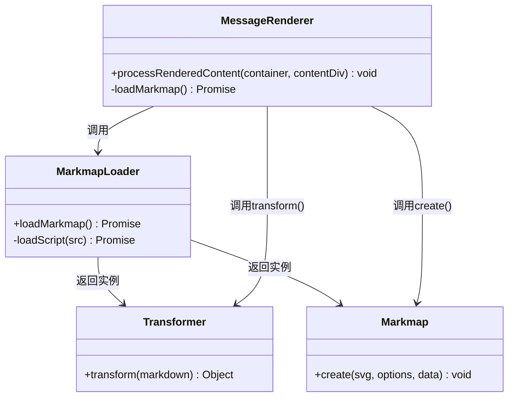
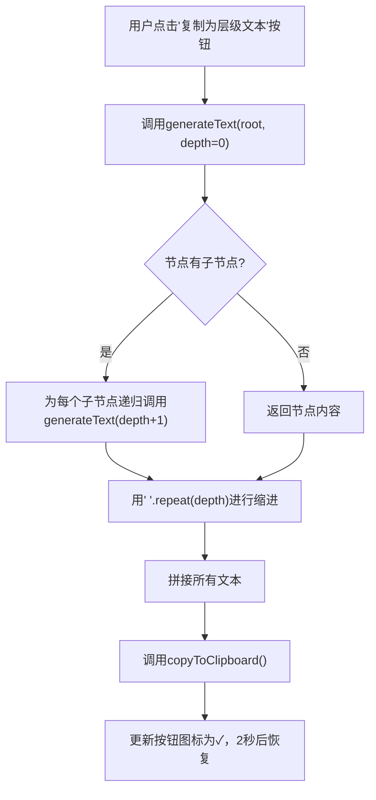

# 思维导图渲染

<cite>
**本文档引用的文件**  
- [events.js](file://sandbox/boot/events.js)
- [message.js](file://sandbox/render/message.js)
- [markmap-loader.js](file://sandbox/libs/markmap-loader.js)
- [content.js](file://sandbox/render/content.js)
- [pipeline.js](file://sandbox/render/pipeline.js)
- [config.js](file://sandbox/render/config.js)
- [clipboard.js](file://sandbox/render/clipboard.js)
- [base.css](file://css/base.css)
- [chat.css](file://css/chat.css)
- [theme_init.js](file://sandbox/theme_init.js)
</cite>

## 目录
1. [简介](#简介)
2. [核心组件](#核心组件)
3. [事件监听与渲染触发](#事件监听与渲染触发)
4. [Markmap 数据结构构建](#markmap-数据结构构建)
5. [用户交互功能实现](#用户交互功能实现)
6. [样式与主题定制](#样式与主题定制)
7. [异常诊断与修复](#异常诊断与修复)

## 简介
本技术文档详细阐述了系统如何将 AI 响应中的 Markdown 代码块识别并转换为交互式知识脑图。文档深入分析了从事件监听、内容解析、动态渲染到用户交互的完整流程，重点说明了 `markmap-lib` 库的集成机制与 `sandbox/boot/events.js` 和 `sandbox/render/message.js` 两个核心模块的协作方式。同时，文档还涵盖了用户交互功能的实现路径以及常见渲染异常的诊断与修复方案。

## 核心组件

该功能由多个核心组件协同工作，共同完成从文本到可视化脑图的转换。

**Section sources**
- [events.js](file://sandbox/boot/events.js#L1-L296)
- [message.js](file://sandbox/render/message.js#L1-L657)
- [markmap-loader.js](file://sandbox/libs/markmap-loader.js#L1-L50)

## 事件监听与渲染触发

系统的思维导图渲染流程由 `sandbox/boot/events.js` 文件中的事件监听机制启动。当用户点击“总结”按钮时，系统会触发一个预设的提示词（prompt），该提示词明确要求 AI 生成一个包含 `markmap` 代码块的响应。

```mermaid
sequenceDiagram
participant 用户 as 用户
participant UI as UI界面
participant Events as events.js
participant Message as message.js
participant MarkmapLoader as markmap-loader.js
用户->>UI : 点击"总结"按钮
UI->>Events : 触发点击事件
Events->>Events : 构造包含markmap格式要求的prompt
Events->>Message : 调用app.prompt.executePrompt()发送请求
Message->>Message : 接收AI返回的包含
```markmap```代码块的响应
    Message->>Message: 调用processRenderedContent()处理内容
    Message->>MarkmapLoader: 调用loadMarkmap()加载外部库
    MarkmapLoader->>MarkmapLoader: 动态加载d3.js、markmap-view.js和markmap-lib.js
    MarkmapLoader-->>Message: 返回Transformer和Markmap实例
    Message->>Message: 使用Transformer解析Markdown，生成树状数据
    Message->>Message: 创建SVG容器并调用Markmap.create()渲染脑图
```

**Diagram sources**
- [events.js](file://sandbox/boot/events.js#L38-L101)
- [message.js](file://sandbox/render/message.js#L331-L526)
- [markmap-loader.js](file://sandbox/libs/markmap-loader.js#L16-L49)

**Section sources**
- [events.js](file://sandbox/boot/events.js#L38-L101)
- [message.js](file://sandbox/render/message.js#L331-L526)

## Markmap 数据结构构建

当 `message.js` 中的 `processRenderedContent` 函数被调用时，它会首先查找所有带有 `.markmap-source` 类且未被处理过的代码块。找到后，它会立即通过添加 `processed-markmap` 类来标记它们，防止重复处理。

随后，系统调用 `loadMarkmap()` 函数（来自 `markmap-loader.js`）来异步加载 `d3.js`、`markmap-view.js` 和 `markmap-lib.js` 这三个必要的外部库。一旦加载成功，系统将获得 `Transformer` 和 `Markmap` 两个核心类。

`Transformer` 类负责将 `markmap` 代码块内的 Markdown 文本解析成一个包含 `root` 节点的树状数据结构。此数据结构是后续可视化的基础。



**Diagram sources**
- [message.js](file://sandbox/render/message.js#L341-L350)
- [markmap-loader.js](file://sandbox/libs/markmap-loader.js#L16-L49)

**Section sources**
- [message.js](file://sandbox/render/message.js#L336-L350)
- [markmap-loader.js](file://sandbox/libs/markmap-loader.js#L16-L49)

## 用户交互功能实现

渲染出的思维导图提供了丰富的用户交互功能，这些功能通过在 SVG 容器上叠加一个工具栏来实现。

### 点击节点展开/收起
`markmap` 库本身基于 `d3.js` 实现了节点的交互逻辑。当用户点击一个非叶子节点时，`markmap` 会自动处理其子节点的展开或收起动画，无需额外的代码干预。

### 文本复制
系统提供了一个“复制为层级文本”的按钮。当用户点击此按钮时，系统会遍历 `markmap` 的 `root` 数据结构，递归地生成一个带有缩进的纯文本字符串。该字符串通过 `copyToClipboard` 函数（来自 `clipboard.js`）复制到系统剪贴板。



**Diagram sources**
- [message.js](file://sandbox/render/message.js#L465-L507)
- [clipboard.js](file://sandbox/render/clipboard.js#L4-L43)

### 导出为PNG/SVG图像
- **导出为PNG**：当用户点击“下载为PNG”按钮时，系统会克隆 SVG 元素，计算其边界框，并内联所有必要的 CSS 样式（如字体、颜色等），以确保图像在任何环境中都能正确显示。然后，系统将处理后的 SVG 字符串通过 `window.parent.postMessage` 发送到父页面（`sidepanel/index.js`），由父页面创建一个离屏容器，使用 `canvas` 将 SVG 渲染为 PNG 图像并触发下载。
- **导出为SVG**：此功能直接将原始的 SVG 字符串打包，通过 `postMessage` 发送到父页面。父页面使用 `Blob` 和 `URL.createObjectURL` 创建一个下载链接，让用户直接下载 SVG 文件。

**Section sources**
- [message.js](file://sandbox/render/message.js#L396-L463)
- [sidepanel/index.js](file://sidepanel/index.js#L336-L369)

## 样式与主题定制

系统的样式主要通过 CSS 变量（CSS Variables）进行定制，这些变量定义在 `css/base.css` 文件中。系统支持浅色和深色两种主题，通过在 `html` 标签上添加 `data-theme="dark"` 属性来切换。

### 主题颜色
所有颜色，如背景色、文字色、边框色等，都使用 `var(--variable-name)` 的形式定义。例如，消息气泡的背景色由 `--bg-user-msg` 控制。当主题切换时，`:root` 和 `[data-theme="dark"]` 中定义的变量值会自动应用，实现全局换肤。

### 布局方向与字体大小
- **布局方向**：目前的实现中，`markmap` 库的布局方向是固定的，但可以通过修改 `Markmap.create()` 的 `options` 参数来调整。虽然当前代码未显式传递此参数，但为未来扩展提供了接口。
- **字体大小**：`markmap` 内部的字体大小由其自身的 CSS 控制。而整个应用的字体大小则由 `base.css` 中的全局 `font-size` 和 `line-height` 决定。例如，AI 消息中的 `h3` 标题固定为 `16px`。

**Section sources**
- [base.css](file://css/base.css#L2-L106)
- [chat.css](file://css/chat.css#L262)
- [theme_init.js](file://sandbox/theme_init.js#L1-L22)

## 异常诊断与修复

### 空白图
**现象**：思维导图区域显示为空白。
**诊断与修复**：
1.  **检查网络**：确认 `vendor/d3.js`、`vendor/markmap-view.js` 和 `vendor/markmap-lib.js` 是否成功加载。在浏览器开发者工具的“网络”标签页中检查是否有 404 错误。
2.  **检查控制台**：查看是否有 `Markmap load failed` 的错误日志。这通常意味着外部库加载失败或 `window.markmap` 对象未正确暴露。
3.  **检查数据**：确认 AI 的响应中确实包含 ` ```markmap` 代码块，并且代码块内的 Markdown 内容不为空。

### 样式错乱
**现象**：脑图节点重叠、线条错位或颜色异常。
**诊断与修复**：
1.  **检查 CSS 冲突**：确认 `markmap` 库自带的 CSS 是否被正确加载，且没有被应用的其他 CSS 规则覆盖。
2.  **检查 SVG 内联样式**：在导出 PNG 时，如果样式错乱，检查 `message.js` 中 `stylesToInline` 数组是否包含了所有必要的 CSS 属性（如 `font-family`, `fill` 等）。确保 `computed.getPropertyValue(prop)` 能正确获取到这些属性的值。
3.  **检查容器尺寸**：确认 `.markmap-container` 的尺寸（`350px` 高度）是否足够显示所有内容。如果内容过多，可能需要调整容器高度或实现滚动。