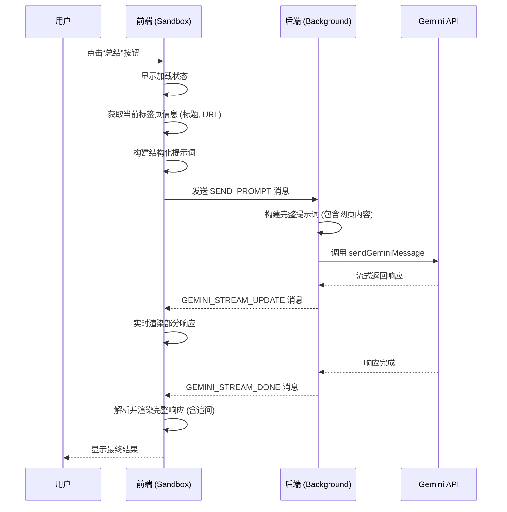
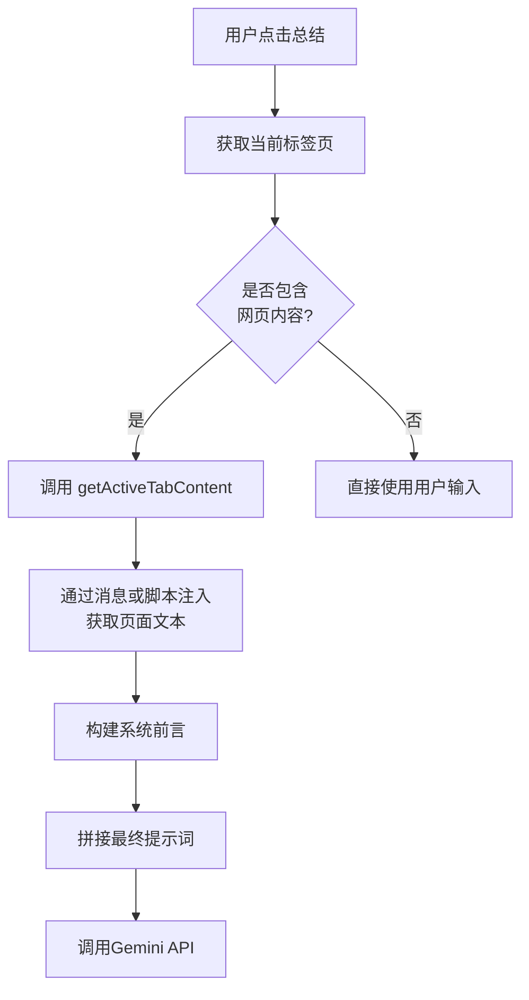
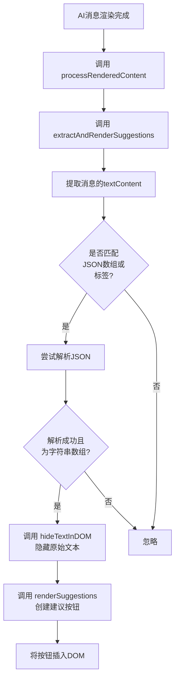

# 智能总结

<cite>
**本文档引用的文件**
- [message.js](file://sandbox/render/message.js)
- [builder.js](file://background/handlers/session/prompt/builder.js)
- [preamble.js](file://background/handlers/session/prompt/preamble.js)
- [gemini_api.js](file://services/gemini_api.js)
- [tool_executor.js](file://background/handlers/session/prompt/tool_executor.js)
- [context_handler.js](file://background/handlers/session/context_handler.js)
- [quick_ask_handler.js](file://background/handlers/session/quick_ask_handler.js)
- [actions.js](file://content/toolbar/actions.js)
- [parser.js](file://services/parser.js)
- [utils.js](file://background/handlers/session/utils.js)
- [session_manager.js](file://background/managers/session_manager.js)
- [events.js](file://sandbox/boot/events.js)
- [prompt.js](file://sandbox/controllers/prompt.js)
</cite>

## 目录
1. [简介](#简介)
2. [核心功能流程](#核心功能流程)
3. [提示工程设计](#提示工程设计)
4. [消息渲染与追问机制](#消息渲染与追问机制)
5. [典型使用场景](#典型使用场景)
6. [常见问题与排查](#常见问题与排查)
7. [结论](#结论)

## 简介
本系统提供了一套完整的智能总结功能，允许用户通过点击工具栏按钮对当前网页内容进行深度语义分析。系统会将网页文本上下文传递给Gemini AI模型，并生成结构化的研报式响应，包括核心摘要、知识脑图、深度内容明细和总结启示。该功能的核心在于精确的提示工程设计、高效的前后端通信机制以及对AI响应的智能解析与展示。

## 核心功能流程
当用户点击“总结”按钮时，系统启动一个完整的智能分析流程。该流程从获取当前页面内容开始，经过提示词构建、API调用，最终将结构化响应渲染到用户界面。

**Diagram sources**
- [events.js](file://sandbox/boot/events.js#L36-L101)
- [prompt.js](file://sandbox/controllers/prompt.js#L15-L116)
- [quick_ask_handler.js](file://background/handlers/session/quick_ask_handler.js#L11-L44)
- [gemini_api.js](file://services/gemini_api.js#L26-L230)

**Section sources**
- [events.js](file://sandbox/boot/events.js#L36-L101)
- [prompt.js](file://sandbox/controllers/prompt.js#L15-L116)
- [quick_ask_handler.js](file://background/handlers/session/quick_ask_handler.js#L11-L44)

## 提示工程设计
系统的智能总结能力高度依赖于精心设计的提示词（Prompt Engineering）。该提示词不仅指导AI生成特定格式的响应，还包含了上下文处理和信息密度优化策略。

### 提示词结构
提示词被设计为一个严格的多部分结构，确保输出的一致性和可解析性：
1.  **核心摘要**: 要求AI用100-200字概括核心内容。
2.  **知识脑图 (Markmap)**: 指令AI生成`markmap`代码块，用于可视化文章逻辑。
3.  **深度内容明细**: 要求AI使用H3标题层层拆解内容，并提供详尽的段落解析。
4.  **总结与启示**: 要求AI给出精炼的结论。
5.  **追问建议**: 在响应末尾以特定格式生成三个追问问题。

### 上下文截断与信息密度优化
系统通过`builder.js`中的`PromptBuilder`类来处理网页上下文。它使用`getActiveTabContent()`函数获取页面的`innerText`，这本身就是一种信息密度优化，因为它去除了HTML标签和冗余的视觉元素，只保留纯文本内容。对于超长页面，Gemini API本身会处理上下文截断，确保输入在模型的token限制内。

**Diagram sources**
- [builder.js](file://background/handlers/session/prompt/builder.js#L5-L44)
- [utils.js](file://background/handlers/session/utils.js#L23-L64)

**Section sources**
- [builder.js](file://background/handlers/session/prompt/builder.js#L5-L44)
- [preamble.js](file://background/handlers/session/prompt/preamble.js#L4-L109)

## 消息渲染与追问机制
`sandbox/render/message.js`文件是前端渲染逻辑的核心，负责将AI返回的Markdown格式响应转换为用户友好的界面，并处理追问问题的自动生成与展示。

### 消息渲染流程
`appendMessage`函数是渲染的入口点。它根据消息角色（用户或AI）创建相应的DOM元素。对于AI消息，它会创建一个带有思考过程（可选）、内容区域和页脚（包含模型信息和复制按钮）的气泡。

### 追问问题的解析与展示
系统通过`processRenderedContent`函数在消息渲染后进行二次处理。该函数会调用`extractAndRenderSuggestions`来解析追问问题。

**Diagram sources**
- [message.js](file://sandbox/render/message.js#L327-L649)

**Section sources**
- [message.js](file://sandbox/render/message.js#L14-L323)
- [message.js](file://sandbox/render/message.js#L327-L649)

## 典型使用场景
### 技术文档提炼
对于一篇关于机器学习算法的技术博客，智能总结功能可以：
- **核心摘要**：概括该算法的创新点和适用场景。
- **知识脑图**：将文章的章节结构（如“背景”、“原理”、“实现”、“应用”）可视化为一个思维导图。
- **深度内容明细**：详细解释算法的数学公式和代码实现细节。
- **追问建议**：生成如“该算法的计算复杂度是多少？”、“如何在TensorFlow中实现？”等深入问题。

### 新闻文章分析
对于一篇国际时事新闻，该功能可以：
- **核心摘要**：提炼事件的起因、经过和各方反应。
- **知识脑图**：梳理事件的时间线和涉及的关键人物/组织。
- **深度内容明细**：分析事件背后的深层原因和潜在影响。
- **追问建议**：生成如“该事件对全球经济有何影响？”、“相关国家的历史关系如何？”等拓展性问题。

## 常见问题与排查
### 响应中未显示追问按钮
**可能原因**：
1.  AI的响应末尾没有按照指定格式（`<suggestions>[...]</suggestions>` 或纯JSON数组）生成追问。
2.  响应中的JSON格式不正确（例如使用了单引号）。
3.  `extractAndRenderSuggestions`函数在解析时出错。

**排查方法**：
1.  检查AI的原始响应文本，确认是否存在符合格式的追问部分。
2.  打开开发者工具，查看`message.js`中的`extractAndRenderSuggestions`函数是否被调用，以及`console.error`是否有相关错误日志。

### 网页内容获取失败
**可能原因**：
1.  当前页面为Chrome内置页面（如`chrome://extensions`）。
2.  内容脚本未正确注入或通信失败。

**排查方法**：
1.  尝试在普通网页（如新闻网站）上使用该功能。
2.  检查`utils.js`中的`getActiveTabContent`函数，确认`chrome.tabs.sendMessage`是否成功，否则会回退到`chrome.scripting.executeScript`。

### API调用失败
**可能原因**：
1.  用户未登录Google账号。
2.  请求过于频繁，触发了速率限制。
3.  网络连接问题。

**排查方法**：
1.  检查`gemini_api.js`中的错误处理逻辑，系统会返回明确的中文错误信息，如“未登录”、“请求过于频繁”等。
2.  根据错误提示，尝试刷新Gemini页面或等待几分钟后重试。

## 结论
本智能总结功能通过一套精密的前后端协作机制，实现了对网页内容的深度语义分析和结构化输出。其核心优势在于：
1.  **结构化提示工程**：强制AI生成符合预定义格式的响应，便于前端解析。
2.  **智能追问机制**：通过DOM后处理技术，从AI响应中提取并渲染追问按钮，极大地提升了交互性和探索性。
3.  **鲁棒的错误处理**：系统对登录状态、速率限制和网络问题都有完善的处理和用户友好的提示。

该功能为用户提供了一种高效的信息提炼和知识探索工具，特别适用于处理长篇幅、高信息密度的网页内容。