# 功能特性

<cite>
**本文档引用的文件**  
- [prompt_handler.js](file://background/handlers/session/prompt_handler.js)
- [tool_executor.js](file://background/handlers/session/prompt/tool_executor.js)
- [builder.js](file://background/handlers/session/prompt/builder.js)
- [navigation.js](file://background/control/actions/navigation.js)
- [crop.js](file://content/toolbar/crop.js)
- [mcp_manager.js](file://background/managers/mcp_manager.js)
- [image_manager.js](file://background/managers/image_manager.js)
- [controller.js](file://content/toolbar/controller.js)
- [actions.js](file://content/toolbar/actions.js)
- [markmap-loader.js](file://sandbox/libs/markmap-loader.js)
- [index.js](file://background/index.js)
- [content/index.js](file://content/index.js)
</cite>

## 目录
1. [侧边栏对话功能](#侧边栏对话功能)
2. [智能总结与思维导图生成](#智能总结与思维导图生成)
3. [图像分析功能](#图像分析功能)
4. [浏览器控制功能](#浏览器控制功能)
5. [MCP协议工具调用](#mcp协议工具调用)
6. [功能协同工作模式](#功能协同工作模式)
7. [功能可配置性](#功能可配置性)

## 侧边栏对话功能

侧边栏对话功能是Gemini Nexus的核心交互界面，通过`prompt_handler.js`处理用户输入并驱动整个对话流程。该功能基于Chrome扩展的background服务工作线程实现，利用`prompt_handler.js`中的`PromptHandler`类协调会话管理、上下文构建和响应流式传输。

当用户在侧边栏输入问题时，系统通过`PromptHandler.handle()`方法启动处理流程。首先调用`PromptBuilder`构建包含上下文和预设指令的完整提示词，然后将请求发送至Gemini API进行处理。在整个响应过程中，系统通过`onUpdate`回调机制实现流式更新，确保用户界面能够实时显示AI的思考过程和部分结果。

该功能支持多轮对话和会话历史管理，通过`appendUserMessage`和`appendAiMessage`方法维护对话上下文，确保AI能够基于之前的交互进行连贯回应。同时，系统实现了自动反馈循环机制，在检测到工具调用请求时，能够自动执行相应操作并将结果反馈给AI模型，形成闭环交互。

**Section sources**
- [prompt_handler.js](file://background/handlers/session/prompt_handler.js#L6-L103)
- [builder.js](file://background/handlers/session/prompt/builder.js)
- [index.js](file://background/index.js#L4-L27)

## 智能总结与思维导图生成

智能总结与思维导图生成功能通过集成markmap库实现文本内容的可视化转换。该功能允许用户将长篇文本或对话内容自动转换为结构化的思维导图，帮助用户更好地理解和组织信息。

系统通过`sandbox/libs/markmap-loader.js`动态加载markmap和d3.js等依赖库，在隔离的沙箱环境中安全地渲染思维导图。当需要生成思维导图时，系统首先将文本内容转换为符合markmap格式的Markdown大纲结构，然后使用markmap的Transformer将Markdown转换为JSON格式的树状结构，最后通过Markmap组件在UI中渲染出交互式的思维导图。

智能总结功能与思维导图生成紧密结合，当用户选择"总结"操作时，系统不仅生成文本摘要，还可以一键转换为思维导图形式。这种集成设计使得用户能够从线性文本和图形化视图两种模式中自由切换，获得更全面的信息理解体验。

**Diagram sources**
- [markmap-loader.js](file://sandbox/libs/markmap-loader.js#L1-L50)
- [actions.js](file://content/toolbar/actions.js#L92-L122)

## 图像分析功能

图像分析功能集成了截图工具、OCR识别和翻译能力，为用户提供全面的视觉内容处理解决方案。该功能的核心是`crop.js`文件中实现的图像裁剪模块，它允许用户在网页上选择特定区域进行精确截图。

当用户触发截图操作时，系统首先通过`ImageManager.captureScreenshot()`获取当前标签页的完整截图，然后在前端通过`GeminiImageCropper.crop()`方法对选区进行客户端裁剪。这一过程确保了用户隐私，因为所有图像处理都在本地完成，无需将完整页面发送到远程服务器。

OCR和翻译功能通过`actions.js`中的`handleImagePrompt()`方法实现。当用户选择OCR模式时，系统会生成特定的提示词模板，指导AI模型专注于文本识别任务；当选择翻译模式时，则会添加翻译指令，要求AI将识别出的文本转换为目标语言。这些功能的实现依赖于Gemini模型强大的多模态处理能力，能够同时理解图像内容和文本语义。

**Diagram sources**
- [crop.js](file://content/toolbar/crop.js#L1-L30)
- [image_manager.js](file://background/managers/image_manager.js#L62-L96)
- [actions.js](file://content/toolbar/actions.js#L21-L75)

## 浏览器控制功能

浏览器控制功能通过`navigation.js`等文件实现自然语言指令的执行，使用户能够用简单的语言命令控制浏览器行为。该功能基于`NavigationActions`类提供了一系列浏览器操作方法，包括页面导航、标签管理等。

`navigation.js`文件中的`navigatePage`方法支持前进、后退、刷新和跳转到指定URL等操作。`newPage`方法用于创建新标签页，`closePage`和`selectPage`方法则分别用于关闭和切换标签页。这些方法通过Chrome扩展API与浏览器进行交互，实现了对浏览器状态的全面控制。

系统通过`controlManager.execute()`方法统一调度各种控制动作，将自然语言指令解析为具体的动作名称和参数。例如，当用户说"打开一个新的空白页"时，系统会解析出`newPage`动作并执行；当用户说"回到上一页"时，则会调用`navigatePage`方法并传入`back`类型参数。

```mermaid
flowchart TD
A[用户自然语言输入] --> B{指令解析}
B --> C[导航指令]
B --> D[标签管理指令]
B --> E[其他控制指令]
C --> F[调用navigatePage]
D --> G[调用newPage/closePage/selectPage]
E --> H[调用相应控制方法]
F --> I[执行chrome.tabs API]
G --> I
H --> I
I --> J[返回执行结果]
J --> K[反馈给用户]
```

**Diagram sources**
- [navigation.js](file://background/control/actions/navigation.js#L5-L61)
- [controller.js](file://content/toolbar/controller.js#L26-L27)

## MCP协议工具调用

MCP协议工具调用功能通过`mcp_manager.js`实现，为Gemini Nexus提供了扩展外部工具的能力。该功能允许系统连接到支持MCP（Model Context Protocol）的服务器，动态发现并调用各种工具，极大地扩展了AI的功能边界。

`MCPManager`类负责管理所有MCP服务器的连接状态、工具列表和通信协议。系统支持两种连接模式：SSE（Server-Sent Events）和HTTP模式，能够适应不同服务器的实现方式。当连接成功后，系统会自动获取服务器提供的工具列表，并将这些工具信息整合到AI的系统提示中，使AI能够知晓可用工具及其使用方法。

工具调用流程由`executeTool`方法驱动，当AI模型输出符合规范的工具调用指令时，系统会解析指令、验证参数，并通过相应的通信协议发送到目标服务器。执行结果会被格式化后返回给AI模型，形成"思考-行动-观察"的闭环。这种设计使得Gemini Nexus能够与各种外部服务无缝集成，实现复杂任务的自动化处理。

**Diagram sources**
- [mcp_manager.js](file://background/managers/mcp_manager.js#L2-L530)
- [tool_executor.js](file://background/handlers/session/prompt/tool_executor.js#L4-L49)

## 功能协同工作模式

Gemini Nexus的各个功能模块通过精心设计的协同工作机制无缝集成，形成了高效的工作流。最典型的协同模式是文本选中后触发工具栏显示并传递上下文的过程，这一流程涉及多个组件的紧密配合。

当用户在网页上选择文本时，`selection.js`会检测到选择事件并通知`controller.js`中的`GeminiToolbarController`。控制器随即在选区附近显示浮动工具栏，并通过`handleSelection`方法获取选中的文本内容作为上下文。这一过程通过`selectionObserver`和`actionsDelegate`等组件实现事件的捕获和分发。

工具栏上的各种操作按钮（如翻译、总结、解释等）点击后，会通过`actions.js`中的`handleQuickAction`方法生成相应的请求消息，包含原始文本和预设的提示词模板。这些请求最终被发送到background脚本，在`prompt_handler.js`中进行统一处理。整个流程确保了从用户交互到AI处理的无缝衔接，实现了低延迟、高响应性的用户体验。

**Diagram sources**
- [controller.js](file://content/toolbar/controller.js#L29-L33)
- [actions.js](file://content/toolbar/actions.js#L92-L140)
- [content/index.js](file://content/index.js#L94-L97)

## 功能可配置性

Gemini Nexus提供了丰富的可配置选项，允许用户根据个人偏好启用或禁用特定工具。系统通过Chrome Storage API持久化存储用户的配置选择，确保设置在浏览器重启后仍然有效。

主要的可配置项包括文本选择功能和图像工具的启用状态，这些设置在`content/index.js`中通过监听存储变化来动态调整。当用户在设置面板中更改`geminiTextSelectionEnabled`或`geminiImageToolsEnabled`选项时，系统会立即更新`floatingToolbar`的状态，实时反映用户的配置选择。

快捷键配置也具有高度可定制性，系统定义了默认的快捷键映射（如Ctrl+G用于快速提问，Alt+S用于打开侧边栏），但允许用户在设置中修改这些快捷键。配置的变更会触发`chrome.storage.onChanged`事件监听器，确保所有相关组件都能及时获取最新的快捷键设置。

此外，MCP服务器的配置完全可定制，用户可以通过JSON格式的配置文件添加、修改或删除MCP服务器连接。`mcp_manager.js`中的`saveConfig`方法负责验证和保存这些配置，并自动重新初始化连接，实现了配置变更的热重载。

**Section sources**
- [content/index.js](file://content/index.js#L117-L152)
- [mcp_manager.js](file://background/managers/mcp_manager.js#L40-L61)
- [controller.js](file://content/toolbar/controller.js#L68-L82)