# OCR与文字提取

<cite>
**本文档引用的文件**   
- [message_handler.js](file://sandbox/controllers/message_handler.js)
- [gemini_api.js](file://services/gemini_api.js)
- [crop.js](file://content/toolbar/crop.js)
- [overlay.js](file://content/overlay.js)
- [crop_utils.js](file://lib/crop_utils.js)
- [index.js](file://content/index.js)
- [builder.js](file://background/handlers/session/prompt/builder.js)
</cite>

## 目录
1. [简介](#简介)
2. [OCR功能架构](#ocr功能架构)
3. [核心组件分析](#核心组件分析)
4. [OCR处理流程](#ocr处理流程)
5. [图像裁剪与处理](#图像裁剪与处理)
6. [Gemini API集成](#gemini-api集成)
7. [沙箱环境处理](#沙箱环境处理)
8. [实际使用示例](#实际使用示例)
9. [错误处理](#错误处理)
10. [性能优化策略](#性能优化策略)
11. [结论](#结论)

## 简介
本文档详细描述了系统如何实现OCR（光学字符识别）与文字提取功能。当用户选择截图区域后，系统能够自动识别图像中的文字内容并将其转换为可编辑文本。文档重点阐述了`captureMode`设置为'ocr'时的自动处理流程，包括从用户选择区域到最终文字提取的完整技术实现路径。

## OCR功能架构

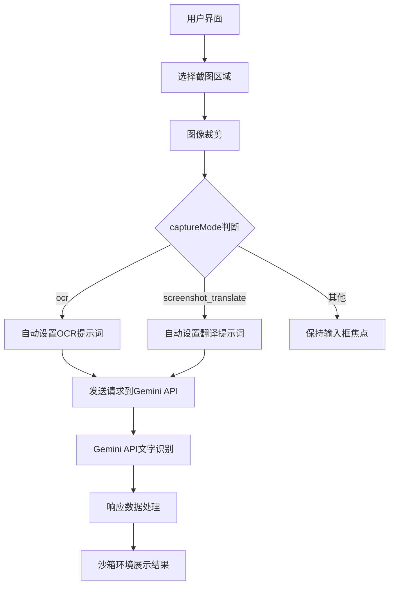

**Diagram sources**
- [message_handler.js](file://sandbox/controllers/message_handler.js#L318-L336)
- [overlay.js](file://content/overlay.js#L176-L194)

## 核心组件分析

### 消息处理器分析

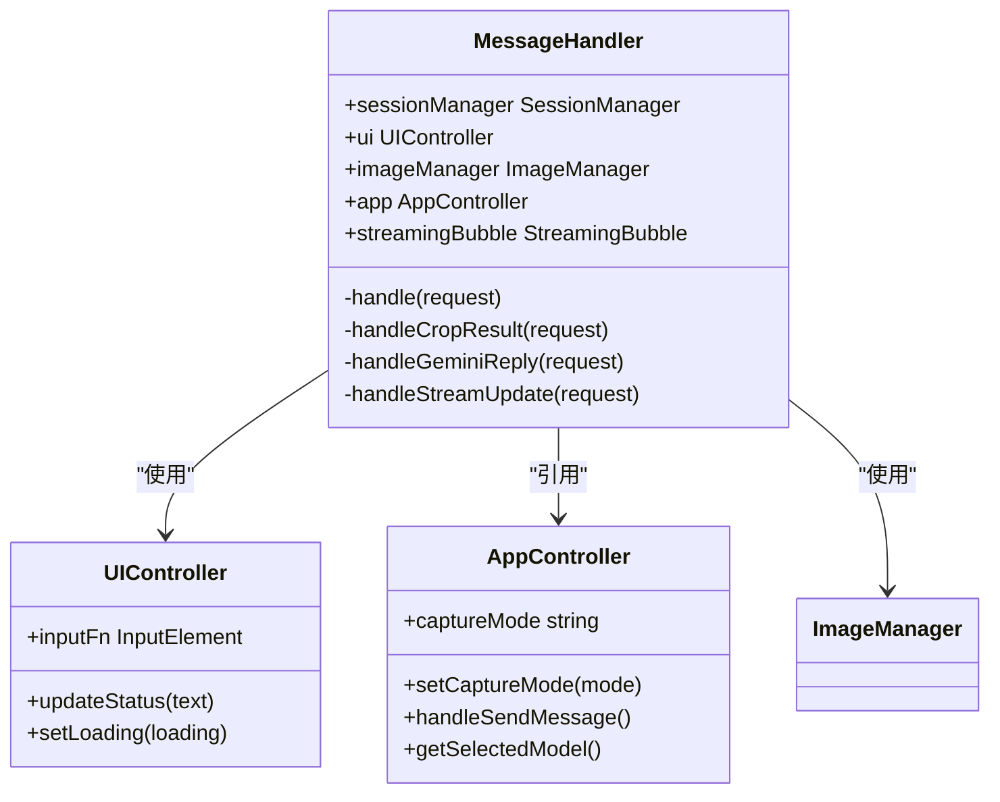

**Diagram sources**
- [message_handler.js](file://sandbox/controllers/message_handler.js#L8-L364)

**Section sources**
- [message_handler.js](file://sandbox/controllers/message_handler.js#L8-L364)

### OCR处理组件分析

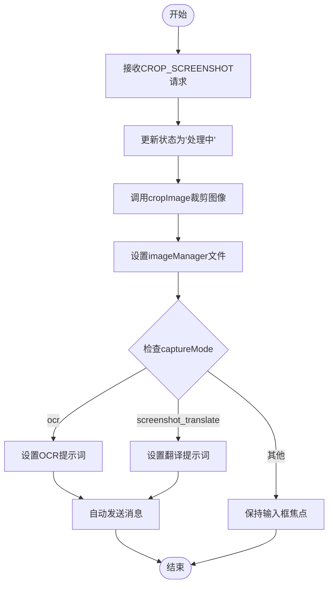

**Diagram sources**
- [message_handler.js](file://sandbox/controllers/message_handler.js#L318-L336)

**Section sources**
- [message_handler.js](file://sandbox/controllers/message_handler.js#L318-L336)

## OCR处理流程

### 捕获模式切换流程

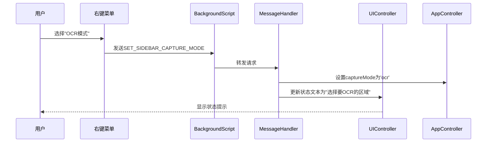

**Diagram sources**
- [message_handler.js](file://sandbox/controllers/message_handler.js#L48-L56)

### OCR自动处理流程

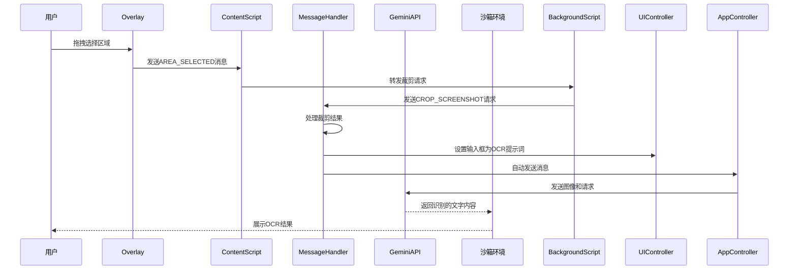

**Diagram sources**
- [message_handler.js](file://sandbox/controllers/message_handler.js#L43-L45)
- [overlay.js](file://content/overlay.js#L176-L194)
- [index.js](file://content/index.js#L67-L82)

## 图像裁剪与处理

### 图像裁剪流程

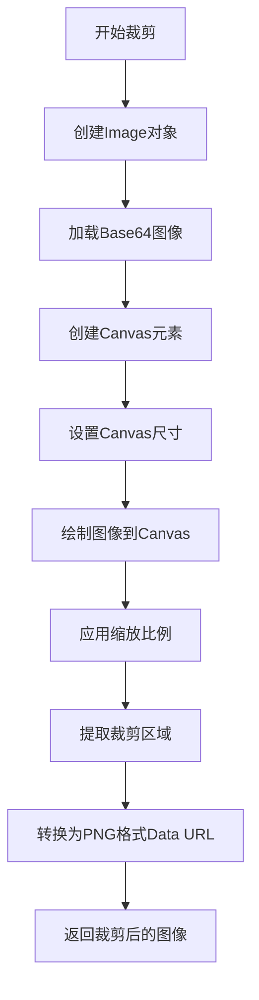

**Diagram sources**
- [crop_utils.js](file://lib/crop_utils.js#L4-L28)
- [crop.js](file://content/toolbar/crop.js#L5-L27)

### 选择覆盖层组件

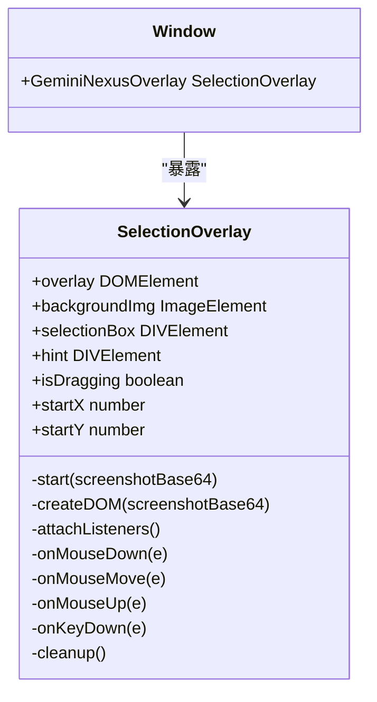

**Diagram sources**
- [overlay.js](file://content/overlay.js#L4-L212)

**Section sources**
- [overlay.js](file://content/overlay.js#L4-L212)

## Gemini API集成

### API请求流程

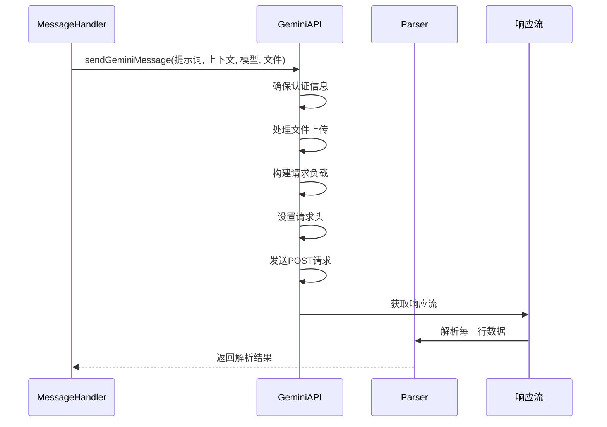

**Diagram sources**
- [gemini_api.js](file://services/gemini_api.js#L26-L230)

### 请求构建组件

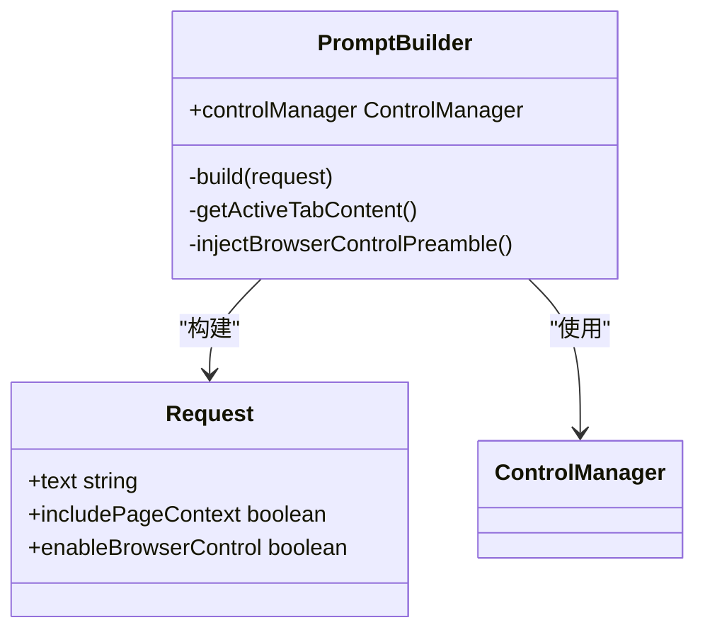

**Diagram sources**
- [builder.js](file://background/handlers/session/prompt/builder.js#L5-L44)

**Section sources**
- [builder.js](file://background/handlers/session/prompt/builder.js#L5-L44)

## 沙箱环境处理

### 消息处理机制

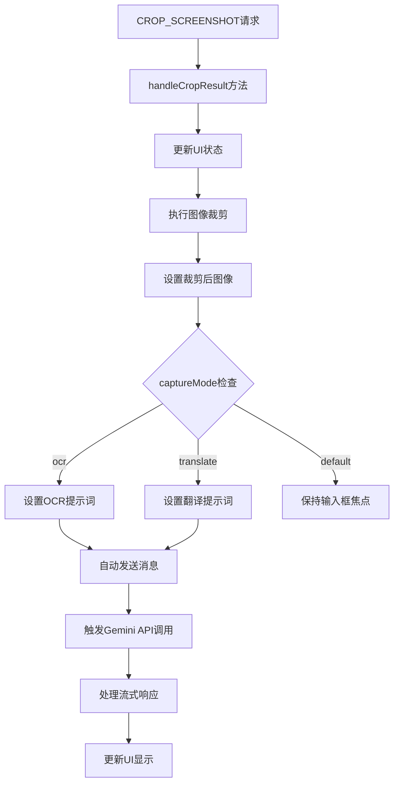

**Section sources**
- [message_handler.js](file://sandbox/controllers/message_handler.js#L318-L336)

## 实际使用示例

### OCR使用场景

```mermaid
flowchart LR
A[用户在网页上] --> B[右键选择"OCR模式"]
B --> C[点击"截图OCR"]
C --> D[出现半透明覆盖层]
D --> E[拖拽选择文字区域]
E --> F[系统自动处理]
F --> G[输入框填充OCR提示]
G --> H[自动发送请求]
H --> I[显示识别的文字]
```

**Section sources**
- [message_handler.js](file://sandbox/controllers/message_handler.js#L324-L328)
- [overlay.js](file://content/overlay.js#L22-L91)

## 错误处理

### 错误处理流程

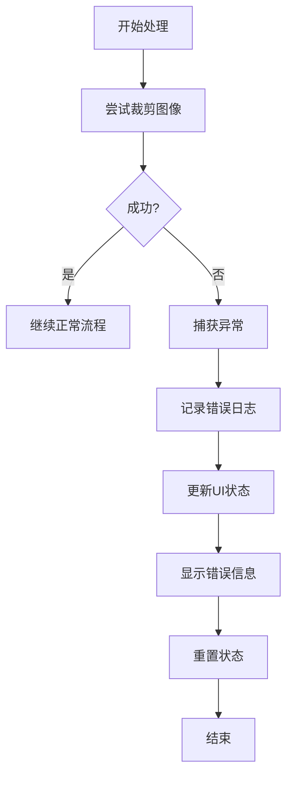

**Section sources**
- [message_handler.js](file://sandbox/controllers/message_handler.js#L337-L340)

### 错误类型与处理

| 错误类型 | 触发条件 | 处理方式 | 用户提示 |
|---------|---------|---------|---------|
| 裁剪错误 | 图像加载失败或裁剪异常 | 捕获异常，记录日志 | "截图处理失败，请重试" |
| API连接错误 | 网络问题或认证失效 | 抛出网络错误 | "网络错误，请检查连接" |
| 会话过期 | 认证令牌失效 | 检测HTML响应 | "未登录，请刷新页面" |
| 请求频繁 | 超出API速率限制 | 检测429状态 | "请求过于频繁，请稍后再试" |
| 空响应 | 服务器无响应 | 检测空响应 | "服务器无响应，请检查网络" |

**Section sources**
- [gemini_api.js](file://services/gemini_api.js#L154-L218)
- [message_handler.js](file://sandbox/controllers/message_handler.js#L337-L340)

## 性能优化策略

### 并行处理优化

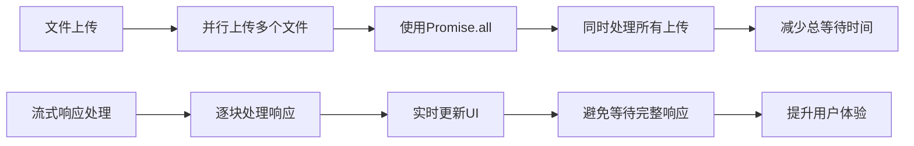

**Section sources**
- [gemini_api.js](file://services/gemini_api.js#L46-L50)

### 资源管理优化

| 优化策略 | 实现方式 | 性能收益 |
|---------|---------|---------|
| 内存优化 | 及时清理覆盖层DOM元素 | 减少内存泄漏风险 |
| 网络优化 | 并行文件上传 | 缩短总上传时间 |
| UI响应优化 | 流式处理响应 | 实时反馈，提升感知速度 |
| 缓存优化 | 高分辨率图像URL处理 | 提升图像质量 |
| 错误恢复 | 完善的错误处理机制 | 提高系统稳定性 |

**Section sources**
- [gemini_api.js](file://services/gemini_api.js#L46-L50)
- [overlay.js](file://content/overlay.js#L104-L121)
- [utils.js](file://lib/utils.js#L37-L57)

## 结论
本系统通过集成OCR功能，实现了从截图到文字提取的完整自动化流程。当`captureMode`设置为'ocr'时，系统能够自动触发OCR处理流程，在用户选择区域后自动设置OCR提示词并发送请求。后台服务通过Gemini API进行文字识别，响应数据在沙箱环境中被有效处理和展示。整个流程设计考虑了错误处理和性能优化，确保了功能的稳定性和用户体验的流畅性。