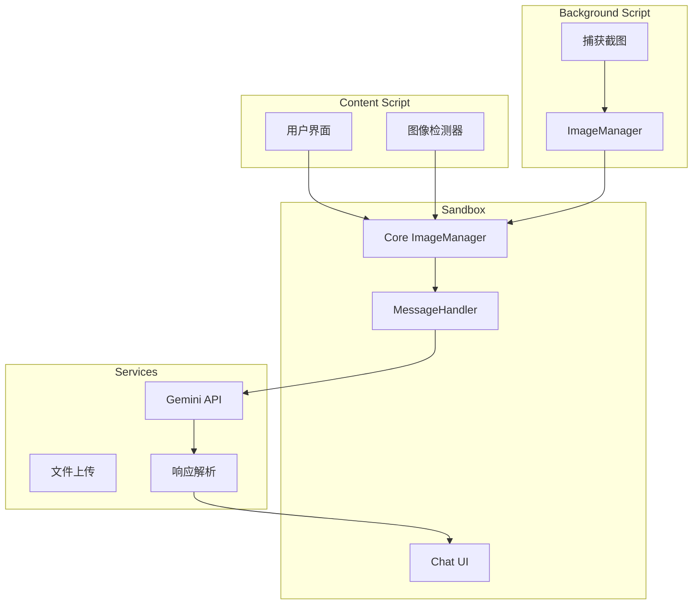
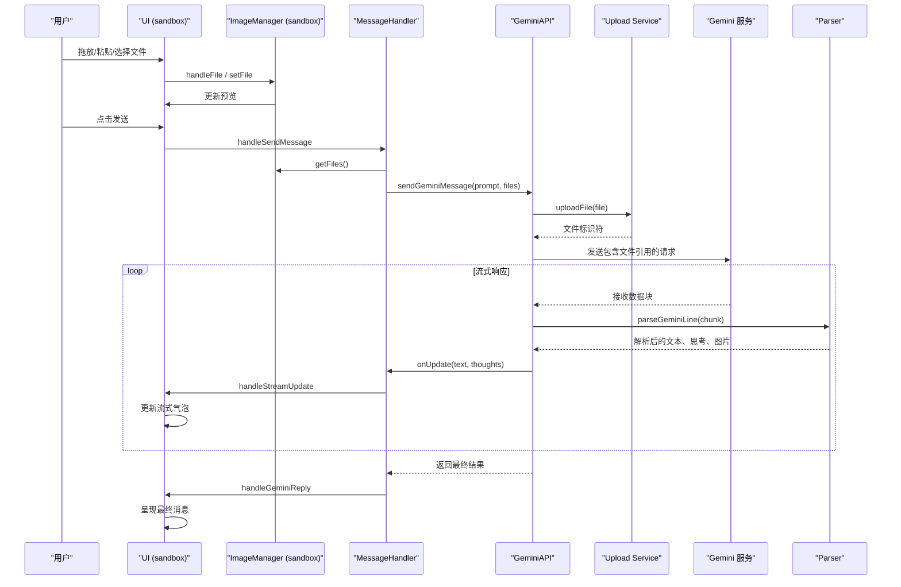
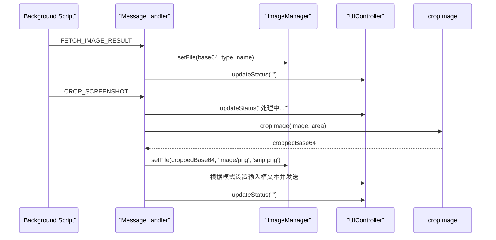
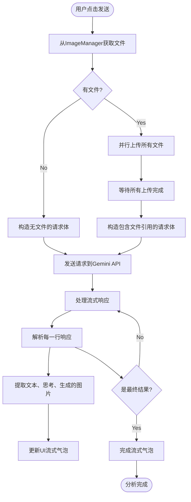

# 图像分析

<cite>
**本文档引用的文件**   
- [image_manager.js](file://background/managers/image_manager.js)
- [image_manager.js](file://sandbox/core/image_manager.js)
- [message_handler.js](file://sandbox/controllers/message_handler.js)
- [gemini_api.js](file://services/gemini_api.js)
- [upload.js](file://services/upload.js)
- [parser.js](file://services/parser.js)
- [message.js](file://sandbox/render/message.js)
- [chat.js](file://sandbox/ui/chat.js)
- [crop_utils.js](file://lib/crop_utils.js)
- [watermark_remover.js](file://lib/watermark_remover.js)
- [image.js](file://content/toolbar/image.js)
- [drag.js](file://content/toolbar/utils/drag.js)
</cite>

## 目录
1. [简介](#简介)
2. [项目结构](#项目结构)
3. [核心组件](#核心组件)
4. [架构概述](#架构概述)
5. [详细组件分析](#详细组件分析)
6. [依赖分析](#依赖分析)
7. [性能考虑](#性能考虑)
8. [故障排除指南](#故障排除指南)
9. [结论](#结论)

## 简介
本文档详细描述了Gemini Nexus扩展的图像分析功能，涵盖从用户上传图像到通过Gemini API进行深度内容理解的完整流程。文档重点阐述了`ImageManager`如何处理多种输入方式（拖放、粘贴、文件选择），`message_handler.js`如何将图像与文本提示结合发送至Gemini API，以及分析结果如何在聊天界面中结构化呈现。同时，文档还提供了实际使用示例、错误处理机制和性能优化建议。

## 项目结构
该扩展的项目结构清晰地分离了不同功能模块。核心的图像管理功能分布在`background`和`sandbox`两个主要目录下。`background`目录中的`managers/image_manager.js`负责与浏览器API交互以捕获屏幕截图。`sandbox`目录中的`core/image_manager.js`则负责管理用户界面中的图像上传和预览。图像分析的请求处理由`sandbox/controllers/message_handler.js`协调，最终通过`services/gemini_api.js`与Gemini服务通信。



**图表来源**
- [image_manager.js](file://background/managers/image_manager.js#L48-L79)
- [image_manager.js](file://sandbox/core/image_manager.js#L19-L214)
- [message_handler.js](file://sandbox/controllers/message_handler.js#L17-L86)
- [gemini_api.js](file://services/gemini_api.js#L26-L230)

**章节来源**
- [image_manager.js](file://background/managers/image_manager.js)
- [image_manager.js](file://sandbox/core/image_manager.js)
- [project_structure](file://#L1-L200)

## 核心组件
本系统的核心组件包括`ImageManager`（负责图像的捕获与管理）、`MessageHandler`（负责协调消息流和API调用）以及`GeminiAPI`服务（负责与后端进行通信）。`ImageManager`在`background`和`sandbox`环境中分别实现，前者处理浏览器原生的截图功能，后者处理用户交互和文件上传。`MessageHandler`作为中枢，接收来自UI的请求，调用`ImageManager`获取图像数据，并将其与用户提示一起通过`GeminiAPI`发送出去。`GeminiAPI`则封装了复杂的网络请求和响应解析逻辑。

**章节来源**
- [image_manager.js](file://background/managers/image_manager.js#L4-L97)
- [image_manager.js](file://sandbox/core/image_manager.js#L4-L281)
- [message_handler.js](file://sandbox/controllers/message_handler.js#L8-L365)

## 架构概述
系统的整体架构遵循分层设计原则。用户通过UI进行交互，触发图像上传或截图操作。UI层的`ImageManager`负责处理文件输入、拖放和粘贴事件，并将图像数据存储在内存中。当用户提交包含图像的请求时，`MessageHandler`被激活，它从`ImageManager`获取图像数据，并调用`GeminiAPI`服务。`GeminiAPI`服务负责将图像文件上传到Google的`content-push`服务，获取文件标识符，然后构造包含文本提示和文件引用的请求体，发送给Gemini的`StreamGenerate`端点。收到流式响应后，`MessageHandler`通过`Parser`解析响应，并将结果传递给UI进行渲染。



**图表来源**
- [image_manager.js](file://sandbox/core/image_manager.js#L195-L214)
- [message_handler.js](file://sandbox/controllers/message_handler.js#L17-L280)
- [gemini_api.js](file://services/gemini_api.js#L26-L230)
- [parser.js](file://services/parser.js#L4-L157)

## 详细组件分析

### 图像管理器分析
`ImageManager`是图像功能的核心，它在`sandbox`和`background`两个环境中都有实现，分别负责不同的职责。

#### 对象导向组件：
```mermaid
classDiagram
class ImageManager {
+imageInput : HTMLInputElement
+imagePreview : HTMLElement
+inputWrapper : HTMLElement
+inputFn : HTMLTextAreaElement
+onUrlDrop : Function
+files : {base64, type, name}[]
+initListeners() void
+handleFile(file) void
+setFile(base64, type, name) void
+addFile(base64, type, name) void
+removeFile(index) void
+clearFile() void
+getFiles() {base64, type, name}[]
+getFileData() {base64, type, name}
+_render() void
+_insertTextAtCursor(text) void
}
class BackgroundImageManager {
+fetchImage(url) Promise~{action, base64?, type?, name?, error?}~
+_captureTab() Promise~string?
+captureScreenshot() Promise~{action, base64, type, name, error?}~
+captureArea(area) Promise~{action, image, area}?
}
ImageManager --> BackgroundImageManager : "通过消息通信"
```

**图表来源**
- [image_manager.js](file://sandbox/core/image_manager.js#L4-L281)
- [image_manager.js](file://background/managers/image_manager.js#L4-L97)

**章节来源**
- [image_manager.js](file://sandbox/core/image_manager.js#L4-L281)
- [image_manager.js](file://background/managers/image_manager.js#L4-L97)

### 消息处理分析
`MessageHandler`是协调整个图像分析流程的控制器。它监听来自`background`脚本的各种消息，并调用相应的UI方法进行处理。

#### API/服务组件：


**图表来源**
- [message_handler.js](file://sandbox/controllers/message_handler.js#L31-L341)
- [crop_utils.js](file://lib/crop_utils.js#L4-L29)

**章节来源**
- [message_handler.js](file://sandbox/controllers/message_handler.js#L31-L341)

### 图像上传与API调用分析
此流程描述了从用户提交请求到与Gemini API通信的完整过程。

#### 复杂逻辑组件：


**图表来源**
- [gemini_api.js](file://services/gemini_api.js#L26-L230)
- [upload.js](file://services/upload.js#L7-L40)
- [parser.js](file://services/parser.js#L4-L157)
- [message_handler.js](file://sandbox/controllers/message_handler.js#L212-L279)

**章节来源**
- [gemini_api.js](file://services/gemini_api.js#L26-L230)

## 依赖分析
系统各组件之间存在明确的依赖关系。`sandbox`中的`ImageManager`直接依赖于DOM元素进行用户交互。`MessageHandler`依赖于`ImageManager`获取图像数据，并依赖于`GeminiAPI`服务进行网络通信。`GeminiAPI`服务又依赖于`upload.js`进行文件上传和`parser.js`进行响应解析。UI组件（如`chat.js`）依赖于`MessageHandler`来更新界面状态。这种依赖关系确保了关注点的分离，使得每个组件可以独立开发和测试。

```mermaid
graph TD
A[image_manager.js (sandbox)] --> B[message_handler.js]
B --> C[gemini_api.js]
C --> D[upload.js]
C --> E[parser.js]
F[chat.js] --> B
G[image.js] --> A
H[drag.js] --> A
I[watermark_remover.js] --> J[message.js]
J --> B
```

**图表来源**
- [image_manager.js](file://sandbox/core/image_manager.js)
- [message_handler.js](file://sandbox/controllers/message_handler.js)
- [gemini_api.js](file://services/gemini_api.js)
- [upload.js](file://services/upload.js)
- [parser.js](file://services/parser.js)
- [chat.js](file://sandbox/ui/chat.js)
- [message.js](file://sandbox/render/message.js)

**章节来源**
- [image_manager.js](file://sandbox/core/image_manager.js)
- [message_handler.js](file://sandbox/controllers/message_handler.js)
- [gemini_api.js](file://services/gemini_api.js)

## 性能考虑
为了优化性能，系统在多个层面进行了设计。首先，文件上传采用并行处理，通过`Promise.all()`同时上传多个文件，显著减少了总等待时间。其次，图像处理（如截图裁剪）在客户端完成，避免了不必要的网络传输。流式响应的处理是增量的，UI可以立即开始显示部分结果，提升了用户体验。此外，`WatermarkRemover`使用了单例模式和缓存，避免了对相同背景图像的重复计算。对于大型图像，系统会根据尺寸自动选择合适的水印模板进行处理。

## 故障排除指南
当图像分析功能出现问题时，可以从以下几个方面进行排查：

**章节来源**
- [image_manager.js](file://background/managers/image_manager.js#L40-L45)
- [gemini_api.js](file://services/gemini_api.js#L154-L219)
- [message_handler.js](file://sandbox/controllers/message_handler.js#L284-L287)

1.  **图像上传失败**：检查`ImageManager`的`handleFile`方法是否被正确调用。确认文件对象是否有效，以及`FileReader`的`onload`事件是否触发。如果上传失败，查看`upload.js`中的网络请求状态码。
2.  **API调用失败**：最常见的原因是会话过期。检查`gemini_api.js`中`sendGeminiMessage`函数的响应，如果返回HTML内容（包含`Sign in`），说明用户需要重新登录。其他错误如`429`（请求过于频繁）或网络错误也应被捕获和处理。
3.  **响应解析失败**：如果流式响应无法解析，检查`parser.js`中的`parseGeminiLine`函数。确保响应行以`)]}'`开头并能被正确JSON解析。复杂的嵌套结构可能导致解析失败。
4.  **UI未更新**：确认`MessageHandler`是否收到了来自`background`脚本的正确消息（如`FETCH_IMAGE_RESULT`）。检查`handleImageResult`等处理函数是否正确地调用了`ImageManager`的方法。

## 结论
Gemini Nexus的图像分析功能通过一个精心设计的架构，实现了从用户交互到AI分析的无缝衔接。`ImageManager`的双重实现有效地分离了UI逻辑和浏览器API调用。`MessageHandler`作为协调者，确保了消息流的正确处理。`GeminiAPI`服务则封装了与外部服务通信的复杂性。整个系统在性能和用户体验上都做了充分的优化，为用户提供了一个强大且可靠的图像内容理解工具。通过遵循本文档中的分析和建议，开发者可以更好地理解、维护和扩展此功能。