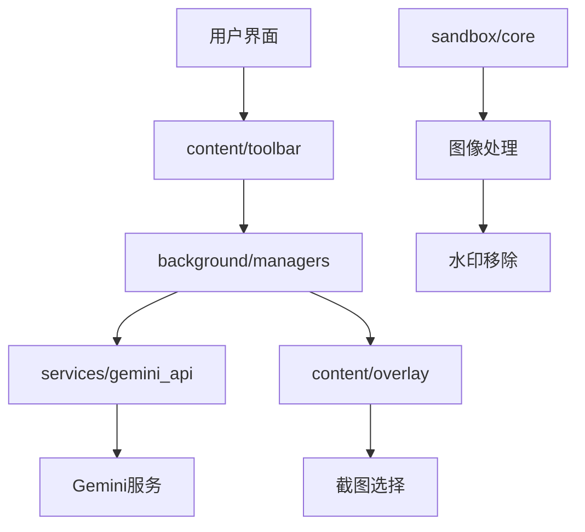
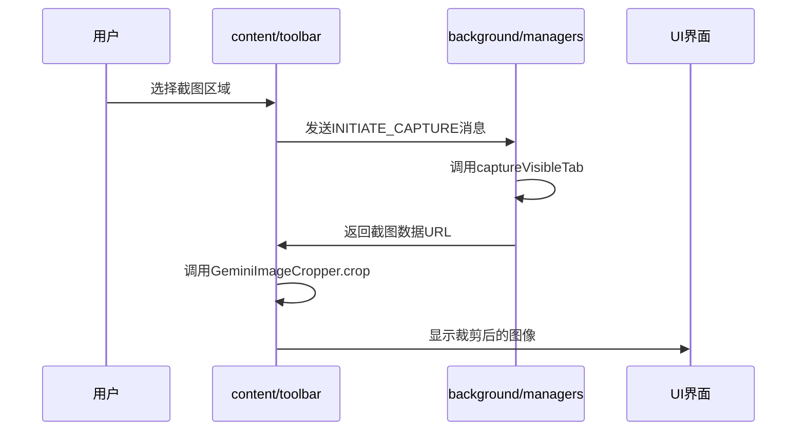
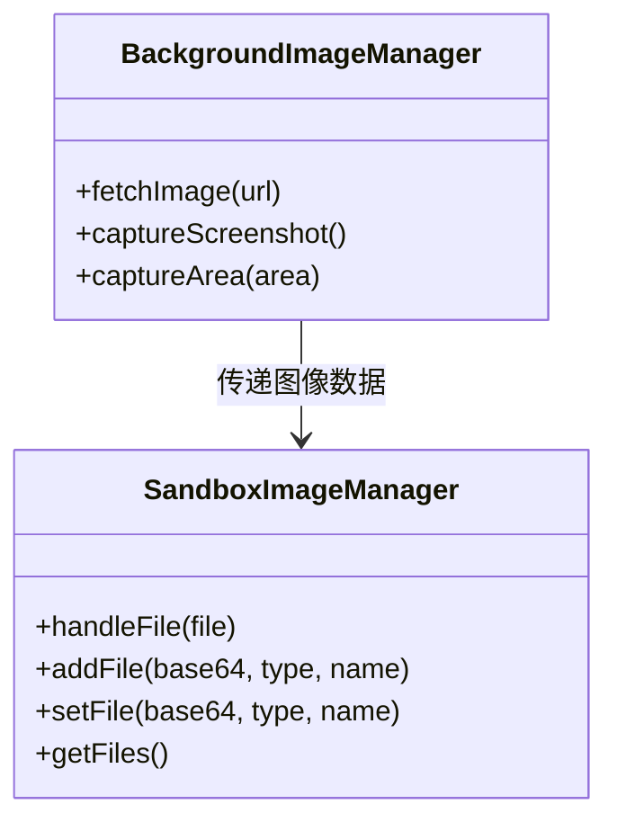
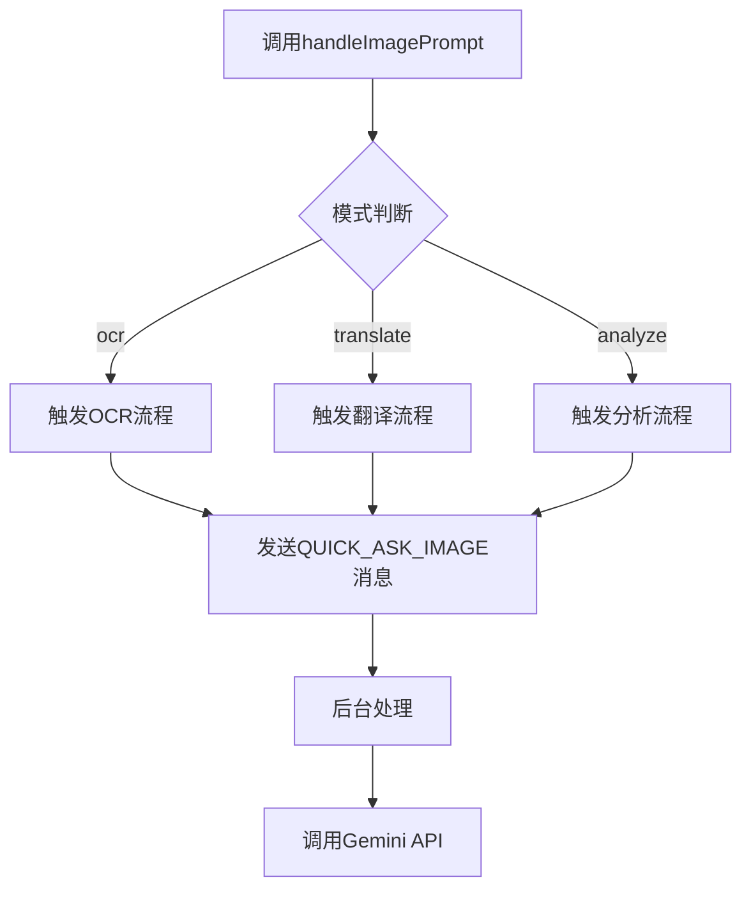
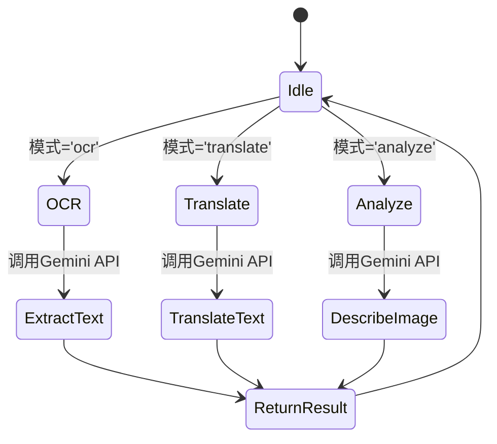
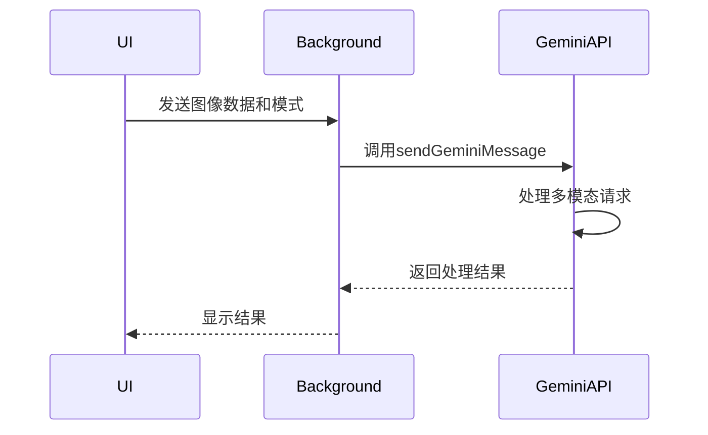
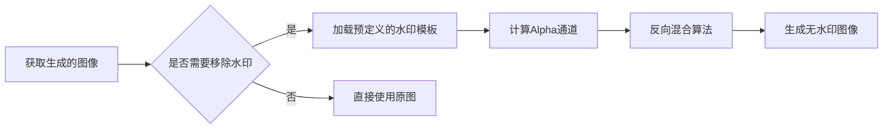
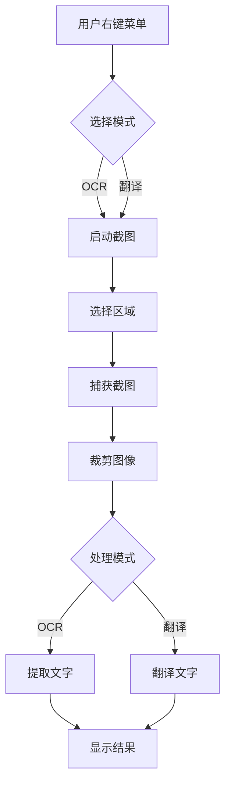

# 图像处理

<cite>
**本文档引用的文件**  
- [crop.js](file://content/toolbar/crop.js)
- [image.js](file://content/toolbar/image.js)
- [actions.js](file://content/toolbar/actions.js)
- [controller.js](file://content/toolbar/controller.js)
- [image_manager.js](file://background/managers/image_manager.js)
- [image_manager.js](file://sandbox/core/image_manager.js)
- [gemini_api.js](file://services/gemini_api.js)
- [tool_executor.js](file://background/handlers/session/prompt/tool_executor.js)
- [prompt_handler.js](file://background/handlers/session/prompt_handler.js)
- [watermark_remover.js](file://lib/watermark_remover.js)
- [generated_image.js](file://sandbox/render/generated_image.js)
- [crop_utils.js](file://lib/crop_utils.js)
</cite>

## 目录
1. [项目结构](#项目结构)
2. [核心组件](#核心组件)
3. [截图与区域选择实现](#截图与区域选择实现)
4. [图像管理器协作机制](#图像管理器协作机制)
5. [图像提示处理流程](#图像提示处理流程)
6. [OCR与翻译处理流程](#ocr与翻译处理流程)
7. [Gemini API集成](#gemini-api集成)
8. [水印移除与错误处理](#水印移除与错误处理)
9. [使用示例](#使用示例)

## 项目结构

本项目采用分层架构，主要分为以下模块：

- **background**：后台服务，负责核心逻辑、会话管理、图像捕获和与Gemini API的通信。
- **content**：内容脚本，注入到网页中，负责用户交互、截图区域选择和UI控制。
- **sandbox**：沙箱环境，用于安全地处理生成的图像和渲染内容。
- **services**：外部服务接口，包括Gemini API和文件上传。
- **lib**：通用工具库，包含水印移除、日志记录和消息传递等功能。

**Diagram sources**
- [content/toolbar/controller.js](file://content/toolbar/controller.js#L1-L301)
- [background/managers/image_manager.js](file://background/managers/image_manager.js#L1-L97)

## 核心组件

系统的核心组件包括：

- **ImageManager**：分别在后台和沙箱环境中管理图像的捕获、上传和处理。
- **Crop.js**：实现页面区域选择和截图功能。
- **handleImagePrompt**：根据模式触发不同的图像处理流程。
- **WatermarkRemover**：处理生成图像的水印移除。

**Section sources**
- [background/managers/image_manager.js](file://background/managers/image_manager.js#L1-L97)
- [sandbox/core/image_manager.js](file://sandbox/core/image_manager.js#L1-L281)
- [lib/watermark_remover.js](file://lib/watermark_remover.js#L1-L143)

## 截图与区域选择实现

### Crop.js 实现细节

`crop.js` 文件实现了页面区域选择和截图功能。当用户选择一个区域时，该脚本会创建一个画布元素，并使用 `drawImage` 方法将选定区域从原始图像中裁剪出来。

**Diagram sources**
- [content/toolbar/crop.js](file://content/toolbar/crop.js#L1-L30)
- [lib/crop_utils.js](file://lib/crop_utils.js#L1-L29)

**Section sources**
- [content/toolbar/crop.js](file://content/toolbar/crop.js#L1-L30)
- [lib/crop_utils.js](file://lib/crop_utils.js#L1-L29)

## 图像管理器协作机制

### 后台与沙箱环境协作

图像管理器在后台和沙箱环境中协同工作：

1. **后台ImageManager**：负责捕获屏幕截图和获取网络图像。
2. **沙箱ImageManager**：处理用户上传的文件、粘贴的图像和拖放操作。

**Diagram sources**
- [background/managers/image_manager.js](file://background/managers/image_manager.js#L1-L97)
- [sandbox/core/image_manager.js](file://sandbox/core/image_manager.js#L1-L281)

**Section sources**
- [background/managers/image_manager.js](file://background/managers/image_manager.js#L1-L97)
- [sandbox/core/image_manager.js](file://sandbox/core/image_manager.js#L1-L281)

## 图像提示处理流程

### handleImagePrompt 方法

`handleImagePrompt` 方法根据不同的模式触发相应的处理流程：

**Diagram sources**
- [content/toolbar/actions.js](file://content/toolbar/actions.js#L21-L73)
- [content/toolbar/controller.js](file://content/toolbar/controller.js#L120-L153)

**Section sources**
- [content/toolbar/actions.js](file://content/toolbar/actions.js#L21-L73)
- [content/toolbar/controller.js](file://content/toolbar/controller.js#L120-L153)

## OCR与翻译处理流程

### 处理模式实现

系统支持三种主要的图像处理模式：

1. **OCR模式**：提取图像中的文字内容。
2. **翻译模式**：将图像中的文字翻译成目标语言。
3. **分析模式**：对图像进行整体分析和描述。

**Diagram sources**
- [content/toolbar/actions.js](file://content/toolbar/actions.js#L21-L73)
- [background/handlers/session/prompt_handler.js](file://background/handlers/session/prompt_handler.js#L1-L103)

## Gemini API集成

### 图像数据传递

截图后，图像数据通过以下流程传递给Gemini API：

1. 截图被转换为Base64编码的数据URL。
2. 数据URL与处理模式一起发送到后台服务。
3. 后台服务调用Gemini API，将图像作为多模态输入。

**Diagram sources**
- [services/gemini_api.js](file://services/gemini_api.js#L26-L230)
- [background/handlers/session/prompt_handler.js](file://background/handlers/session/prompt_handler.js#L1-L103)

## 水印移除与错误处理

### 水印移除处理

生成的图像可能包含水印，系统使用 `WatermarkRemover` 类进行处理：

**Diagram sources**
- [lib/watermark_remover.js](file://lib/watermark_remover.js#L1-L143)
- [sandbox/render/generated_image.js](file://sandbox/render/generated_image.js#L1-L42)

**Section sources**
- [lib/watermark_remover.js](file://lib/watermark_remover.js#L1-L143)
- [sandbox/render/generated_image.js](file://sandbox/render/generated_image.js#L1-L42)

## 使用示例

### 用户选择区域进行OCR识别或翻译

以下是用户选择区域进行OCR识别或翻译的实际使用示例：

1. 用户右键点击页面，选择"截图并OCR"或"截图并翻译"。
2. 系统进入截图模式，用户选择一个包含文字的区域。
3. 系统捕获该区域的截图并自动裁剪。
4. 根据选择的模式，系统调用Gemini API进行文字提取或翻译。
5. 结果在UI中显示，用户可以查看提取的文字或翻译结果。

**Diagram sources**
- [content/toolbar/controller.js](file://content/toolbar/controller.js#L119-L153)
- [content/toolbar/dispatch.js](file://content/toolbar/dispatch.js#L33-L63)

**Section sources**
- [content/toolbar/controller.js](file://content/toolbar/controller.js#L119-L153)
- [content/toolbar/dispatch.js](file://content/toolbar/dispatch.js#L33-L63)