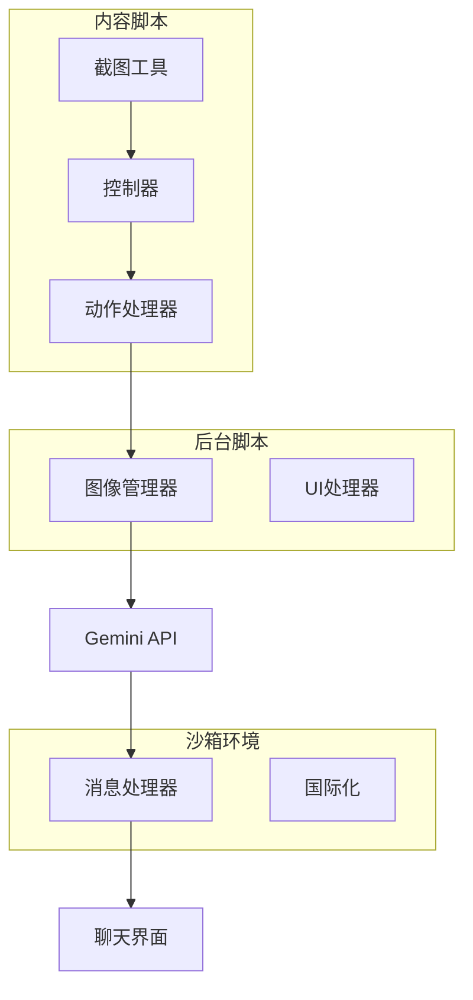
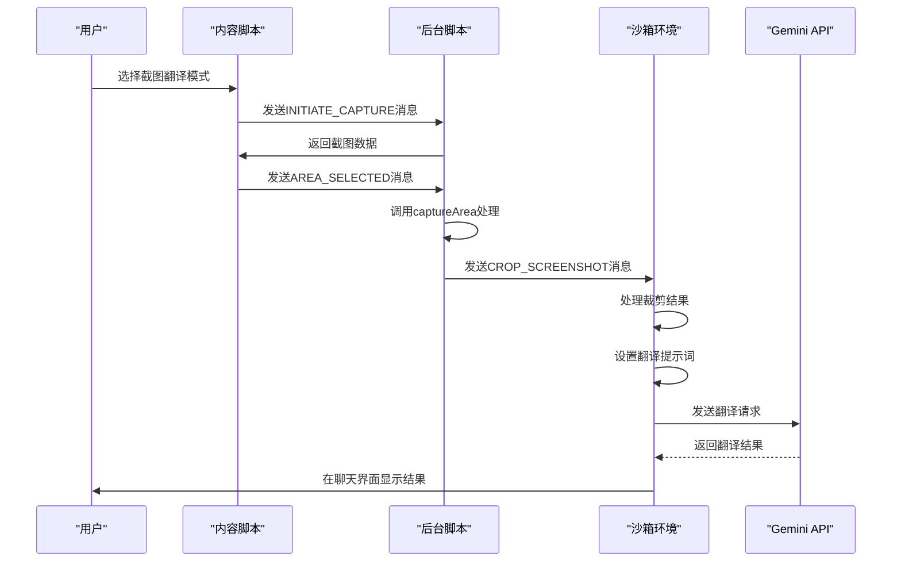
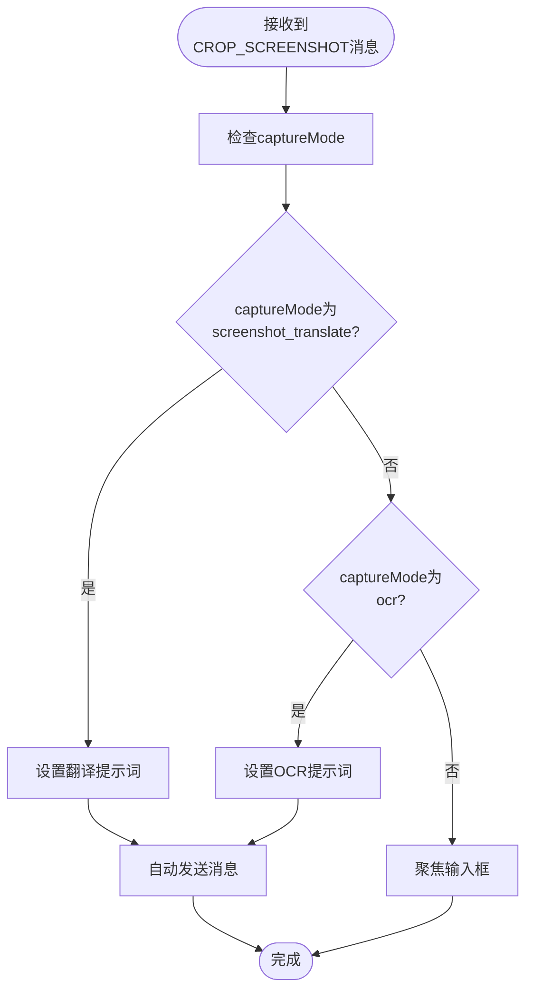
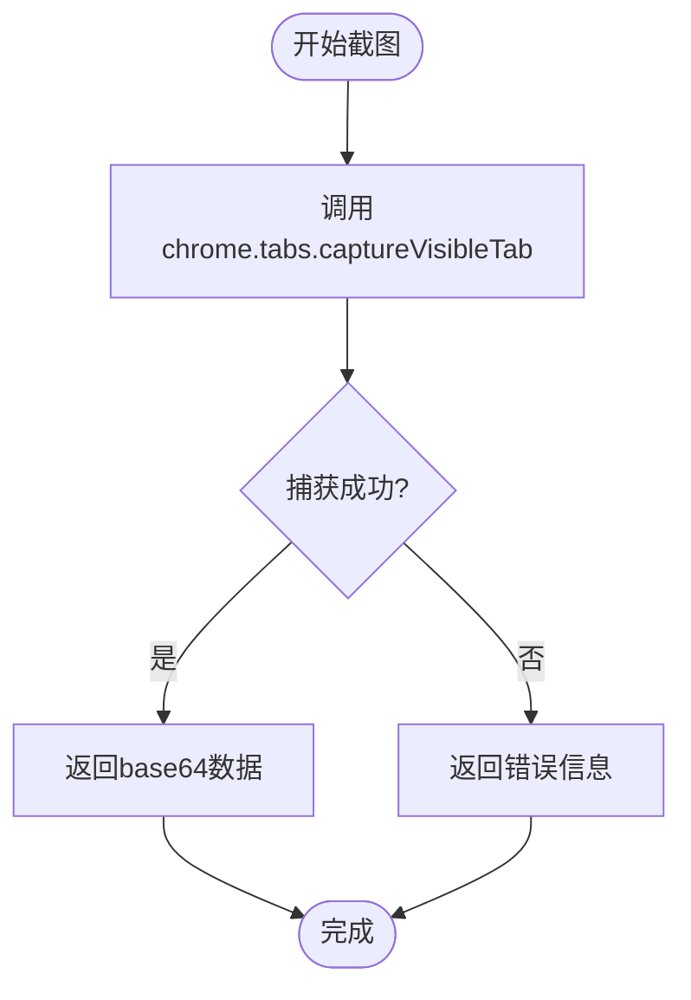
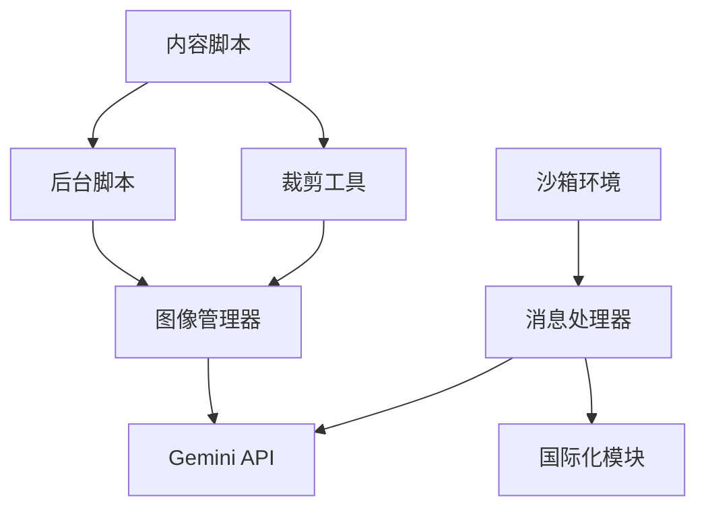

# 图像翻译

<cite>
**本文档引用的文件**  
- [message_handler.js](file://sandbox/controllers/message_handler.js)
- [gemini_api.js](file://services/gemini_api.js)
- [crop.js](file://content/toolbar/crop.js)
- [image_manager.js](file://background/managers/image_manager.js)
- [controller.js](file://content/toolbar/controller.js)
- [ui.js](file://background/handlers/ui.js)
- [actions.js](file://content/toolbar/actions.js)
- [i18n.js](file://sandbox/core/i18n.js)
- [crop_utils.js](file://lib/crop_utils.js)
- [watermark_remover.js](file://lib/watermark_remover.js)
</cite>

## 目录
1. [简介](#简介)
2. [项目结构](#项目结构)
3. [核心组件](#核心组件)
4. [架构概述](#架构概述)
5. [详细组件分析](#详细组件分析)
6. [依赖分析](#依赖分析)
7. [性能考虑](#性能考虑)
8. [故障排除指南](#故障排除指南)
9. [结论](#结论)

## 简介
本文档详细描述了基于截图的视觉翻译功能实现机制。当用户选择“截图翻译”模式（captureMode为'screenshot_translate'）时，系统会自动启动翻译工作流。该功能通过集成Gemini API实现多语言图像内容翻译，并将结果在聊天界面中呈现。文档将阐述从用户选择网页片段到系统自动执行翻译的完整流程，包括语言检测、翻译准确性和用户反馈机制，并说明与纯文本翻译的区别及优势。

## 项目结构
系统采用分层架构设计，主要分为内容脚本（content）、后台脚本（background）和沙箱环境（sandbox）三大模块。图像翻译功能涉及多个组件协同工作：内容脚本负责用户交互和截图捕获；后台脚本管理图像处理和API通信；沙箱环境处理消息响应和UI更新。这种分离设计确保了安全性和可维护性。

**图表来源**  
- [controller.js](file://content/toolbar/controller.js#L1-L301)
- [message_handler.js](file://sandbox/controllers/message_handler.js#L1-L365)

## 核心组件
图像翻译功能的核心在于多个组件的紧密协作。`message_handler.js`作为消息中枢，处理来自用户界面的各种请求，特别是截图结果和翻译指令。`gemini_api.js`负责与Gemini服务进行通信，发送包含图像数据的请求并接收翻译结果。`crop.js`和`crop_utils.js`共同完成图像裁剪功能，确保用户选择的区域被精确提取。这些组件通过标准化的消息传递机制实现无缝集成。

**章节来源**  
- [message_handler.js](file://sandbox/controllers/message_handler.js#L1-L365)
- [gemini_api.js](file://services/gemini_api.js#L1-L230)
- [crop_utils.js](file://lib/crop_utils.js#L1-L29)

## 架构概述
系统架构采用事件驱动模式，以消息传递为核心机制。当用户触发截图翻译操作时，事件流从内容脚本开始，经过后台脚本处理，最终在沙箱环境中完成响应。整个流程体现了清晰的职责分离：内容脚本专注于用户交互，后台脚本负责业务逻辑和外部通信，沙箱环境则专注于安全的消息处理和界面更新。

**图表来源**  
- [ui.js](file://background/handlers/ui.js#L1-L195)
- [message_handler.js](file://sandbox/controllers/message_handler.js#L1-L365)

## 详细组件分析

### 消息处理器分析
`message_handler.js`是整个图像翻译工作流的关键组件，负责协调各个阶段的操作。当接收到"CROP_SCREENSHOT"消息时，它会根据当前的captureMode决定后续操作。对于'screenshot_translate'模式，处理器会自动设置翻译提示词并触发消息发送。

#### 消息处理流程

**图表来源**  
- [message_handler.js](file://sandbox/controllers/message_handler.js#L318-L341)

**章节来源**  
- [message_handler.js](file://sandbox/controllers/message_handler.js#L1-L365)

### 图像管理器分析
`image_manager.js`负责图像数据的捕获和处理。它提供了captureScreenshot和captureArea等核心方法，能够获取当前标签页的可见区域或用户选择的特定区域。该组件作为内容脚本和后台逻辑之间的桥梁，确保图像数据能够正确传递。

#### 图像捕获流程

**图表来源**  
- [image_manager.js](file://background/managers/image_manager.js#L1-L97)

**章节来源**  
- [image_manager.js](file://background/managers/image_manager.js#L1-L97)

### 国际化支持分析
系统通过`i18n.js`提供全面的国际化支持，确保不同语言环境下的用户体验一致性。对于图像翻译功能，系统预定义了多种语言的提示词模板，能够根据用户界面语言自动选择合适的翻译指令。

#### 翻译提示词配置
| 提示词类型 | 中文内容 | 英文内容 |
|-----------|---------|--------|
| OCR提示 | 请识别并提取这张图片中的文字 (OCR)。仅输出识别到的文本内容，不需要任何解释。 | Please OCR this image. Extract the text content exactly as is, without any explanation. |
| 截图翻译提示 | 请识别这张图片中的文字并将其翻译成中文。仅输出翻译后的内容。 | Please extract the text from this image and translate it into English. Output ONLY the translation. |

**图表来源**  
- [i18n.js](file://sandbox/core/i18n.js#L62-L73)

**章节来源**  
- [i18n.js](file://sandbox/core/i18n.js#L1-L215)

## 依赖分析
系统各组件之间存在明确的依赖关系。内容脚本依赖于后台脚本提供的图像捕获能力，而消息处理器则依赖于国际化模块提供的语言资源。Gemini API作为外部依赖，为系统提供核心的翻译能力。这种依赖结构通过模块化设计得到有效管理，确保了系统的可扩展性和可维护性。

**图表来源**  
- [controller.js](file://content/toolbar/controller.js#L1-L301)
- [message_handler.js](file://sandbox/controllers/message_handler.js#L1-L365)

**章节来源**  
- [controller.js](file://content/toolbar/controller.js#L1-L301)
- [actions.js](file://content/toolbar/actions.js#L1-L197)

## 性能考虑
图像翻译功能在性能方面进行了多项优化。首先，系统采用异步处理机制，避免阻塞用户界面；其次，图像裁剪操作在客户端完成，减少了数据传输量；最后，通过缓存机制和连接复用，提高了与Gemini API的通信效率。这些优化措施确保了即使在处理大型图像时，系统也能保持良好的响应速度。

## 故障排除指南
当图像翻译功能出现问题时，可以按照以下步骤进行排查：
1. 检查用户是否已正确登录Gemini服务
2. 验证截图区域是否包含可识别的文字内容
3. 确认网络连接是否稳定
4. 检查浏览器扩展权限设置
5. 查看控制台日志获取详细错误信息

系统在`message_handler.js`中实现了完善的错误处理机制，能够捕获并报告常见的运行时异常，如截图失败、API调用超时等。

**章节来源**  
- [message_handler.js](file://sandbox/controllers/message_handler.js#L337-L340)
- [gemini_api.js](file://services/gemini_api.js#L197-L218)

## 结论
基于截图的视觉翻译功能通过集成先进的图像处理和自然语言处理技术，为用户提供了一种直观高效的跨语言信息获取方式。与纯文本翻译相比，该功能的优势在于能够直接处理屏幕上的视觉内容，无需手动复制粘贴文本，特别适用于处理图片中的文字、图表说明等非可选中内容。系统的模块化设计和清晰的职责分离确保了功能的稳定性和可维护性，为未来的功能扩展奠定了良好基础。