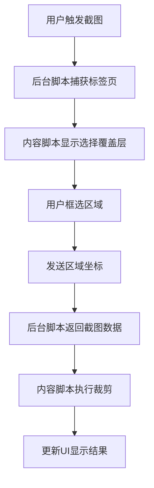
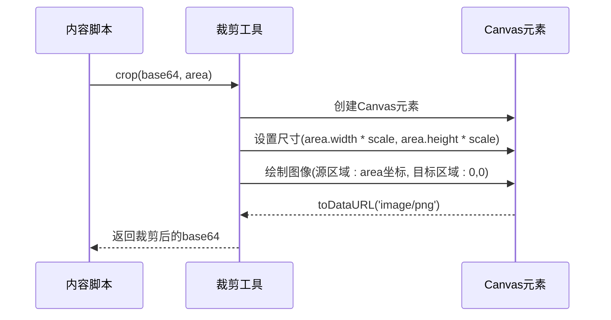
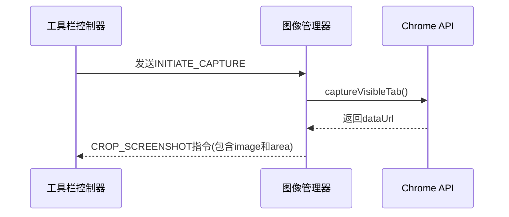
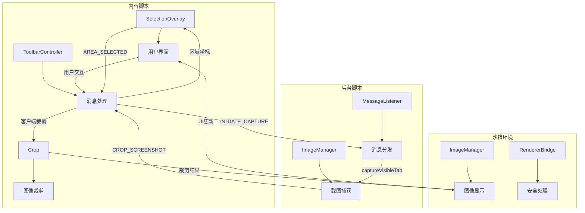
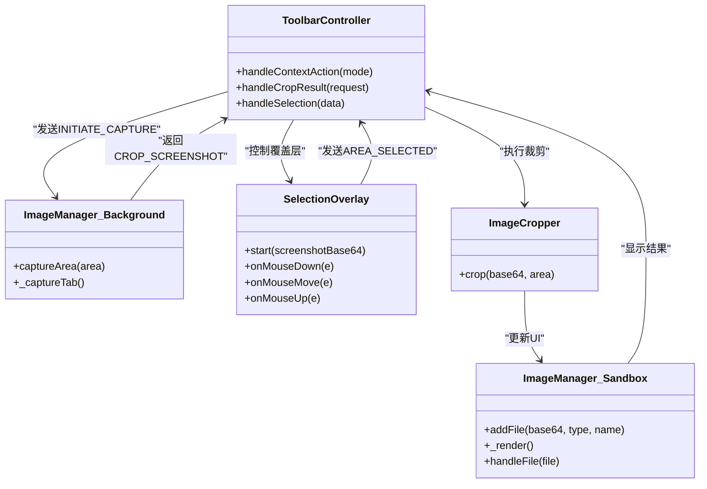

# 截图与选择

<cite>
**本文档引用的文件**   
- [crop.js](file://content/toolbar/crop.js)
- [image_manager.js](file://background/managers/image_manager.js)
- [image_manager.js](file://sandbox/core/image_manager.js)
- [selection.js](file://content/selection.js)
- [overlay.js](file://content/overlay.js)
- [controller.js](file://content/toolbar/controller.js)
- [messages.js](file://background/messages.js)
- [bridge.js](file://content/toolbar/bridge.js)
- [ui/manager.js](file://content/toolbar/ui/manager.js)
- [actions.js](file://content/toolbar/actions.js)
- [crop_utils.js](file://lib/crop_utils.js)
</cite>

## 目录
1. [功能概述](#功能概述)
2. [截图与选择流程](#截图与选择流程)
3. [核心组件分析](#核心组件分析)
4. [区域裁剪实现](#区域裁剪实现)
5. [图像管理机制](#图像管理机制)
6. [事件传递与数据流](#事件传递与数据流)
7. [多文件支持与用户交互](#多文件支持与用户交互)
8. [完整流程示例](#完整流程示例)
9. [架构图示](#架构图示)

## 功能概述

本功能允许用户通过工具栏选择页面区域进行截图，支持OCR识别、翻译、图像分析等多种应用场景。用户可通过右键菜单或工具栏按钮触发截图操作，系统将捕获当前标签页可见区域，并允许用户框选特定区域进行精确裁剪。

**Section sources**
- [controller.js](file://content/toolbar/controller.js#L103-L114)
- [image_manager.js](file://background/managers/image_manager.js#L82-L94)

## 截图与选择流程

截图与选择功能的完整流程包括：用户触发截图指令、捕获标签页可见区域、显示选择覆盖层、用户框选区域、发送裁剪指令、处理裁剪结果并更新UI。该流程涉及内容脚本、后台脚本和沙箱环境之间的协同工作。



**Diagram sources **
- [controller.js](file://content/toolbar/controller.js#L112)
- [image_manager.js](file://background/managers/image_manager.js#L82-L94)
- [overlay.js](file://content/overlay.js#L22-L194)

## 核心组件分析

### 内容脚本组件

内容脚本负责处理用户界面交互和区域选择。`SelectionOverlay`类管理选择覆盖层的显示和用户交互，`GeminiSelectionObserver`类监听鼠标事件以检测文本选择。

**Section sources**
- [overlay.js](file://content/overlay.js#L4-L213)
- [selection.js](file://content/selection.js#L5-L62)

### 后台脚本组件

后台脚本中的`ImageManager`类负责实际的截图捕获操作，通过`chrome.tabs.captureVisibleTab`API获取当前标签页的截图，并将结果返回给内容脚本进行进一步处理。

**Section sources**
- [image_manager.js](file://background/managers/image_manager.js#L48-L94)

### 沙箱环境组件

沙箱环境中的`ImageManager`类负责管理图像文件的显示和用户交互，包括多文件支持、拖拽上传、粘贴支持等功能，确保图像数据的安全处理。

**Section sources**
- [image_manager.js](file://sandbox/core/image_manager.js#L4-L280)

## 区域裁剪实现

### 裁剪方法实现

`content/toolbar/crop.js`中的`crop`方法基于base64图像和区域坐标实现精确裁剪。该方法创建一个临时的Canvas元素，根据区域坐标和设备像素比进行缩放，然后将指定区域的图像绘制到Canvas上，最后转换为新的base64数据URL。



**Diagram sources **
- [crop.js](file://content/toolbar/crop.js#L5-L27)
- [crop_utils.js](file://lib/crop_utils.js#L4-L28)

### 设备像素比处理

裁剪方法正确处理了高DPI屏幕的设备像素比问题，通过`area.pixelRatio`参数确保在不同分辨率设备上都能获得清晰的裁剪结果。源图像的绘制坐标和尺寸都乘以缩放因子，保证了裁剪精度。

**Section sources**
- [crop.js](file://content/toolbar/crop.js#L12-L20)
- [crop_utils.js](file://lib/crop_utils.js#L13-L21)

## 图像管理机制

### 后台截图捕获

`background/managers/image_manager.js`中的`captureArea`方法调用`chrome.tabs.captureVisibleTab`获取当前标签页截图。该方法首先捕获整个可见区域，然后返回包含截图数据和区域坐标的指令对象，供内容脚本进行客户端裁剪。



**Diagram sources **
- [image_manager.js](file://background/managers/image_manager.js#L82-L94)
- [controller.js](file://content/toolbar/controller.js#L112)

### 沙箱环境图像处理

沙箱环境中的`ImageManager`接收裁剪结果并更新UI预览。该组件管理一个文件数组，存储base64数据、MIME类型和文件名，并通过`_render`方法动态更新预览界面，支持多文件显示和删除操作。

**Section sources**
- [image_manager.js](file://sandbox/core/image_manager.js#L14-L280)

## 事件传递与数据流

### 消息传递机制

系统使用Chrome扩展的消息传递机制在不同上下文之间通信。后台脚本通过`setupMessageListener`注册消息监听器，将不同类型的请求分发给相应的处理器，确保截图相关消息被正确处理。

**Section sources**
- [messages.js](file://background/messages.js#L22-L81)

### 数据格式转换

截图数据以base64编码的PNG图像格式在系统中传递。从原始截图到最终裁剪结果，数据始终保持base64格式，便于在JavaScript环境中处理和显示，同时避免了二进制数据处理的复杂性。

**Section sources**
- [image_manager.js](file://background/managers/image_manager.js#L91-L93)
- [crop.js](file://content/toolbar/crop.js#L22)

## 多文件支持与用户交互

### 文件管理功能

沙箱环境的`ImageManager`支持多文件管理，用户可以同时上传和显示多个图像文件。文件数组存储每个文件的base64数据、类型和名称，预览界面为每个文件显示缩略图和删除按钮。

**Section sources**
- [image_manager.js](file://sandbox/core/image_manager.js#L14-L280)

### 用户交互细节

系统提供了丰富的用户交互功能，包括拖拽上传、粘贴支持、点击取消等。选择覆盖层显示提示信息，支持中文和英文双语，用户可以通过鼠标拖拽选择区域，或按ESC键取消操作。

**Section sources**
- [overlay.js](file://content/overlay.js#L78-L87)
- [image_manager.js](file://sandbox/core/image_manager.js#L88-L171)

## 完整流程示例

### 从触发到显示的完整流程

以下是从用户触发截图到图像显示在输入框的完整流程示例：

```mermaid
flowchart TD
A[用户右键点击页面] --> B[选择"截图并OCR"]
B --> C[发送INITIATE_CAPTURE消息]
C --> D[后台脚本捕获标签页截图]
D --> E[内容脚本显示选择覆盖层]
E --> F[用户拖拽选择区域]
F --> G[发送AREA_SELECTED消息(包含坐标)]
G --> H[后台返回CROP_SCREENSHOT指令]
H --> I[内容脚本执行客户端裁剪]
I --> J[调用handleImagePrompt]
J --> K[显示结果在输入框]
```

**Diagram sources **
- [controller.js](file://content/toolbar/controller.js#L103-L153)
- [image_manager.js](file://background/managers/image_manager.js#L82-L94)
- [overlay.js](file://content/overlay.js#L184-L194)

### 事件处理链

完整的事件处理链展示了各个组件如何协同工作：

1. 用户触发截图操作
2. `ToolbarController`接收动作并发送`INITIATE_CAPTURE`消息
3. `ImageManager`捕获标签页并返回截图数据
4. `SelectionOverlay`显示覆盖层等待用户选择
5. 用户选择区域后发送`AREA_SELECTED`消息
6. `ToolbarController`处理裁剪结果并调用相应功能

**Section sources**
- [controller.js](file://content/toolbar/controller.js#L103-L153)
- [overlay.js](file://content/overlay.js#L184-L194)

## 架构图示

### 系统架构概览



**Diagram sources **
- [controller.js](file://content/toolbar/controller.js#L7-L301)
- [image_manager.js](file://background/managers/image_manager.js#L4-L97)
- [image_manager.js](file://sandbox/core/image_manager.js#L4-L281)
- [overlay.js](file://content/overlay.js#L4-L213)

### 组件交互关系



**Diagram sources **
- [controller.js](file://content/toolbar/controller.js#L7-L301)
- [image_manager.js](file://background/managers/image_manager.js#L4-L97)
- [overlay.js](file://content/overlay.js#L4-L213)
- [crop.js](file://content/toolbar/crop.js#L4-L28)
- [image_manager.js](file://sandbox/core/image_manager.js#L4-L281)