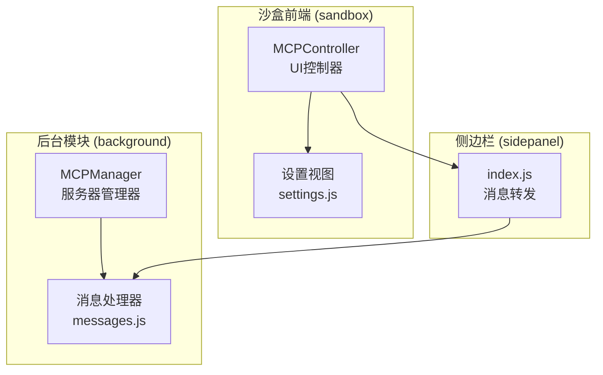
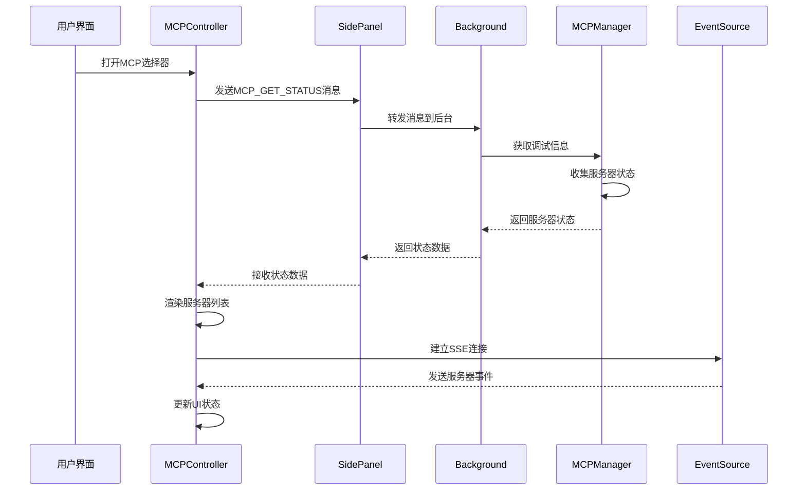
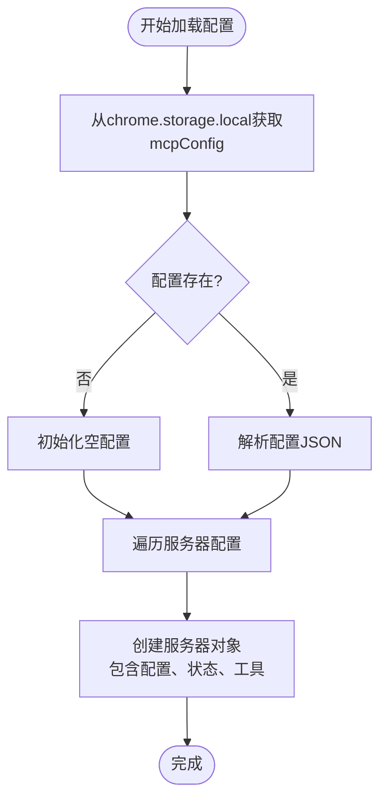
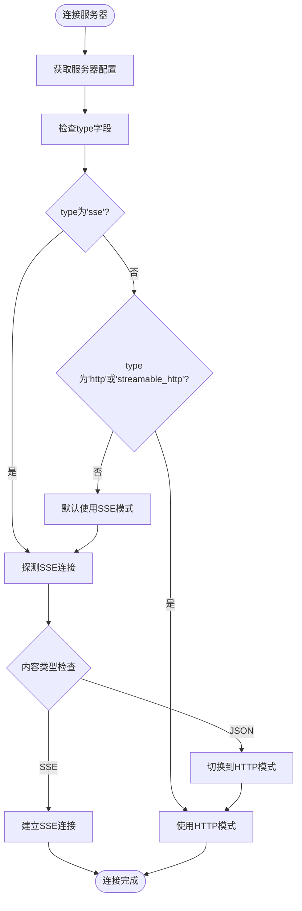
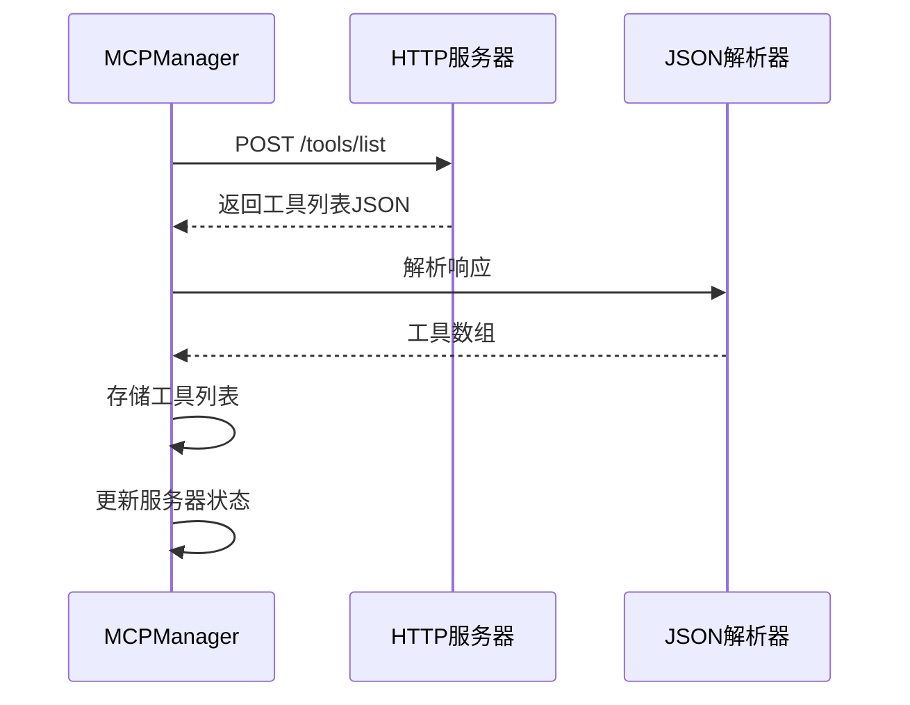
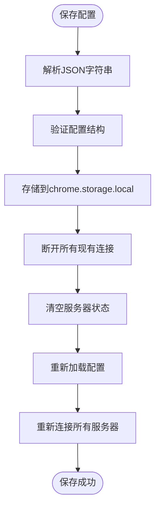
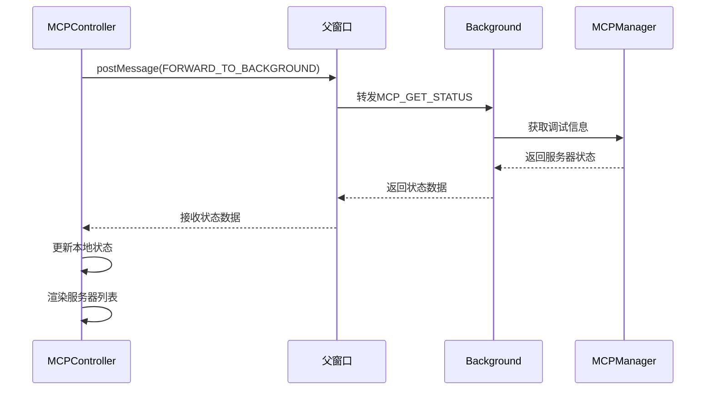
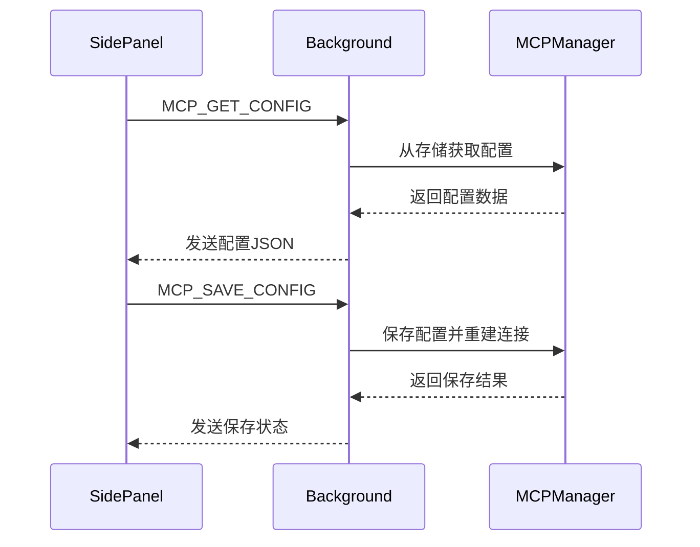
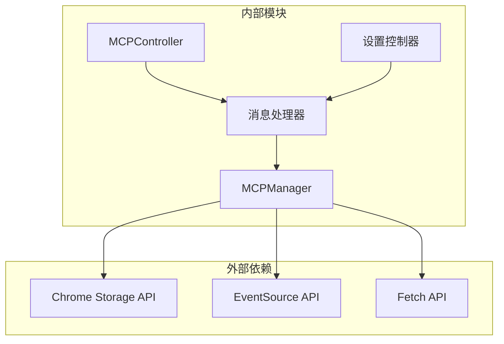

# MCP服务器管理

<cite>
**本文档引用的文件**
- [mcp_manager.js](file://background/managers/mcp_manager.js)
- [mcp_controller.js](file://sandbox/controllers/mcp_controller.js)
- [messages.js](file://background/messages.js)
- [settings.js](file://sandbox/ui/settings.js)
- [settings.js](file://sandbox/ui/templates/settings.js)
- [index.js](file://sidepanel/index.js)
</cite>

## 目录
1. [简介](#简介)
2. [项目结构](#项目结构)
3. [核心组件](#核心组件)
4. [架构概览](#架构概览)
5. [详细组件分析](#详细组件分析)
6. [依赖关系分析](#依赖关系分析)
7. [性能考虑](#性能考虑)
8. [故障排除指南](#故障排除指南)
9. [结论](#结论)
10. [附录](#附录)

## 简介

MCP（Model Context Protocol）服务器管理功能是Gemini Nexus扩展中的重要组成部分，负责管理外部AI工具服务器的连接和通信。该功能通过Chrome扩展的存储系统管理服务器配置，自动建立连接，并提供完整的UI界面供用户管理和监控服务器状态。

## 项目结构

MCP服务器管理功能分布在三个主要模块中：



**图表来源**
- [mcp_manager.js](file://background/managers/mcp_manager.js#L1-L530)
- [messages.js](file://background/messages.js#L1-L82)
- [mcp_controller.js](file://sandbox/controllers/mcp_controller.js#L1-L221)

**章节来源**
- [mcp_manager.js](file://background/managers/mcp_manager.js#L1-L530)
- [mcp_controller.js](file://sandbox/controllers/mcp_controller.js#L1-L221)
- [messages.js](file://background/messages.js#L1-L82)

## 核心组件

### MCPManager - 服务器管理器

MCPManager是整个MCP功能的核心类，负责：
- 从Chrome存储加载服务器配置
- 自动连接所有启用的服务器
- 管理服务器连接状态
- 处理不同类型的连接模式
- 提供工具发现和执行功能

### MCPController - UI控制器

MCPController负责UI层面的服务器管理：
- 获取服务器状态并渲染列表
- 处理用户选择和取消选择
- 更新标签显示选中的服务器
- 提供服务器状态查询接口

### 消息通信层

通过Chrome扩展的消息传递机制实现前后端通信：
- 设置面板发送配置请求
- 后台管理器响应状态查询
- 实现双向数据同步

**章节来源**
- [mcp_manager.js](file://background/managers/mcp_manager.js#L2-L69)
- [mcp_controller.js](file://sandbox/controllers/mcp_controller.js#L5-L221)
- [messages.js](file://background/messages.js#L41-L67)

## 架构概览

MCP服务器管理采用分层架构设计，确保了清晰的职责分离和良好的可维护性：



**图表来源**
- [mcp_controller.js](file://sandbox/controllers/mcp_controller.js#L88-L99)
- [messages.js](file://background/messages.js#L63-L67)
- [mcp_manager.js](file://background/managers/mcp_manager.js#L71-L150)

## 详细组件分析

### MCPManager - 服务器管理器

#### 配置加载机制

MCPManager通过`loadConfig`方法从Chrome存储中加载服务器配置：



**图表来源**
- [mcp_manager.js](file://background/managers/mcp_manager.js#L21-L38)

#### 连接模式决策

MCPManager根据配置的`type`字段决定连接模式：



**图表来源**
- [mcp_manager.js](file://background/managers/mcp_manager.js#L71-L150)

#### HTTP模式工具发现

对于HTTP模式的服务器，MCPManager使用直接POST请求获取工具列表：



**图表来源**
- [mcp_manager.js](file://background/managers/mcp_manager.js#L153-L213)

#### 保存配置流程

保存配置时，MCPManager会完全重建连接以应用新配置：



**图表来源**
- [mcp_manager.js](file://background/managers/mcp_manager.js#L40-L61)

**章节来源**
- [mcp_manager.js](file://background/managers/mcp_manager.js#L21-L213)

### MCPController - UI控制器

#### 服务器状态获取

MCPController通过postMessage机制向后台请求服务器状态：



**图表来源**
- [mcp_controller.js](file://sandbox/controllers/mcp_controller.js#L88-L99)
- [messages.js](file://background/messages.js#L63-L67)

#### 服务器列表渲染

MCPController根据服务器状态动态渲染UI元素：

| 状态 | 显示样式 | 连接状态 | 工具数量 |
|------|----------|----------|----------|
| connected | 绿色连接点 | 已连接 | 显示工具数 |
| disconnected | 灰色连接点 | 未连接 | 显示0 |
| error | 红色连接点 | 错误状态 | 显示0 |

**章节来源**
- [mcp_controller.js](file://sandbox/controllers/mcp_controller.js#L101-L147)

### 消息通信机制

#### 设置面板到后台的消息传递



**图表来源**
- [messages.js](file://background/messages.js#L49-L67)
- [settings.js](file://sandbox/ui/settings.js#L234-L247)

**章节来源**
- [messages.js](file://background/messages.js#L41-L81)
- [settings.js](file://sandbox/ui/settings.js#L234-L247)

## 依赖关系分析

MCP服务器管理功能的依赖关系如下：



**图表来源**
- [mcp_manager.js](file://background/managers/mcp_manager.js#L1-L530)
- [mcp_controller.js](file://sandbox/controllers/mcp_controller.js#L1-L221)
- [messages.js](file://background/messages.js#L1-L82)

### 组件耦合度分析

- **MCPManager** 与 **Chrome API** 的耦合度较高，但封装良好
- **MCPController** 与 **UI框架** 耦合度中等
- **消息处理器** 提供了良好的抽象层，降低模块间耦合

**章节来源**
- [mcp_manager.js](file://background/managers/mcp_manager.js#L1-L530)
- [mcp_controller.js](file://sandbox/controllers/mcp_controller.js#L1-L221)

## 性能考虑

### 连接优化策略

1. **延迟初始化**：仅在需要时建立连接
2. **连接池管理**：复用现有的连接而非频繁重建
3. **超时控制**：为请求设置合理的超时时间
4. **错误重试**：实现智能的重试机制

### 内存管理

- 及时清理EventSource连接
- 合理管理工具列表缓存
- 避免内存泄漏

## 故障排除指南

### 常见配置错误

#### 1. 缺少必需字段

**问题症状**：服务器状态显示为"error"
**解决方案**：确保配置包含以下字段之一
- `url`: 主要的服务器URL
- `endpoint`: 兼容的端点地址

#### 2. 类型配置错误

**问题症状**：连接失败或行为异常
**解决方案**：正确设置`type`字段
- `sse`: 标准SSE连接模式
- `http`: HTTP直连模式
- `streamable_http`: 流式HTTP模式

#### 3. JSON格式错误

**问题症状**：保存配置时报错
**解决方案**：确保JSON格式正确
- 使用有效的JSON语法
- 包含必需的`mcpServers`键

### 连接问题诊断

#### 1. SSE连接失败

**诊断步骤**：
1. 检查网络连接是否正常
2. 验证服务器URL可达性
3. 查看浏览器控制台错误信息
4. 确认服务器支持SSE协议

#### 2. HTTP模式问题

**诊断步骤**：
1. 确认服务器支持HTTP直连
2. 检查POST请求是否被正确处理
3. 验证工具列表响应格式

#### 3. 工具发现失败

**诊断步骤**：
1. 检查服务器是否返回有效的工具列表
2. 验证响应格式符合预期
3. 确认网络请求未被拦截

**章节来源**
- [mcp_manager.js](file://background/managers/mcp_manager.js#L79-L83)
- [mcp_manager.js](file://background/managers/mcp_manager.js#L107-L113)

## 结论

MCP服务器管理功能提供了完整而灵活的服务器连接和管理解决方案。通过清晰的架构设计和完善的错误处理机制，该功能能够有效管理多种类型的AI工具服务器连接。

### 主要优势

1. **多模式支持**：同时支持SSE和HTTP两种连接模式
2. **自动探测**：智能检测服务器能力并选择最佳连接方式
3. **状态管理**：完整的连接状态跟踪和UI反馈
4. **配置灵活**：支持动态配置更新和热重载

### 未来改进方向

1. **连接池优化**：实现更高效的连接复用机制
2. **错误恢复**：增强自动重连和故障转移能力
3. **性能监控**：添加详细的性能指标收集
4. **安全增强**：实现更严格的安全验证机制

## 附录

### 服务器配置JSON格式示例

```json
{
  "mcpServers": {
    "local-server": {
      "name": "本地服务器",
      "url": "http://localhost:3000/sse",
      "type": "sse",
      "enabled": true
    },
    "http-server": {
      "name": "HTTP服务器",
      "url": "http://localhost:3001/api",
      "type": "http",
      "enabled": true
    }
  }
}
```

### 配置字段说明

| 字段名 | 类型 | 必需 | 描述 |
|--------|------|------|------|
| name | string | 否 | 服务器显示名称 |
| url | string | 是 | 服务器URL地址 |
| type | string | 否 | 连接类型 (sse/http/streamable_http) |
| enabled | boolean | 否 | 是否启用服务器 |

### 状态枚举值

- `disconnected`: 未连接
- `connecting`: 连接中
- `connected`: 已连接
- `error`: 连接错误