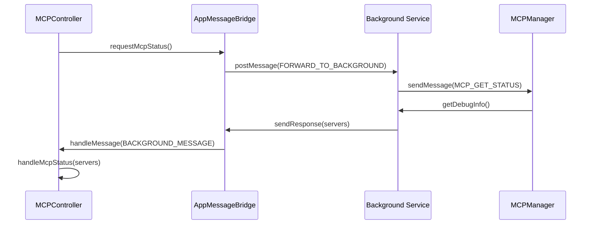
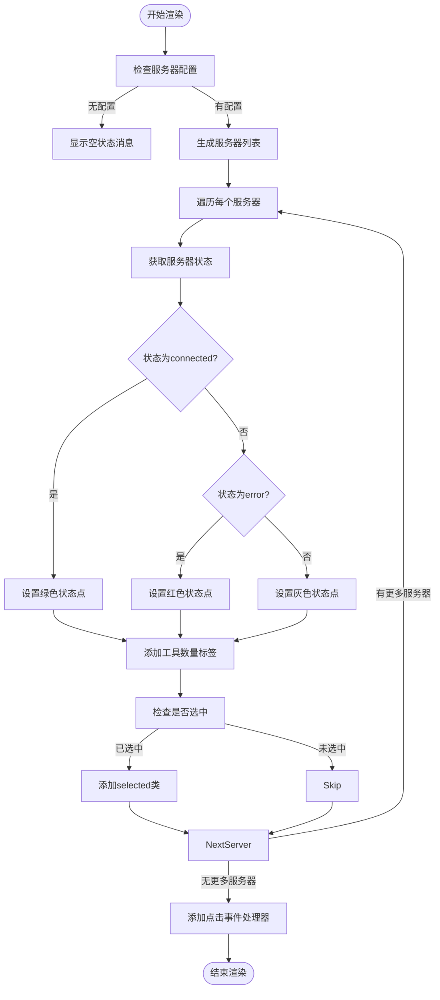
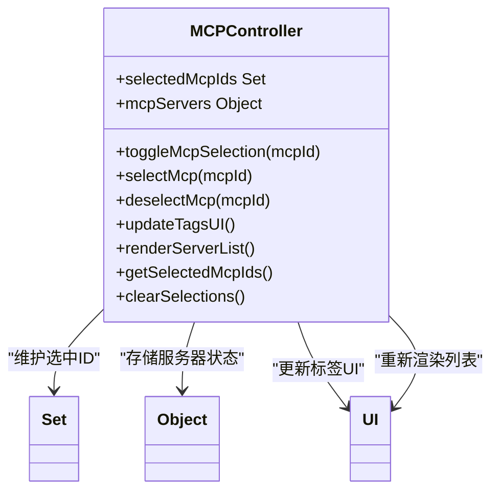
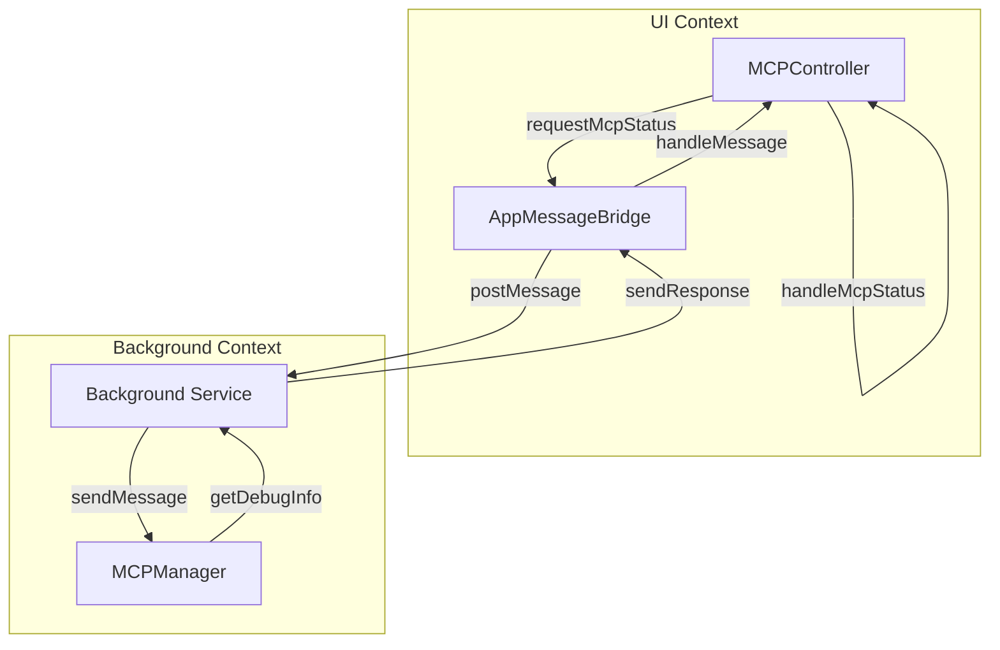

# UI状态同步

<cite>
**本文档引用的文件**
- [mcp_controller.js](file://sandbox/controllers/mcp_controller.js)
- [mcp_manager.js](file://background/managers/mcp_manager.js)
- [messages.js](file://background/messages.js)
- [input.css](file://css/input.css)
- [messaging.js](file://sandbox/boot/messaging.js)
- [ui_controller.js](file://sandbox/ui/ui_controller.js)
</cite>

## 目录
1. [简介](#简介)
2. [核心组件](#核心组件)
3. [状态查询与响应流程](#状态查询与响应流程)
4. [UI渲染机制](#ui渲染机制)
5. [用户交互逻辑](#用户交互逻辑)
6. [数据流与消息传递](#数据流与消息传递)

## 简介
本文档详细说明了MCP服务器UI状态同步的实现机制。系统通过MCPController管理UI层的服务器选择状态，并与后台服务进行通信以获取服务器状态信息。当用户与MCP选择器交互时，系统会向后台服务发送状态查询请求，接收服务器状态数据（包括连接状态、工具数量等），并动态更新UI显示。文档还阐述了用户如何通过点击服务器项进行选择、通过标签界面管理已选服务器以及清除选择等交互逻辑。

## 核心组件

MCP服务器UI状态同步系统由多个核心组件构成，这些组件协同工作以实现状态同步和用户交互功能。MCPController负责管理UI层的状态和用户交互，MCPManager在后台服务中管理MCP服务器的连接和状态，而消息传递系统则在不同上下文之间转发状态信息。

**Section sources**
- [mcp_controller.js](file://sandbox/controllers/mcp_controller.js#L5-L220)
- [mcp_manager.js](file://background/managers/mcp_manager.js#L2-L529)

## 状态查询与响应流程

### 状态查询机制
当用户点击MCP菜单项时，MCPController的`openPicker`方法被调用，该方法首先关闭其他操作菜单，然后通过`requestMcpStatus`方法向后台服务发送状态查询消息。该方法使用`window.parent.postMessage`向父窗口发送一个包含`FORWARD_TO_BACKGROUND`动作的消息，其有效载荷中包含`MCP_GET_STATUS`动作，指示后台服务返回MCP服务器状态。

**Diagram sources**
- [mcp_controller.js](file://sandbox/controllers/mcp_controller.js#L88-L93)
- [messaging.js](file://sandbox/boot/messaging.js#L4-L9)
- [messages.js](file://background/messages.js#L63-L66)
- [mcp_manager.js](file://background/managers/mcp_manager.js#L389-L403)

### 状态响应处理
后台服务接收到`MCP_GET_STATUS`请求后，通过`setupMessageListener`中的消息处理器调用MCPManager的`getDebugInfo`方法获取所有MCP服务器的调试信息，包括服务器ID、状态、类型、URL、POST URL、工具数量和工具名称列表。这些信息被打包成响应消息，通过消息传递系统返回给UI层。MCPController的`handleMcpStatus`方法接收到这些服务器状态数据后，将其存储在`mcpServers`对象中，并调用`renderServerList`方法更新UI显示。

**Section sources**
- [mcp_controller.js](file://sandbox/controllers/mcp_controller.js#L96-L99)
- [messages.js](file://background/messages.js#L63-L66)
- [mcp_manager.js](file://background/managers/mcp_manager.js#L389-L403)

## UI渲染机制

### 服务器列表渲染
`renderServerList`方法负责根据服务器状态数据生成服务器列表的UI。该方法首先检查是否存在服务器配置，如果没有配置则显示相应的提示信息。对于每个服务器，方法会根据其状态（connected、error）和工具数量动态渲染视觉元素。连接正常的服务器显示绿色状态点，错误的服务器显示红色状态点，同时显示工具数量标签。选中的服务器项会添加`selected`类以改变背景色。

**Diagram sources**
- [mcp_controller.js](file://sandbox/controllers/mcp_controller.js#L101-L137)
- [input.css](file://css/input.css#L559-L646)

### 视觉元素动态渲染
UI根据服务器状态动态渲染不同的视觉元素。状态点使用`mcp-status-dot`类，根据连接状态添加`connected`或`error`类来改变颜色。工具数量标签在服务器有工具时显示，使用`mcp-server-tools`类进行样式化。服务器项的选中状态通过`selected`类控制，改变背景色和复选框样式。错误状态的服务器项会降低透明度，表示不可用。

**Section sources**
- [mcp_controller.js](file://sandbox/controllers/mcp_controller.js#L118-L133)
- [input.css](file://css/input.css#L572-L598)

## 用户交互逻辑

### 服务器选择交互
用户可以通过点击服务器项来选择或取消选择MCP服务器。`toggleMcpSelection`方法处理选择切换逻辑：如果服务器已选中，则调用`deselectMcp`方法取消选择；如果未选中，则调用`selectMcp`方法进行选择。每次选择状态改变后，系统会更新标签UI并重新渲染服务器列表以反映最新的选择状态。

**Diagram sources**
- [mcp_controller.js](file://sandbox/controllers/mcp_controller.js#L149-L167)

### 标签管理与选择清除
选中的服务器会在UI顶部以标签形式显示，用户可以通过点击标签上的移除按钮来取消选择。`updateTagsUI`方法负责更新标签界面，根据`selectedMcpIds`集合中的服务器ID生成相应的标签元素。当没有服务器被选中时，隐藏标签容器。`clearSelections`方法用于清除所有选择，通常在开始新对话时调用，它会清空`selectedMcpIds`集合并更新标签UI。

**Section sources**
- [mcp_controller.js](file://sandbox/controllers/mcp_controller.js#L169-L197)
- [mcp_controller.js](file://sandbox/controllers/mcp_controller.js#L209-L213)

## 数据流与消息传递

### 消息传递架构
系统使用基于`postMessage`的消息传递机制在不同上下文之间通信。UI层通过`AppMessageBridge`类处理消息，该类负责将来自后台服务的消息分发给相应的控制器。当UI需要与后台服务通信时，通过`FORWARD_TO_BACKGROUND`动作将消息转发到后台，后台服务处理完成后通过`BACKGROUND_MESSAGE`动作将响应返回给UI。

**Diagram sources**
- [messaging.js](file://sandbox/boot/messaging.js#L4-L90)
- [messages.js](file://background/messages.js#L14-L81)
- [sidepanel\index.js](file://sidepanel/index.js#L178-L424)

### 数据流分析
MCP服务器状态数据流从后台服务的MCPManager开始，通过消息系统传递到UI层的MCPController。MCPManager从本地存储加载服务器配置，建立连接并维护服务器状态。当收到状态查询请求时，MCPManager收集所有服务器的调试信息并返回。UI层接收到这些数据后，将其存储在`mcpServers`对象中，并触发UI更新。用户的选择状态通过`selectedMcpIds`集合维护，该集合的内容可以通过`getSelectedMcpIds`方法提供给其他模块使用。

**Section sources**
- [mcp_manager.js](file://background/managers/mcp_manager.js#L21-L38)
- [mcp_controller.js](file://sandbox/controllers/mcp_controller.js#L8-L9)
- [mcp_controller.js](file://sandbox/controllers/mcp_controller.js#L199-L202)