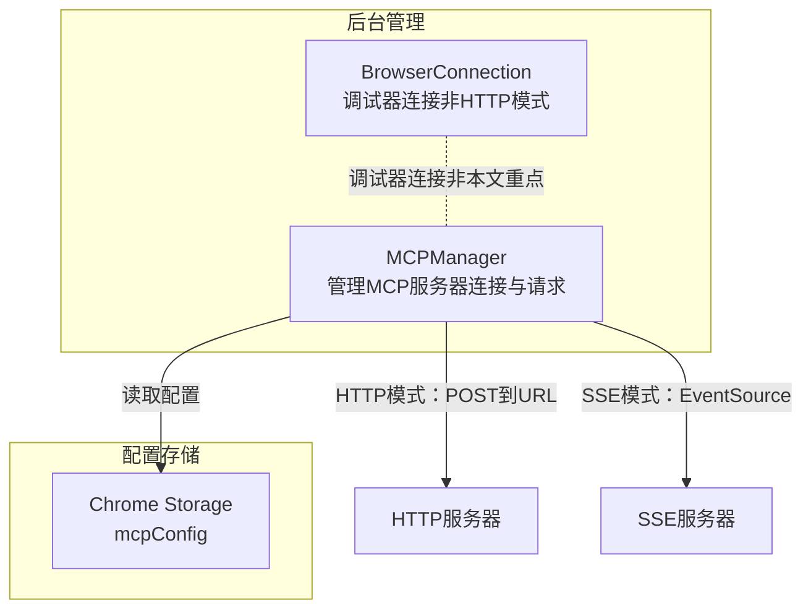
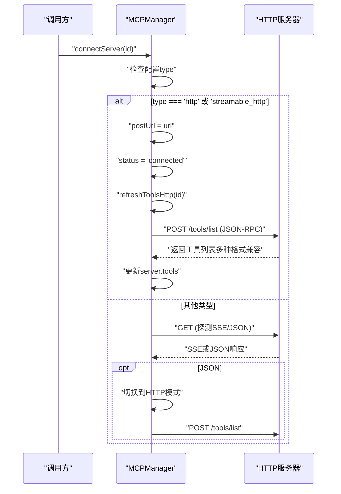
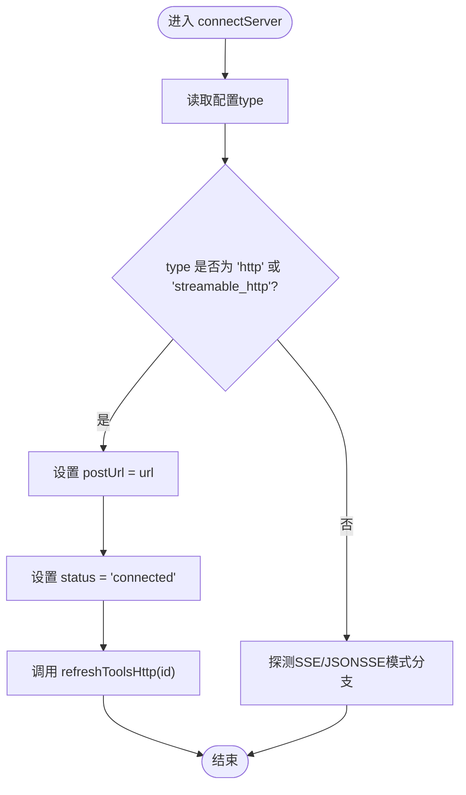
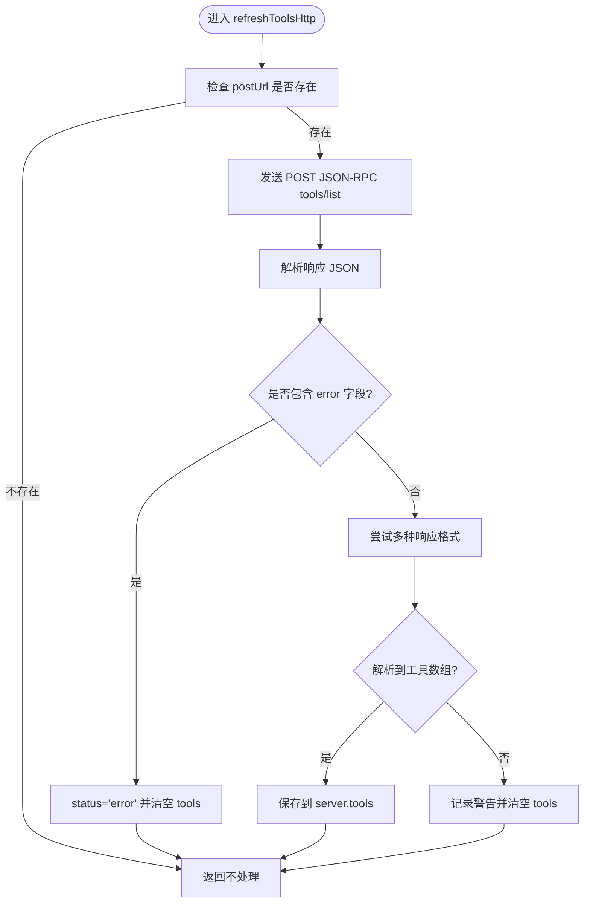
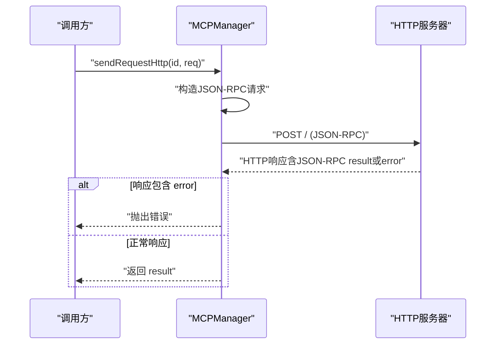
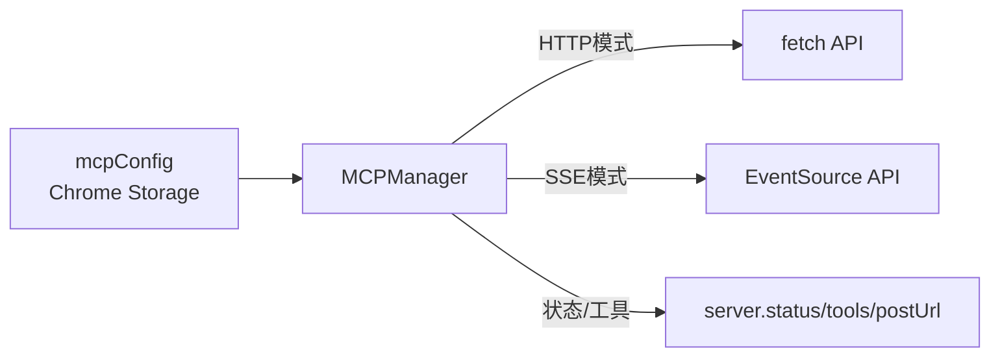

# HTTP连接

<cite>
**本文档引用的文件**
- [mcp_manager.js](file://background/managers/mcp_manager.js)
- [connection.js](file://background/control/connection.js)
</cite>

## 目录
1. [简介](#简介)
2. [项目结构](#项目结构)
3. [核心组件](#核心组件)
4. [架构总览](#架构总览)
5. [详细组件分析](#详细组件分析)
6. [依赖关系分析](#依赖关系分析)
7. [性能考量](#性能考量)
8. [故障排查指南](#故障排查指南)
9. [结论](#结论)

## 简介
本文件聚焦于“HTTP连接模式”的实现与行为，特别是当MCP服务器配置为type为'http'或'streamable_http'时的连接与请求流程。文档将详细说明：
- connectServer方法如何直接将配置的URL赋值给postUrl并设置status为'connected'，随后立即调用refreshToolsHttp获取工具列表
- refreshToolsHttp方法中发送JSON-RPC协议的POST请求流程，以及对多种响应格式的兼容性处理（result.tools、tools、result数组、直接数组等）
- HTTP模式下sendRequestHttp方法的同步请求响应机制与SSE模式的本质区别

## 项目结构
与HTTP连接模式直接相关的代码位于后台管理模块中，核心类为MCPManager，负责：
- 解析配置并建立连接
- 在HTTP模式下直接POST请求获取工具列表
- 在HTTP模式下同步发送JSON-RPC请求并等待响应
- 在SSE模式下通过事件流接收响应

图表来源
- [mcp_manager.js](file://background/managers/mcp_manager.js#L21-L38)
- [connection.js](file://background/control/connection.js#L8-L26)

章节来源
- [mcp_manager.js](file://background/managers/mcp_manager.js#L21-L38)
- [connection.js](file://background/control/connection.js#L8-L26)

## 核心组件
- MCPManager：负责加载配置、建立连接、刷新工具列表、发送请求、处理消息与状态
- BrowserConnection：用于调试器连接（与HTTP模式无关，仅作背景知识）

章节来源
- [mcp_manager.js](file://background/managers/mcp_manager.js#L2-L6)
- [connection.js](file://background/control/connection.js#L8-L26)

## 架构总览
HTTP连接模式的关键路径如下：
- 当type为'http'或'streamable_http'时，connectServer直接将配置URL赋值给postUrl并置status为'connected'，然后立即调用refreshToolsHttp
- refreshToolsHttp向postUrl发送JSON-RPC的tools/list请求，并兼容多种响应格式
- 发起工具调用时，若目标服务器处于HTTP模式，则使用sendRequestHttp进行同步请求；否则使用SSE模式的sendRequest

图表来源
- [mcp_manager.js](file://background/managers/mcp_manager.js#L71-L150)

章节来源
- [mcp_manager.js](file://background/managers/mcp_manager.js#L71-L150)

## 详细组件分析

### connectServer：HTTP模式的连接建立
- 输入：服务器ID与配置（包含url/endpoint与type）
- 行为：
  - 若type为'http'或'streamable_http'，直接将配置URL赋值给postUrl并设置status为'connected'
  - 立即调用refreshToolsHttp(id)以获取工具列表
- 输出：服务器状态变为'connected'，postUrl可用，工具列表已加载

图表来源
- [mcp_manager.js](file://background/managers/mcp_manager.js#L71-L96)

章节来源
- [mcp_manager.js](file://background/managers/mcp_manager.js#L71-L96)

### refreshToolsHttp：HTTP模式下的工具列表获取
- 请求：向postUrl发送JSON-RPC的tools/list请求
- 响应兼容性：
  - result.result.tools
  - result.tools
  - result（数组）
  - 直接数组
- 错误处理：若响应包含error字段，设置status为'error'并清空tools
- 成功后：将解析出的工具数组写入server.tools

图表来源
- [mcp_manager.js](file://background/managers/mcp_manager.js#L152-L213)

章节来源
- [mcp_manager.js](file://background/managers/mcp_manager.js#L152-L213)

### sendRequestHttp：HTTP模式下的同步请求响应
- 请求：构造JSON-RPC请求体，向postUrl发送POST请求
- 响应处理：
  - 若HTTP状态码非2xx，抛出错误
  - 解析响应JSON，若包含error字段，抛出错误
  - 返回result字段作为结果
- 特点：该方法为同步阻塞式，等待单次HTTP响应后返回

图表来源
- [mcp_manager.js](file://background/managers/mcp_manager.js#L229-L260)

章节来源
- [mcp_manager.js](file://background/managers/mcp_manager.js#L229-L260)

### 与SSE模式的本质区别
- HTTP模式（type=http/streamable_http）：
  - 直接使用fetch POST请求，无需EventSource
  - refreshToolsHttp与sendRequestHttp均为同步阻塞式
  - 适合无SSE能力或希望简化通信的场景
- SSE模式（默认type=sse）：
  - 使用EventSource监听服务器推送
  - refreshTools与sendRequest通过SSE通道接收响应
  - 适合需要双向事件流的MCP服务器

章节来源
- [mcp_manager.js](file://background/managers/mcp_manager.js#L87-L150)
- [mcp_manager.js](file://background/managers/mcp_manager.js#L308-L351)

## 依赖关系分析
- MCPManager依赖Chrome Storage读取mcpConfig，内部维护每个服务器的状态、postUrl、工具列表
- HTTP模式下，MCPManager直接依赖fetch API进行POST请求
- SSE模式下，MCPManager依赖EventSource API进行事件订阅

图表来源
- [mcp_manager.js](file://background/managers/mcp_manager.js#L21-L38)
- [mcp_manager.js](file://background/managers/mcp_manager.js#L71-L150)

章节来源
- [mcp_manager.js](file://background/managers/mcp_manager.js#L21-L38)
- [mcp_manager.js](file://background/managers/mcp_manager.js#L71-L150)

## 性能考量
- HTTP模式优势
  - 无SSE连接开销，减少资源占用
  - 工具列表与请求均采用同步HTTP，延迟可控
- SSE模式优势
  - 服务器可主动推送通知与事件，交互更灵活
  - 适合长连接与实时数据流场景
- 建议
  - 对于简单工具调用与静态工具列表，优先选择HTTP模式
  - 对于需要实时事件推送的复杂MCP服务器，选择SSE模式

## 故障排查指南
- 无法连接HTTP服务器
  - 检查配置type是否为'http'或'streamable_http'
  - 确认postUrl有效且可访问
  - 查看控制台日志中的错误信息
- 工具列表为空
  - 确认服务器返回的响应格式符合兼容规则（result.tools、tools、result数组、直接数组）
  - 若服务器返回错误，检查result.error字段
- 请求失败
  - 检查HTTP状态码与响应JSON中的error字段
  - 确认服务器端JSON-RPC实现正确

章节来源
- [mcp_manager.js](file://background/managers/mcp_manager.js#L152-L213)
- [mcp_manager.js](file://background/managers/mcp_manager.js#L229-L260)

## 结论
当MCP服务器配置为HTTP模式（type=http或streamable_http）时，系统采用直接的HTTP POST通信方式：
- connectServer直接设置postUrl与status，并立即刷新工具列表
- refreshToolsHttp兼容多种响应格式，确保工具发现的鲁棒性
- sendRequestHttp提供同步阻塞式请求响应，适合简单、确定性的工具调用
与SSE模式相比，HTTP模式在实现与部署上更为简洁，适合大多数工具集成场景。