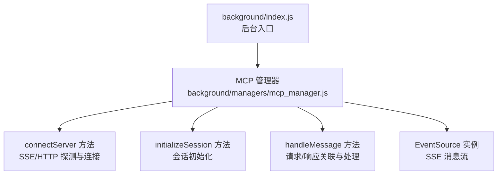
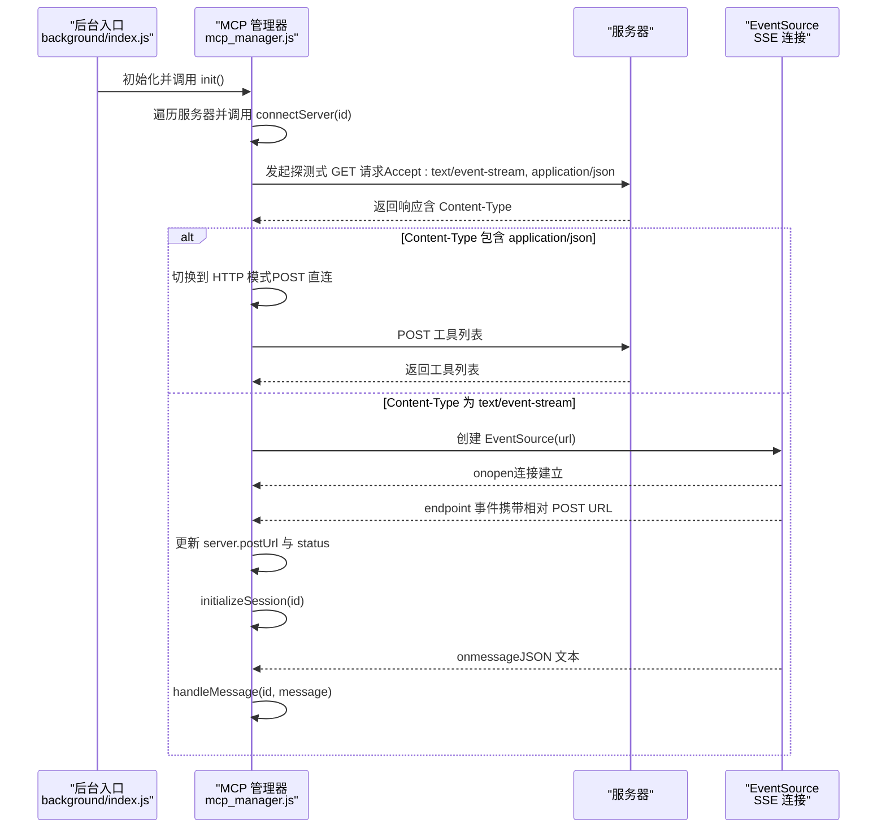
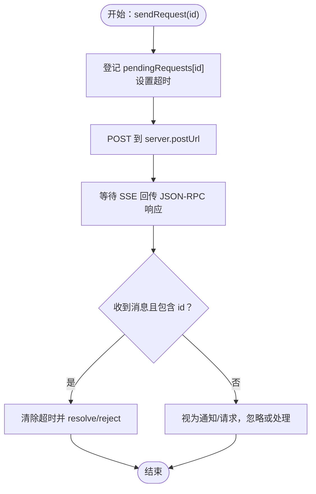
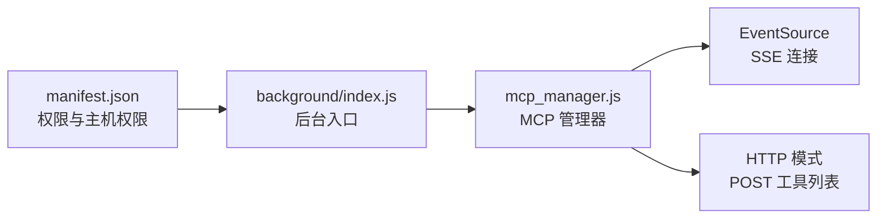

# SSE连接

<cite>
**本文引用的文件**
- [background/managers/mcp_manager.js](file://background/managers/mcp_manager.js)
- [background/index.js](file://background/index.js)
- [manifest.json](file://manifest.json)
</cite>

## 目录
1. [简介](#简介)
2. [项目结构](#项目结构)
3. [核心组件](#核心组件)
4. [架构总览](#架构总览)
5. [详细组件分析](#详细组件分析)
6. [依赖关系分析](#依赖关系分析)
7. [性能考量](#性能考量)
8. [故障排查指南](#故障排查指南)
9. [结论](#结论)

## 简介
本文件聚焦于SSE（Server-Sent Events）连接机制，围绕 MCP（Model Context Protocol）管理器中的 connectServer 方法展开，系统性说明：
- 如何通过一次探测式 fetch 请求检测服务器响应的 Content-Type；
- 当 Content-Type 为 text/event-stream 时，如何建立 EventSource 连接；
- onopen、onerror 事件处理及对连接状态的影响；
- 如何监听 'endpoint' 事件以获取 POST URL，并在连接成功后将 server.status 更新为 'connected'；
- 触发 initializeSession 初始化流程；
- 在 SSE 连接下消息响应的处理机制，包括 onmessage 中 JSON 数据解析与 handleMessage 对请求/响应相关性的处理。

## 项目结构
与本主题直接相关的文件主要位于 background/managers 目录，其中 MCP 管理器负责管理多个 MCP 服务器的连接与消息收发；后台入口 background/index.js 负责初始化 MCP 管理器并启动连接。

图表来源
- [background/index.js](file://background/index.js#L24-L26)
- [background/managers/mcp_manager.js](file://background/managers/mcp_manager.js#L71-L150)
- [background/managers/mcp_manager.js](file://background/managers/mcp_manager.js#L262-L285)
- [background/managers/mcp_manager.js](file://background/managers/mcp_manager.js#L370-L385)

章节来源
- [background/index.js](file://background/index.js#L1-L30)
- [manifest.json](file://manifest.json#L1-L93)

## 核心组件
- MCP 管理器：集中管理 MCP 服务器配置、连接状态、工具列表、消息收发与会话初始化。
- connectServer：负责根据配置选择连接模式（SSE 或 HTTP），并通过探测式请求判断服务器能力。
- EventSource：用于接收服务器推送的消息流，处理 endpoint 事件与通用消息。
- initializeSession：在收到 endpoint 后进行初始化通知与工具列表拉取。
- handleMessage：基于 JSON-RPC id 关联请求与响应，实现异步等待与超时控制。

章节来源
- [background/managers/mcp_manager.js](file://background/managers/mcp_manager.js#L2-L6)
- [background/managers/mcp_manager.js](file://background/managers/mcp_manager.js#L71-L150)
- [background/managers/mcp_manager.js](file://background/managers/mcp_manager.js#L262-L285)
- [background/managers/mcp_manager.js](file://background/managers/mcp_manager.js#L370-L385)

## 架构总览
SSE 连接的整体流程如下：后台入口初始化 MCP 管理器；MCP 管理器遍历配置中的服务器，调用 connectServer；connectServer 先探测 Content-Type，再决定是否使用 SSE；SSE 成功后监听 endpoint 事件以获取 POST URL 并进入初始化流程；随后通过 onmessage 解析 JSON 并交由 handleMessage 完成请求/响应关联。

图表来源
- [background/index.js](file://background/index.js#L24-L26)
- [background/managers/mcp_manager.js](file://background/managers/mcp_manager.js#L71-L150)
- [background/managers/mcp_manager.js](file://background/managers/mcp_manager.js#L116-L145)
- [background/managers/mcp_manager.js](file://background/managers/mcp_manager.js#L262-L285)
- [background/managers/mcp_manager.js](file://background/managers/mcp_manager.js#L370-L385)

## 详细组件分析

### connectServer 方法与 SSE 探测
- 探测请求：向服务器发起 GET 请求，设置 Accept 头为 text/event-stream, application/json，以便服务器返回 SSE 或 JSON。
- Content-Type 检测：从响应头中读取 Content-Type，若包含 application/json，则切换到 HTTP 模式（直接 POST）。
- SSE 建立：若返回 text/event-stream，则创建 EventSource 实例并注册事件处理器。
- 状态更新：在探测阶段将 server.status 设为 connecting；在 HTTP 模式下直接设为 connected；在 SSE 模式下等待 endpoint 事件后再设为 connected。

章节来源
- [background/managers/mcp_manager.js](file://background/managers/mcp_manager.js#L71-L150)

### EventSource 连接与事件处理
- onopen：记录连接建立日志。
- onerror：记录错误并把 server.status 设为 error。
- endpoint 事件：从事件数据中提取相对 URL，结合原始 URL 计算绝对 POST URL，保存到 server.postUrl，并将 server.status 更新为 connected，随后调用 initializeSession。
- onmessage：尝试将 event.data 解析为 JSON，然后交给 handleMessage 处理；解析失败则记录错误。

章节来源
- [background/managers/mcp_manager.js](file://background/managers/mcp_manager.js#L116-L145)

### initializeSession 初始化流程
- 发送 JSON-RPC initialize 请求，包含协议版本与客户端信息等。
- 发送 notifications/initialized 通知。
- 拉取工具列表 refreshTools。

章节来源
- [background/managers/mcp_manager.js](file://background/managers/mcp_manager.js#L262-L285)

### 消息处理与请求/响应关联
- pendingRequests：以 JSON-RPC id 为键维护待处理的 Promise，包含 resolve/reject 与超时定时器。
- sendRequest：发送 POST 请求至 server.postUrl，同时在 pendingRequests 中登记该 id；等待 SSE 回传的 JSON-RPC 响应（由 onmessage 触发）。
- handleMessage：当收到带 id 的消息时，清除对应定时器并根据是否存在 error 决定 resolve 或 reject；否则视为通知或请求，忽略或按需处理。

图表来源
- [background/managers/mcp_manager.js](file://background/managers/mcp_manager.js#L308-L351)
- [background/managers/mcp_manager.js](file://background/managers/mcp_manager.js#L370-L385)

章节来源
- [background/managers/mcp_manager.js](file://background/managers/mcp_manager.js#L308-L351)
- [background/managers/mcp_manager.js](file://background/managers/mcp_manager.js#L370-L385)

### HTTP 模式回退与工具加载
- 若探测到服务器返回 JSON（非 SSE），则切换到 HTTP 模式，直接使用 POST 获取工具列表。
- refreshToolsHttp：构造 JSON-RPC 请求，发送 POST，解析多种可能的响应格式（result.tools、tools、result 数组、直接数组）。

章节来源
- [background/managers/mcp_manager.js](file://background/managers/mcp_manager.js#L87-L113)
- [background/managers/mcp_manager.js](file://background/managers/mcp_manager.js#L153-L213)

## 依赖关系分析
- 背景入口依赖 MCP 管理器：后台入口初始化 MCP 管理器并在启动时调用其 init，从而自动连接已配置的服务器。
- 权限与主机权限：manifest.json 提供了必要的权限与主机权限，确保后台脚本可以访问目标服务器并进行网络请求。

图表来源
- [manifest.json](file://manifest.json#L6-L10)
- [background/index.js](file://background/index.js#L24-L26)
- [background/managers/mcp_manager.js](file://background/managers/mcp_manager.js#L71-L150)

章节来源
- [manifest.json](file://manifest.json#L1-L93)
- [background/index.js](file://background/index.js#L1-L30)

## 性能考量
- 超时控制：sendRequest 中为每个 JSON-RPC 请求设置 10 秒超时，避免长时间挂起。
- 事件驱动：SSE 采用事件驱动模型，消息到达即刻处理，减少轮询开销。
- 内存与历史：HTTP 模式下的工具列表解析支持多种格式，便于兼容不同服务器实现；但需注意避免无限制增长的数据结构。

## 故障排查指南
- 探测失败：若探测请求抛出异常，connectServer 将把 server.status 设为 error。检查网络连通性、服务器可达性与 CORS 设置。
- Content-Type 异常：若服务器未正确设置 Content-Type，可能导致误判为 SSE 或 HTTP。确认服务器端对 SSE 与 JSON 的区分逻辑。
- SSE 连接错误：onerror 会记录错误并置 error 状态。检查 EventSource URL 是否正确、服务器是否支持 SSE、浏览器对跨域与认证的支持。
- endpoint 事件缺失：若服务器未推送 endpoint 事件，将无法获取 POST URL。确认服务器实现是否符合 MCP 协议规范。
- 消息解析失败：onmessage 中对 JSON 的解析失败会记录错误。检查服务器消息格式是否符合 JSON-RPC。
- 请求未响应：若超过 10 秒未收到对应 id 的响应，sendRequest 将超时并拒绝。检查服务器是否正确回传 JSON-RPC 响应，以及 handleMessage 是否被正确调用。

章节来源
- [background/managers/mcp_manager.js](file://background/managers/mcp_manager.js#L146-L149)
- [background/managers/mcp_manager.js](file://background/managers/mcp_manager.js#L122-L125)
- [background/managers/mcp_manager.js](file://background/managers/mcp_manager.js#L135-L142)
- [background/managers/mcp_manager.js](file://background/managers/mcp_manager.js#L324-L350)
- [background/managers/mcp_manager.js](file://background/managers/mcp_manager.js#L370-L385)

## 结论
本文档系统梳理了 MCP 管理器中 connectServer 的 SSE 连接机制：通过探测式请求识别服务器能力，建立 EventSource 连接，监听 endpoint 事件以获取 POST URL 并完成初始化，随后在 SSE 流中解析 JSON 并通过 id 关联请求与响应。该设计兼顾了兼容性（自动回退到 HTTP 模式）与实时性（事件驱动的消息处理），为 MCP 服务集成提供了稳健的基础设施。