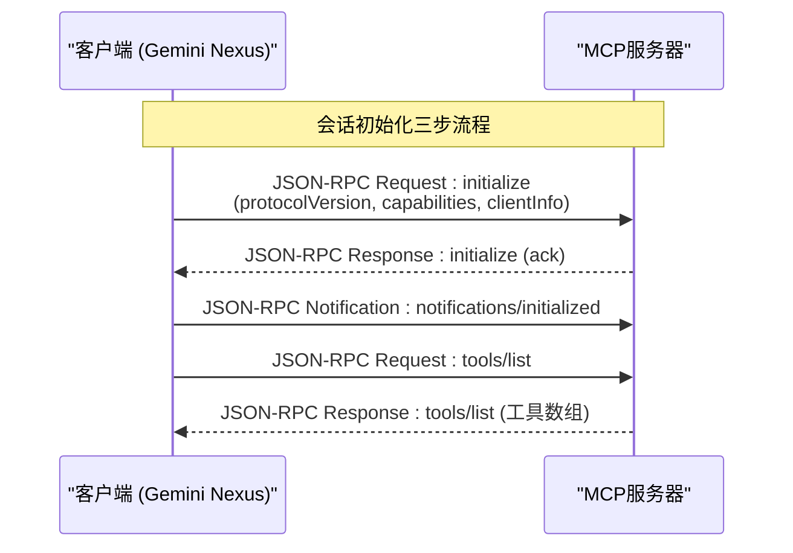
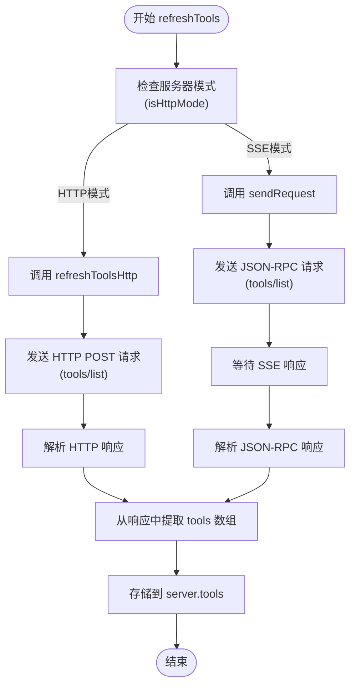

# 会话初始化

<cite>
**本文档引用的文件**
- [mcp_manager.js](file://background/managers/mcp_manager.js)
</cite>

## 目录
1. [会话初始化流程](#会话初始化流程)
2. [initializeSession方法详解](#initializesession方法详解)
3. [refreshTools方法与数据流转](#refreshtools方法与数据流转)

## 会话初始化流程

MCP（Model Context Protocol）会话初始化是建立客户端与MCP服务器之间通信的关键步骤。该流程主要在`MCPManager`类中实现，当服务器通过SSE（Server-Sent Events）连接成功并接收到`endpoint`事件后，会调用`initializeSession`方法来完成初始化。整个流程确保了客户端能够正确声明自身能力、通知服务器准备就绪，并获取可用的工具列表，为后续的交互打下基础。

**Section sources**
- [mcp_manager.js](file://background/managers/mcp_manager.js#L127-L133)

## initializeSession方法详解

`initializeSession`方法是会话初始化的核心，它按顺序执行三个关键的JSON-RPC操作，以完成与MCP服务器的握手。

### 第一步：发送'initialize'请求

该方法首先调用`sendRequest`，向服务器发送一个`initialize`方法的JSON-RPC请求。此请求包含以下三个重要参数：

*   **protocolVersion**: 协议版本号，用于确保客户端与服务器使用兼容的MCP协议。在代码中，其值被硬编码为`"2024-11-05"`，客户端和服务器应基于此版本号协商功能。
*   **capabilities**: 客户端能力声明，以JSON对象的形式告知服务器客户端支持的功能。例如，代码中的`{ roots: { listChanged: true } }`表明该客户端能够响应根目录列表变更的通知。
*   **clientInfo**: 客户端信息，包含客户端的名称和版本，便于服务器识别和记录。在本例中，客户端名称为`"Gemini Nexus"`，版本为`"4.0.0"`。

发送此请求后，客户端等待服务器的响应，以确认初始化请求已被接受。

### 第二步：发送'notifications/initialized'通知

在`initialize`请求成功完成后，方法立即调用`sendNotification`，发送一个`notifications/initialized`通知。与请求不同，通知（Notification）不需要服务器回复。此通知的作用是告知服务器，客户端已经完成了初始化过程，现在处于就绪状态，可以接收来自服务器的后续请求或通知。

### 第三步：获取工具列表

最后，方法调用`refreshTools(id)`，启动获取服务器可用工具列表的流程。这标志着初始化流程的结束和功能发现阶段的开始。

**Diagram sources**
- [mcp_manager.js](file://background/managers/mcp_manager.js#L262-L285)

**Section sources**
- [mcp_manager.js](file://background/managers/mcp_manager.js#L262-L285)

## refreshTools方法与数据流转

`refreshTools`方法负责获取并存储MCP服务器提供的工具列表，其执行方式根据服务器的配置模式（SSE或HTTP）自动选择。

### 模式判断与分支执行

该方法首先调用`isHttpMode(id)`来检查目标服务器的配置。如果服务器的`type`配置为`'streamable_http'`或`'http'`，或者未指定`type`但探测到服务器返回JSON而非SSE流，则判定为HTTP模式。

*   **HTTP模式**: 如果是HTTP模式，方法会调用`refreshToolsHttp(id)`。此函数直接向服务器的`postUrl`发起一个HTTP POST请求，请求的`method`为`"tools/list"`。服务器返回的响应经过解析后，提取出工具数组并直接赋值给`this.servers[id].tools`。
*   **SSE模式**: 如果是标准的SSE模式，方法则调用`sendRequest(id, { method: "tools/list" })`。这会通过已建立的SSE连接发送`tools/list`请求。当服务器通过SSE流返回响应时，`MCPManager`的`handleMessage`方法会根据请求的`id`找到对应的Promise并解析，最终将响应中的`tools`数组赋值给`this.servers[id].tools`。

### 数据流转与存储

无论采用哪种模式，数据流转的最终目标是一致的：将获取到的工具列表安全地存储在`MCPManager`实例的`servers`对象中，具体路径为`this.servers[serverId].tools`。这个数组随后会被`getAllTools()`等方法使用，以向Gemini模型提供可用工具的上下文信息，从而实现工具调用功能。

**Diagram sources**
- [mcp_manager.js](file://background/managers/mcp_manager.js#L287-L306)
- [mcp_manager.js](file://background/managers/mcp_manager.js#L153-L213)

**Section sources**
- [mcp_manager.js](file://background/managers/mcp_manager.js#L287-L306)
- [mcp_manager.js](file://background/managers/mcp_manager.js#L153-L213)