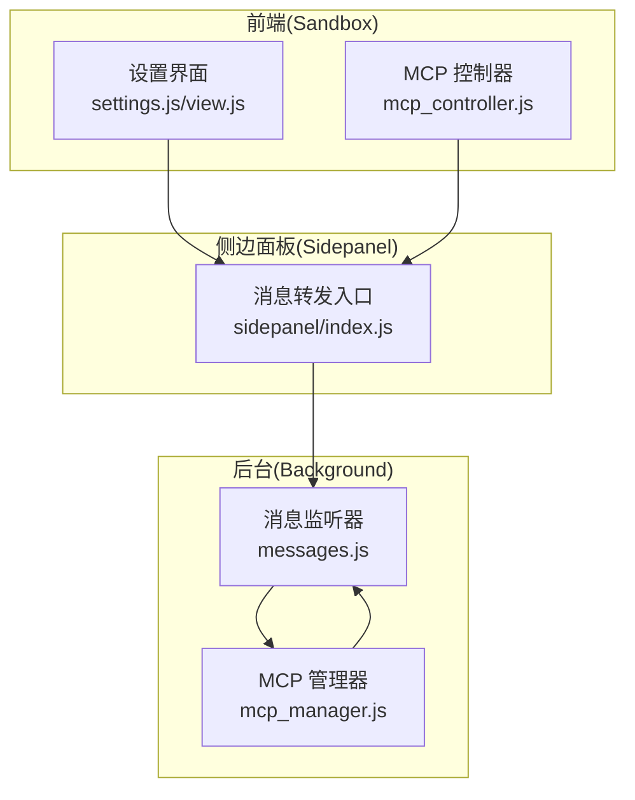
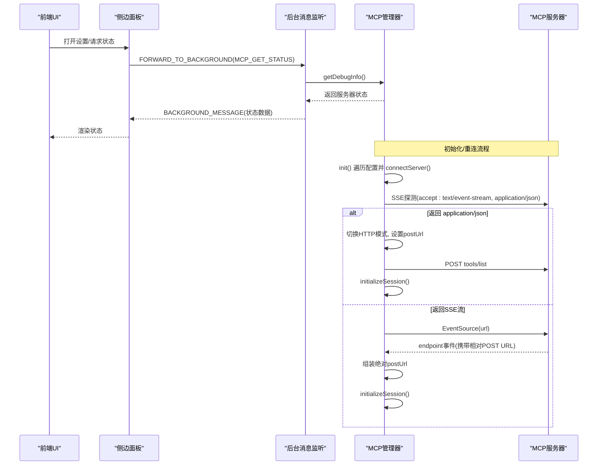
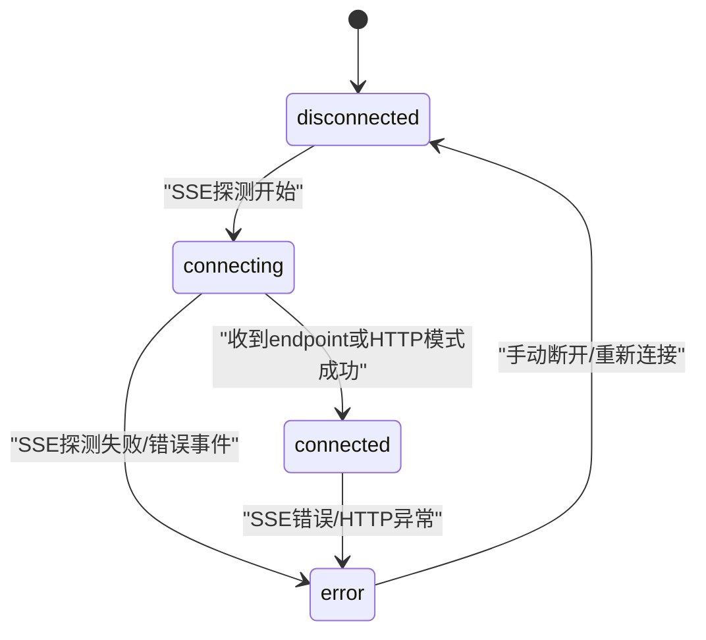
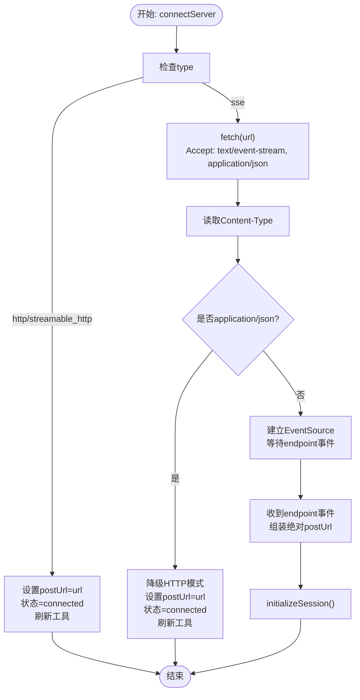
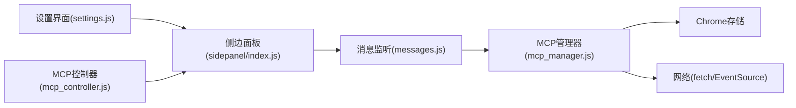

# 连接机制

<cite>
**本文引用的文件**
- [mcp_manager.js](file://background/managers/mcp_manager.js)
- [messages.js](file://background/messages.js)
- [mcp_controller.js](file://sandbox/controllers/mcp_controller.js)
- [settings.js](file://sandbox/ui/settings.js)
- [view.js](file://sandbox/ui/settings/view.js)
- [index.js](file://sidepanel/index.js)
</cite>

## 目录
1. [简介](#简介)
2. [项目结构](#项目结构)
3. [核心组件](#核心组件)
4. [架构总览](#架构总览)
5. [详细组件分析](#详细组件分析)
6. [依赖关系分析](#依赖关系分析)
7. [性能考量](#性能考量)
8. [故障排查指南](#故障排查指南)
9. [结论](#结论)
10. [附录](#附录)

## 简介
本文件系统化梳理了 Gemini Nexus 中 MCP（Model Context Protocol）服务器的连接机制，重点围绕以下目标：
- 解析 connectServer 方法如何依据服务器配置的 type 字段（sse、http、streamable_http）选择连接模式
- 详述 SSE 模式下的连接探针流程：通过 fetch 请求探测 Content-Type，若返回 application/json 则自动降级到 HTTP 模式
- 阐明 SSE 连接建立后如何通过 'endpoint' 事件获取 POST URL，并触发 initializeSession 完成 MCP 会话初始化
- 说明 HTTP 模式（含 streamable_http）下如何直接使用配置的 URL 作为 postUrl 进行通信
- 描述连接状态机（disconnected、connecting、connected、error）的转换逻辑
- 说明 init 方法如何在初始化时自动连接所有已配置的服务器

## 项目结构
与 MCP 连接机制相关的核心位置如下：
- 后台管理器：负责加载/保存配置、建立连接、状态管理、消息收发与工具列表刷新
- 消息通道：后台监听来自前端的消息，提供 MCP 配置、工具、状态查询等接口
- 前端控制器：负责 UI 展示与状态轮询，向后台请求 MCP 状态
- 设置界面：提供 MCP 配置输入与保存入口

图表来源
- [messages.js](file://background/messages.js#L14-L81)
- [mcp_manager.js](file://background/managers/mcp_manager.js#L1-L529)
- [mcp_controller.js](file://sandbox/controllers/mcp_controller.js#L1-L150)
- [settings.js](file://sandbox/ui/settings.js#L27-L88)
- [view.js](file://sandbox/ui/settings/view.js#L1-L241)
- [index.js](file://sidepanel/index.js#L178-L209)

章节来源
- [messages.js](file://background/messages.js#L14-L81)
- [mcp_manager.js](file://background/managers/mcp_manager.js#L1-L529)
- [mcp_controller.js](file://sandbox/controllers/mcp_controller.js#L1-L150)
- [settings.js](file://sandbox/ui/settings.js#L27-L88)
- [view.js](file://sandbox/ui/settings/view.js#L1-L241)
- [index.js](file://sidepanel/index.js#L178-L209)

## 核心组件
- MCP 管理器（MCPManager）
  - 负责：加载/保存配置、自动连接、状态机维护、SSE/HTTP 模式切换、消息收发、工具列表刷新、会话初始化
  - 关键方法：init、loadConfig、saveConfig、connectServer、initializeSession、sendRequest、sendRequestHttp、refreshTools、refreshToolsHttp、isHttpMode、handleMessage、getDebugInfo
- 消息监听器（setupMessageListener）
  - 提供：MCP 配置读取/保存、工具列表查询、状态查询、日志转发等后台接口
- 前端 MCP 控制器（MCPController）
  - 负责：打开/关闭 MCP 选择器、请求后台状态、渲染服务器列表与状态
- 设置界面（settings.js/view.js）
  - 负责：展示 MCP 配置输入框、保存配置、接收后台返回结果

章节来源
- [mcp_manager.js](file://background/managers/mcp_manager.js#L1-L529)
- [messages.js](file://background/messages.js#L14-L81)
- [mcp_controller.js](file://sandbox/controllers/mcp_controller.js#L1-L150)
- [settings.js](file://sandbox/ui/settings.js#L27-L88)
- [view.js](file://sandbox/ui/settings/view.js#L1-L241)

## 架构总览
MCP 连接机制遵循“配置驱动 + 自动探测 + 双模式适配”的设计：
- 初始化阶段：MCPManager.init 自动遍历配置中的服务器并调用 connectServer
- 连接阶段：connectServer 依据 type 决定模式；对于 SSE 模式先探测 Content-Type，再按需降级为 HTTP 模式；SSE 成功后通过 endpoint 事件获取 POST URL 并初始化会话
- 通信阶段：SSE 模式通过 EventSource 接收消息并回调 handleMessage；HTTP 模式直接 POST JSON-RPC 至 postUrl
- 工具与会话：refreshTools/refreshToolsHttp 获取工具列表；initializeSession 发送 initialize 与 notifications/initialized 并再次刷新工具

图表来源
- [messages.js](file://background/messages.js#L41-L67)
- [mcp_manager.js](file://background/managers/mcp_manager.js#L8-L19)
- [mcp_manager.js](file://background/managers/mcp_manager.js#L71-L150)
- [mcp_manager.js](file://background/managers/mcp_manager.js#L262-L285)

## 详细组件分析

### 连接状态机与生命周期
- 状态定义
  - disconnected：初始状态或断开后
  - connecting：SSE 探测中
  - connected：已建立连接并可通信
  - error：连接失败或运行期错误
- 状态转换
  - disconnected -> connecting：SSE 探测开始
  - connecting -> connected：SSE 探测成功且收到 endpoint 或 HTTP 模式直接成功
  - connecting/error：SSE 探测失败或 SSE 错误事件
  - connected -> error：SSE 错误或 HTTP 请求异常
- 关键实现点
  - connectServer 中对 type 的判断与分支
  - SSE 探测与降级逻辑
  - SSE 错误事件与状态更新
  - HTTP 模式直接设置 postUrl 并进入 connected

图表来源
- [mcp_manager.js](file://background/managers/mcp_manager.js#L71-L150)
- [mcp_manager.js](file://background/managers/mcp_manager.js#L122-L125)
- [mcp_manager.js](file://background/managers/mcp_manager.js#L218-L223)

章节来源
- [mcp_manager.js](file://background/managers/mcp_manager.js#L71-L150)
- [mcp_manager.js](file://background/managers/mcp_manager.js#L218-L223)

### connectServer 方法与类型决策
- 输入来源
  - 服务器配置：包含 url 或 endpoint，以及 type（默认 sse）
- 类型决策
  - type 为 http 或 streamable_http：直接使用该 URL 作为 postUrl，状态置为 connected，并立即刷新工具
  - type 为 sse：发起探测请求，Accept 包含 text/event-stream 与 application/json
    - 若 Content-Type 为 application/json：判定为 HTTP 模式，降级并走 HTTP 流程
    - 否则：建立 EventSource，等待 endpoint 事件与后续消息
- 失败处理
  - 无 url/endpoint：状态置 error
  - 探测失败或 SSE 错误：状态置 error

章节来源
- [mcp_manager.js](file://background/managers/mcp_manager.js#L71-L150)

### SSE 探针与自动降级流程
- 探针请求
  - 使用 fetch 对 SSE 入口发起 GET，Accept 头同时包含 text/event-stream 与 application/json
  - 读取响应头 Content-Type
- 降级条件
  - 当 Content-Type 包含 application/json 时，认为服务器不支持 SSE，自动切换至 HTTP 模式
  - 此时 postUrl 设为原始 URL，状态置 connected，并刷新工具
- 异常路径
  - 探测请求失败：状态置 error

图表来源
- [mcp_manager.js](file://background/managers/mcp_manager.js#L71-L150)
- [mcp_manager.js](file://background/managers/mcp_manager.js#L101-L113)

章节来源
- [mcp_manager.js](file://background/managers/mcp_manager.js#L71-L150)

### SSE 连接建立与 endpoint 事件处理
- EventSource 建立
  - onopen：记录连接成功
  - onerror：记录错误并状态置 error
  - onmessage：尝试解析 JSON 并交由 handleMessage 分发
- endpoint 事件
  - 从事件数据中提取相对 URL，基于原始 URL 组装绝对 POST URL
  - 设置 server.postUrl，状态置 connected
  - 触发 initializeSession 完成会话初始化

章节来源
- [mcp_manager.js](file://background/managers/mcp_manager.js#L116-L144)
- [mcp_manager.js](file://background/managers/mcp_manager.js#L262-L285)

### initializeSession 会话初始化流程
- 发送 initialize 请求，包含协议版本与客户端信息
- 发送 notifications/initialized 通知
- 刷新工具列表（SSE 模式下通过 sendRequest，HTTP 模式下通过 refreshToolsHttp）

章节来源
- [mcp_manager.js](file://background/managers/mcp_manager.js#L262-L285)

### HTTP 模式（含 streamable_http）通信
- 直接使用配置的 URL 作为 postUrl
- refreshToolsHttp：直接 POST JSON-RPC 的 tools/list
- sendRequestHttp：直接 POST JSON-RPC 请求并等待服务器直接返回结果
- isHttpMode：判断服务器是否处于 HTTP 模式（type 为 http 或 streamable_http）

章节来源
- [mcp_manager.js](file://background/managers/mcp_manager.js#L88-L96)
- [mcp_manager.js](file://background/managers/mcp_manager.js#L153-L213)
- [mcp_manager.js](file://background/managers/mcp_manager.js#L229-L260)
- [mcp_manager.js](file://background/managers/mcp_manager.js#L218-L223)

### 消息分发与请求/响应关联
- sendRequest：构造 JSON-RPC 请求，使用 fetch POST 到 postUrl；同时在 pendingRequests 中登记 Promise，等待 SSE onmessage 回传的同 id 消息
- handleMessage：当收到带 id 的消息时，匹配 pendingRequests 并 resolve/reject
- 超时控制：sendRequest 中设置 10 秒超时，清理 pendingRequests

章节来源
- [mcp_manager.js](file://background/managers/mcp_manager.js#L308-L351)
- [mcp_manager.js](file://background/managers/mcp_manager.js#L370-L385)
- [mcp_manager.js](file://background/managers/mcp_manager.js#L529)

### 初始化自动连接与配置管理
- init：首次初始化时，加载配置并自动对每个服务器调用 connectServer
- saveConfig：保存新配置后，断开旧连接、重新加载配置、再逐一 connectServer
- getDebugInfo：聚合各服务器的状态、类型、URL、postUrl、工具数量与名称，供前端展示

章节来源
- [mcp_manager.js](file://background/managers/mcp_manager.js#L8-L19)
- [mcp_manager.js](file://background/managers/mcp_manager.js#L40-L61)
- [mcp_manager.js](file://background/managers/mcp_manager.js#L389-L403)

### 前端交互与状态展示
- MCPController：打开 MCP 选择器时请求后台状态（MCP_GET_STATUS），并将返回的服务器状态渲染为 UI
- 设置界面：提供 MCP 配置输入框，保存后通过 sidepanel 转发到后台并接收保存结果提示

章节来源
- [mcp_controller.js](file://sandbox/controllers/mcp_controller.js#L68-L99)
- [settings.js](file://sandbox/ui/settings.js#L27-L88)
- [view.js](file://sandbox/ui/settings/view.js#L207-L209)
- [index.js](file://sidepanel/index.js#L178-L209)

## 依赖关系分析
- MCPManager 依赖
  - Chrome 存储：读取/写入 mcpConfig
  - EventSource：SSE 连接
  - fetch：HTTP 请求（探测、发送 JSON-RPC）
  - 消息通道：与后台消息监听器交互
- 消息监听器依赖
  - 将 MCPManager 注入到会话管理器，以便工具调用
  - 提供 MCP 配置、工具、状态查询等接口
- 前端控制器依赖
  - 通过 postMessage 与 sidepanel 交互
  - 通过 sidepanel 转发到后台消息监听器

图表来源
- [messages.js](file://background/messages.js#L14-L81)
- [mcp_manager.js](file://background/managers/mcp_manager.js#L1-L529)
- [mcp_controller.js](file://sandbox/controllers/mcp_controller.js#L1-L150)
- [settings.js](file://sandbox/ui/settings.js#L27-L88)
- [index.js](file://sidepanel/index.js#L178-L209)

章节来源
- [messages.js](file://background/messages.js#L14-L81)
- [mcp_manager.js](file://background/managers/mcp_manager.js#L1-L529)
- [mcp_controller.js](file://sandbox/controllers/mcp_controller.js#L1-L150)
- [settings.js](file://sandbox/ui/settings.js#L27-L88)
- [index.js](file://sidepanel/index.js#L178-L209)

## 性能考量
- SSE 探测仅一次，避免重复握手
- HTTP 模式下直接 POST，减少中间层开销
- pendingRequests 采用 Promise 映射，避免并发请求冲突
- 工具列表刷新在 SSE 与 HTTP 模式分别实现，避免不必要的 SSE 监听
- 超时控制（10 秒）防止阻塞

## 故障排查指南
- 无法连接
  - 检查服务器配置是否存在 url/endpoint
  - 查看后台日志中 connectServer 的错误输出
- SSE 不生效
  - 确认服务器是否返回 application/json（此时会自动降级）
  - 检查 EventSource 是否触发 onerror
- endpoint 事件未触发
  - 确认服务器是否正确发出 endpoint 事件
  - 检查 postUrl 组装是否正确（相对 URL + 基础 URL）
- 工具列表为空
  - SSE 模式：确认 tools/list 请求是否成功
  - HTTP 模式：确认 tools/list 的响应格式（result.tools、tools、result 数组或直接数组）
- 请求超时
  - 检查网络连通性与服务器响应速度
  - 确认 SSE onmessage 是否能正确回传带 id 的消息

章节来源
- [mcp_manager.js](file://background/managers/mcp_manager.js#L79-L83)
- [mcp_manager.js](file://background/managers/mcp_manager.js#L122-L125)
- [mcp_manager.js](file://background/managers/mcp_manager.js#L153-L213)
- [mcp_manager.js](file://background/managers/mcp_manager.js#L308-L351)
- [mcp_manager.js](file://background/managers/mcp_manager.js#L370-L385)

## 结论
本连接机制以“类型驱动 + 自动探测 + 双模式适配”为核心策略，既兼容标准 MCP SSE 模式，又能在服务器不支持 SSE 时自动降级到 HTTP 模式，确保稳定可用。初始化阶段自动连接所有已配置服务器，配合前端状态展示与工具列表刷新，形成完整的 MCP 服务接入闭环。

## 附录
- 配置结构要点
  - mcpServers：服务器集合，键名为服务器 ID，值包含 endpoint/url、type（sse/http/streamable_http）、其他能力声明
  - type 默认为 sse；若为 http/streamable_http，则直接走 HTTP 模式
- 前端交互要点
  - 通过 sidepanel 转发消息到后台
  - MCP_GET_STATUS 用于实时展示服务器状态
  - 设置界面提供 MCP 配置输入与保存

章节来源
- [messages.js](file://background/messages.js#L49-L67)
- [settings.js](file://sandbox/ui/settings.js#L27-L88)
- [view.js](file://sandbox/ui/settings/view.js#L207-L209)
- [index.js](file://sidepanel/index.js#L178-L209)