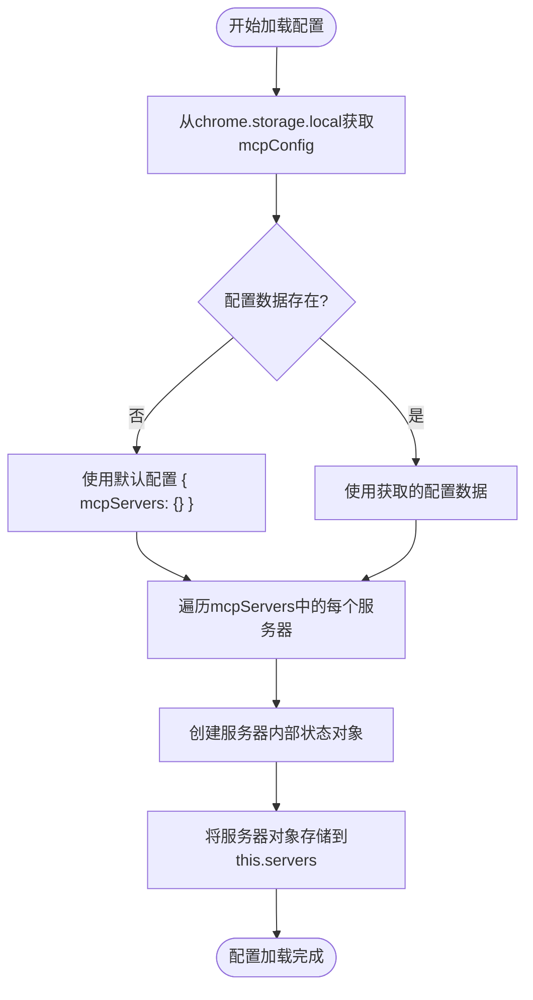
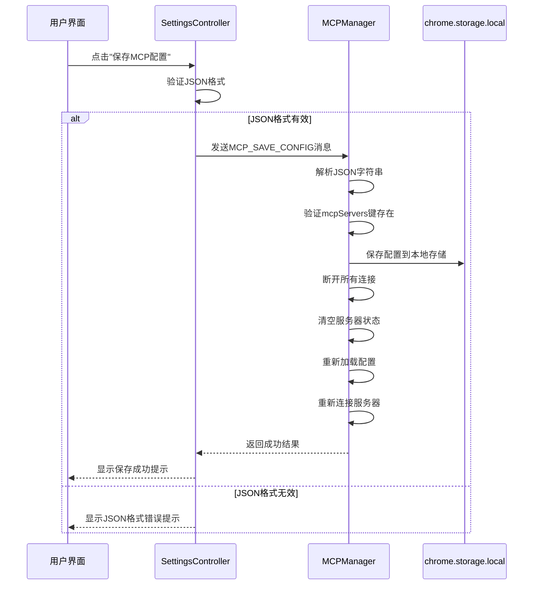
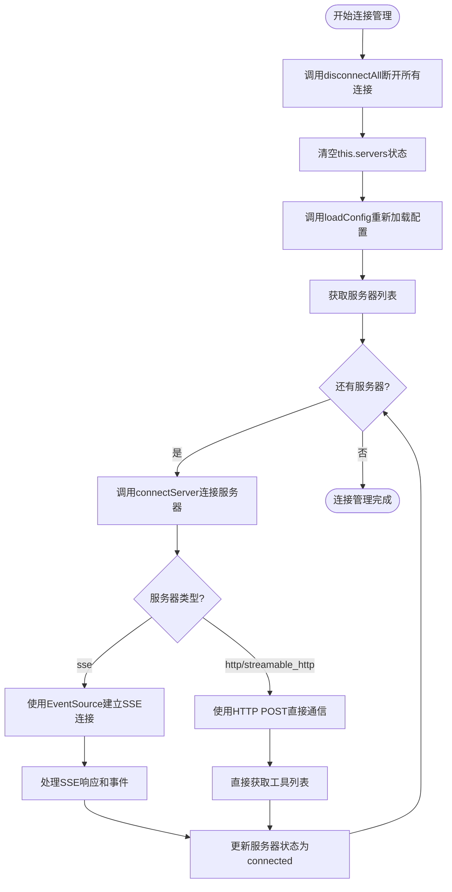
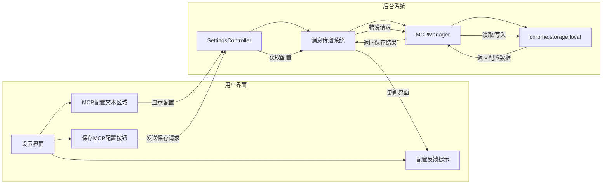
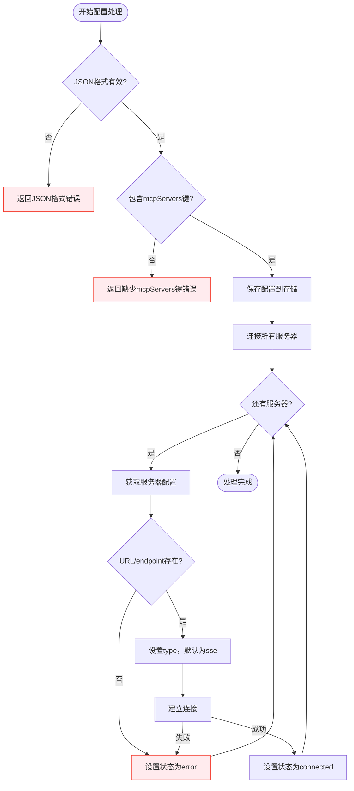

# 配置管理

<cite>
**本文档引用的文件**
- [mcp_manager.js](file://background/managers/mcp_manager.js)
- [settings.js](file://sandbox/ui/settings.js)
- [view.js](file://sandbox/ui/settings/view.js)
- [settings.js](file://sandbox/ui/settings.js)
- [messages.js](file://background/messages.js)
</cite>

## 目录
1. [简介](#简介)
2. [配置数据结构](#配置数据结构)
3. [配置加载机制](#配置加载机制)
4. [配置保存与验证](#配置保存与验证)
5. [连接管理](#连接管理)
6. [用户界面交互](#用户界面交互)
7. [错误处理与默认值](#错误处理与默认值)

## 简介
本文档详细说明了MCP服务器配置管理系统的工作原理，重点阐述了MCPManager如何通过loadConfig方法从chrome.storage.local加载mcpConfig配置数据，并将其解析为内部服务器状态对象。文档还解释了saveConfig方法如何验证JSON格式、持久化存储配置，并触发连接重建流程。同时，文档描述了配置数据结构的关键字段、配置变更后的热重载机制以及相关的错误处理策略。

## 配置数据结构
MCP服务器配置数据以JSON格式存储，其核心结构包含一个名为`mcpServers`的对象，该对象的每个键代表一个服务器ID，值为服务器的配置对象。配置对象包含以下关键字段：

- **服务器ID**: 配置对象的键名，用作服务器的唯一标识符
- **URL/endpoint**: 服务器的访问地址，支持`url`或`endpoint`字段
- **type**: 服务器类型，支持`sse`、`http`和`streamable_http`三种模式，默认为`sse`
- **其他配置**: 可能包含服务器特定的其他配置参数

**Section sources**
- [mcp_manager.js](file://background/managers/mcp_manager.js#L21-L38)

## 配置加载机制
MCPManager通过`loadConfig`方法从浏览器的本地存储中加载配置数据。该方法执行以下步骤：

1. 调用`chrome.storage.local.get('mcpConfig')`从本地存储中获取配置数据
2. 如果存储中没有配置数据，则使用默认配置`{ mcpServers: {} }`
3. 遍历配置中的每个服务器，将其转换为内部状态对象，包含配置、事件源、POST地址、工具列表和状态等属性
4. 将转换后的服务器对象存储在`this.servers`对象中，以服务器ID为键

配置加载通常在MCPManager初始化时自动调用，确保系统启动时能够正确加载已保存的服务器配置。

**Diagram sources**
- [mcp_manager.js](file://background/managers/mcp_manager.js#L21-L38)

**Section sources**
- [mcp_manager.js](file://background/managers/mcp_manager.js#L21-L38)

## 配置保存与验证
MCPManager通过`saveConfig`方法保存和验证配置数据。该方法接收一个JSON字符串作为输入，执行以下操作：

1. 尝试解析输入的JSON字符串，如果解析失败则捕获异常
2. 验证解析后的对象是否包含必需的`mcpServers`键
3. 将验证通过的配置对象保存到`chrome.storage.local`中
4. 断开所有现有连接，清空内部服务器状态
5. 重新加载配置并重新连接所有服务器

配置保存过程实现了事务性操作，确保配置变更能够正确应用到系统中。如果在保存过程中发生错误，方法会返回包含错误信息的对象，以便调用者处理。

**Diagram sources**
- [mcp_manager.js](file://background/managers/mcp_manager.js#L40-L60)
- [settings.js](file://sandbox/ui/settings.js#L238-L247)

**Section sources**
- [mcp_manager.js](file://background/managers/mcp_manager.js#L40-L60)
- [settings.js](file://sandbox/ui/settings.js#L238-L247)

## 连接管理
MCPManager实现了完整的连接管理机制，包括服务器连接、断开和状态维护。当配置变更或系统初始化时，会触发连接重建流程：

1. `disconnectAll`方法遍历所有服务器，关闭其事件源连接
2. `connectServer`方法根据服务器配置建立新的连接
3. 根据服务器类型(`type`)选择不同的连接模式：
   - `sse`模式：使用EventSource建立SSE连接
   - `http`或`streamable_http`模式：使用HTTP POST直接通信
4. 连接成功后，更新服务器状态并获取可用工具列表

连接管理机制确保了配置变更后能够正确重建所有服务器连接，同时处理连接过程中的各种状态和错误情况。

**Diagram sources**
- [mcp_manager.js](file://background/managers/mcp_manager.js#L63-L150)

**Section sources**
- [mcp_manager.js](file://background/managers/mcp_manager.js#L63-L150)

## 用户界面交互
MCP配置管理通过用户界面提供完整的配置体验。设置界面包含一个专门的MCP配置区域，用户可以在其中：

1. 在文本区域中输入和编辑MCP配置JSON
2. 点击"保存MCP配置"按钮保存配置
3. 查看配置保存结果的反馈信息

用户界面通过消息传递机制与后台脚本通信，实现了配置的获取、保存和状态更新。当用户打开设置界面时，系统会自动从后台获取当前的MCP配置并显示在文本区域中，确保用户看到的是最新的配置状态。

**Diagram sources**
- [view.js](file://sandbox/ui/settings/view.js#L36-L38)
- [settings.js](file://sandbox/ui/settings.js#L234-L247)

**Section sources**
- [view.js](file://sandbox/ui/settings/view.js#L36-L38)
- [settings.js](file://sandbox/ui/settings.js#L234-L247)

## 错误处理与默认值
MCP配置管理系统实现了完善的错误处理机制和默认值设定，确保系统在各种情况下都能稳定运行：

1. **配置加载错误处理**:
   - 如果存储中没有配置数据，使用默认配置`{ mcpServers: {} }`
   - 如果配置数据格式不正确，使用默认配置避免系统崩溃

2. **配置保存错误处理**:
   - 验证JSON格式，如果格式无效则返回错误信息
   - 验证必需的`mcpServers`键是否存在
   - 捕获所有异常并返回包含错误信息的结果对象

3. **连接错误处理**:
   - 如果服务器URL为空，将服务器状态设置为'error'
   - 如果SSE连接失败，将服务器状态设置为'error'
   - 如果HTTP请求失败，将服务器状态设置为'error'

4. **默认值设定**:
   - 服务器类型`type`字段默认为`sse`
   - 如果配置中未指定URL或endpoint，连接将失败并标记为错误状态

这些错误处理和默认值机制确保了系统在面对不完整或错误的配置时仍能保持稳定，为用户提供清晰的错误反馈。

**Diagram sources**
- [mcp_manager.js](file://background/managers/mcp_manager.js#L23-L83)
- [mcp_manager.js](file://background/managers/mcp_manager.js#L42-L60)

**Section sources**
- [mcp_manager.js](file://background/managers/mcp_manager.js#L23-L83)
- [mcp_manager.js](file://background/managers/mcp_manager.js#L42-L60)