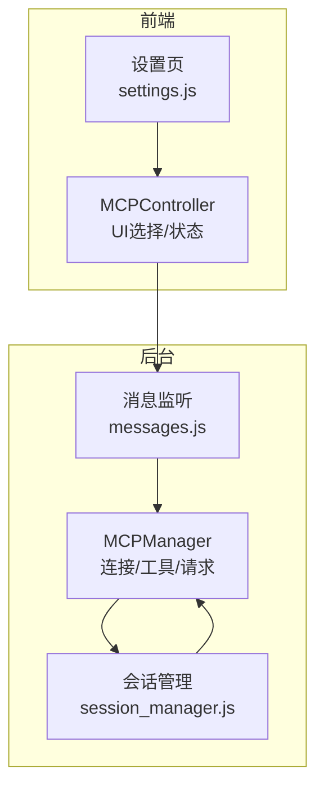
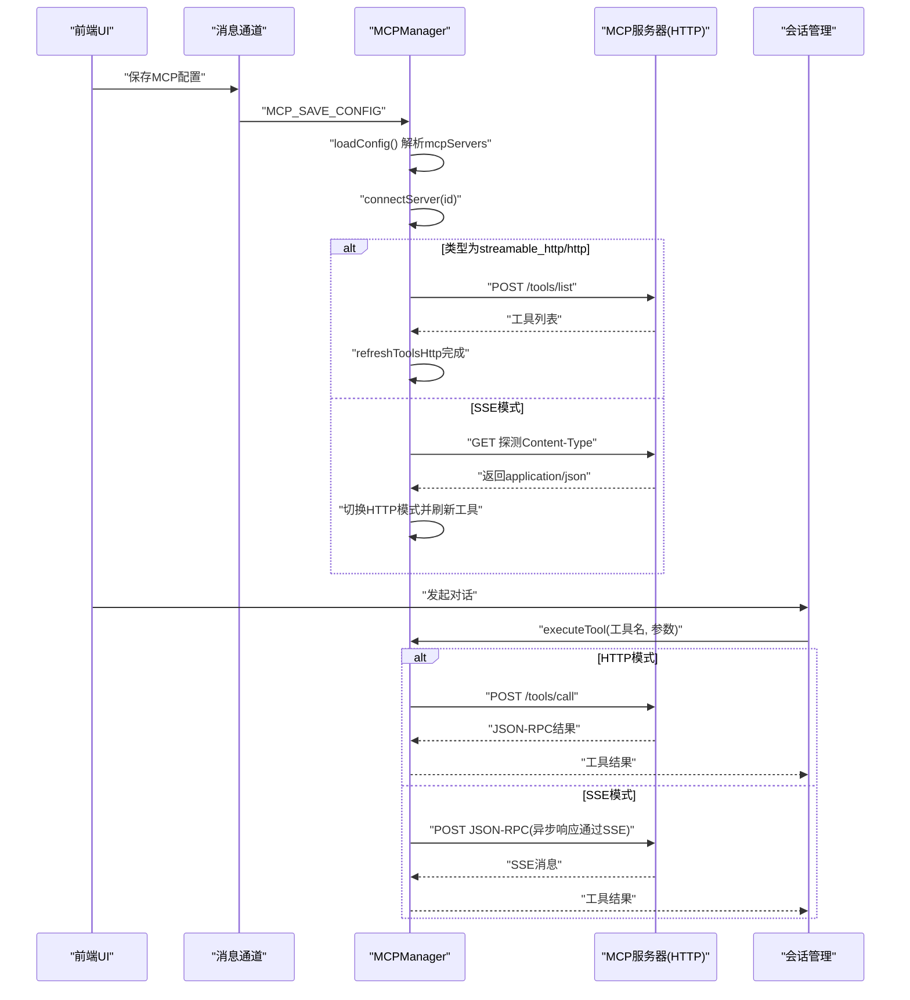
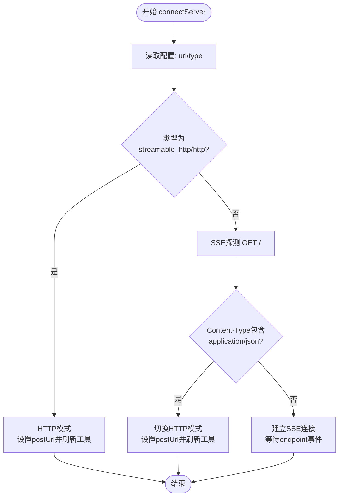
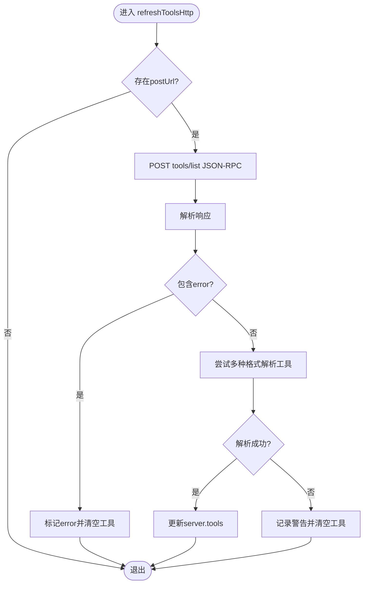
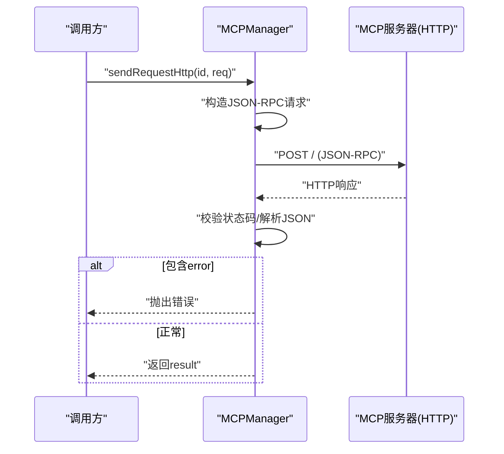
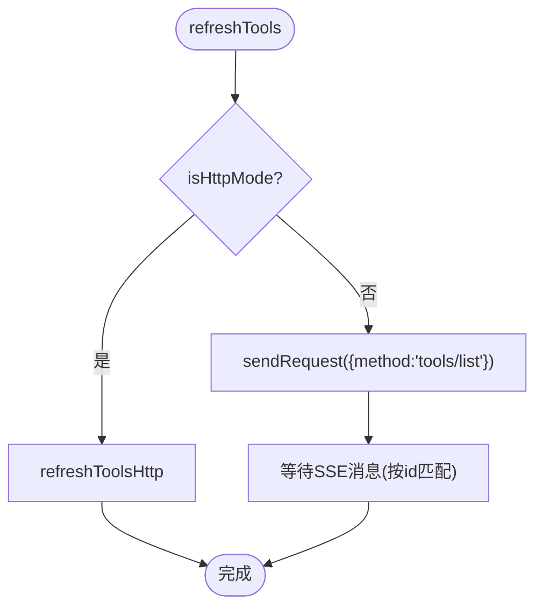
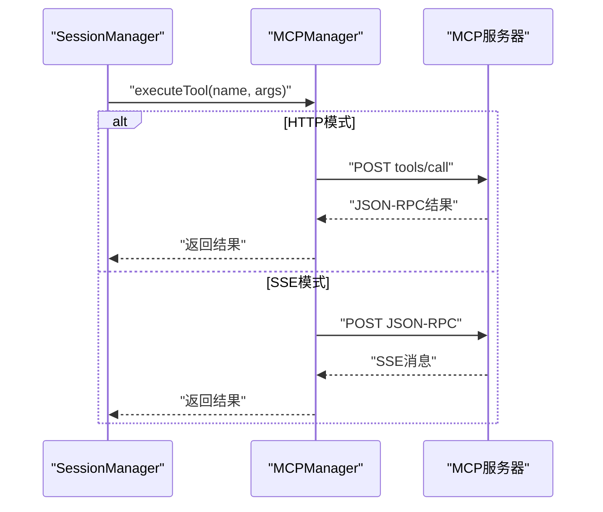
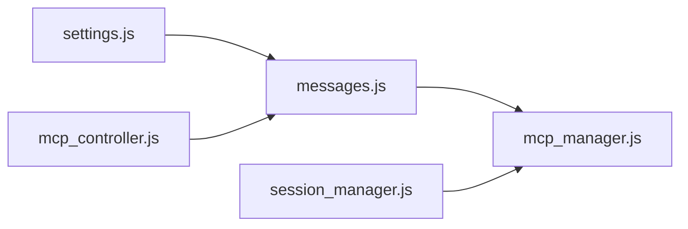

# HTTP通信模式

<cite>
**本文引用的文件列表**
- [mcp_manager.js](file://background/managers/mcp_manager.js)
- [mcp_controller.js](file://sandbox/controllers/mcp_controller.js)
- [session_manager.js](file://background/managers/session_manager.js)
- [messages.js](file://background/messages.js)
- [settings.js](file://sandbox/ui/templates/settings.js)
</cite>

## 目录
1. [简介](#简介)
2. [项目结构](#项目结构)
3. [核心组件](#核心组件)
4. [架构总览](#架构总览)
5. [详细组件分析](#详细组件分析)
6. [依赖关系分析](#依赖关系分析)
7. [性能考量](#性能考量)
8. [故障排查指南](#故障排查指南)
9. [结论](#结论)

## 简介
本文件聚焦于HTTP通信模式，特别是当MCP服务器类型为streamable_http或http时的直接POST请求机制。文档将深入解释：
- connectServer如何在Content-Type探针返回application/json时自动切换到HTTP模式
- sendRequestHttp如何实现同步请求-响应模式（请求构造、超时处理与错误传播）
- 对比HTTP模式与SSE模式在工具调用executeTool中的不同实现路径
- 提供HTTP模式的适用场景与性能考量

## 项目结构
围绕HTTP通信模式的关键模块分布如下：
- 后台管理：MCPManager负责连接、工具拉取、请求发送与状态管理
- 前端控制：MCPController负责UI交互与状态展示
- 会话集成：SessionManager将MCP工具注入到对话流程中，并在需要时执行工具
- 消息通道：messages.js提供后台与前端之间的消息转发能力
- 配置入口：settings.js提供MCP配置输入界面

图表来源
- [mcp_manager.js](file://background/managers/mcp_manager.js#L71-L150)
- [messages.js](file://background/messages.js#L14-L81)
- [session_manager.js](file://background/managers/session_manager.js#L17-L120)
- [mcp_controller.js](file://sandbox/controllers/mcp_controller.js#L88-L99)
- [settings.js](file://sandbox/ui/templates/settings.js#L75-L87)

章节来源
- [mcp_manager.js](file://background/managers/mcp_manager.js#L71-L150)
- [messages.js](file://background/messages.js#L14-L81)
- [session_manager.js](file://background/managers/session_manager.js#L17-L120)
- [mcp_controller.js](file://sandbox/controllers/mcp_controller.js#L88-L99)
- [settings.js](file://sandbox/ui/templates/settings.js#L75-L87)

## 核心组件
- MCPManager：负责MCP服务器连接、工具列表刷新、HTTP/SSE请求发送、错误处理与状态维护
- MCPController：负责MCP服务器选择UI、状态展示与用户交互
- SessionManager：负责将MCP工具注入到对话系统，并在模型输出包含工具调用时执行对应工具
- messages.js：提供后台消息监听与转发，支撑MCP配置与状态查询
- settings.js：提供MCP配置输入框，支持保存mcpServers配置

章节来源
- [mcp_manager.js](file://background/managers/mcp_manager.js#L2-L69)
- [mcp_controller.js](file://sandbox/controllers/mcp_controller.js#L5-L21)
- [session_manager.js](file://background/managers/session_manager.js#L6-L15)
- [messages.js](file://background/messages.js#L14-L81)
- [settings.js](file://sandbox/ui/templates/settings.js#L75-L87)

## 架构总览
HTTP模式的核心流程：
- 连接阶段：connectServer根据配置类型决定使用HTTP直连还是SSE探测
- 内容类型探针：若SSE探测返回application/json，则自动降级为HTTP模式
- 工具刷新：HTTP模式下通过POST tools/list获取工具清单
- 请求发送：executeTool根据服务器类型选择sendRequestHttp或sendRequest
- 结果返回：HTTP模式直接返回结果；SSE模式通过事件流回调

图表来源
- [mcp_manager.js](file://background/managers/mcp_manager.js#L71-L150)
- [mcp_manager.js](file://background/managers/mcp_manager.js#L152-L213)
- [mcp_manager.js](file://background/managers/mcp_manager.js#L229-L260)
- [mcp_manager.js](file://background/managers/mcp_manager.js#L479-L525)
- [messages.js](file://background/messages.js#L42-L67)
- [session_manager.js](file://background/managers/session_manager.js#L76-L114)

## 详细组件分析

### connectServer：自动切换到HTTP模式
- 当配置类型为streamable_http或http时，直接以HTTP模式建立连接，设置postUrl并立即刷新工具
- 当配置类型为sse时，先进行GET探测，检查Content-Type是否为application/json
  - 若为application/json，则认为服务器不支持SSE，自动切换为HTTP模式并刷新工具
  - 否则继续SSE连接，等待endpoint事件获取POST URL

图表来源
- [mcp_manager.js](file://background/managers/mcp_manager.js#L71-L150)

章节来源
- [mcp_manager.js](file://background/managers/mcp_manager.js#L71-L150)

### refreshToolsHttp：HTTP模式下的工具刷新
- 使用POST向postUrl发送JSON-RPC请求，方法为tools/list
- 支持多种响应格式：result.tools、tools、result数组、直接数组
- 若响应包含error字段，标记服务器状态为error并清空工具列表
- 成功时更新server.tools并记录日志

图表来源
- [mcp_manager.js](file://background/managers/mcp_manager.js#L152-L213)

章节来源
- [mcp_manager.js](file://background/managers/mcp_manager.js#L152-L213)

### sendRequestHttp：同步请求-响应模式
- 构造JSON-RPC请求，包含随机id、method与params
- 通过POST发送至postUrl，等待响应
- 校验HTTP状态码，非2xx抛出错误
- 解析JSON-RPC响应，若包含error字段抛出错误
- 返回result字段作为最终结果

图表来源
- [mcp_manager.js](file://background/managers/mcp_manager.js#L229-L260)

章节来源
- [mcp_manager.js](file://background/managers/mcp_manager.js#L229-L260)

### refreshTools与SSE模式对比
- refreshTools在HTTP模式下调用refreshToolsHttp，在SSE模式下调用sendRequest发送tools/list并等待SSE消息
- sendRequest在SSE模式下采用Promise映射与超时机制，等待SSE消息中的同id响应

图表来源
- [mcp_manager.js](file://background/managers/mcp_manager.js#L287-L306)
- [mcp_manager.js](file://background/managers/mcp_manager.js#L308-L351)

章节来源
- [mcp_manager.js](file://background/managers/mcp_manager.js#L287-L306)
- [mcp_manager.js](file://background/managers/mcp_manager.js#L308-L351)

### executeTool：HTTP与SSE的不同路径
- 在executeTool中，根据isHttpMode判断使用sendRequestHttp还是sendRequest
- HTTP模式直接返回工具结果
- SSE模式通过SSE事件流接收响应

图表来源
- [mcp_manager.js](file://background/managers/mcp_manager.js#L479-L525)

章节来源
- [mcp_manager.js](file://background/managers/mcp_manager.js#L479-L525)

## 依赖关系分析
- MCPManager依赖Chrome存储读写（mcpConfig），用于加载/保存MCP服务器配置
- MCPManager与SessionManager协作：SessionManager在对话中检测工具调用并委托MCPManager执行
- MCPController通过消息通道与后台交互，获取MCP状态并在UI中展示
- settings.js提供配置输入，保存为mcpConfig并触发后台重新连接

图表来源
- [messages.js](file://background/messages.js#L42-L67)
- [mcp_manager.js](file://background/managers/mcp_manager.js#L21-L61)
- [mcp_controller.js](file://sandbox/controllers/mcp_controller.js#L88-L99)
- [session_manager.js](file://background/managers/session_manager.js#L17-L120)
- [settings.js](file://sandbox/ui/templates/settings.js#L75-L87)

章节来源
- [messages.js](file://background/messages.js#L42-L67)
- [mcp_manager.js](file://background/managers/mcp_manager.js#L21-L61)
- [mcp_controller.js](file://sandbox/controllers/mcp_controller.js#L88-L99)
- [session_manager.js](file://background/managers/session_manager.js#L17-L120)
- [settings.js](file://sandbox/ui/templates/settings.js#L75-L87)

## 性能考量
- HTTP模式优势
  - 直接POST，无需SSE长连接，减少连接开销
  - 工具刷新与调用均为同步请求-响应，延迟可预测
  - 适合工具数量较少、调用频率较低的场景
- SSE模式优势
  - 一次SSE连接可承载多条通知与异步响应，适合高并发或持续交互
  - 但需要维持长连接，且在HTTP模式下需额外的超时与请求关联逻辑
- 适用场景建议
  - 优先使用HTTP模式：工具数量有限、调用频次不高、对延迟敏感
  - 使用SSE模式：需要实时通知、工具调用频繁、服务端支持SSE
- 错误与超时
  - HTTP模式：sendRequestHttp对HTTP状态与JSON-RPC error进行严格校验
  - SSE模式：sendRequest通过超时与Promise映射处理异步响应，避免阻塞

[本节为通用性能讨论，不直接分析具体文件]

## 故障排查指南
- 无法连接MCP服务器
  - 检查配置类型与URL是否正确
  - 若为SSE模式，确认服务器返回Content-Type是否为application/json
  - 查看后台日志与MCP状态面板
- 工具列表为空
  - 确认HTTP模式下POST tools/list返回格式是否符合预期
  - 检查服务器是否返回error字段
- 工具调用失败
  - HTTP模式：检查POST /tools/call返回的JSON-RPC error
  - SSE模式：检查SSE消息是否按id正确匹配
- UI选择无效
  - 确认MCP配置已保存并触发后台重新连接
  - 检查MCP状态面板显示的工具数量

章节来源
- [mcp_manager.js](file://background/managers/mcp_manager.js#L152-L213)
- [mcp_manager.js](file://background/managers/mcp_manager.js#L229-L260)
- [mcp_manager.js](file://background/managers/mcp_manager.js#L308-L351)
- [mcp_controller.js](file://sandbox/controllers/mcp_controller.js#L88-L99)
- [messages.js](file://background/messages.js#L42-L67)

## 结论
- HTTP模式（streamable_http/http）通过直接POST简化了通信链路，适合轻量工具与低频调用
- SSE模式适用于需要实时通知与高并发的场景，但实现复杂度更高
- 自动切换机制确保在SSE服务器返回JSON时也能稳定工作
- 在实际应用中，应根据工具规模、调用频率与实时性需求选择合适的模式，并结合错误处理与超时策略提升稳定性