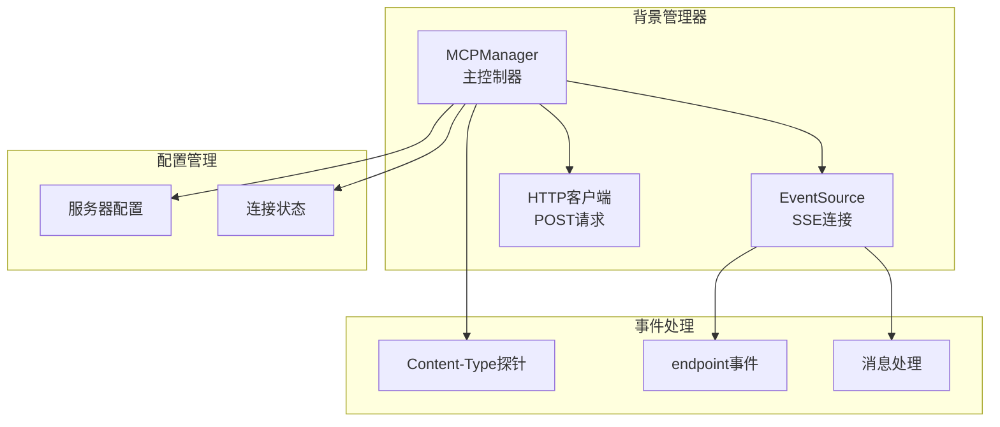
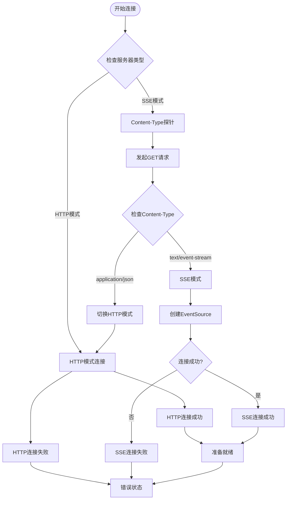
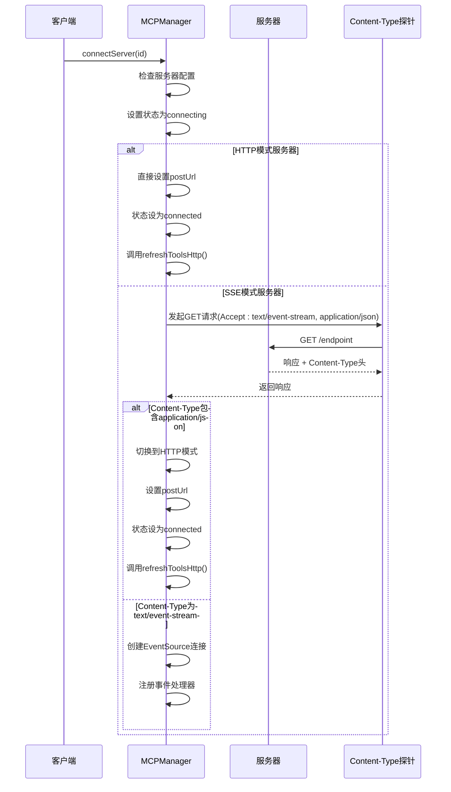
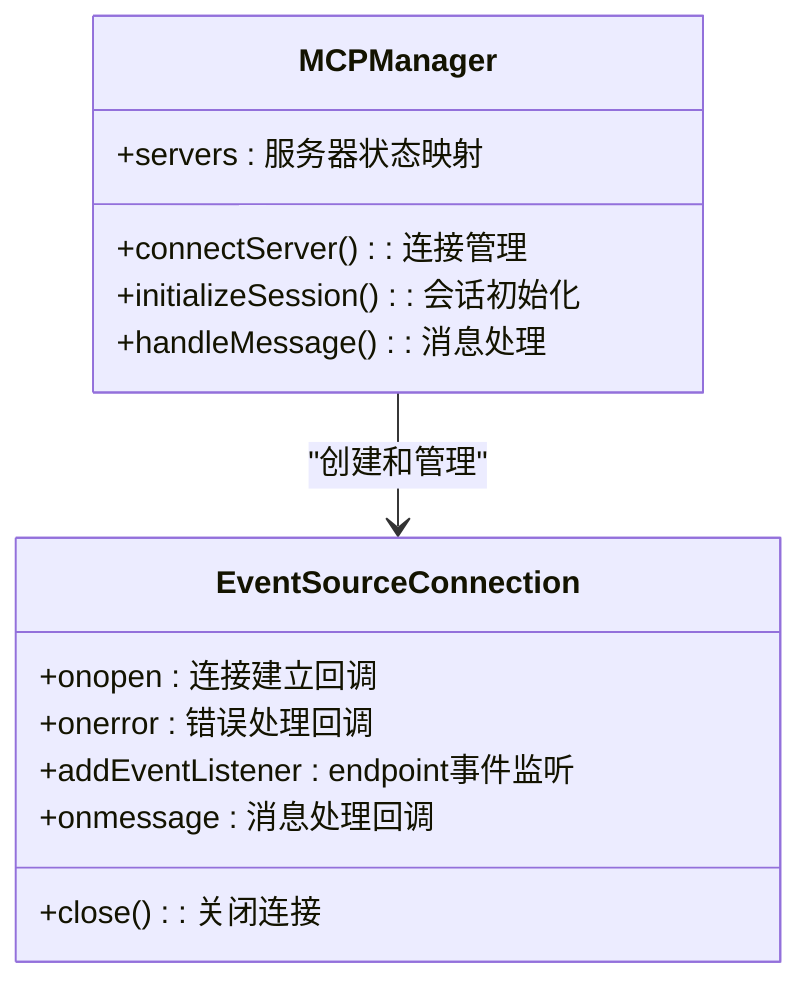
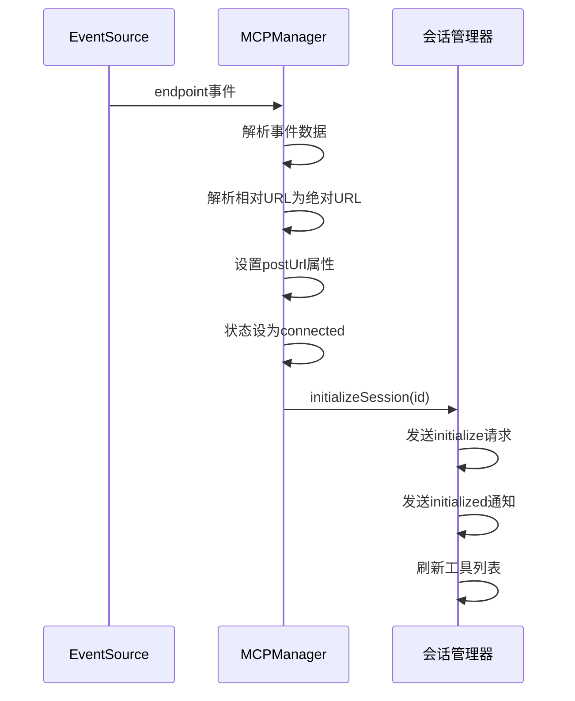
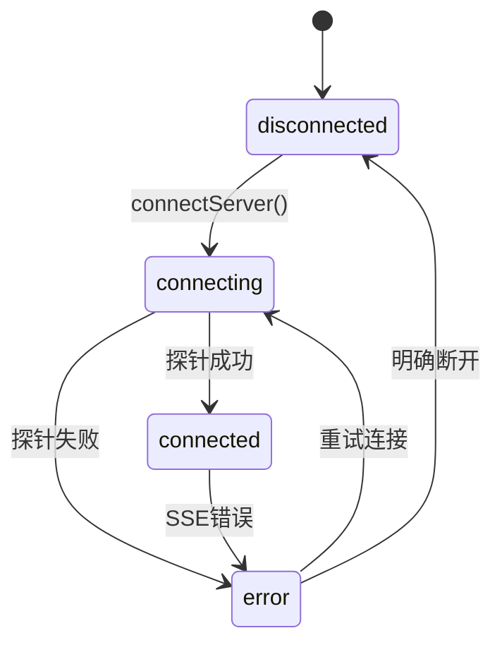
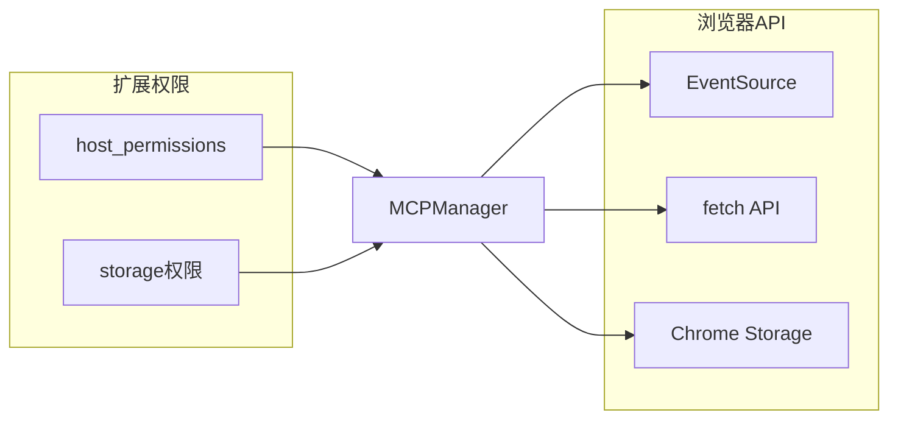
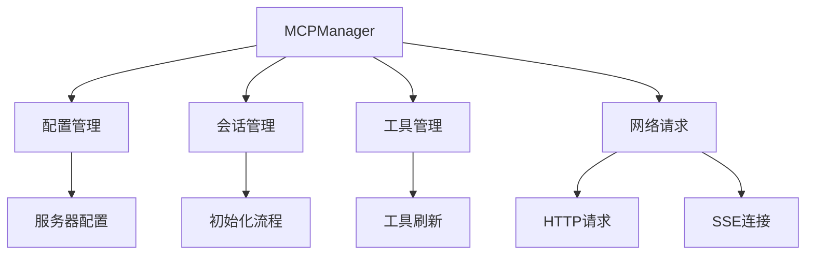

# SSE连接管理

<cite>
**本文档引用的文件**
- [mcp_manager.js](file://background/managers/mcp_manager.js)
- [manifest.json](file://manifest.json)
</cite>

## 目录
1. [简介](#简介)
2. [项目结构](#项目结构)
3. [核心组件](#核心组件)
4. [架构概览](#架构概览)
5. [详细组件分析](#详细组件分析)
6. [依赖关系分析](#依赖关系分析)
7. [性能考虑](#性能考虑)
8. [故障排除指南](#故障排除指南)
9. [结论](#结论)

## 简介

本文档详细说明了Gemini Nexus扩展中的SSE（Server-Sent Events）连接管理机制。重点分析了`connectServer`方法如何通过fetch探针检测Content-Type来决定连接模式，以及EventSource连接的完整生命周期管理。

该系统实现了智能的连接模式选择：当服务器返回text/event-stream时使用SSE模式，当返回application/json时自动切换到HTTP模式。文档还涵盖了连接状态管理、endpoint事件处理、initializeSession流程，以及常见连接失败原因的诊断和解决方案。

## 项目结构

SSE连接管理功能主要位于背景管理器模块中：



**图表来源**
- [mcp_manager.js](file://background/managers/mcp_manager.js#L71-L150)

**章节来源**
- [mcp_manager.js](file://background/managers/mcp_manager.js#L1-L530)

## 核心组件

### MCPManager类

MCPManager是SSE连接管理的核心控制器，负责：
- 服务器配置加载和管理
- 连接状态跟踪和转换
- SSE连接建立和维护
- HTTP模式下的直接请求处理

### 连接状态管理

系统使用四种连接状态：
- `disconnected`: 初始状态，未连接
- `connecting`: 正在进行连接探测
- `connected`: 连接成功，可进行通信
- `error`: 连接失败或发生错误

**章节来源**
- [mcp_manager.js](file://background/managers/mcp_manager.js#L21-L38)
- [mcp_manager.js](file://background/managers/mcp_manager.js#L71-L150)

## 架构概览

SSE连接管理采用双模式架构，支持智能模式切换：



**图表来源**
- [mcp_manager.js](file://background/managers/mcp_manager.js#L71-L150)

## 详细组件分析

### connectServer方法实现

connectServer方法是SSE连接管理的核心入口点，实现了完整的连接流程：

#### 模式检测阶段



**图表来源**
- [mcp_manager.js](file://background/managers/mcp_manager.js#L71-L150)

#### EventSource连接建立

当服务器正确返回text/event-stream时，系统创建EventSource连接：



**图表来源**
- [mcp_manager.js](file://background/managers/mcp_manager.js#L116-L144)

#### endpoint事件处理流程

endpoint事件是SSE连接的关键事件，用于传递POST URL并触发会话初始化：



**图表来源**
- [mcp_manager.js](file://background/managers/mcp_manager.js#L127-L133)
- [mcp_manager.js](file://background/managers/mcp_manager.js#L262-L285)

### 连接状态管理机制

系统实现了完整的连接状态生命周期管理：



**图表来源**
- [mcp_manager.js](file://background/managers/mcp_manager.js#L71-L150)

**章节来源**
- [mcp_manager.js](file://background/managers/mcp_manager.js#L71-L150)

## 依赖关系分析

### 外部依赖

SSE连接管理主要依赖以下外部组件：



**图表来源**
- [mcp_manager.js](file://background/managers/mcp_manager.js#L1-L530)
- [manifest.json](file://manifest.json#L6-L10)

### 内部依赖关系



**图表来源**
- [mcp_manager.js](file://background/managers/mcp_manager.js#L21-L38)
- [mcp_manager.js](file://background/managers/mcp_manager.js#L262-L285)

**章节来源**
- [mcp_manager.js](file://background/managers/mcp_manager.js#L1-L530)
- [manifest.json](file://manifest.json#L6-L10)

## 性能考虑

### 连接优化策略

1. **智能模式切换**: 自动检测服务器能力，避免不必要的SSE连接
2. **超时控制**: 请求超时机制防止长时间阻塞
3. **内存管理**: 及时清理EventSource连接和状态信息
4. **并发控制**: 避免重复连接尝试

### 资源使用监控

系统提供了调试接口来监控连接状态：
- 连接状态跟踪
- 服务器类型识别
- 工具列表加载状态
- 请求响应时间统计

**章节来源**
- [mcp_manager.js](file://background/managers/mcp_manager.js#L389-L403)

## 故障排除指南

### 常见连接失败原因

#### CORS跨域问题

**症状**: 控制台显示CORS错误，连接被阻止

**诊断步骤**:
1. 检查服务器是否正确设置CORS头
2. 验证`Access-Control-Allow-Origin`配置
3. 确认预检请求处理

**解决方案**:
```javascript
// 服务器需要设置正确的CORS头
Access-Control-Allow-Origin: *
Access-Control-Allow-Methods: GET, POST, OPTIONS
Access-Control-Allow-Headers: Content-Type
```

#### 网络超时问题

**症状**: 连接在探测阶段超时

**诊断步骤**:
1. 检查网络连接稳定性
2. 验证服务器可达性
3. 检查防火墙设置

**解决方案**:
- 增加超时时间配置
- 实现重连机制
- 使用备用服务器地址

#### 服务器配置问题

**症状**: Content-Type检测失败或返回意外格式

**诊断步骤**:
1. 检查服务器SSE实现
2. 验证Content-Type头设置
3. 确认endpoint事件格式

**解决方案**:
- 确保服务器正确返回`text/event-stream`
- 验证endpoint事件的数据格式
- 检查服务器日志输出

### 调试建议

#### 启用详细日志

系统提供了丰富的日志输出：
- 连接状态变化
- Content-Type检测结果
- 事件处理过程
- 错误信息详情

#### 使用调试API

```javascript
// 获取当前连接状态
const debugInfo = mcpManager.getDebugInfo();
console.log(debugInfo);
```

#### 连接测试步骤

1. **基础连通性测试**: 验证服务器可达性
2. **Content-Type测试**: 确认正确的MIME类型
3. **SSE功能测试**: 验证事件流传输
4. **HTTP模式测试**: 验证POST请求处理

**章节来源**
- [mcp_manager.js](file://background/managers/mcp_manager.js#L118-L125)
- [mcp_manager.js](file://background/managers/mcp_manager.js#L146-L149)
- [mcp_manager.js](file://background/managers/mcp_manager.js#L389-L403)

## 结论

Gemini Nexus的SSE连接管理系统实现了智能化的连接模式选择和完善的错误处理机制。通过Content-Type探针检测，系统能够自动适应不同的服务器实现，提供最佳的连接体验。

关键特性包括：
- **智能模式切换**: 自动检测服务器能力
- **完整的状态管理**: 清晰的连接生命周期
- **强大的错误处理**: 全面的故障诊断和恢复
- **灵活的调试支持**: 详细的日志和状态监控

该系统为Model Context Protocol (MCP)提供了可靠的连接基础设施，支持高效的工具调用和实时通信。