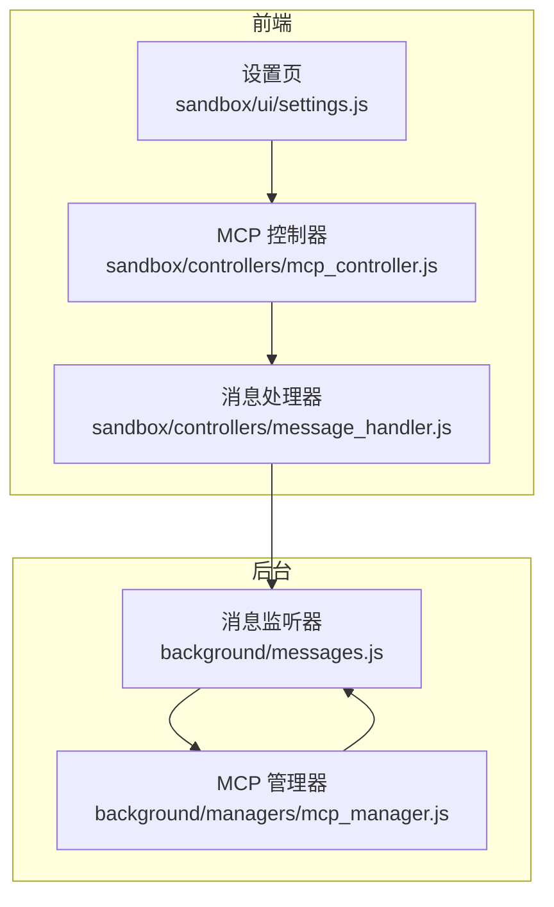
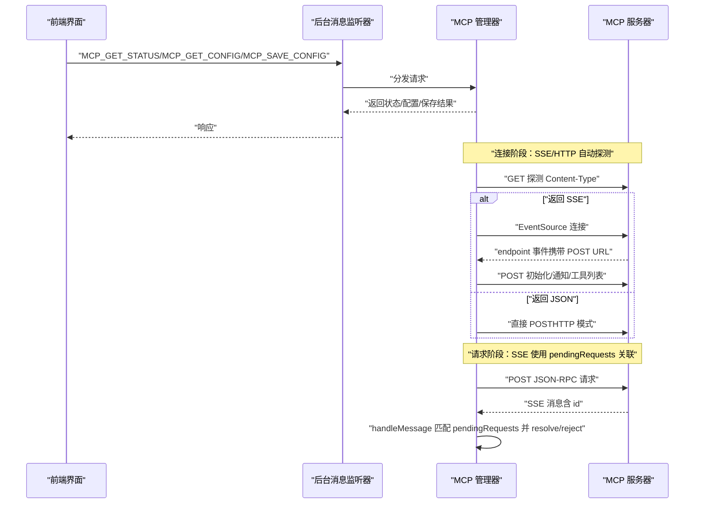
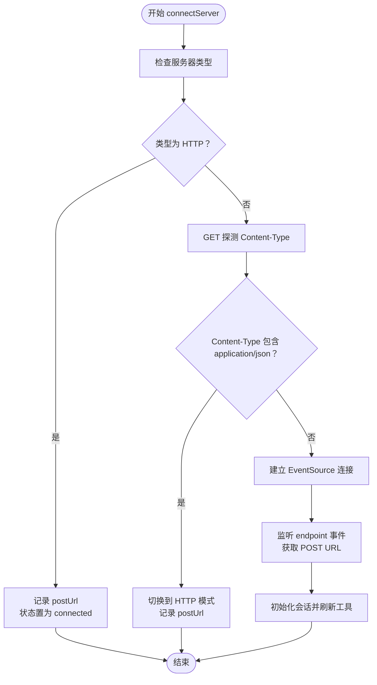
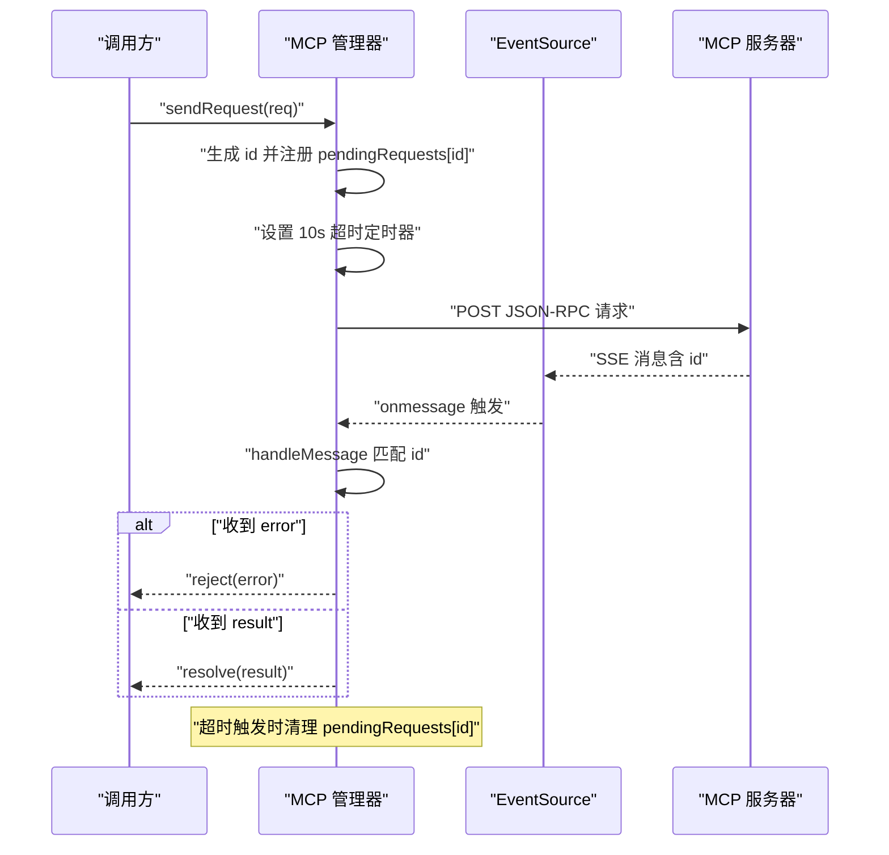
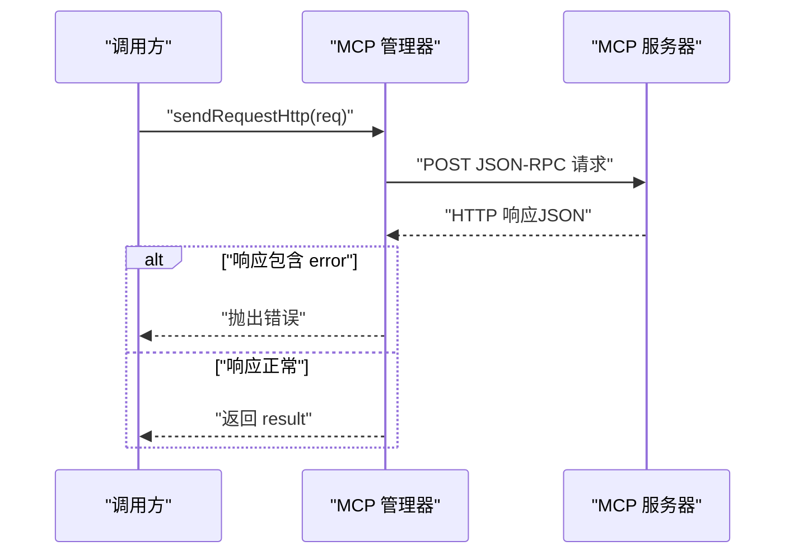
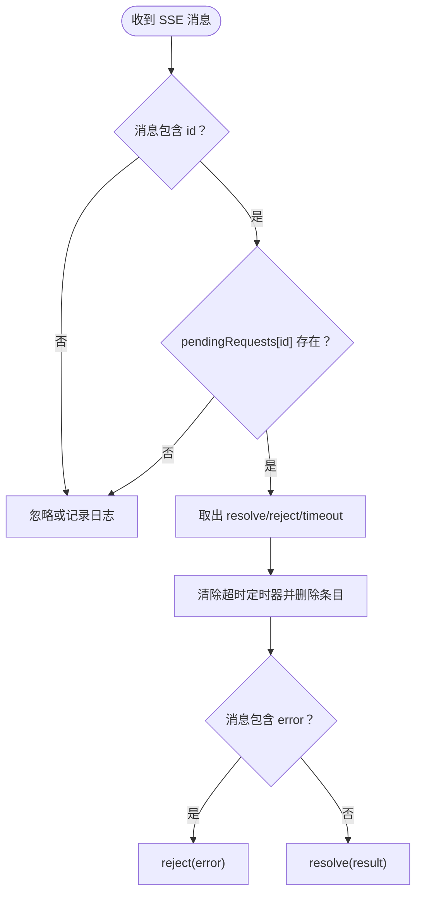
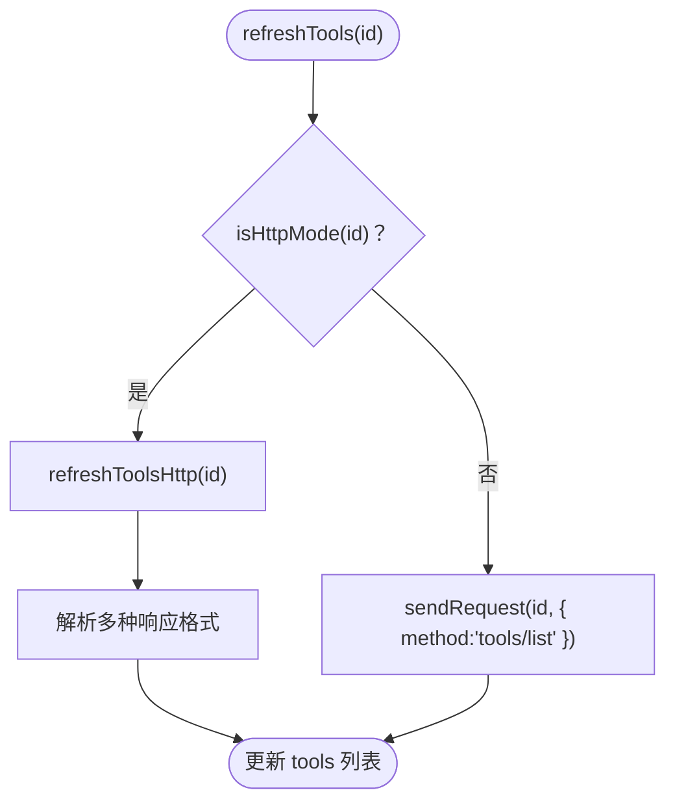
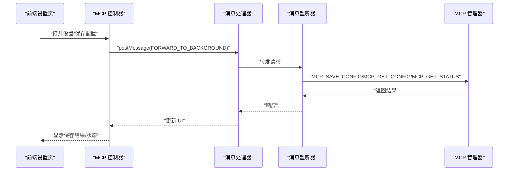
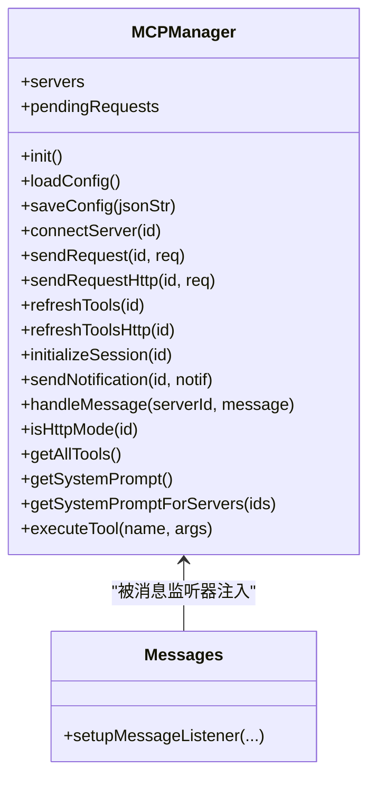

# 协议通信机制

<cite>
**本文引用的文件**
- [mcp_manager.js](file://background/managers/mcp_manager.js)
- [messages.js](file://background/messages.js)
- [mcp_controller.js](file://sandbox/controllers/mcp_controller.js)
- [message_handler.js](file://sandbox/controllers/message_handler.js)
- [settings.js](file://sandbox/ui/settings.js)
</cite>

## 目录
1. [简介](#简介)
2. [项目结构](#项目结构)
3. [核心组件](#核心组件)
4. [架构总览](#架构总览)
5. [详细组件分析](#详细组件分析)
6. [依赖关系分析](#依赖关系分析)
7. [性能考量](#性能考量)
8. [故障排查指南](#故障排查指南)
9. [结论](#结论)

## 简介
本文件系统性梳理并解读 Gemini Nexus 中的 MCP（Model Context Protocol）通信机制，重点覆盖以下方面：
- 通过 Content-Type 探针自动识别服务器类型，动态选择 SSE 或 HTTP 模式
- 在 SSE 模式下，利用 pendingRequests 映射实现请求-响应关联、超时与错误传播
- 在 HTTP 模式下，sendRequestHttp 直接发起 POST 请求并等待响应
- handleMessage 对 SSE 消息进行解析与分发，匹配对应请求并返回结果
- 对比两种模式的优缺点与适用场景，并给出性能优化建议

## 项目结构
围绕 MCP 的通信逻辑主要分布在后台管理器与前后端交互层：
- 后台管理器：负责服务器配置加载、连接建立、请求发送、消息处理与工具列表刷新
- 前端控制器与设置页：负责 MCP 服务器状态展示、用户选择与配置下发
- 消息通道：通过浏览器 runtime onMessage 实现前后端消息转发与响应

图表来源
- [messages.js](file://background/messages.js#L14-L81)
- [mcp_manager.js](file://background/managers/mcp_manager.js#L1-L530)
- [mcp_controller.js](file://sandbox/controllers/mcp_controller.js#L1-L185)
- [message_handler.js](file://sandbox/controllers/message_handler.js#L75-L113)
- [settings.js](file://sandbox/ui/settings.js#L57-L88)

章节来源
- [messages.js](file://background/messages.js#L14-L81)
- [mcp_manager.js](file://background/managers/mcp_manager.js#L1-L530)
- [mcp_controller.js](file://sandbox/controllers/mcp_controller.js#L1-L185)
- [message_handler.js](file://sandbox/controllers/message_handler.js#L75-L113)
- [settings.js](file://sandbox/ui/settings.js#L57-L88)

## 核心组件
- MCPManager：负责服务器生命周期管理、连接探测、请求发送、消息处理与工具列表维护
- 消息监听器：统一接收前端请求，分发到相应处理器（含 MCP）
- 前端控制器：负责 MCP 服务器状态展示、用户选择与配置下发

章节来源
- [mcp_manager.js](file://background/managers/mcp_manager.js#L2-L69)
- [messages.js](file://background/messages.js#L14-L81)
- [mcp_controller.js](file://sandbox/controllers/mcp_controller.js#L1-L185)

## 架构总览
MCP 通信采用“双模式”策略：
- SSE 模式：先通过 GET 探测 Content-Type，若为 text/event-stream 则建立 EventSource；若为 application/json 则回退到 HTTP 模式
- HTTP 模式：直接以 POST 方式与服务器交互，适用于 streamable_http 或 http 类型

图表来源
- [mcp_manager.js](file://background/managers/mcp_manager.js#L71-L150)
- [mcp_manager.js](file://background/managers/mcp_manager.js#L308-L385)
- [messages.js](file://background/messages.js#L41-L67)

## 详细组件分析

### connectServer：SSE 与 HTTP 模式的自动识别
- 首先根据配置中的 type 决定是否直接进入 HTTP 模式（streamable_http/http）
- 若为标准 MCP（默认或 sse），则先发起一次 GET 请求并检查响应头 Content-Type
  - 若为 application/json，则判定为 HTTP 模式，记录 postUrl 并进入 connected 状态
  - 若为 text/event-stream，则建立 EventSource 连接，并监听 endpoint 事件以获取 POST URL
- 成功获取 POST URL 后，进入 connected 状态并初始化会话（发送 initialize 与 notifications/initialized），随后刷新工具列表

图表来源
- [mcp_manager.js](file://background/managers/mcp_manager.js#L71-L150)

章节来源
- [mcp_manager.js](file://background/managers/mcp_manager.js#L71-L150)

### sendRequest：SSE 环境下的请求-响应关联与超时处理
- 为每个 JSON-RPC 请求生成唯一 id，并将其注册到 pendingRequests 映射中
- 设置固定超时（示例为 10 秒），超时后清理 pendingRequests 并 reject
- 发送 POST 请求至 postUrl，实际响应由 SSE onmessage 回传
- handleMessage 收到带 id 的消息后，从 pendingRequests 取出对应 Promise 并 resolve 或 reject

图表来源
- [mcp_manager.js](file://background/managers/mcp_manager.js#L308-L351)
- [mcp_manager.js](file://background/managers/mcp_manager.js#L370-L385)

章节来源
- [mcp_manager.js](file://background/managers/mcp_manager.js#L308-L351)
- [mcp_manager.js](file://background/managers/mcp_manager.js#L370-L385)

### sendRequestHttp：HTTP 模式下的直接响应获取
- 与 sendRequest 类似，构造 JSON-RPC 请求并发送 POST
- 不依赖 SSE，直接等待 HTTP 响应并解析
- 对非 2xx 响应抛出错误，对包含 error 字段的响应也抛出错误
- 返回 result 字段作为调用结果

图表来源
- [mcp_manager.js](file://background/managers/mcp_manager.js#L229-L260)

章节来源
- [mcp_manager.js](file://background/managers/mcp_manager.js#L229-L260)

### handleMessage：SSE 消息解析与响应分发
- 当收到消息包含 id 且存在于 pendingRequests 时，取出对应的 Promise
- 清理超时定时器并删除 pendingRequests 条目
- 若消息包含 error，reject；否则 resolve result
- 对于无 id 的消息（如通知或日志），可忽略或按需处理

图表来源
- [mcp_manager.js](file://background/managers/mcp_manager.js#L370-L385)

章节来源
- [mcp_manager.js](file://background/managers/mcp_manager.js#L370-L385)

### 工具列表刷新：refreshTools 与 refreshToolsHttp
- refreshTools：若为 HTTP 模式，直接调用 refreshToolsHttp；否则通过 sendRequest 发送 tools/list
- refreshToolsHttp：构造 JSON-RPC 请求，支持多种响应格式（result.tools、tools、result 数组、直接数组），解析后写入 servers[id].tools

图表来源
- [mcp_manager.js](file://background/managers/mcp_manager.js#L287-L306)
- [mcp_manager.js](file://background/managers/mcp_manager.js#L153-L213)

章节来源
- [mcp_manager.js](file://background/managers/mcp_manager.js#L287-L306)
- [mcp_manager.js](file://background/managers/mcp_manager.js#L153-L213)

### 前后端交互与配置管理
- 前端通过 postMessage 将 MCP 请求转发给后台
- 后台消息监听器根据 action 分发到 MCP 管理器，再由其执行具体操作（保存配置、获取状态、获取工具等）
- 设置页负责 MCP 配置的展示与保存，保存成功后会重新初始化连接

图表来源
- [settings.js](file://sandbox/ui/settings.js#L57-L88)
- [mcp_controller.js](file://sandbox/controllers/mcp_controller.js#L88-L99)
- [message_handler.js](file://sandbox/controllers/message_handler.js#L75-L113)
- [messages.js](file://background/messages.js#L41-L67)

章节来源
- [settings.js](file://sandbox/ui/settings.js#L57-L88)
- [mcp_controller.js](file://sandbox/controllers/mcp_controller.js#L88-L99)
- [message_handler.js](file://sandbox/controllers/message_handler.js#L75-L113)
- [messages.js](file://background/messages.js#L41-L67)

## 依赖关系分析
- MCPManager 依赖浏览器原生 EventSource 与 fetch API
- 前端通过 postMessage 与后台通信，后台通过 chrome.runtime.onMessage 统一调度
- MCPManager 内部维护 pendingRequests 映射用于请求-响应关联
- 工具列表解析兼容多种响应格式，增强与不同服务器的兼容性

图表来源
- [mcp_manager.js](file://background/managers/mcp_manager.js#L2-L69)
- [messages.js](file://background/messages.js#L14-L21)

章节来源
- [mcp_manager.js](file://background/managers/mcp_manager.js#L2-L69)
- [messages.js](file://background/messages.js#L14-L21)

## 性能考量
- SSE 模式优势
  - 服务器可主动推送消息（如日志、通知），降低轮询开销
  - 适合长连接、流式输出场景
  - 缺点：需要维持 EventSource 连接，资源占用略高
- HTTP 模式优势
  - 简化通信流程，无需维护 SSE 连接
  - 适合一次性请求/响应或不支持 SSE 的服务器
  - 缺点：无法接收服务器主动推送的非请求响应
- 优化建议
  - 使用 Content-Type 探针自动切换，避免手动配置错误
  - 在 SSE 模式下，合理设置超时时间，防止 pendingRequests 泄漏
  - 对工具列表解析增加缓存，减少重复请求
  - 对频繁调用的工具请求，考虑合并或去重
  - 在网络不稳定环境下，适当提高超时阈值或引入指数退避

## 故障排查指南
- 无法连接服务器
  - 检查服务器 URL 是否正确，确认 Content-Type 探测结果
  - 若返回 application/json，确认服务器支持 HTTP 模式
- SSE 连接失败
  - 查看 EventSource onerror 日志，确认服务器端 SSE 支持
  - 确认 endpoint 事件是否正确返回 POST URL
- 请求超时
  - 检查 pendingRequests 是否存在未清理的条目
  - 提升超时阈值或优化服务器响应速度
- 响应解析失败
  - 确认服务器返回的 JSON-RPC 结构符合预期
  - 检查工具列表刷新逻辑是否覆盖了所有可能的响应格式

章节来源
- [mcp_manager.js](file://background/managers/mcp_manager.js#L118-L149)
- [mcp_manager.js](file://background/managers/mcp_manager.js#L324-L350)
- [mcp_manager.js](file://background/managers/mcp_manager.js#L181-L212)

## 结论
本实现通过 Content-Type 探针实现了对 SSE 与 HTTP 两种 MCP 传输模式的无缝切换，结合 pendingRequests 映射在 SSE 模式下完成请求-响应关联与超时控制，在 HTTP 模式下直接获取响应。整体设计兼顾了兼容性与易用性，适合在多样化的 MCP 服务器环境中稳定运行。后续可在工具列表缓存、超时策略与错误恢复等方面进一步优化。