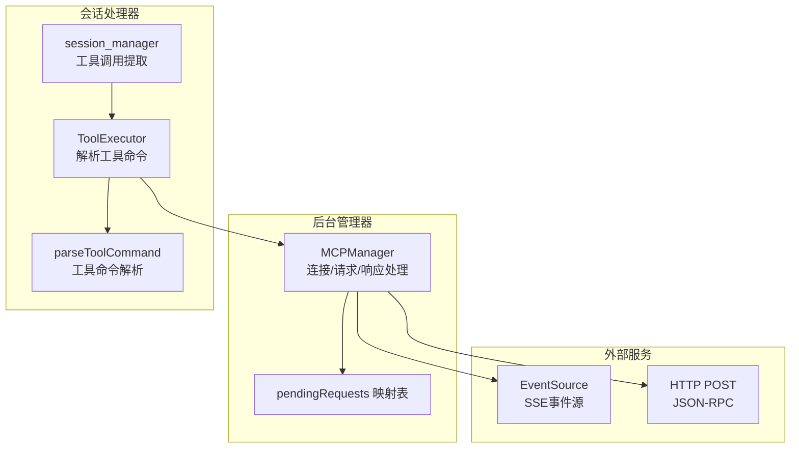
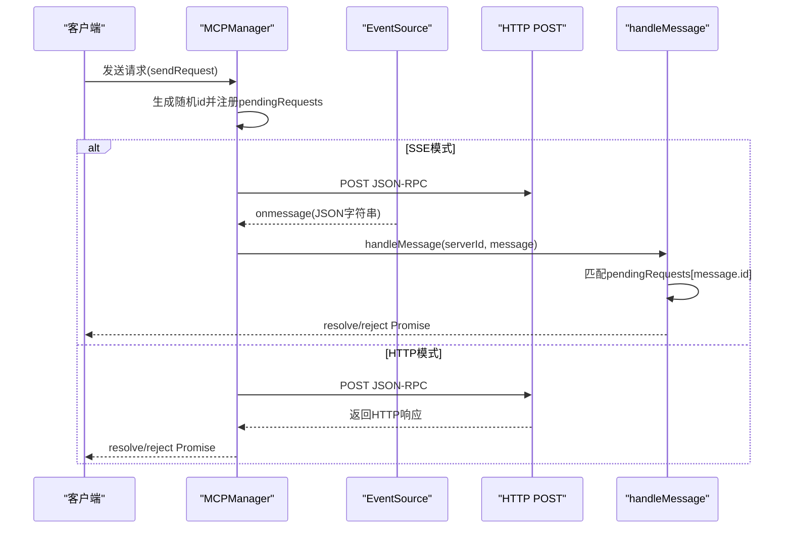
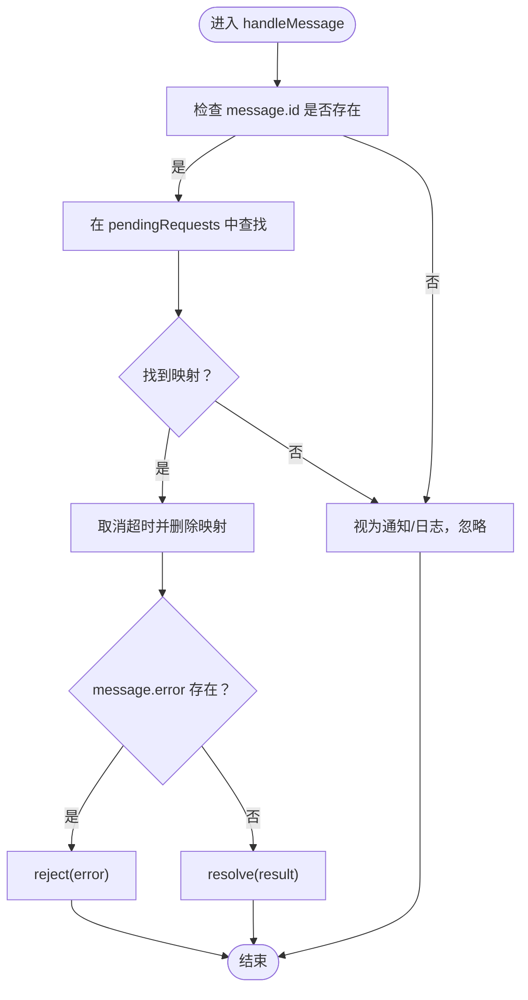
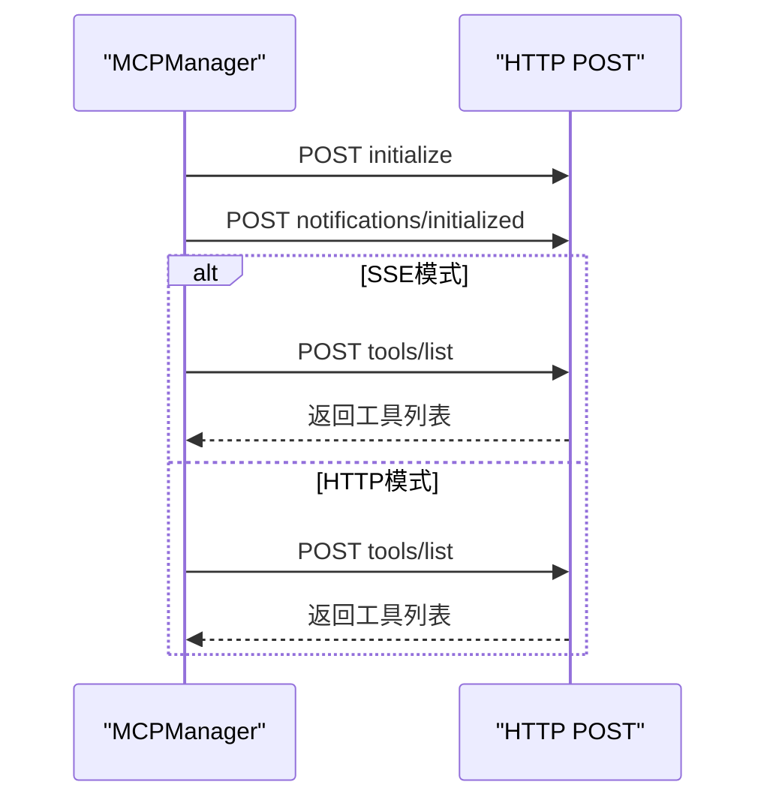
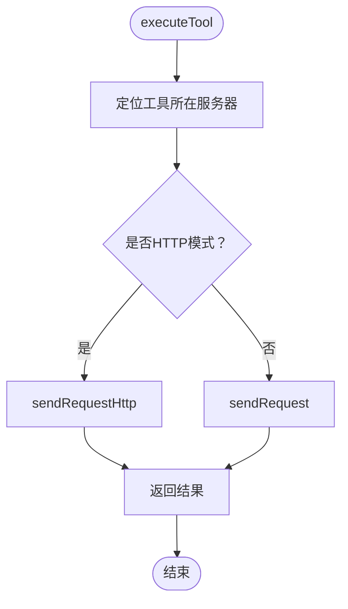
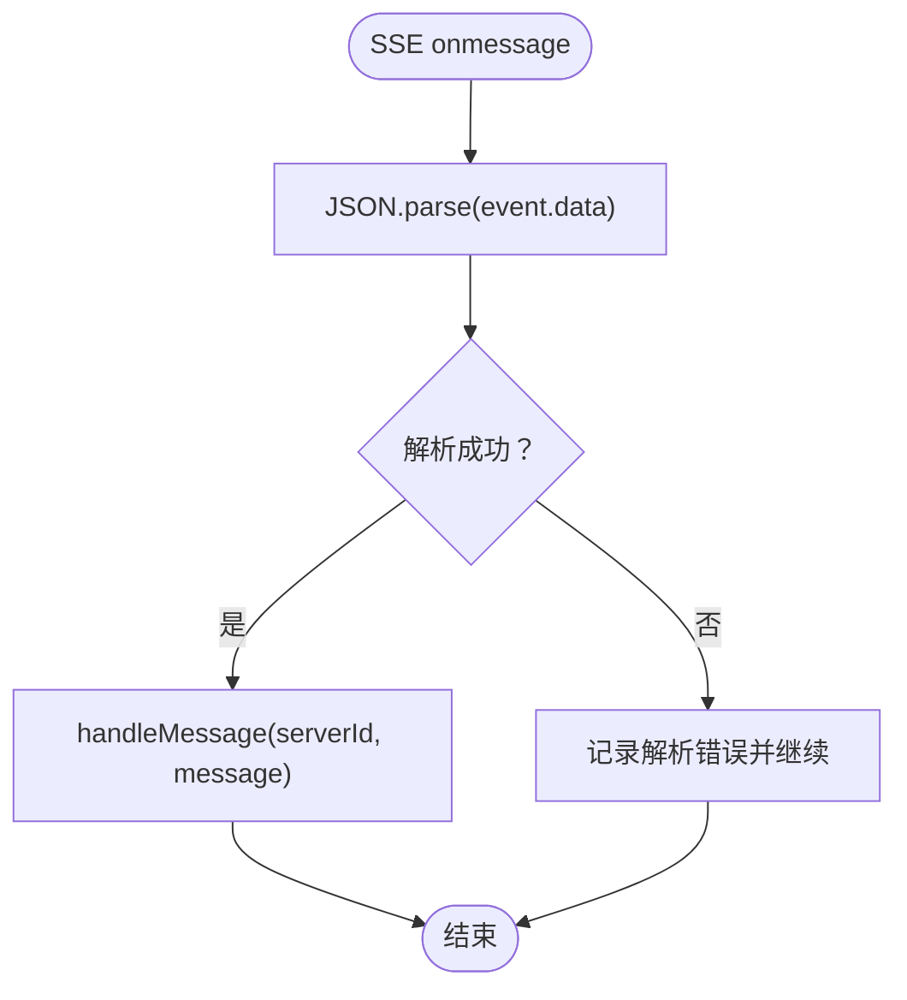
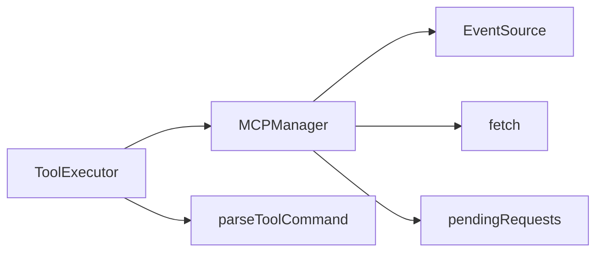

# 消息处理流程

<cite>
**本文引用的文件**
- [mcp_manager.js](file://background/managers/mcp_manager.js)
- [tool_executor.js](file://background/handlers/session/prompt/tool_executor.js)
- [utils.js](file://background/handlers/session/utils.js)
- [session_manager.js](file://background/managers/session_manager.js)
- [parser.js](file://services/parser.js)
</cite>

## 目录
1. [简介](#简介)
2. [项目结构](#项目结构)
3. [核心组件](#核心组件)
4. [架构总览](#架构总览)
5. [详细组件分析](#详细组件分析)
6. [依赖关系分析](#依赖关系分析)
7. [性能考量](#性能考量)
8. [故障排查指南](#故障排查指南)
9. [结论](#结论)

## 简介
本文件聚焦于消息处理流程，特别是SSE传输中的JSON-RPC响应处理与请求-响应关联机制。内容涵盖：
- handleMessage方法如何基于请求ID匹配并解析Promise结果或错误
- pendingRequests映射表在请求-响应关联、Promise解析与超时清理中的作用
- initializeSession流程中initialize请求与initialized通知的发送时序
- 工具调用executeTool时如何根据服务器模式选择sendRequest或sendRequestHttp
- 消息解析失败的异常处理策略

## 项目结构
与消息处理直接相关的核心模块位于后台管理器与会话处理器中：
- 后台管理器：负责连接SSE/HTTP服务器、发送请求、接收响应、维护pendingRequests映射表
- 会话处理器：负责从模型输出中提取工具调用指令，并驱动工具执行
- 解析器：负责对流式响应进行逐行解析（非本文重点，但与消息处理的上游/下游衔接有关）

图表来源
- [mcp_manager.js](file://background/managers/mcp_manager.js#L71-L150)
- [tool_executor.js](file://background/handlers/session/prompt/tool_executor.js#L1-L49)
- [utils.js](file://background/handlers/session/utils.js#L4-L21)
- [session_manager.js](file://background/managers/session_manager.js#L250-L285)

章节来源
- [mcp_manager.js](file://background/managers/mcp_manager.js#L1-L530)
- [tool_executor.js](file://background/handlers/session/prompt/tool_executor.js#L1-L49)
- [utils.js](file://background/handlers/session/utils.js#L1-L64)
- [session_manager.js](file://background/managers/session_manager.js#L250-L285)

## 核心组件
- MCPManager：负责与MCP服务器建立连接（SSE或HTTP），发送请求/通知，接收SSE消息并分发到handleMessage，维护pendingRequests映射表，实现请求-响应关联与超时清理。
- ToolExecutor：从对话文本中解析工具调用指令，触发控制管理器执行工具。
- session_manager：提供更广泛的工具调用提取逻辑（备用解析策略）。
- utils：提供工具命令解析辅助函数（正则+JSON解析）。

章节来源
- [mcp_manager.js](file://background/managers/mcp_manager.js#L2-L6)
- [tool_executor.js](file://background/handlers/session/prompt/tool_executor.js#L4-L7)
- [utils.js](file://background/handlers/session/utils.js#L4-L21)
- [session_manager.js](file://background/managers/session_manager.js#L250-L285)

## 架构总览
SSE与HTTP两种传输模式的处理路径如下：
- SSE模式：通过EventSource监听消息；收到消息后尝试JSON解析，再交由handleMessage按id匹配pendingRequests，解析Promise或抛出错误。
- HTTP模式：直接使用fetch POST发送请求，等待HTTP响应返回结果，不依赖SSE消息。

图表来源
- [mcp_manager.js](file://background/managers/mcp_manager.js#L115-L146)
- [mcp_manager.js](file://background/managers/mcp_manager.js#L308-L351)
- [mcp_manager.js](file://background/managers/mcp_manager.js#L370-L385)

## 详细组件分析

### 组件A：MCPManager的消息处理与请求-响应关联
- 连接与探测
  - connectServer根据配置类型决定使用SSE还是HTTP直连；若SSE探测返回JSON，则自动切换为HTTP模式。
- SSE消息处理
  - onmessage回调中尝试JSON.parse，失败时记录错误并继续处理其他消息。
  - handleMessage根据message.id在pendingRequests中查找对应Promise，成功时resolve，失败时reject，并清理timeout与映射项。
- 请求-响应关联与超时
  - sendRequest为每个请求生成唯一id，注册到pendingRequests，设置10秒超时；若fetch失败或超时，清理映射并reject。
  - handleMessage命中后立即清除timeout并删除映射，避免内存泄漏。
- 初始化流程
  - initializeSession先发送initialize请求，再发送notifications/initialized通知，最后刷新工具列表。

图表来源
- [mcp_manager.js](file://background/managers/mcp_manager.js#L370-L385)

章节来源
- [mcp_manager.js](file://background/managers/mcp_manager.js#L71-L150)
- [mcp_manager.js](file://background/managers/mcp_manager.js#L308-L351)
- [mcp_manager.js](file://background/managers/mcp_manager.js#L370-L385)

### 组件B：initializeSession的时序与工具加载
- initializeSession顺序
  1) 发送initialize请求（包含协议版本、能力声明、客户端信息）
  2) 发送notifications/initialized通知
  3) 刷新工具列表（SSE模式下通过sendRequest获取，HTTP模式下通过refreshToolsHttp直接HTTP请求）
- 时序保证
  - 通过await顺序确保initialize完成后才发送initialized，避免状态不一致。
  - refreshTools根据isHttpMode自动选择HTTP或SSE路径。

图表来源
- [mcp_manager.js](file://background/managers/mcp_manager.js#L262-L285)
- [mcp_manager.js](file://background/managers/mcp_manager.js#L287-L306)

章节来源
- [mcp_manager.js](file://background/managers/mcp_manager.js#L262-L285)
- [mcp_manager.js](file://background/managers/mcp_manager.js#L287-L306)

### 组件C：工具调用executeTool与服务器模式选择
- 工具定位
  - executeTool遍历所有已知服务器的工具清单，定位目标工具所在的服务器ID。
- 模式判断与请求发送
  - 若目标服务器处于HTTP模式（streamable_http或http），使用sendRequestHttp直接获取HTTP响应；
  - 否则使用sendRequest，通过SSE消息回传的JSON-RPC响应完成Promise解析。
- 结果处理
  - 返回值通常包含文本内容与可能的图像数据，便于上层渲染。

图表来源
- [mcp_manager.js](file://background/managers/mcp_manager.js#L479-L525)

章节来源
- [mcp_manager.js](file://background/managers/mcp_manager.js#L479-L525)

### 组件D：消息解析失败的异常处理策略
- SSE消息解析
  - onmessage中对event.data进行JSON.parse，捕获异常并记录错误，避免中断后续消息处理。
- 工具命令解析
  - parseToolCommand采用正则匹配三引号包裹的JSON块，再进行JSON.parse，异常时记录错误并返回null。
- 会话管理器的备用解析
  - session_manager提供更宽松的JSON结构提取策略（括号计数闭合），失败时仍返回null，避免阻断流程。

图表来源
- [mcp_manager.js](file://background/managers/mcp_manager.js#L135-L142)
- [utils.js](file://background/handlers/session/utils.js#L4-L21)
- [session_manager.js](file://background/managers/session_manager.js#L250-L285)

章节来源
- [mcp_manager.js](file://background/managers/mcp_manager.js#L135-L142)
- [utils.js](file://background/handlers/session/utils.js#L4-L21)
- [session_manager.js](file://background/managers/session_manager.js#L250-L285)

## 依赖关系分析
- MCPManager依赖：
  - 浏览器EventSource用于SSE消息监听
  - fetch用于HTTP请求与SSE消息回传的JSON-RPC响应
  - pendingRequests作为全局映射表，贯穿请求发送与响应处理
- ToolExecutor依赖：
  - utils.parseToolCommand从文本中提取工具名称与参数
  - 控制管理器执行具体动作（不在本文展开）

图表来源
- [mcp_manager.js](file://background/managers/mcp_manager.js#L115-L146)
- [mcp_manager.js](file://background/managers/mcp_manager.js#L308-L351)
- [tool_executor.js](file://background/handlers/session/prompt/tool_executor.js#L4-L7)
- [utils.js](file://background/handlers/session/utils.js#L4-L21)

章节来源
- [mcp_manager.js](file://background/managers/mcp_manager.js#L1-L530)
- [tool_executor.js](file://background/handlers/session/prompt/tool_executor.js#L1-L49)
- [utils.js](file://background/handlers/session/utils.js#L1-L64)

## 性能考量
- 超时控制：sendRequest设置10秒超时，防止长时间挂起；超时后清理pendingRequests映射，避免内存泄漏。
- SSE解析健壮性：onmessage中对单条消息解析失败不影响整体事件流，提升鲁棒性。
- HTTP模式优势：对于支持HTTP直连的服务器，可减少SSE开销，提高响应速度。
- 工具列表缓存：refreshToolsHttp与refreshTools在连接建立后立即加载工具，避免后续调用时的延迟。

## 故障排查指南
- SSE连接失败
  - 检查connectServer的错误回调与状态更新；确认服务器端是否正确返回SSE或JSON。
- 消息解析失败
  - 查看SSE onmessage中的异常日志；确认event.data格式是否符合预期。
- 请求未响应或超时
  - 检查pendingRequests映射是否被正确创建与清理；确认服务器端是否通过SSE回传了对应id的响应。
- 工具未找到
  - 使用getAllTools确认工具是否已加载；检查executeTool的工具定位逻辑与服务器类型。

章节来源
- [mcp_manager.js](file://background/managers/mcp_manager.js#L122-L125)
- [mcp_manager.js](file://background/managers/mcp_manager.js#L135-L142)
- [mcp_manager.js](file://background/managers/mcp_manager.js#L324-L350)
- [mcp_manager.js](file://background/managers/mcp_manager.js#L479-L525)

## 结论
本文系统梳理了MCPManager在SSE与HTTP两种传输模式下的消息处理流程，重点阐明了：
- handleMessage基于请求ID的请求-响应关联机制
- pendingRequests映射表在Promise解析与超时清理中的关键作用
- initializeSession的严格时序与工具加载策略
- executeTool根据服务器模式选择合适请求方式的决策流程
- 消息解析失败的异常处理策略与容错设计

这些机制共同保障了与MCP服务器交互的稳定性与可维护性。