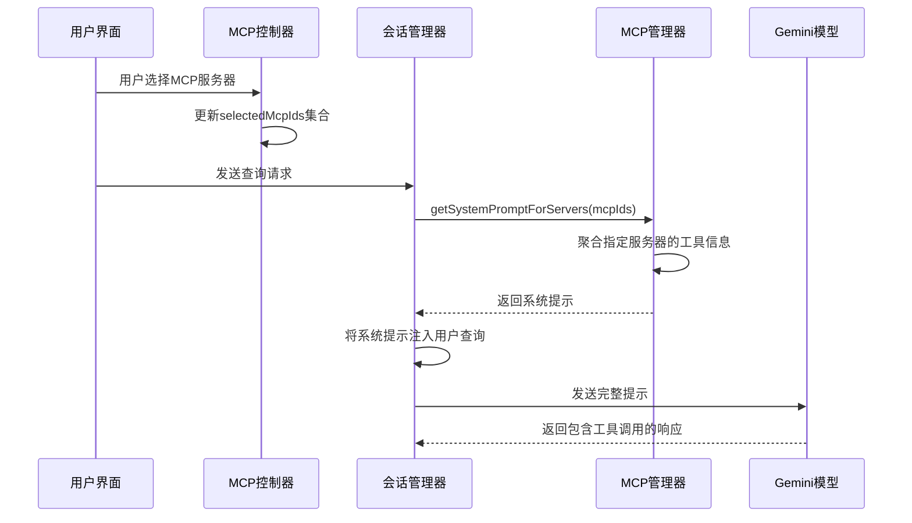
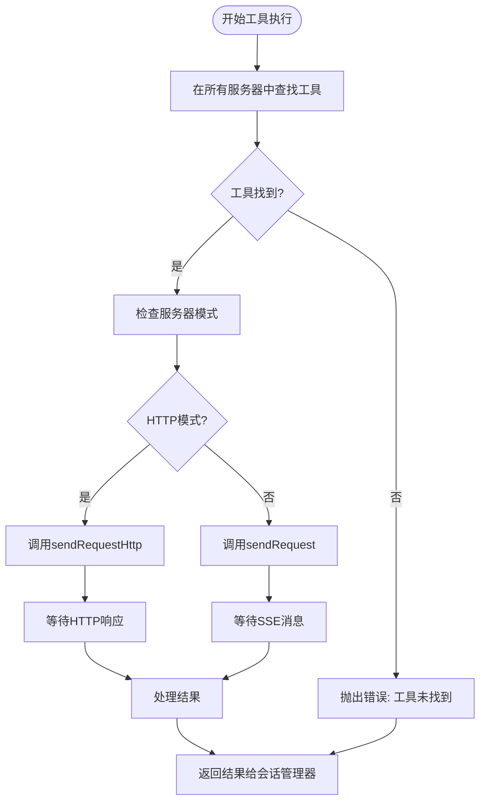
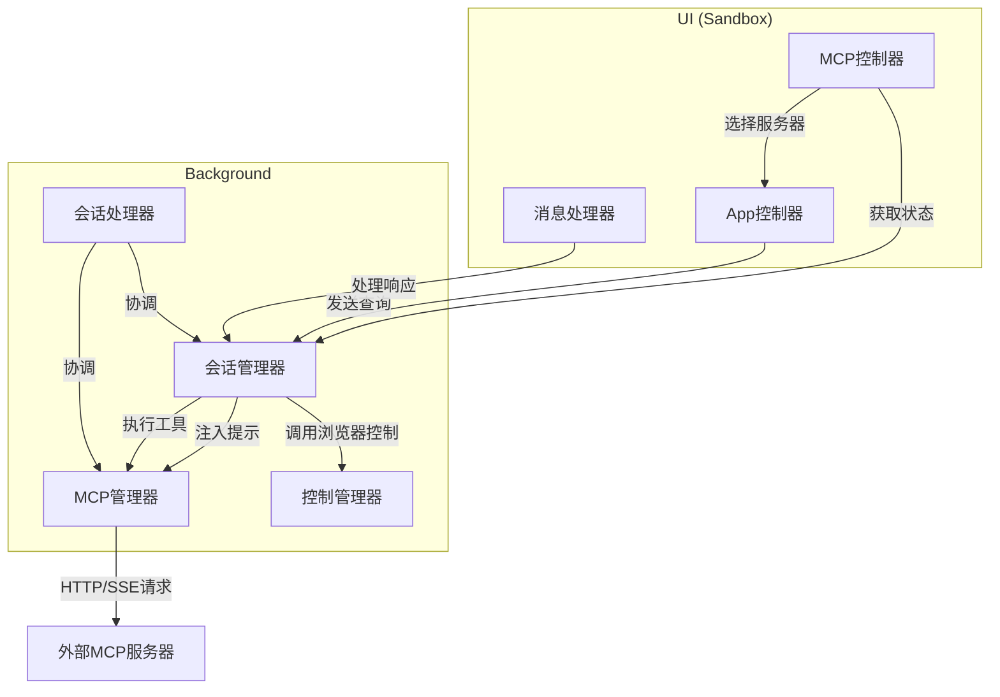

# 工具执行流程

<cite>
**本文档引用的文件**
- [mcp_manager.js](file://background/managers/mcp_manager.js)
- [session_manager.js](file://background/managers/session_manager.js)
- [mcp_controller.js](file://sandbox/controllers/mcp_controller.js)
- [tool_executor.js](file://background/handlers/session/prompt/tool_executor.js)
- [prompt_handler.js](file://background/handlers/session/prompt_handler.js)
- [builder.js](file://background/handlers/session/prompt/builder.js)
- [session.js](file://background/handlers/session.js)
- [message_handler.js](file://sandbox/controllers/message_handler.js)
- [app_controller.js](file://sandbox/controllers/app_controller.js)
- [control_manager.js](file://background/managers/control_manager.js)
- [logger.js](file://lib/logger.js)
</cite>

## 目录
1. [简介](#简介)
2. [用户选择工具流程](#用户选择工具流程)
3. [会话管理与提示词生成](#会话管理与提示词生成)
4. [工具执行流程](#工具执行流程)
5. [工具列表聚合机制](#工具列表聚合机制)
6. [工具调用失败分析与调试](#工具调用失败分析与调试)
7. [系统架构图](#系统架构图)

## 简介
本文档详细描述了MCP（Model Context Protocol）工具从用户选择到结果返回的端到端执行流程。文档涵盖了MCPController如何管理用户选择的服务器ID，SessionManager如何在生成提示词前注入工具描述，以及executeTool方法如何根据工具名称查找目标服务器并区分HTTP和SSE模式进行调用。同时，文档还解释了getAllTools方法如何聚合所有服务器的工具列表，并提供了工具调用失败的常见原因和调试方法。

## 用户选择工具流程

MCP工具执行流程始于用户在UI界面中选择需要使用的MCP服务器。`MCPController`类负责管理这一交互过程，它维护着用户当前选中的服务器ID集合。

当用户点击MCP菜单项时，`MCPController`会触发`togglePicker`方法，打开服务器选择器。该控制器通过`requestMcpStatus`方法向后台发送`MCP_GET_STATUS`消息，获取所有已配置MCP服务器的状态信息。收到服务器状态后，`handleMcpStatus`方法会更新内部的`mcpServers`对象，并调用`renderServerList`方法渲染服务器列表UI。

用户通过点击服务器项来选择或取消选择服务器，`toggleMcpSelection`方法会相应地调用`selectMcp`或`deselectMcp`方法来更新`selectedMcpIds`集合。每次选择状态改变时，`updateTagsUI`方法会更新UI上的标签显示，直观地展示当前选中的服务器。

当用户准备发送查询时，`getSelectedMcpIds`方法会返回当前选中服务器ID的数组，这些ID将作为请求的一部分传递给会话管理器，用于确定哪些工具描述需要注入到系统提示中。

**Section sources**
- [mcp_controller.js](file://sandbox/controllers/mcp_controller.js#L8-L202)
- [app_controller.js](file://sandbox/controllers/app_controller.js#L35)
- [message_handler.js](file://sandbox/controllers/message_handler.js#L82-L84)

## 会话管理与提示词生成

`SessionManager`是整个工具执行流程的核心协调者，它负责处理用户查询、管理会话状态，并协调工具的执行。当用户发送查询时，`handleSendPrompt`方法被调用，该方法首先确保用户已登录，然后进入MCP工具注入阶段。

在注入阶段，`SessionManager`检查请求中是否包含`mcpIds`（即用户选中的服务器ID）。如果存在，它会调用`MCPManager`的`getSystemPromptForServers`方法，传入选中的服务器ID数组。该方法会从所有指定服务器中收集工具信息，并生成一个结构化的系统提示。

生成的系统提示会被附加到用户查询之前，形成最终发送给Gemini模型的完整提示。这种设计确保了模型在生成响应时，完全知晓可用的工具及其使用方法。系统提示中包含了每个工具的名称、描述和参数模式，以及调用工具所需的JSON代码块格式。

**Diagram sources**
- [session_manager.js](file://background/managers/session_manager.js#L57-L63)
- [mcp_manager.js](file://background/managers/mcp_manager.js#L446-L477)

**Section sources**
- [session_manager.js](file://background/managers/session_manager.js#L57-L63)
- [mcp_manager.js](file://background/managers/mcp_manager.js#L446-L477)

## 工具执行流程

当Gemini模型的响应中包含工具调用指令时，`SessionManager`会启动工具执行循环。`handleSendPrompt`方法中的`parseToolCall`函数会解析响应文本，查找符合`{"action": "call_tool", "tool": "...", "args": {...}}`格式的JSON代码块。

一旦检测到有效的工具调用，`SessionManager`会调用`MCPManager`的`executeTool`方法。该方法首先通过遍历所有服务器的工具列表来查找与调用名称匹配的工具。如果未找到匹配的工具，它会抛出一个包含所有可用工具名称的错误。

找到目标工具后，`executeTool`方法会根据服务器的配置类型（`type`）决定使用HTTP模式还是SSE模式。`isHttpMode`方法检查服务器配置，如果类型为`streamable_http`或`http`，则使用`sendRequestHttp`方法；否则使用`sendRequest`方法。

`sendRequestHttp`方法直接向服务器的POST端点发送一个JSON-RPC请求，并等待服务器的直接HTTP响应。而`sendRequest`方法则通过SSE（Server-Sent Events）连接发送请求，并使用一个`pendingRequests`映射来关联请求ID与Promise，以便在接收到SSE消息时解析相应的Promise。

工具调用的结果会返回给`SessionManager`，然后作为新的查询发送回Gemini模型，从而形成一个自动化的反馈循环，直到模型不再调用工具为止。

**Diagram sources**
- [session_manager.js](file://background/managers/session_manager.js#L77-L87)
- [mcp_manager.js](file://background/managers/mcp_manager.js#L479-L524)

**Section sources**
- [session_manager.js](file://background/managers/session_manager.js#L77-L87)
- [mcp_manager.js](file://background/managers/mcp_manager.js#L479-L524)

## 工具列表聚合机制

`MCPManager`提供了两个关键方法来聚合工具列表：`getAllTools`和`getSystemPromptForServers`。`getAllTools`方法遍历`MCPManager`内部所有服务器的`tools`数组，将每个工具对象复制并添加一个`_serverId`属性，然后将所有工具合并到一个数组中返回。

`getSystemPromptForServers`方法则更为具体，它只聚合指定服务器ID列表中的工具。该方法接收一个服务器ID数组作为参数，遍历这些ID，从对应的服务器配置中提取工具列表，并同样添加`_serverId`属性。聚合完成后，它会检查工具列表是否为空，如果为空则返回`null`。

这两个方法生成的工具列表随后被用于构建系统提示。`getSystemPromptForServers`方法会遍历工具列表，为每个工具生成一条描述，包括工具名称、描述和参数模式。最终生成的提示文本会明确告知模型如何调用这些工具，包括必须使用的JSON代码块格式和`action`字段的值。

**Section sources**
- [mcp_manager.js](file://background/managers/mcp_manager.js#L407-L477)

## 工具调用失败分析与调试

工具调用可能因多种原因失败，系统提供了相应的错误处理和调试机制。常见的失败原因包括：

1.  **工具未找到**：当`executeTool`方法无法在任何已连接的服务器上找到指定名称的工具时，会抛出错误。错误信息会列出所有可用的工具名称，帮助用户识别拼写错误或确认工具是否已正确加载。

2.  **服务器连接问题**：如果服务器状态为`disconnected`或`error`，则无法执行工具调用。这通常由配置错误（如URL无效）或网络问题引起。`connectServer`方法中的日志可以帮助诊断此类问题。

3.  **HTTP请求失败**：在HTTP模式下，`sendRequestHttp`方法可能会遇到HTTP错误（如404或500）。该方法会捕获`fetch`异常并抛出带有HTTP状态码的错误。

4.  **服务器返回错误**：即使HTTP请求成功，服务器也可能在JSON-RPC响应中返回一个`error`对象。`sendRequestHttp`和`handleMessage`方法都会检查并抛出这些错误。

5.  **解析错误**：`refreshToolsHttp`方法在处理工具列表响应时，会尝试多种可能的JSON格式。如果所有格式都无法解析，它会记录警告并清空工具列表。

为了便于调试，`MCPManager`提供了一个`getDebugInfo`方法，该方法返回一个包含所有服务器状态、类型、URL、POST端点和工具数量的详细信息的对象。这个信息可以通过`MCP_GET_STATUS`消息从UI获取，帮助用户和开发者快速了解系统的当前状态。

**Section sources**
- [mcp_manager.js](file://background/managers/mcp_manager.js#L174-L177)
- [mcp_manager.js](file://background/managers/mcp_manager.js#L248-L257)
- [mcp_manager.js](file://background/managers/mcp_manager.js#L376-L378)
- [mcp_manager.js](file://background/managers/mcp_manager.js#L501-L505)
- [mcp_manager.js](file://background/managers/mcp_manager.js#L389-L403)

## 系统架构图

**Diagram sources**
- [mcp_controller.js](file://sandbox/controllers/mcp_controller.js)
- [app_controller.js](file://sandbox/controllers/app_controller.js)
- [session_manager.js](file://background/managers/session_manager.js)
- [mcp_manager.js](file://background/managers/mcp_manager.js)
- [control_manager.js](file://background/managers/control_manager.js)
- [session.js](file://background/handlers/session.js)