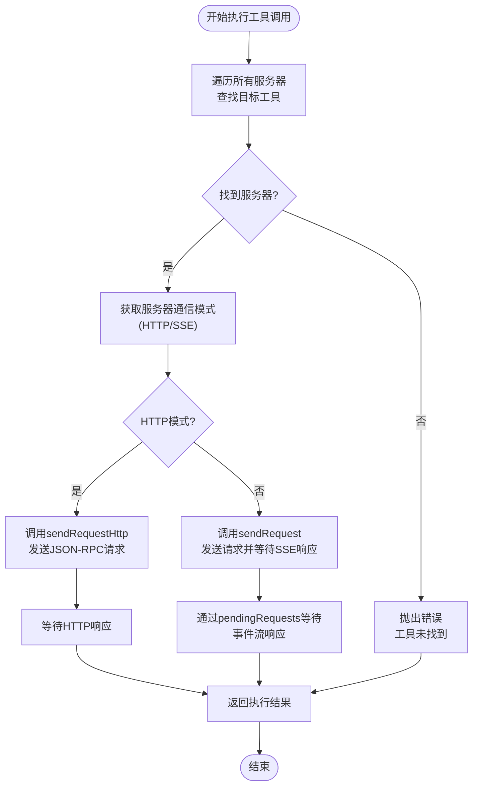
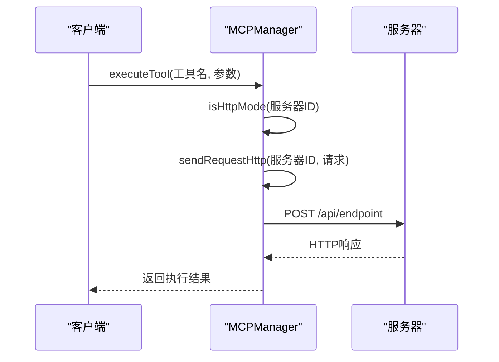
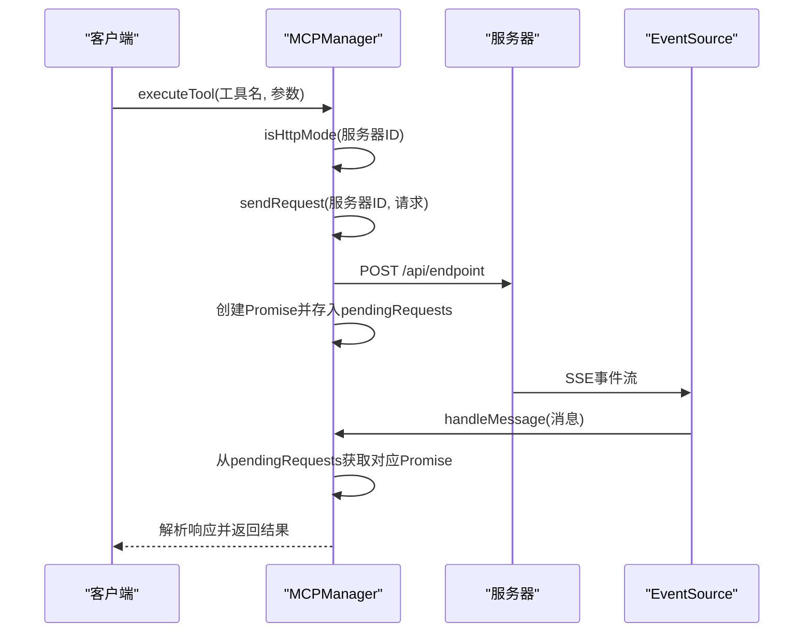
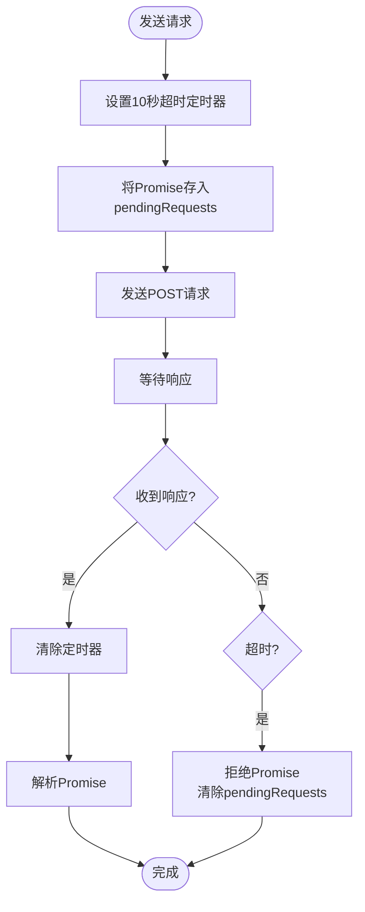
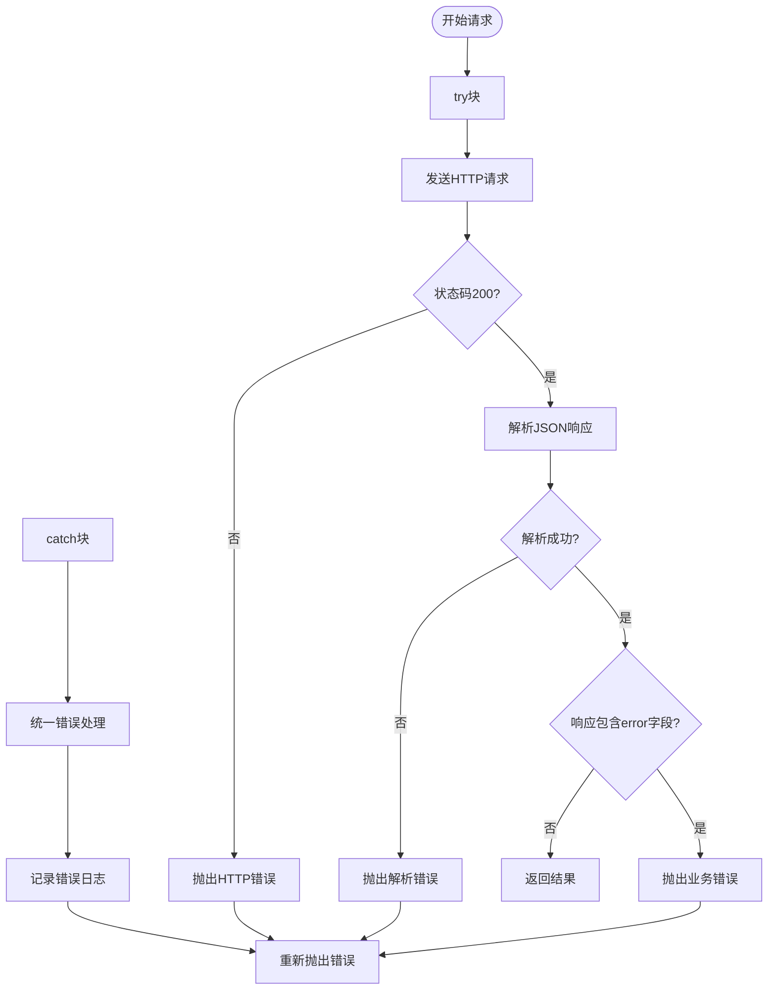
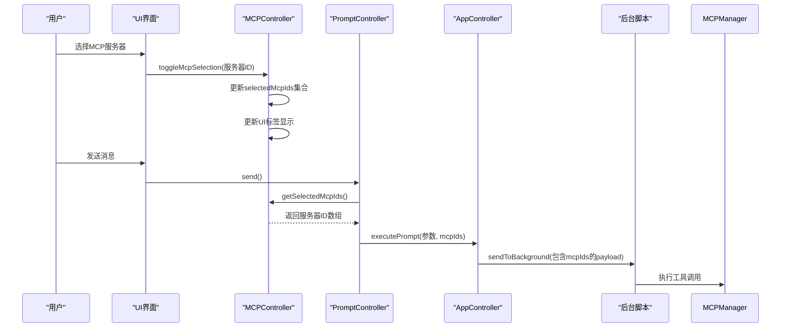
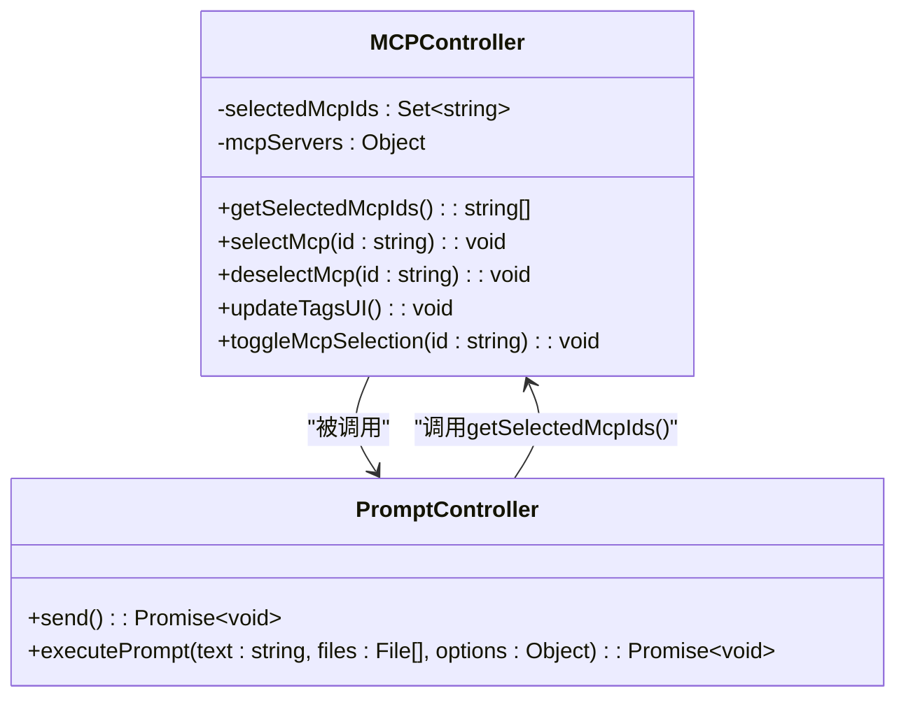
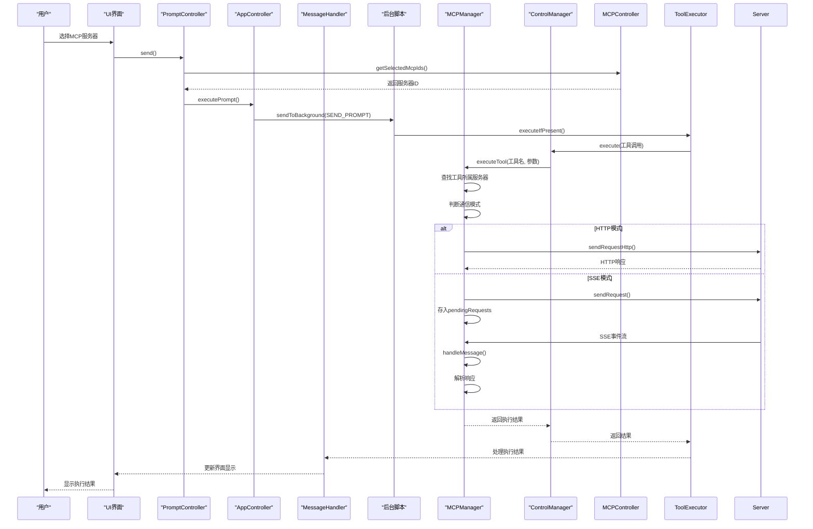

# 工具调用执行

<cite>
**本文档引用的文件**   
- [mcp_manager.js](file://background/managers/mcp_manager.js)
- [mcp_controller.js](file://sandbox/controllers/mcp_controller.js)
- [tool_executor.js](file://background/handlers/session/prompt/tool_executor.js)
- [control_manager.js](file://background/managers/control_manager.js)
- [utils.js](file://background/handlers/session/utils.js)
- [message_handler.js](file://sandbox/controllers/message_handler.js)
- [app_controller.js](file://sandbox/controllers/app_controller.js)
- [prompt.js](file://sandbox/controllers/prompt.js)
</cite>

## 目录
1. [简介](#简介)
2. [工具调用执行流程](#工具调用执行流程)
3. [通信模式分析](#通信模式分析)
4. [请求超时与错误处理](#请求超时与错误处理)
5. [前端服务器选择机制](#前端服务器选择机制)
6. [完整执行序列图](#完整执行序列图)

## 简介
本文档深入解析MCPManager的executeTool方法执行流程，详细说明工具调用的完整生命周期。文档涵盖从用户选择服务器到最终执行工具的全过程，重点分析HTTP和SSE两种通信模式的实现机制，以及前端与后端之间的数据传递流程。

## 工具调用执行流程

MCPManager的executeTool方法是工具调用的核心入口，负责定位目标工具所属的服务器并执行调用。该方法首先通过遍历所有服务器的工具列表来查找指定名称的工具。

**图示来源**
- [mcp_manager.js](file://background/managers/mcp_manager.js#L479-L525)

**本节来源**
- [mcp_manager.js](file://background/managers/mcp_manager.js#L479-L525)

## 通信模式分析

MCPManager支持HTTP和SSE两种通信模式，通过isHttpMode方法判断服务器配置的通信类型。两种模式的实现机制有显著差异：

### HTTP模式
在HTTP模式下，系统通过sendRequestHttp方法发送JSON-RPC请求并直接获取响应。该方法使用标准的HTTP POST请求，具有同步响应特性。

**图示来源**
- [mcp_manager.js](file://background/managers/mcp_manager.js#L229-L260)

### SSE模式
在SSE模式下，系统通过sendRequest方法发送请求，并利用pendingRequests映射等待事件流响应。该模式采用异步通信机制，通过EventSource接收服务器推送的响应。

**图示来源**
- [mcp_manager.js](file://background/managers/mcp_manager.js#L308-L385)

**本节来源**
- [mcp_manager.js](file://background/managers/mcp_manager.js#L218-L260)
- [mcp_manager.js](file://background/managers/mcp_manager.js#L308-L385)

## 请求超时与错误处理

系统实现了完善的请求超时和错误处理机制，确保在异常情况下能够正确响应。

### 超时机制
在SSE模式下，sendRequest方法为每个请求设置10秒的超时时间。超时后会清除pendingRequests中的对应条目并拒绝Promise。

### 错误处理策略
系统在多个层面实现了错误处理：
1. **网络错误处理**：在fetch请求中捕获网络异常
2. **HTTP状态错误**：检查响应状态码，非200状态抛出错误
3. **JSON解析错误**：捕获JSON解析异常
4. **业务逻辑错误**：处理服务器返回的error字段

**图示来源**
- [mcp_manager.js](file://background/managers/mcp_manager.js#L248-L257)
- [mcp_manager.js](file://background/managers/mcp_manager.js#L346-L349)

**本节来源**
- [mcp_manager.js](file://background/managers/mcp_manager.js#L229-L260)
- [mcp_manager.js](file://background/managers/mcp_manager.js#L324-L349)

## 前端服务器选择机制

前端通过MCPController的getSelectedMcpIds方法将用户选择的服务器ID传递到执行上下文中，实现完整的工具调用流程。

### 数据传递流程
1. 用户通过UI选择服务器
2. MCPController维护selectedMcpIds集合
3. PromptController调用getSelectedMcpIds获取选中的服务器ID
4. 服务器ID作为mcpIds参数传递给后端

### 关键方法分析
- **getSelectedMcpIds**: 返回当前选中的服务器ID数组
- **selectMcp/deselectMcp**: 管理服务器选择状态
- **updateTagsUI**: 更新UI上的服务器标签显示

**图示来源**
- [mcp_controller.js](file://sandbox/controllers/mcp_controller.js#L200-L202)
- [prompt.js](file://sandbox/controllers/prompt.js#L30-L32)
- [message_handler.js](file://sandbox/controllers/message_handler.js#L216-L218)

**本节来源**
- [mcp_controller.js](file://sandbox/controllers/mcp_controller.js#L8-L202)
- [prompt.js](file://sandbox/controllers/prompt.js#L27-L32)
- [app_controller.js](file://sandbox/controllers/app_controller.js#L35-L36)

## 完整执行序列图

以下是工具调用的完整执行序列，从用户界面到最终执行的全过程：

**图示来源**
- [mcp_manager.js](file://background/managers/mcp_manager.js#L479-L525)
- [tool_executor.js](file://background/handlers/session/prompt/tool_executor.js#L22-L25)
- [control_manager.js](file://background/managers/control_manager.js#L43-L157)
- [prompt.js](file://sandbox/controllers/prompt.js#L15-L32)

**本节来源**
- [mcp_manager.js](file://background/managers/mcp_manager.js#L479-L525)
- [tool_executor.js](file://background/handlers/session/prompt/tool_executor.js#L9-L47)
- [control_manager.js](file://background/managers/control_manager.js#L43-L157)
- [prompt.js](file://sandbox/controllers/prompt.js#L15-L32)