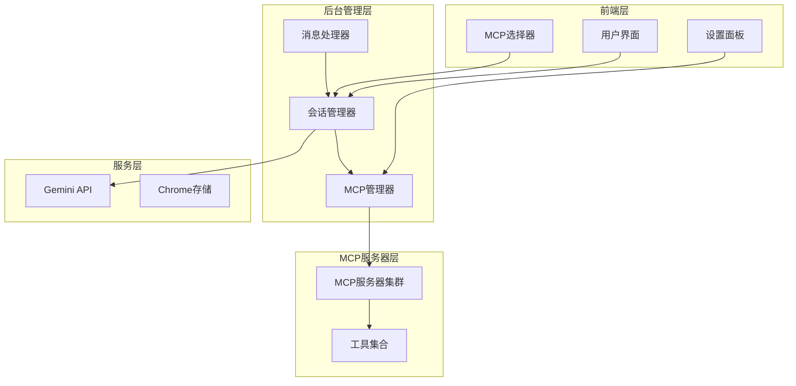
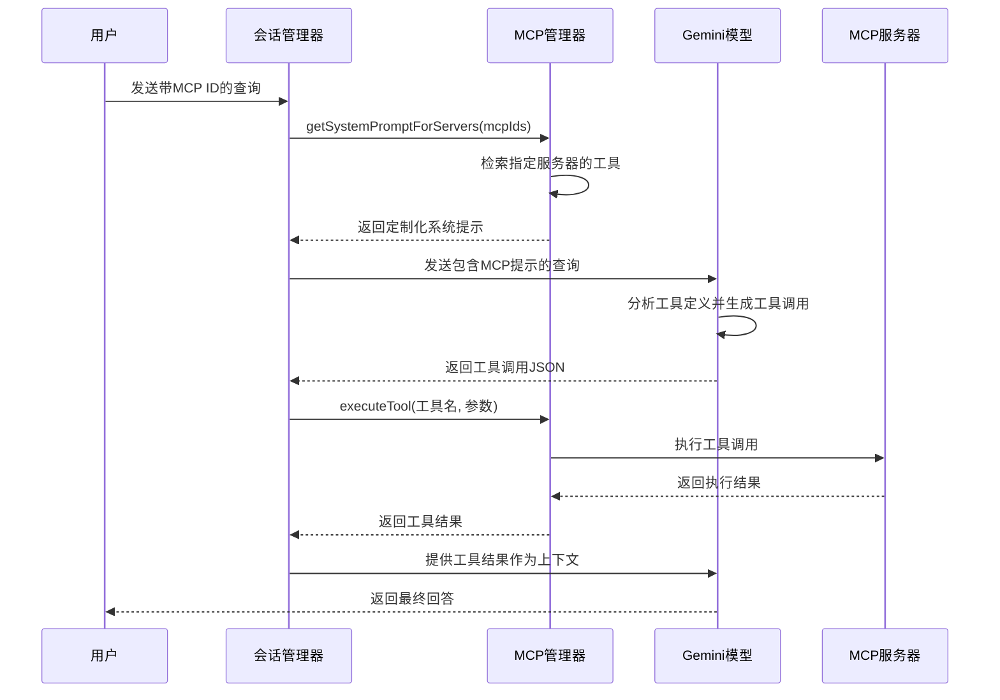
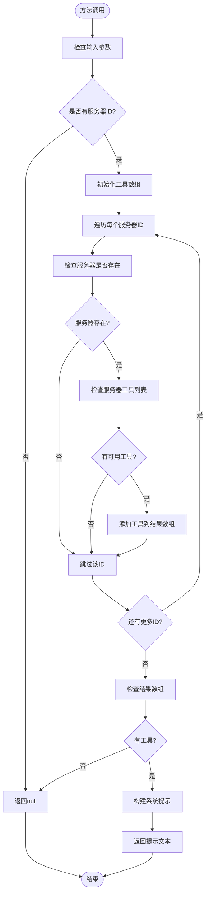
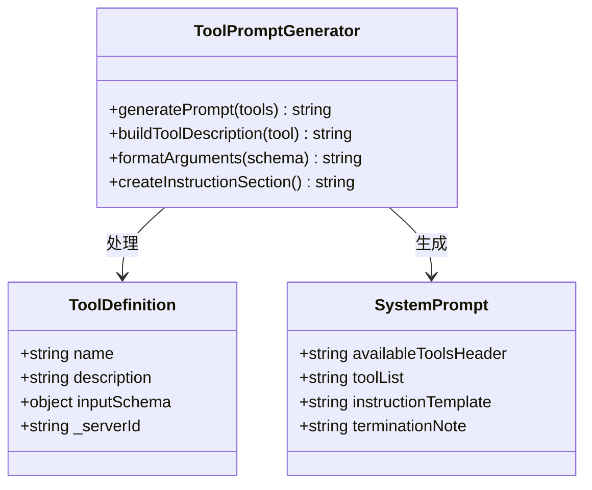
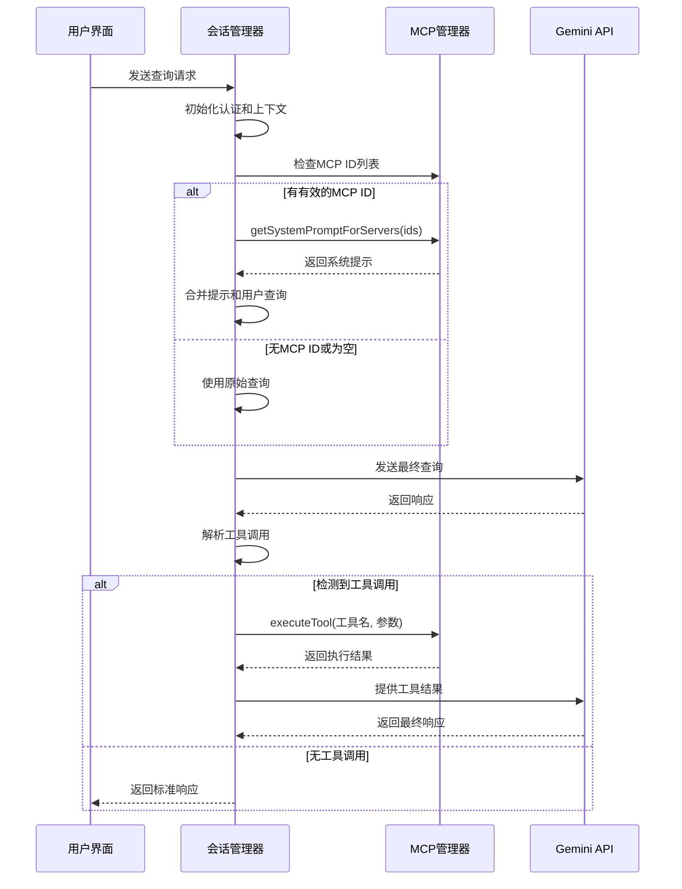
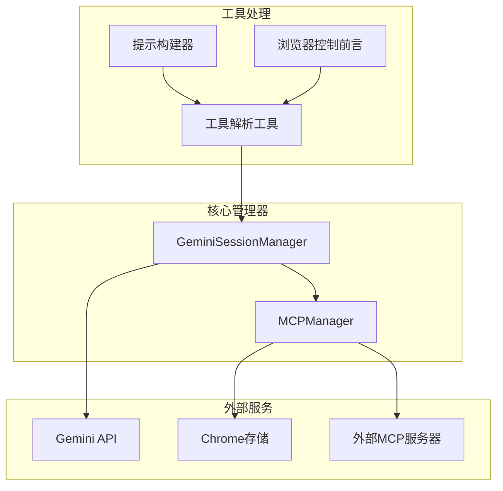

# 系统提示生成

<cite>
**本文档引用的文件**
- [mcp_manager.js](file://background/managers/mcp_manager.js)
- [session_manager.js](file://background/managers/session_manager.js)
- [builder.js](file://background/handlers/session/prompt/builder.js)
- [preamble.js](file://background/handlers/session/prompt/preamble.js)
- [tool_executor.js](file://background/handlers/session/prompt/tool_executor.js)
- [utils.js](file://background/handlers/session/utils.js)
- [gemini_api.js](file://services/gemini_api.js)
- [message_handler.js](file://sandbox/controllers/message_handler.js)
- [mcp_controller.js](file://sandbox/controllers/mcp_controller.js)
- [settings.js](file://sandbox/ui/settings.js)
- [messages.js](file://background/messages.js)
</cite>

## 目录
1. [简介](#简介)
2. [项目结构](#项目结构)
3. [核心组件](#核心组件)
4. [架构概览](#架构概览)
5. [详细组件分析](#详细组件分析)
6. [依赖关系分析](#依赖关系分析)
7. [性能考虑](#性能考虑)
8. [故障排除指南](#故障排除指南)
9. [结论](#结论)

## 简介

本文档详细说明了MCPManager的`getSystemPromptForServers`方法如何根据传入的服务器ID列表生成包含工具描述的系统提示。该方法是Gemini Nexus系统中的关键组件，负责将MCP（Model Context Protocol）服务器的可用工具整合到系统提示中，指导Gemini模型正确输出JSON格式的工具调用指令。

系统的核心目标是在不暴露内部实现细节的情况下，为用户提供一个强大而直观的工具调用接口。通过精心设计的系统提示，Gemini模型能够理解如何使用各种MCP工具来执行复杂的任务。

## 项目结构

Gemini Nexus采用模块化架构，主要分为以下几个层次：



**图表来源**
- [mcp_manager.js](file://background/managers/mcp_manager.js#L1-L530)
- [session_manager.js](file://background/managers/session_manager.js#L1-L285)

**章节来源**
- [mcp_manager.js](file://background/managers/mcp_manager.js#L1-L530)
- [session_manager.js](file://background/managers/session_manager.js#L1-L285)

## 核心组件

### MCP管理器（MCPManager）

MCP管理器是系统的核心组件，负责管理所有MCP服务器连接和工具发现。其主要职责包括：

- **服务器管理**：维护服务器连接状态、配置和工具列表
- **工具发现**：自动发现和更新可用工具
- **系统提示生成**：根据服务器ID生成定制化的系统提示
- **工具执行**：协调工具调用和结果处理

### 会话管理器（GeminiSessionManager）

会话管理器负责处理用户与Gemini的交互，包括：

- **提示构建**：将MCP提示与用户查询结合
- **工具调用解析**：从Gemini响应中提取工具调用指令
- **执行循环**：协调工具执行和Gemini回复的往返过程

**章节来源**
- [mcp_manager.js](file://background/managers/mcp_manager.js#L422-L477)
- [session_manager.js](file://background/managers/session_manager.js#L21-L120)

## 架构概览

系统采用分层架构设计，确保各组件职责清晰分离：



**图表来源**
- [session_manager.js](file://background/managers/session_manager.js#L54-L115)
- [mcp_manager.js](file://background/managers/mcp_manager.js#L446-L477)

## 详细组件分析

### getSystemPromptForServers方法详解

#### 方法签名和参数验证

该方法接受服务器ID数组作为输入，并进行严格的参数验证：



**图表来源**
- [mcp_manager.js](file://background/managers/mcp_manager.js#L446-L477)

#### 工具数据结构处理

方法的核心逻辑是将服务器工具转换为标准化的提示格式。每个工具包含以下关键信息：

- **工具名称**：用于唯一标识工具的字符串
- **描述信息**：工具功能的简要说明
- **输入模式**：工具期望的参数结构
- **服务器标识**：用于工具执行的源服务器

#### 提示文本生成算法

生成的系统提示遵循特定的格式规范：



**图表来源**
- [mcp_manager.js](file://background/managers/mcp_manager.js#L446-L477)

#### JSON格式指导机制

生成的提示文本包含明确的JSON格式指导，确保Gemini模型能够正确输出工具调用指令：

- **代码块格式**：使用三重反引号包围JSON代码块
- **必需字段**：明确要求包含`action`、`tool`和`args`字段
- **参数结构**：提供标准的参数嵌套格式
- **终止规则**：指示模型在输出工具调用后停止生成

### SessionManager集成流程

#### handleSendPrompt方法中的MCP集成

SessionManager在`handleSendPrompt`方法中实现了完整的MCP集成流程：



**图表来源**
- [session_manager.js](file://background/managers/session_manager.js#L54-L115)

#### 工具调用解析机制

SessionManager实现了多层工具调用解析策略：

1. **代码块解析**：优先查找```json标记的代码块
2. **裸JSON解析**：尝试解析独立的JSON对象
3. **智能扫描**：通过括号匹配查找JSON结构

**章节来源**
- [session_manager.js](file://background/managers/session_manager.js#L221-L283)

### 错误处理和边界情况

#### 无效服务器ID处理

当传入无效的服务器ID时，系统采用优雅的降级策略：

- **静默忽略**：无效ID被简单地跳过
- **部分结果**：仅返回有效ID对应的工具
- **空结果**：如果没有任何有效工具，返回null

#### 无可用工具处理

当指定服务器没有可用工具时：

- **条件检查**：验证服务器存在且有工具列表
- **数组验证**：确保工具列表是有效的数组
- **空提示返回**：返回null以避免发送无意义的提示

#### 工具参数模式处理

系统对工具的输入模式进行了灵活处理：

- **模式提取**：从`inputSchema.properties`提取参数定义
- **安全序列化**：使用JSON字符串化确保数据安全
- **错误容错**：捕获序列化异常并继续处理

**章节来源**
- [mcp_manager.js](file://background/managers/mcp_manager.js#L446-L477)

## 依赖关系分析

### 组件间依赖关系



**图表来源**
- [mcp_manager.js](file://background/managers/mcp_manager.js#L1-L530)
- [session_manager.js](file://background/managers/session_manager.js#L1-L285)

### 数据流分析

系统中的主要数据流包括：

1. **配置数据流**：从Chrome存储到MCP管理器的状态同步
2. **工具数据流**：从MCP服务器到管理器再到提示生成器
3. **提示数据流**：从管理器到会话管理器再到Gemini API
4. **执行数据流**：从Gemini响应到工具执行再到结果反馈

**章节来源**
- [messages.js](file://background/messages.js#L41-L81)

## 性能考虑

### 内存使用优化

- **延迟加载**：工具列表仅在需要时加载
- **缓存策略**：利用Chrome存储减少重复获取
- **内存清理**：及时释放不再使用的工具引用

### 网络性能优化

- **批量操作**：支持多个服务器ID的批量处理
- **连接复用**：重用现有的MCP连接而非重新建立
- **超时控制**：为HTTP请求设置合理的超时时间

### 处理效率提升

- **早期退出**：在检测到无效输入时立即返回
- **短路评估**：使用逻辑运算符避免不必要的计算
- **最小化序列化**：仅在必要时进行JSON序列化

## 故障排除指南

### 常见问题诊断

#### MCP服务器连接问题

**症状**：`getSystemPromptForServers`返回null
**可能原因**：
- 服务器ID不存在
- 服务器未连接或处于错误状态
- 工具列表为空

**解决步骤**：
1. 验证服务器ID的有效性
2. 检查MCP服务器的连接状态
3. 确认工具列表已正确加载

#### 工具调用失败

**症状**：工具执行抛出异常
**可能原因**：
- 工具名称拼写错误
- 参数格式不符合预期
- 服务器不支持指定工具

**解决步骤**：
1. 使用`getAllTools()`验证可用工具列表
2. 检查工具的输入模式定义
3. 确认服务器类型兼容性

#### Gemini响应解析问题

**症状**：无法从Gemini响应中提取工具调用
**可能原因**：
- 响应格式不符合预期
- JSON结构复杂导致解析困难
- 模型输出格式变化

**解决步骤**：
1. 检查日志输出以了解具体格式
2. 更新解析策略以支持新格式
3. 实现更健壮的错误处理机制

**章节来源**
- [mcp_manager.js](file://background/managers/mcp_manager.js#L479-L525)
- [session_manager.js](file://background/managers/session_manager.js#L104-L114)

## 结论

MCPManager的`getSystemPromptForServers`方法代表了现代AI应用中工具集成的最佳实践。通过精心设计的系统提示生成机制，该方法成功地解决了以下关键挑战：

1. **抽象化复杂性**：将底层MCP服务器的复杂性隐藏在简洁的系统提示中
2. **灵活性保证**：支持动态服务器选择和工具组合
3. **用户体验优化**：提供直观的工具调用接口
4. **可靠性保障**：通过完善的错误处理确保系统稳定性

该实现不仅满足了当前的功能需求，还为未来的扩展提供了良好的基础。通过模块化设计和清晰的接口定义，系统能够轻松集成新的MCP服务器和工具类型，同时保持向后兼容性。

随着AI工具生态系统的不断发展，这种基于系统提示的工具集成模式将成为标准实践，为用户提供更加智能和高效的工具使用体验。