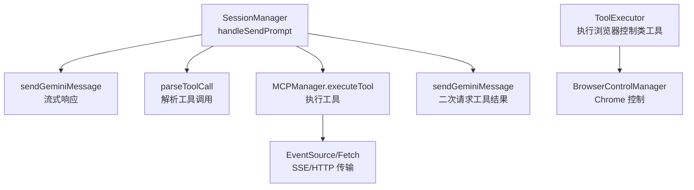
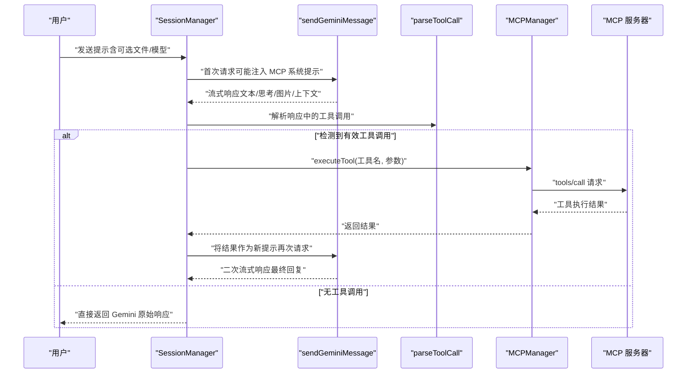
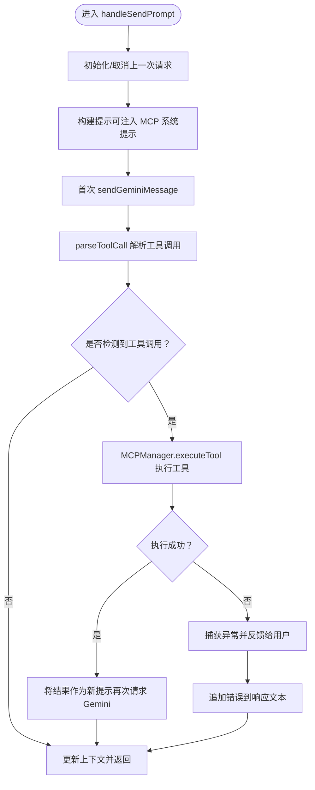
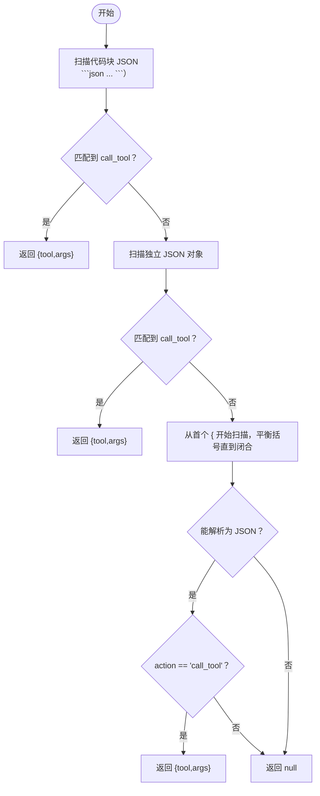
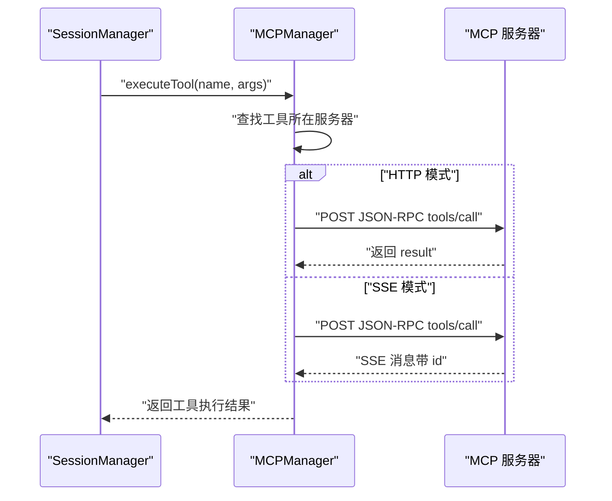
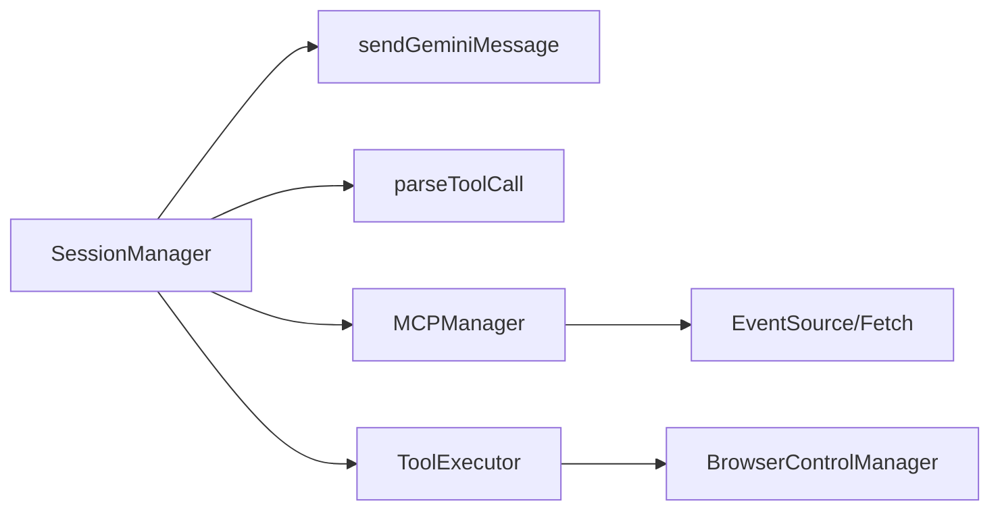

# 结果处理

<cite>
**本文引用的文件**
- [session_manager.js](file://background/managers/session_manager.js)
- [mcp_manager.js](file://background/managers/mcp_manager.js)
- [gemini_api.js](file://services/gemini_api.js)
- [utils.js](file://background/handlers/session/utils.js)
- [tool_executor.js](file://background/handlers/session/prompt/tool_executor.js)
- [builder.js](file://background/handlers/session/prompt/builder.js)
- [preamble.js](file://background/handlers/session/prompt/preamble.js)
- [control_manager.js](file://background/managers/control_manager.js)
</cite>

## 目录
1. [简介](#简介)
2. [项目结构](#项目结构)
3. [核心组件](#核心组件)
4. [架构总览](#架构总览)
5. [详细组件分析](#详细组件分析)
6. [依赖关系分析](#依赖关系分析)
7. [性能考量](#性能考量)
8. [故障排查指南](#故障排查指南)
9. [结论](#结论)

## 简介
本文件聚焦于 SessionManager 在 handleSendPrompt 方法中实现的“单轮工具调用执行循环”。该循环负责：
- 从 Gemini 的响应文本中解析出工具调用指令（支持代码块、内联 JSON 等多种格式）
- 当检测到有效工具调用时，调用 MCPManager 的 executeTool 执行工具并获取结果
- 将工具执行结果作为新提示发送回 Gemini 进行后续处理
- 工具执行失败时的错误捕获与用户反馈
- 实现单轮工具调用的闭环

## 项目结构
围绕“结果处理”主题，涉及以下关键模块：
- 会话管理：SessionManager（发起请求、解析工具调用、驱动 MCP 循环）
- MCP 管理：MCPManager（连接 MCP 服务器、列举工具、执行工具）
- Gemini 接口：sendGeminiMessage（流式接收响应、更新上下文）
- 工具解析与执行：parseToolCall（解析工具调用）、ToolExecutor（执行浏览器控制类工具）
- 提示构建：PromptBuilder、Preamble（注入系统提示）



图表来源
- [session_manager.js](file://background/managers/session_manager.js#L21-L120)
- [gemini_api.js](file://services/gemini_api.js#L26-L230)
- [mcp_manager.js](file://background/managers/mcp_manager.js#L479-L525)
- [tool_executor.js](file://background/handlers/session/prompt/tool_executor.js#L4-L48)
- [control_manager.js](file://background/managers/control_manager.js#L11-L159)

章节来源
- [session_manager.js](file://background/managers/session_manager.js#L1-L285)
- [gemini_api.js](file://services/gemini_api.js#L1-L230)
- [mcp_manager.js](file://background/managers/mcp_manager.js#L1-L530)
- [tool_executor.js](file://background/handlers/session/prompt/tool_executor.js#L1-L49)
- [builder.js](file://background/handlers/session/prompt/builder.js#L1-L45)
- [preamble.js](file://background/handlers/session/prompt/preamble.js#L1-L109)
- [control_manager.js](file://background/managers/control_manager.js#L1-L159)

## 核心组件
- SessionManager.handleSendPrompt：主流程入口，包含 MCP 执行循环与错误处理
- MCPManager.executeTool：根据工具名定位服务器并执行工具，返回结果
- sendGeminiMessage：向 Gemini 发送消息并流式读取响应，维护上下文
- parseToolCall：从响应文本中解析工具调用指令（支持多种 JSON 包装形式）
- ToolExecutor：执行浏览器控制类工具（与 MCP 管理器配合）
- PromptBuilder/Preamble：为 Gemini 注入系统提示（含工具列表与调用规范）

章节来源
- [session_manager.js](file://background/managers/session_manager.js#L21-L120)
- [mcp_manager.js](file://background/managers/mcp_manager.js#L479-L525)
- [gemini_api.js](file://services/gemini_api.js#L26-L230)
- [utils.js](file://background/handlers/session/utils.js#L4-L21)
- [tool_executor.js](file://background/handlers/session/prompt/tool_executor.js#L4-L48)
- [builder.js](file://background/handlers/session/prompt/builder.js#L5-L44)
- [preamble.js](file://background/handlers/session/prompt/preamble.js#L4-L108)

## 架构总览
下图展示了从用户输入到工具执行与二次推理的端到端流程。



图表来源
- [session_manager.js](file://background/managers/session_manager.js#L21-L120)
- [gemini_api.js](file://services/gemini_api.js#L26-L230)
- [mcp_manager.js](file://background/managers/mcp_manager.js#L479-L525)

## 详细组件分析

### SessionManager.handleSendPrompt 中的 MCP 执行循环
- 初始化与取消：每次请求前创建 AbortController，支持取消当前请求
- 上下文与账户轮换：确保认证上下文可用；多账户时最多重试一次并轮换账号
- 注入 MCP 系统提示：若请求指定 MCP 服务器，则拼接系统提示并前置到用户查询
- 首次请求：调用 sendGeminiMessage 获取流式响应，同时通过 onUpdate 回调实时推送
- 单轮工具调用循环：
  - 解析工具调用：parseToolCall 从响应文本中提取工具名与参数
  - 成功路径：调用 MCPManager.executeTool 执行工具，将结果以 JSON 文本形式再次发送给 Gemini，触发二次推理
  - 失败路径：捕获异常，通过 onUpdate 输出错误信息，并将错误追加到响应文本中
- 成功收尾：更新上下文并返回最终结果



图表来源
- [session_manager.js](file://background/managers/session_manager.js#L21-L120)
- [mcp_manager.js](file://background/managers/mcp_manager.js#L479-L525)

章节来源
- [session_manager.js](file://background/managers/session_manager.js#L21-L120)

### parseToolCall：从响应文本解析工具调用
- 支持的 JSON 包装形式：
  - 代码块包裹的 JSON（```json ... ```），内部包含 action 字段且值为 call_tool
  - 独立的 JSON 对象（非代码块），匹配包含 action:"call_tool" 的对象
  - 内联 JSON（更宽松的扫描），从首个 {"action":"call_tool" 或 {"action": "call_tool"} 开始，通过括号平衡算法找到闭合大括号，再尝试解析
- 返回结构：{ tool, args }，若未匹配则返回 null



图表来源
- [session_manager.js](file://background/managers/session_manager.js#L221-L283)

章节来源
- [session_manager.js](file://background/managers/session_manager.js#L221-L283)

### MCPManager.executeTool：工具执行与结果返回
- 工具定位：遍历所有服务器，查找目标工具名，确定目标服务器
- 请求方式选择：
  - HTTP 模式（streamable_http/http）：直接 POST JSON-RPC 请求，等待一次性响应
  - SSE 模式：通过 EventSource 接收消息，基于 JSON-RPC id 关联请求与响应
- 结果格式：通常包含 content（文本等）与 isError 标记，返回给 SessionManager



图表来源
- [mcp_manager.js](file://background/managers/mcp_manager.js#L479-L525)

章节来源
- [mcp_manager.js](file://background/managers/mcp_manager.js#L479-L525)

### 工具执行成功后的二次推理
- 上下文更新：先用第一次响应的新上下文更新本地状态，再获取最新上下文
- 再次请求：将工具结果以 JSON 文本形式发送给 Gemini，触发其对工具输出进行总结或进一步处理
- 流式回调：通过 onUpdate 将中间状态推送给前端

章节来源
- [session_manager.js](file://background/managers/session_manager.js#L89-L102)

### 工具执行失败的错误捕获与用户反馈
- 异常捕获：在 MCP 执行循环中捕获错误，记录日志
- 用户反馈：通过 onUpdate 输出错误信息，同时将错误文本追加到响应文本末尾，便于用户查看
- 错误类型：包括工具不存在、HTTP 错误、SSE 错误、解析失败等

章节来源
- [session_manager.js](file://background/managers/session_manager.js#L104-L114)

### 与浏览器控制类工具的衔接（ToolExecutor）
- ToolExecutor 用于执行浏览器控制类工具（如截图、点击、填充表单等）
- 它依赖 BrowserControlManager，后者封装了连接、快照与动作执行
- 该组件与 MCP 管理器配合，形成“结构化提示 + 工具调用”的闭环

章节来源
- [tool_executor.js](file://background/handlers/session/prompt/tool_executor.js#L4-L48)
- [control_manager.js](file://background/managers/control_manager.js#L11-L159)

## 依赖关系分析
- SessionManager 依赖：
  - sendGeminiMessage：发起与接收 Gemini 流式响应
  - MCPManager：执行工具并返回结果
  - parseToolCall：解析工具调用
- MCPManager 依赖：
  - EventSource/fetch：SSE/HTTP 传输
  - 服务器配置与工具列表：通过 tools/list 获取可用工具
- ToolExecutor 依赖：
  - BrowserControlManager：执行浏览器控制动作



图表来源
- [session_manager.js](file://background/managers/session_manager.js#L1-L285)
- [mcp_manager.js](file://background/managers/mcp_manager.js#L1-L530)
- [gemini_api.js](file://services/gemini_api.js#L1-L230)
- [tool_executor.js](file://background/handlers/session/prompt/tool_executor.js#L1-L49)
- [control_manager.js](file://background/managers/control_manager.js#L1-L159)

章节来源
- [session_manager.js](file://background/managers/session_manager.js#L1-L285)
- [mcp_manager.js](file://background/managers/mcp_manager.js#L1-L530)
- [gemini_api.js](file://services/gemini_api.js#L1-L230)
- [tool_executor.js](file://background/handlers/session/prompt/tool_executor.js#L1-L49)
- [control_manager.js](file://background/managers/control_manager.js#L1-L159)

## 性能考量
- 流式响应：sendGeminiMessage 使用流式读取，及时更新 UI，降低感知延迟
- 并发上传：文件上传采用并发策略，提升多文件场景下的吞吐
- 单轮循环：MCP 执行循环为单轮，避免深度递归导致的复杂度上升
- 账户轮换：多账户时最多重试一次，减少长时间阻塞

## 故障排查指南
- 登录态问题：若出现“未登录/会话过期”，系统会强制刷新上下文并引导用户登录
- 请求过于频繁：遇到限流时提示等待后再试
- 服务器无响应：建议刷新 Gemini 页面后重试
- 响应解析失败：建议刷新页面后重试
- 工具执行失败：检查工具名是否存在、参数是否正确；查看 onUpdate 输出的错误信息

章节来源
- [session_manager.js](file://background/managers/session_manager.js#L149-L199)

## 结论
SessionManager 的 handleSendPrompt 方法实现了“单轮工具调用”的闭环：从解析工具调用、执行工具、二次推理到最终返回，形成了清晰的控制流。parseToolCall 对多种 JSON 包装形式的支持增强了鲁棒性；MCPManager 的 executeTool 提供了灵活的传输模式（SSE/HTTP）与结果返回；错误处理与用户反馈机制保证了用户体验。该设计既满足了 Gemini 的工具调用需求，又保持了良好的扩展性与可维护性。