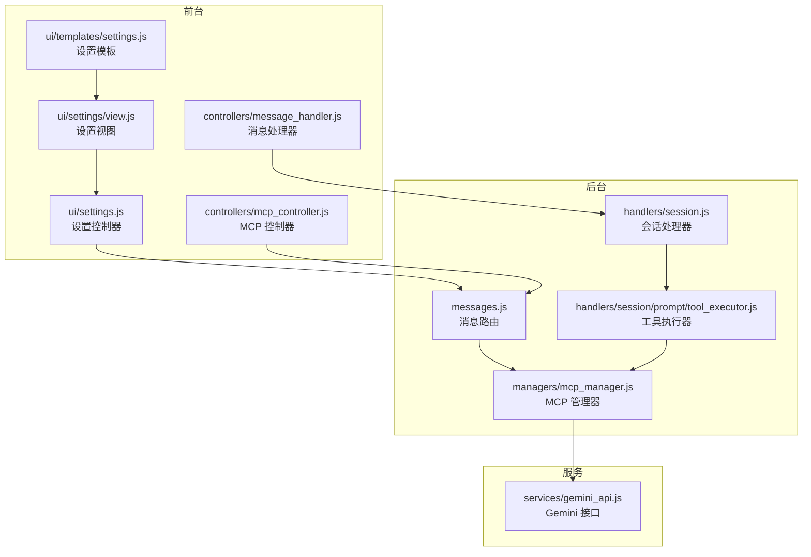
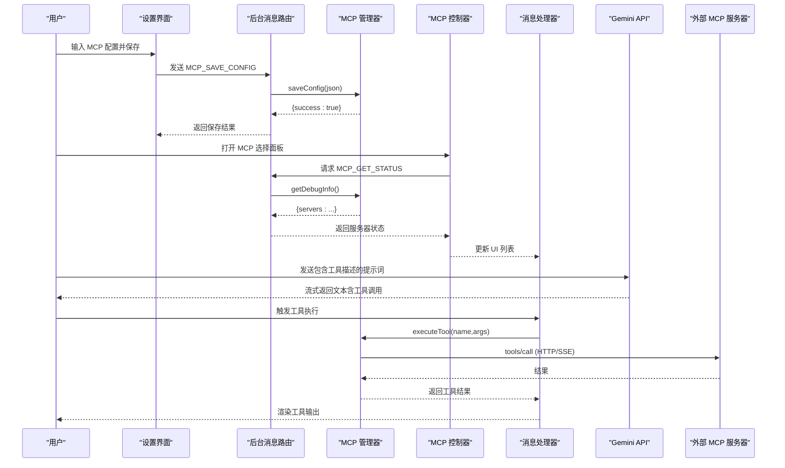
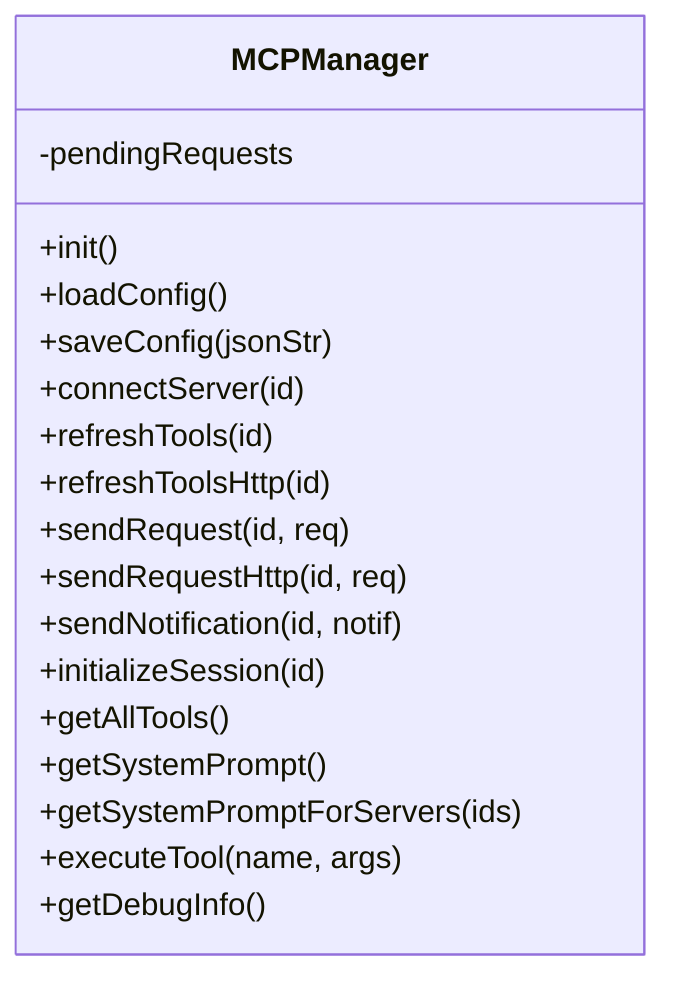
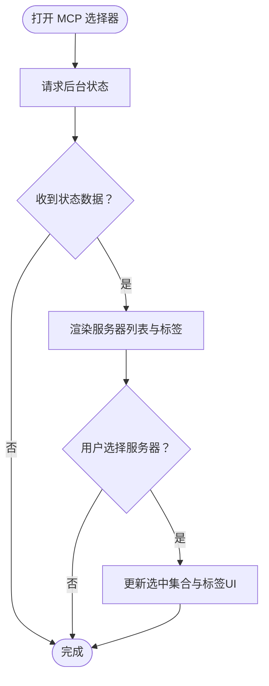
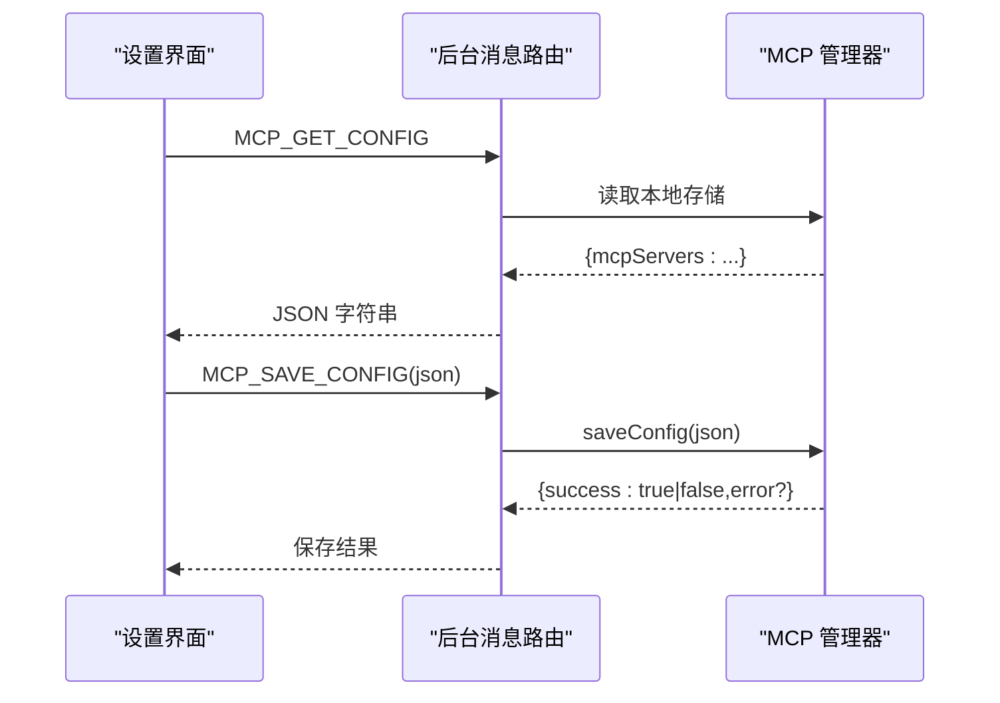
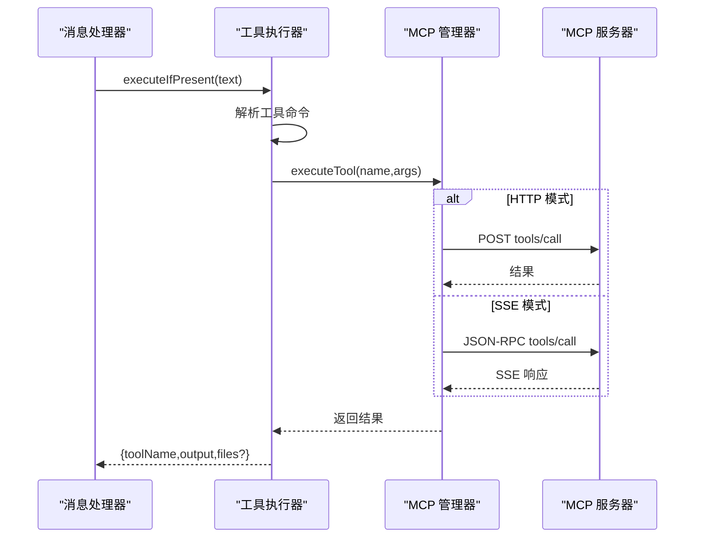
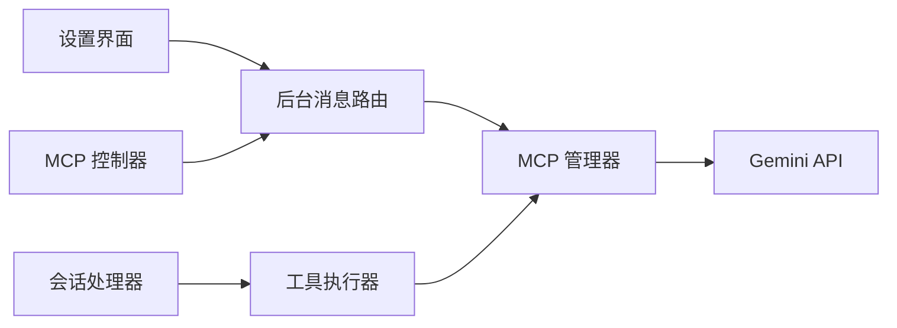

# 工具集成

<cite>
**本文引用的文件**
- [mcp_manager.js](file://background/managers/mcp_manager.js)
- [mcp_controller.js](file://sandbox/controllers/mcp_controller.js)
- [tool_executor.js](file://background/handlers/session/prompt/tool_executor.js)
- [utils.js](file://background/handlers/session/utils.js)
- [gemini_api.js](file://services/gemini_api.js)
- [settings.js](file://sandbox/ui/settings.js)
- [settings_view.js](file://sandbox/ui/settings/view.js)
- [settings_template.js](file://sandbox/ui/templates/settings.js)
- [messages.js](file://background/messages.js)
- [message_handler.js](file://sandbox/controllers/message_handler.js)
- [session.js](file://background/handlers/session.js)
</cite>

## 目录
1. [简介](#简介)
2. [项目结构](#项目结构)
3. [核心组件](#核心组件)
4. [架构总览](#架构总览)
5. [组件详解](#组件详解)
6. [依赖关系分析](#依赖关系分析)
7. [性能考量](#性能考量)
8. [故障排查指南](#故障排查指南)
9. [结论](#结论)
10. [附录：使用示例与最佳实践](#附录使用示例与最佳实践)

## 简介
本文件面向“MCP（Model Context Protocol）工具集成功能”，系统性说明以下内容：
- MCPManager 如何加载配置、连接服务器并获取可用工具列表
- MCPController 在 UI 层如何实现服务器选择与状态管理
- 系统如何在发送提示词前注入 MCP 工具描述，并解析 Gemini 返回的工具调用请求
- executeTool 方法如何将工具调用转发给相应 MCP 服务器并处理结果
- 用户如何配置 MCP 服务器并使用外部工具
- MCP 协议的 HTTP 和 SSE 两种连接模式

## 项目结构
围绕 MCP 集成的关键模块分布于后台管理器、消息通道、前端控制器与设置界面之间，形成“配置—连接—工具—执行”的闭环。

图表来源
- [messages.js](file://background/messages.js#L14-L81)
- [mcp_manager.js](file://background/managers/mcp_manager.js#L2-L19)
- [tool_executor.js](file://background/handlers/session/prompt/tool_executor.js#L4-L7)
- [settings.js](file://sandbox/ui/settings.js#L22-L35)
- [settings_view.js](file://sandbox/ui/settings/view.js#L4-L43)
- [settings_template.js](file://sandbox/ui/templates/settings.js#L75-L87)
- [message_handler.js](file://sandbox/controllers/message_handler.js#L8-L86)
- [mcp_controller.js](file://sandbox/controllers/mcp_controller.js#L5-L13)
- [gemini_api.js](file://services/gemini_api.js#L26-L230)

章节来源
- [messages.js](file://background/messages.js#L14-L81)
- [mcp_manager.js](file://background/managers/mcp_manager.js#L2-L19)
- [settings.js](file://sandbox/ui/settings.js#L22-L35)
- [message_handler.js](file://sandbox/controllers/message_handler.js#L8-L86)

## 核心组件
- MCPManager：负责 MCP 服务器配置加载、连接建立、工具列表刷新、JSON-RPC 请求/通知发送、SSE 消息处理与工具执行。
- MCPController：负责 MCP 服务器选择 UI、状态展示、与后台的消息交互。
- ToolExecutor：在会话中解析并执行工具命令。
- SettingsController/SettingsView/SettingsTemplate：提供 MCP 配置的输入、保存与读取。
- MessageHandler：接收来自后台的消息，更新 UI（含 MCP 状态与工具选择）。
- Gemini API：向 Gemini 发送消息并流式接收响应，用于触发工具调用与结果回传。

章节来源
- [mcp_manager.js](file://background/managers/mcp_manager.js#L2-L530)
- [mcp_controller.js](file://sandbox/controllers/mcp_controller.js#L5-L221)
- [tool_executor.js](file://background/handlers/session/prompt/tool_executor.js#L4-L49)
- [settings.js](file://sandbox/ui/settings.js#L8-L249)
- [settings_view.js](file://sandbox/ui/settings/view.js#L4-L241)
- [settings_template.js](file://sandbox/ui/templates/settings.js#L75-L87)
- [message_handler.js](file://sandbox/controllers/message_handler.js#L8-L365)
- [gemini_api.js](file://services/gemini_api.js#L26-L230)

## 架构总览
下图展示了 MCP 从配置到工具执行的端到端流程，包括 UI 选择、后台连接、工具注入、Gemini 解析与工具调用转发。

图表来源
- [settings.js](file://sandbox/ui/settings.js#L238-L247)
- [messages.js](file://background/messages.js#L42-L67)
- [mcp_manager.js](file://background/managers/mcp_manager.js#L40-L61)
- [mcp_controller.js](file://sandbox/controllers/mcp_controller.js#L88-L99)
- [message_handler.js](file://sandbox/controllers/message_handler.js#L82-L85)
- [gemini_api.js](file://services/gemini_api.js#L26-L230)

## 组件详解

### MCPManager：配置加载、连接与工具管理
- 初始化与配置加载
  - 通过本地存储读取 MCP 配置，初始化各服务器的状态与工具列表。
  - 自动对启用的服务器发起连接。
- 连接模式
  - 支持 SSE（默认）与 HTTP（含 streamable_http/http）两种模式。
  - 对 SSE：探测服务器类型；若返回 JSON 则自动切换为 HTTP 模式。
  - 对 HTTP：直接记录 POST URL 并立即拉取工具列表。
- 工具列表刷新
  - SSE：通过 JSON-RPC 的 tools/list 获取。
  - HTTP：以 JSON-RPC POST 请求获取，兼容多种响应格式。
- 请求与通知
  - sendRequest/sendRequestHttp：封装 JSON-RPC 请求，支持超时与错误处理。
  - sendNotification：发送通知。
  - handleMessage：基于 pendingRequests 映射匹配 SSE 响应。
- 工具注入与执行
  - getSystemPrompt/getSystemPromptForServers：生成系统提示，包含可用工具描述。
  - executeTool：根据工具名定位服务器，按模式调用 tools/call 并返回结果。

图表来源
- [mcp_manager.js](file://background/managers/mcp_manager.js#L2-L530)

章节来源
- [mcp_manager.js](file://background/managers/mcp_manager.js#L8-L150)
- [mcp_manager.js](file://background/managers/mcp_manager.js#L152-L306)
- [mcp_manager.js](file://background/managers/mcp_manager.js#L308-L385)
- [mcp_manager.js](file://background/managers/mcp_manager.js#L407-L477)
- [mcp_manager.js](file://background/managers/mcp_manager.js#L479-L525)

### MCPController：UI 中的服务器选择与状态管理
- 元素与事件
  - 初始化元素与监听器，支持打开/关闭选择器、点击外部关闭、移除标签等。
- 状态获取与渲染
  - 通过 postMessage 向后台请求 MCP 状态，接收后渲染服务器列表与选中标签。
  - 支持多选服务器，UI 展示状态与工具数量。
- 选择与清空
  - 提供选择/取消选择、清空选择等接口，便于后续会话使用。

图表来源
- [mcp_controller.js](file://sandbox/controllers/mcp_controller.js#L88-L147)
- [mcp_controller.js](file://sandbox/controllers/mcp_controller.js#L169-L197)

章节来源
- [mcp_controller.js](file://sandbox/controllers/mcp_controller.js#L5-L221)

### 设置界面：MCP 配置的保存与读取
- 设置模板
  - 提供 MCP 配置的 textarea 与保存按钮，占位符给出示例结构。
- 设置控制器
  - 保存配置：校验 JSON 后发送 MCP_SAVE_CONFIG 至后台。
  - 读取配置：发送 MCP_GET_CONFIG，后台返回字符串化 JSON。
  - 下载日志：通过后台消息获取日志并由父窗口下载。

图表来源
- [settings_template.js](file://sandbox/ui/templates/settings.js#L75-L87)
- [settings.js](file://sandbox/ui/settings.js#L234-L247)
- [messages.js](file://background/messages.js#L49-L67)

章节来源
- [settings_template.js](file://sandbox/ui/templates/settings.js#L75-L87)
- [settings.js](file://sandbox/ui/settings.js#L232-L249)
- [messages.js](file://background/messages.js#L49-L67)

### 工具执行链路：解析与转发
- 工具命令解析
  - ToolExecutor 在会话中检测响应中的工具命令 JSON，提取工具名与参数。
- 执行与结果
  - 调用 MCPManager.executeTool，按服务器模式（SSE/HTTP）发送 tools/call 请求并返回结果。
  - 若返回结构化图片+文本，进行适配后作为附件返回。

图表来源
- [tool_executor.js](file://background/handlers/session/prompt/tool_executor.js#L9-L47)
- [utils.js](file://background/handlers/session/utils.js#L4-L21)
- [mcp_manager.js](file://background/managers/mcp_manager.js#L479-L525)

章节来源
- [tool_executor.js](file://background/handlers/session/prompt/tool_executor.js#L4-L49)
- [utils.js](file://background/handlers/session/utils.js#L4-L21)
- [mcp_manager.js](file://background/managers/mcp_manager.js#L479-L525)

### Gemini 集成：提示词注入与工具调用解析
- 提示词注入
  - MCPManager.getSystemPrompt/getSystemPromptForServers 生成包含工具描述的系统提示，用于引导模型输出工具调用。
- 流式响应与解析
  - Gemini API 流式读取响应，解析后通过消息处理器更新 UI。
  - 工具命令解析由工具执行器完成，随后触发 MCP 执行。

章节来源
- [mcp_manager.js](file://background/managers/mcp_manager.js#L422-L477)
- [gemini_api.js](file://services/gemini_api.js#L26-L230)
- [message_handler.js](file://sandbox/controllers/message_handler.js#L212-L280)

### MCP 协议连接模式：HTTP 与 SSE
- SSE 模式（默认）
  - 探测服务器是否返回 JSON；若是则自动降级为 HTTP 模式。
  - 成功后通过 SSE 接收 endpoint 事件，获得 POST URL 并初始化会话。
- HTTP 模式（streamable_http/http）
  - 直接使用 POST URL，立即拉取工具列表。
  - 执行工具时使用 sendRequestHttp，等待直接响应。

章节来源
- [mcp_manager.js](file://background/managers/mcp_manager.js#L71-L150)
- [mcp_manager.js](file://background/managers/mcp_manager.js#L152-L213)
- [mcp_manager.js](file://background/managers/mcp_manager.js#L215-L260)

## 依赖关系分析
- 模块耦合
  - MCPManager 与 Gemini API 通过 JSON-RPC 间接耦合（工具调用），与 UI 通过消息通道解耦。
  - MCPController 仅依赖后台消息通道，不直接操作 MCPManager。
  - ToolExecutor 依赖控制管理器与工具命令解析工具。
- 外部依赖
  - Chrome Extension API（storage、runtime、tabs、scripting）用于配置持久化与页面上下文获取。
  - Fetch API 用于 HTTP/SSE 通信与文件上传。

图表来源
- [messages.js](file://background/messages.js#L14-L81)
- [mcp_manager.js](file://background/managers/mcp_manager.js#L2-L530)
- [tool_executor.js](file://background/handlers/session/prompt/tool_executor.js#L4-L49)
- [gemini_api.js](file://services/gemini_api.js#L26-L230)

章节来源
- [messages.js](file://background/messages.js#L14-L81)
- [mcp_manager.js](file://background/managers/mcp_manager.js#L2-L530)
- [tool_executor.js](file://background/handlers/session/prompt/tool_executor.js#L4-L49)
- [gemini_api.js](file://services/gemini_api.js#L26-L230)

## 性能考量
- 连接探测与降级
  - SSE 探测返回 JSON 时自动切换 HTTP，避免不必要的 SSE 连接开销。
- 工具列表缓存
  - 工具列表在连接成功后缓存，减少重复请求。
- 请求超时与并发
  - pendingRequests 映射配合超时机制，避免长时间挂起。
- 流式响应
  - Gemini API 使用流式读取，提升用户体验，同时注意首包校验与异常处理。

[本节为通用指导，无需特定文件来源]

## 故障排查指南
- 无法连接服务器
  - 检查服务器 URL 是否正确，确认网络可达。
  - 查看后台日志与状态信息，确认是否处于 error 状态。
- 工具列表为空
  - 确认服务器已正确返回 tools/list；若返回 JSON，确认是否被自动降级为 HTTP 模式。
- 工具调用失败
  - 检查工具名是否存在于已加载工具列表；确认服务器支持 tools/call。
  - 查看返回的错误信息，定位参数或权限问题。
- UI 不显示 MCP 选项
  - 确认已在设置中保存有效配置并重新加载页面。
  - 检查后台消息通道是否正常工作。

章节来源
- [mcp_manager.js](file://background/managers/mcp_manager.js#L71-L150)
- [mcp_manager.js](file://background/managers/mcp_manager.js#L152-L213)
- [mcp_manager.js](file://background/managers/mcp_manager.js#L308-L385)
- [message_handler.js](file://sandbox/controllers/message_handler.js#L82-L85)

## 结论
该实现以 MCPManager 为核心，结合设置界面与 UI 控制器，构建了完整的 MCP 工具集成方案。通过 SSE 与 HTTP 双模式适配不同服务器能力，系统在提示词注入、工具解析与执行转发方面具备清晰的职责划分与可扩展性。建议在生产环境中进一步完善错误恢复、重连策略与工具权限校验。

[本节为总结性内容，无需特定文件来源]

## 附录：使用示例与最佳实践

### 示例一：配置 MCP 服务器
- 在设置界面的 MCP 配置区域粘贴 JSON，例如包含一个名为 demo 的服务器，其 endpoint 指向本地 SSE 端点。
- 点击“保存 MCP 配置”，若返回成功，则后台会自动加载配置并尝试连接。

章节来源
- [settings_template.js](file://sandbox/ui/templates/settings.js#L75-L87)
- [settings.js](file://sandbox/ui/settings.js#L238-L247)
- [messages.js](file://background/messages.js#L49-L67)

### 示例二：在会话中使用 MCP 工具
- 打开 MCP 选择器，勾选需要使用的服务器，确认 UI 标签显示已选中。
- 发送提示词，系统会在提示中注入工具描述，引导模型输出工具调用。
- 当模型返回工具调用时，工具执行器解析命令并调用 MCPManager.executeTool，最终将结果回显至聊天界面。

章节来源
- [mcp_controller.js](file://sandbox/controllers/mcp_controller.js#L88-L147)
- [mcp_manager.js](file://background/managers/mcp_manager.js#L422-L477)
- [tool_executor.js](file://background/handlers/session/prompt/tool_executor.js#L9-L47)
- [message_handler.js](file://sandbox/controllers/message_handler.js#L212-L280)

### 最佳实践
- 优先使用 SSE 模式，若服务器返回 JSON 则自动降级为 HTTP。
- 为每个工具提供清晰的名称与描述，确保系统提示准确传达可用能力。
- 在工具调用前验证工具名与参数，避免无效请求。
- 对于图片类工具，遵循返回结构化输出，便于 UI 附件渲染。

[本节为通用指导，无需特定文件来源]