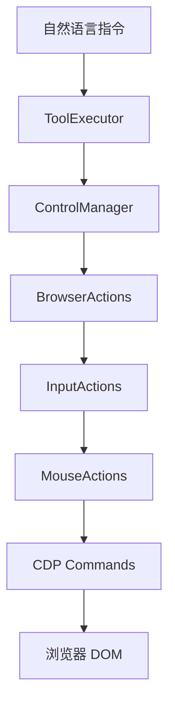
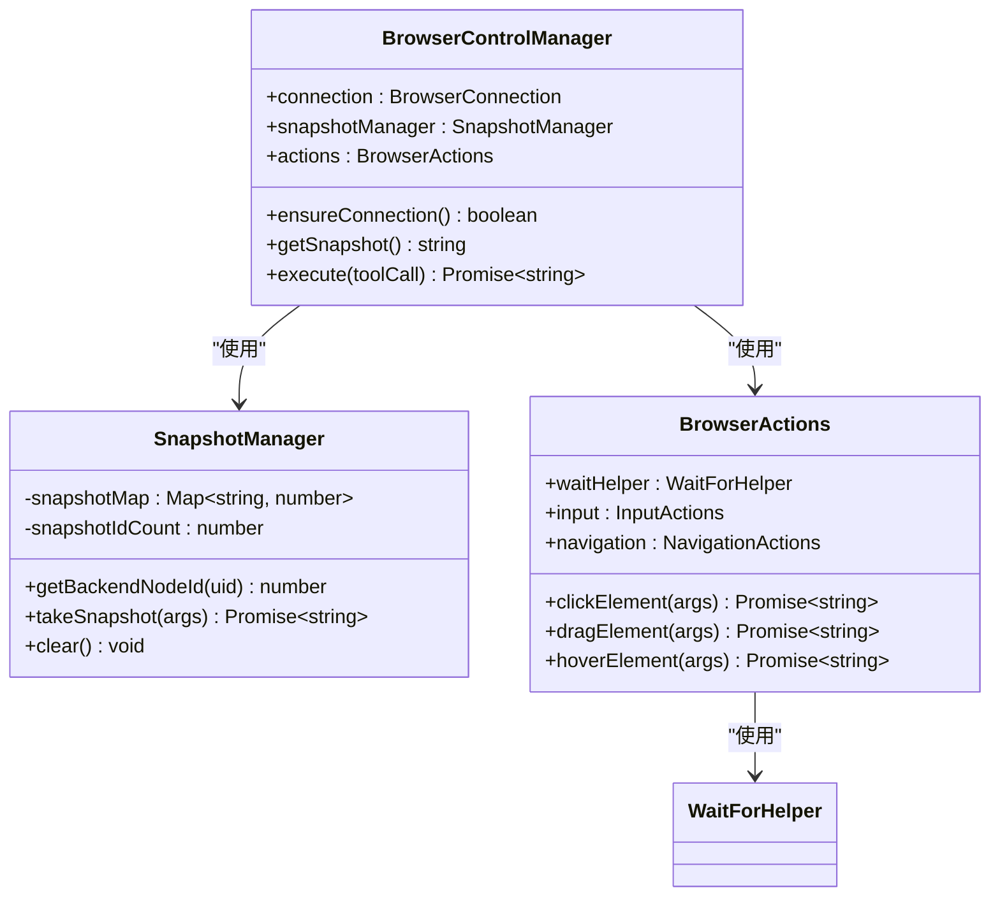
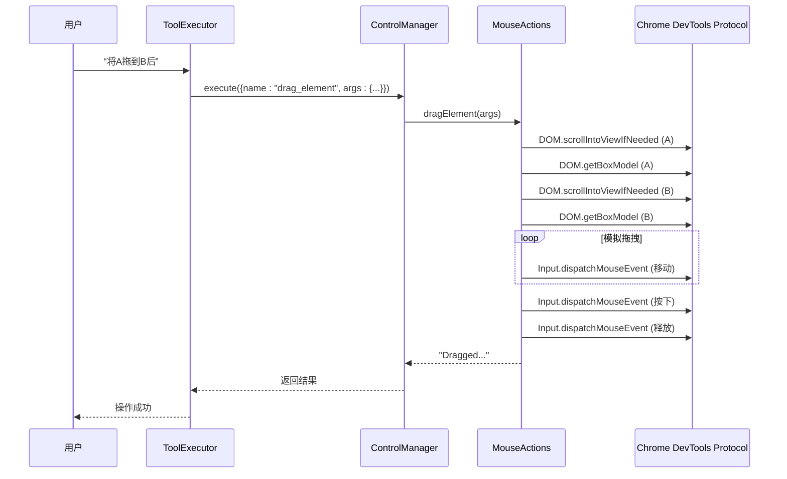

# 元素交互

<cite>
**本文档中引用的文件**   
- [control_manager.js](file://background/managers/control_manager.js)
- [mouse.js](file://background/control/actions/input/mouse.js)
- [snapshot.js](file://background/control/snapshot.js)
- [base.js](file://background/control/actions/base.js)
- [wait_helper.js](file://background/control/wait_helper.js)
- [actions.js](file://background/control/actions.js)
- [tool_executor.js](file://background/handlers/session/prompt/tool_executor.js)
- [dom.js](file://content/toolbar/view/dom.js)
- [drag.js](file://content/toolbar/utils/drag.js)
- [overlay.js](file://content/overlay.js)
</cite>

## 目录
1. [简介](#简介)
2. [核心交互机制](#核心交互机制)
3. [ControlManager 与元素识别](#controlmanager-与元素识别)
4. [定位与执行逻辑详解](#定位与执行逻辑详解)
5. [复杂交互流程案例](#复杂交互流程案例)
6. [异常情况处理](#异常情况处理)
7. [性能优化建议](#性能优化建议)
8. [总结](#总结)

## 简介
本文档全面介绍 Gemini Nexus 扩展中实现的 DOM 元素交互功能。系统通过结合快照数据与 Chrome DevTools 协议（CDP），实现了对点击、悬停、拖拽等用户操作的精确模拟。文档将详细阐述 `click`、`hover`、`drag_element` 等工具的内部工作原理，以及 ControlManager 如何协调这些操作。此外，还将提供实际应用案例和针对常见问题的解决方案。

## 核心交互机制

系统的核心交互功能由 `BrowserActions` 类及其子模块（如 `MouseActions`）实现。这些模块通过 CDP 命令直接与浏览器引擎通信，模拟真实的用户输入事件。

**Diagram sources**
- [tool_executor.js](file://background/handlers/session/prompt/tool_executor.js)
- [control_manager.js](file://background/managers/control_manager.js)
- [actions.js](file://background/control/actions.js)

**Section sources**
- [control_manager.js](file://background/managers/control_manager.js)
- [actions.js](file://background/control/actions.js)

## ControlManager 与元素识别

`ControlManager` 是交互功能的总控中心。它负责管理与浏览器的连接、获取页面快照，并根据指令调用相应的动作。

1.  **连接管理**：`ensureConnection` 方法确保与当前活动标签页建立 CDP 连接。
2.  **快照获取**：`getSnapshot` 方法调用 `SnapshotManager` 获取当前页面的可访问性（Accessibility）树。
3.  **指令分发**：`execute` 方法根据工具名称（如 `click`、`hover`）将指令分发给 `BrowserActions` 实例。

`SnapshotManager` 的关键作用是将复杂的 DOM 结构转换为一个带有唯一标识符（UID）的扁平化树。它维护一个 `snapshotMap`，将每个元素的 UID 映射到其在浏览器内部的 `backendNodeId`。这使得后续操作可以通过 UID 精确定位到目标元素。

**Diagram sources**
- [control_manager.js](file://background/managers/control_manager.js#L11-L158)
- [snapshot.js](file://background/control/snapshot.js#L9-L182)
- [actions.js](file://background/control/actions.js#L13-L54)

**Section sources**
- [control_manager.js](file://background/managers/control_manager.js#L11-L158)
- [snapshot.js](file://background/control/snapshot.js#L9-L182)

## 定位与执行逻辑详解

### 点击 (click) 操作
`clickElement` 方法的执行逻辑如下：
1.  **元素定位**：通过 `getObjectIdFromUid` 方法，利用 `snapshotMap` 将 UID 转换为 `backendNodeId`，再通过 `DOM.resolveNode` 获取 `objectId`。
2.  **滚动到视图**：调用 `DOM.scrollIntoViewIfNeeded` 确保目标元素在可视区域内，以获取正确的坐标。
3.  **坐标计算**：使用 `DOM.getBoxModel` 获取元素的盒模型，计算其内容区域的中心点坐标。
4.  **事件模拟**：按顺序分发 `mouseMoved`、`mousePressed` 和 `mouseReleased` 事件。
5.  **高亮反馈**：在执行前，会短暂地使用 `Overlay.highlightNode` 高亮目标元素，提供视觉反馈。
6.  **容错机制**：如果物理点击失败，会回退到 JavaScript 模拟（调用元素的 `click()` 方法）。

### 悬停 (hover) 操作
`hoverElement` 操作与点击类似，但更简单：
1.  **定位与滚动**：同样需要定位元素并滚动到视图。
2.  **坐标计算**：计算元素中心点。
3.  **事件分发**：仅分发 `mouseMoved` 事件。
4.  **等待稳定**：在移动鼠标后，会调用 `waitForStableDOM` 等待 1.5 秒，以确保由悬停触发的动态内容（如工具提示、下拉菜单）有足够时间加载和稳定。

### 拖拽 (drag_element) 操作
`dragElement` 操作模拟了完整的拖拽流程：
1.  **双元素定位**：分别获取 `from_uid` 和 `to_uid` 的坐标。
2.  **分步模拟**：
    -   移动鼠标到起始元素中心。
    -   按下鼠标左键。
    -   通过一个循环，将鼠标从起始点平滑地移动到目标点，模拟拖拽过程。
    -   在目标点释放鼠标左键。
3.  **等待机制**：整个拖拽过程在 `WaitHelper.execute` 的上下文中运行，确保在操作前后等待 DOM 稳定。

**Section sources**
- [mouse.js](file://background/control/actions/input/mouse.js#L7-L146)
- [base.js](file://background/control/actions/base.js#L25-L63)

## 复杂交互流程案例

### 案例：拖拽排序
假设需要将列表中的项目 A 拖拽到项目 B 之后。
1.  **自然语言指令**：“将项目A拖到项目B后面。”
2.  **指令解析**：系统解析出工具 `drag_element`，参数为 `from_uid="1_1"` (项目A的UID) 和 `to_uid="1_3"` (项目B的UID)。
3.  **执行流程**：
    -   `ControlManager` 调用 `actions.dragElement`。
    -   `MouseActions` 计算项目A和项目B的中心坐标。
    -   模拟鼠标从项目A移动到项目B的完整拖拽动作。
    -   操作完成后，页面状态更新，列表顺序改变。

### 案例：菜单点击
假设需要点击一个需要悬停才能展开的下拉菜单。
1.  **自然语言指令**：“点击设置菜单中的‘退出登录’。”
2.  **指令解析**：系统可能需要先执行 `hover` 操作，再执行 `click` 操作。
3.  **执行流程**：
    -   首先调用 `hoverElement` 悬停在“设置”菜单上，等待子菜单出现。
    -   然后调用 `clickElement` 点击“退出登录”项。

**Diagram sources**
- [tool_executor.js](file://background/handlers/session/prompt/tool_executor.js#L9-L48)
- [mouse.js](file://background/control/actions/input/mouse.js#L72-L118)

## 异常情况处理

系统设计了多种机制来应对元素不可见或被遮挡的情况：

1.  **自动滚动**：所有涉及坐标的操作（点击、悬停、拖拽）都会首先调用 `DOM.scrollIntoViewIfNeeded`，尝试将目标元素滚动到可视区域。
2.  **坐标有效性**：通过 `DOM.getBoxModel` 获取坐标，该方法能提供元素在当前视口中的精确位置，即使元素被部分遮挡或在视口外。
3.  **JavaScript 回退**：当基于坐标的物理事件失败时（例如，元素被完全遮挡导致点击无效），`click` 操作会回退到直接调用元素的 `click()` 方法，这通常能绕过一些可视性限制。
4.  **高亮与反馈**：`highlight` 方法会在操作前短暂高亮元素，如果高亮失败，说明元素可能已从 DOM 中移除或无法访问，这为错误诊断提供了线索。
5.  **错误捕获**：所有 CDP 调用都包含在 `try-catch` 块中，捕获并处理如“元素未找到”等异常，避免整个流程崩溃。

**Section sources**
- [mouse.js](file://background/control/actions/input/mouse.js#L51-L69)
- [base.js](file://background/control/actions/base.js#L36-L63)

## 性能优化建议

为了减少误操作并提升交互的可靠性，建议采取以下措施：

1.  **确保快照时效性**：在执行交互前，确保 `SnapshotManager` 拥有最新的页面快照。过时的快照会导致 UID 映射失效。
2.  **利用等待助手**：`WaitForHelper` 类是关键。它通过 `MutationObserver` 等待 DOM 稳定，并监听页面导航事件，确保在页面加载或动态内容更新完成后再执行操作，避免在元素未准备好时进行交互。
3.  **合理设置超时**：`WaitForHelper` 的超时参数（`stableDom`、`navigation`）可以根据网络和 CPU 情况进行调整，避免因等待时间过短而失败，或因过长而影响效率。
4.  **优先使用语义化操作**：在可能的情况下，优先使用 `fill`、`select_page` 等语义化更强的工具，而不是直接模拟低级的鼠标或键盘事件，这通常更可靠。
5.  **处理异步加载**：对于由用户操作（如点击按钮）触发的异步内容加载，应在操作后显式调用 `waitForStableDOM` 或类似的等待机制。

**Section sources**
- [wait_helper.js](file://background/control/wait_helper.js#L8-L147)
- [mouse.js](file://background/control/actions/input/mouse.js#L134-L135)

## 总结
Gemini Nexus 的元素交互功能通过 `ControlManager` 统一调度，利用 `SnapshotManager` 提供的 UID 映射和 `WaitForHelper` 提供的稳定性保障，结合 `MouseActions` 等模块对 CDP 的精确调用，实现了对点击、悬停、拖拽等操作的高保真模拟。该系统具备良好的容错性和可扩展性，能够处理复杂的用户交互场景。