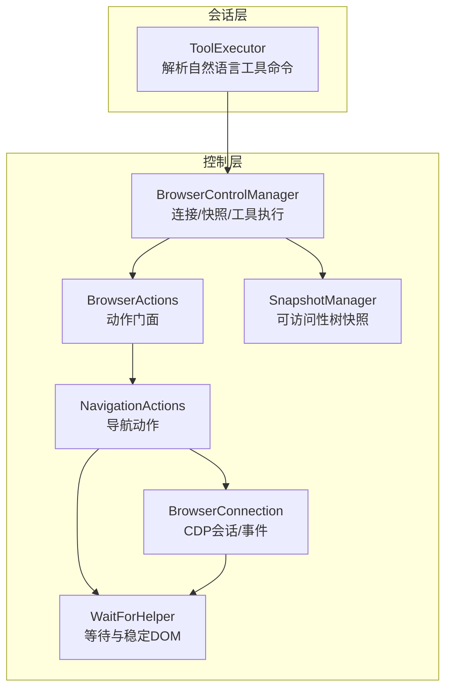
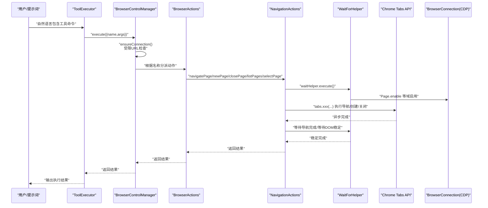
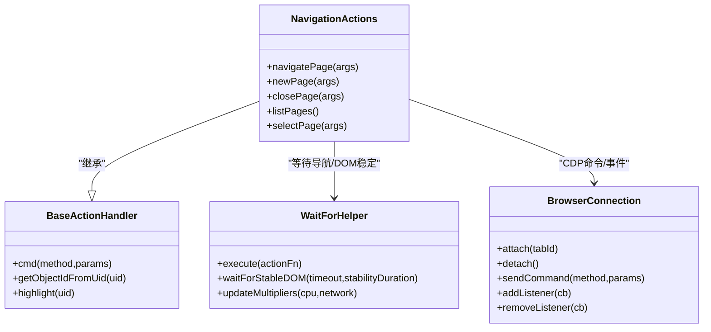
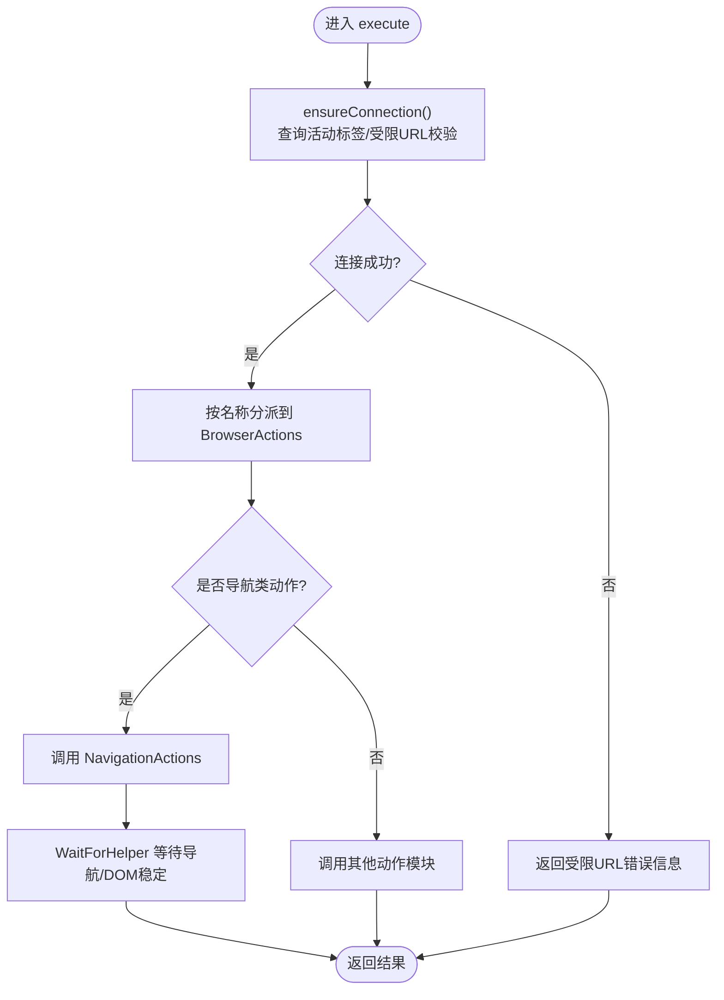
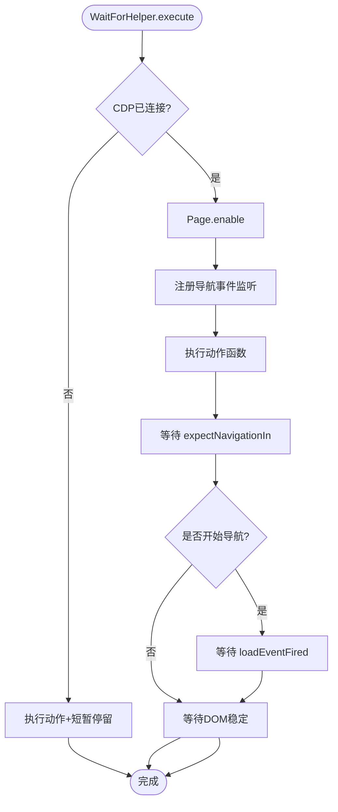
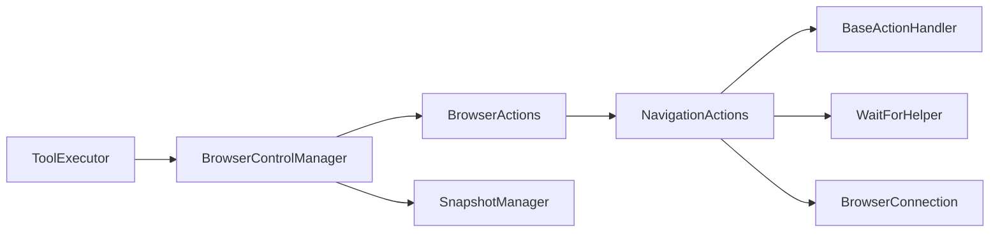

# 导航控制

<cite>
**本文引用的文件**
- [background/managers/control_manager.js](file://background/managers/control_manager.js)
- [background/control/actions.js](file://background/control/actions.js)
- [background/control/actions/navigation.js](file://background/control/actions/navigation.js)
- [background/control/connection.js](file://background/control/connection.js)
- [background/control/wait_helper.js](file://background/control/wait_helper.js)
- [background/control/actions/base.js](file://background/control/actions/base.js)
- [background/control/snapshot.js](file://background/control/snapshot.js)
- [background/handlers/session/prompt/tool_executor.js](file://background/handlers/session/prompt/tool_executor.js)
- [background/handlers/session/utils.js](file://background/handlers/session/utils.js)
</cite>

## 目录
1. [简介](#简介)
2. [项目结构](#项目结构)
3. [核心组件](#核心组件)
4. [架构总览](#架构总览)
5. [详细组件分析](#详细组件分析)
6. [依赖关系分析](#依赖关系分析)
7. [性能考量](#性能考量)
8. [故障排查指南](#故障排查指南)
9. [结论](#结论)
10. [附录](#附录)

## 简介
本文件系统性阐述导航控制功能的实现机制，重点覆盖以下方面：
- 页面导航工具：navigate_page、new_page、close_page、list_pages、select_page 的使用方法与参数配置
- ControlManager 如何通过 BrowserActions 调用底层 Chrome Tabs API 实现标签页管理与页面跳转
- 自然语言指令到导航动作的执行链路（从解析到执行）
- 权限校验与受限 URL 处理逻辑
- 异常情况下的错误处理策略与最佳实践

## 项目结构
导航控制相关代码主要分布在后台管理器、动作层、连接与等待辅助模块之间，形成清晰的分层架构：
- 控制管理层：负责连接建立、快照采集、工具分发与执行
- 动作层：封装具体浏览器行为（导航、输入、观察、仿真、性能）
- 连接层：管理 Chrome Debugger Protocol 会话与事件监听
- 等待辅助：在导航后等待 DOM 稳定与网络/CPU 模拟时间倍数调整
- 会话工具执行：将自然语言中的工具命令解析为结构化调用

图表来源
- [background/handlers/session/prompt/tool_executor.js](file://background/handlers/session/prompt/tool_executor.js#L1-L49)
- [background/managers/control_manager.js](file://background/managers/control_manager.js#L1-L159)
- [background/control/actions.js](file://background/control/actions.js#L1-L55)
- [background/control/actions/navigation.js](file://background/control/actions/navigation.js#L1-L61)
- [background/control/wait_helper.js](file://background/control/wait_helper.js#L1-L148)
- [background/control/connection.js](file://background/control/connection.js#L1-L147)
- [background/control/snapshot.js](file://background/control/snapshot.js#L1-L183)

章节来源
- [background/managers/control_manager.js](file://background/managers/control_manager.js#L1-L159)
- [background/control/actions.js](file://background/control/actions.js#L1-L55)
- [background/control/actions/navigation.js](file://background/control/actions/navigation.js#L1-L61)
- [background/control/connection.js](file://background/control/connection.js#L1-L147)
- [background/control/wait_helper.js](file://background/control/wait_helper.js#L1-L148)
- [background/control/snapshot.js](file://background/control/snapshot.js#L1-L183)
- [background/handlers/session/prompt/tool_executor.js](file://background/handlers/session/prompt/tool_executor.js#L1-L49)

## 核心组件
- BrowserControlManager：控制入口，负责确保连接、执行工具、返回结果；内置受限 URL 校验与错误兜底
- BrowserActions：动作门面，聚合导航、输入、观察、仿真、性能等子动作
- NavigationActions：导航动作实现，支持 back/forward/reload/navigate/new/close/list/select
- BrowserConnection：CDP 会话管理，启用必要域（Network/Page/Runtime/Audits），事件透传与追踪
- WaitForHelper：等待导航开始/结束、等待 DOM 稳定，支持 CPU/网络倍数调整
- SnapshotManager：可访问性树快照，用于节点定位与高亮反馈
- ToolExecutor：将自然语言中的工具命令解析为结构化调用并交由控制管理器执行

章节来源
- [background/managers/control_manager.js](file://background/managers/control_manager.js#L1-L159)
- [background/control/actions.js](file://background/control/actions.js#L1-L55)
- [background/control/actions/navigation.js](file://background/control/actions/navigation.js#L1-L61)
- [background/control/connection.js](file://background/control/connection.js#L1-L147)
- [background/control/wait_helper.js](file://background/control/wait_helper.js#L1-L148)
- [background/control/snapshot.js](file://background/control/snapshot.js#L1-L183)
- [background/handlers/session/prompt/tool_executor.js](file://background/handlers/session/prompt/tool_executor.js#L1-L49)

## 架构总览
导航控制的执行路径如下：
- 自然语言指令经 ToolExecutor 解析为工具名与参数
- BrowserControlManager 接收工具调用，先进行受限 URL 校验与连接确保
- 将导航类工具分派给 BrowserActions，再由 NavigationActions 执行
- NavigationActions 使用 WaitForHelper 包裹动作，等待导航事件与 DOM 稳定
- BrowserConnection 负责 CDP 命令发送与事件监听，必要时启用 Page/Runtime 等域

图表来源
- [background/handlers/session/prompt/tool_executor.js](file://background/handlers/session/prompt/tool_executor.js#L1-L49)
- [background/managers/control_manager.js](file://background/managers/control_manager.js#L43-L157)
- [background/control/actions.js](file://background/control/actions.js#L25-L30)
- [background/control/actions/navigation.js](file://background/control/actions/navigation.js#L6-L30)
- [background/control/wait_helper.js](file://background/control/wait_helper.js#L40-L90)
- [background/control/connection.js](file://background/control/connection.js#L88-L100)

## 详细组件分析

### NavigationActions 组件分析
- navigate_page
  - 支持类型：back、forward、reload 或指定 url 跳转
  - 参数：{ url?, type? }
  - 行为：优先使用已连接标签页 ID，否则回退到目标标签页 ID；通过 WaitForHelper 等待导航事件与 DOM 稳定
- new_page
  - 参数：{ url? }
  - 行为：创建新标签页，默认加载 about:blank
- close_page
  - 参数：{ index }
  - 行为：按索引查询当前窗口标签并关闭；未提供索引或索引越界返回错误
- list_pages
  - 行为：列出当前窗口所有标签页标题与 URL
- select_page
  - 参数：{ index }
  - 行为：按索引激活对应标签页

图表来源
- [background/control/actions/navigation.js](file://background/control/actions/navigation.js#L5-L61)
- [background/control/actions/base.js](file://background/control/actions/base.js#L5-L64)
- [background/control/wait_helper.js](file://background/control/wait_helper.js#L8-L148)
- [background/control/connection.js](file://background/control/connection.js#L8-L147)

章节来源
- [background/control/actions/navigation.js](file://background/control/actions/navigation.js#L6-L61)
- [background/control/actions/base.js](file://background/control/actions/base.js#L13-L34)

### BrowserActions 与 BrowserControlManager
- BrowserActions 作为门面，将导航动作委托给 NavigationActions，并注入 WaitForHelper
- BrowserControlManager 负责：
  - ensureConnection：查询活动标签，校验受限 URL（如 chrome://、edge://、about: 等），尝试附加 CDP 会话
  - execute：根据工具名分派到对应动作，统一错误捕获与返回

图表来源
- [background/managers/control_manager.js](file://background/managers/control_manager.js#L43-L157)
- [background/control/actions.js](file://background/control/actions.js#L25-L30)
- [background/control/wait_helper.js](file://background/control/wait_helper.js#L40-L90)

章节来源
- [background/control/actions.js](file://background/control/actions.js#L13-L31)
- [background/managers/control_manager.js](file://background/managers/control_manager.js#L20-L31)
- [background/managers/control_manager.js](file://background/managers/control_manager.js#L52-L102)

### WaitForHelper 等待与稳定逻辑
- 在非 CDP 会话（受限 URL）场景下，仍会执行动作并等待固定时长以模拟导航启动
- 启用 Page 域后监听 Page.frameStartedNavigating、Page.navigatedWithinDocument、Page.loadEventFired 等事件
- 导航完成后等待 DOM MutationObserver 稳定（默认最大等待与稳定时长可被 CPU/网络倍数调整）

图表来源
- [background/control/wait_helper.js](file://background/control/wait_helper.js#L40-L90)
- [background/control/wait_helper.js](file://background/control/wait_helper.js#L97-L147)

章节来源
- [background/control/wait_helper.js](file://background/control/wait_helper.js#L19-L34)
- [background/control/wait_helper.js](file://background/control/wait_helper.js#L56-L86)

### 权限校验与受限 URL 处理
- 控制层：在执行前查询活动标签并校验 URL 是否属于受限范围（如 chrome://、edge://、about: 等），若受限则直接返回错误提示
- 内容层：在获取页面内容时同样进行受限 URL 判定，避免对扩展页、商店页、源码页等进行内容提取

章节来源
- [background/managers/control_manager.js](file://background/managers/control_manager.js#L20-L31)
- [background/handlers/session/utils.js](file://background/handlers/session/utils.js#L28-L39)

### 自然语言指令到导航动作的执行链路
- ToolExecutor 从文本中解析出工具命令（JSON 代码块），构造 { name, args } 结构
- 交由 BrowserControlManager.execute 执行，内部按名称分派到 BrowserActions
- 对于导航类动作，最终落到 NavigationActions 并通过 WaitForHelper 等待稳定

章节来源
- [background/handlers/session/prompt/tool_executor.js](file://background/handlers/session/prompt/tool_executor.js#L9-L25)
- [background/managers/control_manager.js](file://background/managers/control_manager.js#L52-L102)

## 依赖关系分析
- NavigationActions 依赖 BaseActionHandler（提供 CDP 命令封装与节点对象解析）、WaitForHelper（等待与稳定）、BrowserConnection（CDP 会话）
- BrowserActions 依赖各动作模块与 WaitForHelper
- BrowserControlManager 依赖 BrowserConnection、SnapshotManager、BrowserActions
- ToolExecutor 依赖解析工具与 BrowserControlManager

图表来源
- [background/handlers/session/prompt/tool_executor.js](file://background/handlers/session/prompt/tool_executor.js#L1-L49)
- [background/managers/control_manager.js](file://background/managers/control_manager.js#L1-L16)
- [background/control/actions.js](file://background/control/actions.js#L1-L23)
- [background/control/actions/navigation.js](file://background/control/actions/navigation.js#L1-L5)
- [background/control/actions/base.js](file://background/control/actions/base.js#L1-L11)
- [background/control/wait_helper.js](file://background/control/wait_helper.js#L1-L12)
- [background/control/connection.js](file://background/control/connection.js#L1-L26)
- [background/control/snapshot.js](file://background/control/snapshot.js#L1-L17)

章节来源
- [background/control/actions.js](file://background/control/actions.js#L13-L23)
- [background/control/actions/navigation.js](file://background/control/actions/navigation.js#L5-L11)
- [background/control/actions/base.js](file://background/control/actions/base.js#L5-L11)
- [background/control/wait_helper.js](file://background/control/wait_helper.js#L8-L12)
- [background/control/connection.js](file://background/control/connection.js#L8-L26)
- [background/control/snapshot.js](file://background/control/snapshot.js#L9-L17)

## 性能考量
- CPU/网络倍数调整：WaitForHelper 提供 updateMultipliers，影响导航等待与 DOM 稳定等待的最大时长，便于在仿真环境下合理设置超时
- DOM 稳定检测：通过 MutationObserver 与定时器组合，避免长时间阻塞；同时设置最大安全超时防止挂起
- CDP 域启用：仅在需要时启用 Page/Runtime 等域，减少不必要的事件开销

章节来源
- [background/control/wait_helper.js](file://background/control/wait_helper.js#L19-L34)
- [background/control/wait_helper.js](file://background/control/wait_helper.js#L97-L147)
- [background/control/connection.js](file://background/control/connection.js#L88-L100)

## 故障排查指南
- 工具执行错误
  - 现象：返回包含“Error executing ...”的字符串
  - 排查：确认工具名是否存在、参数格式是否正确、受限 URL 是否导致连接失败
- 受限 URL
  - 现象：ensureConnection 返回受限错误提示
  - 排查：确认当前活动标签不是 chrome://、edge://、about:、view-source:、扩展页或商店页
- 导航无响应
  - 现象：navigate_page 返回无效参数或导航未完成
  - 排查：确认传入的 type 或 url 是否有效；检查 WaitForHelper 是否正确等待导航事件
- 关闭页面失败
  - 现象：close_page 返回“索引未找到”
  - 排查：确认传入 index 是否在 list_pages 的范围内
- DOM 稳定卡住
  - 现象：waitForStableDOM 长时间不返回
  - 排查：检查页面是否存在持续动画或长任务；适当增大 CPU/网络倍数

章节来源
- [background/managers/control_manager.js](file://background/managers/control_manager.js#L153-L157)
- [background/managers/control_manager.js](file://background/managers/control_manager.js#L24-L27)
- [background/control/actions/navigation.js](file://background/control/actions/navigation.js#L38-L46)
- [background/control/wait_helper.js](file://background/control/wait_helper.js#L97-L147)

## 结论
导航控制通过清晰的分层设计实现了从自然语言到浏览器标签页操作的完整闭环：
- NavigationActions 提供了简洁一致的导航 API
- BrowserActions 与 BrowserControlManager 将动作与连接、等待、错误处理整合
- WaitForHelper 在不同运行环境下（受限 URL 或 CDP 会话）均能保证导航后的稳定性
- 受限 URL 校验贯穿会话与控制层，保障安全性与可用性

## 附录

### 工具使用方法与参数配置
- navigate_page
  - 类型：back、forward、reload 或指定 url
  - 参数：{ url?, type? }
  - 示例：跳转到指定 URL 或执行前进/后退/刷新
- new_page
  - 参数：{ url? }
  - 示例：创建新标签页，未提供 url 时默认加载 about:blank
- close_page
  - 参数：{ index }
  - 示例：按索引关闭当前窗口标签页
- list_pages
  - 无参数
  - 示例：列出当前窗口所有标签页标题与 URL
- select_page
  - 参数：{ index }
  - 示例：按索引激活对应标签页

章节来源
- [background/control/actions/navigation.js](file://background/control/actions/navigation.js#L6-L61)

### 自然语言指令示例（路径参考）
- 打开新页面：在提示词中包含工具命令 JSON，例如包含字段 "tool": "new_page"，并提供 "args": { "url": "https://example.com" }
- 切换标签页：包含 "tool": "select_page"，并提供 "args": { "index": 1 }
- 导航到指定地址：包含 "tool": "navigate_page"，并提供 "args": { "url": "https://example.com" }

章节来源
- [background/handlers/session/prompt/tool_executor.js](file://background/handlers/session/prompt/tool_executor.js#L9-L25)
- [background/handlers/session/utils.js](file://background/handlers/session/utils.js#L4-L21)