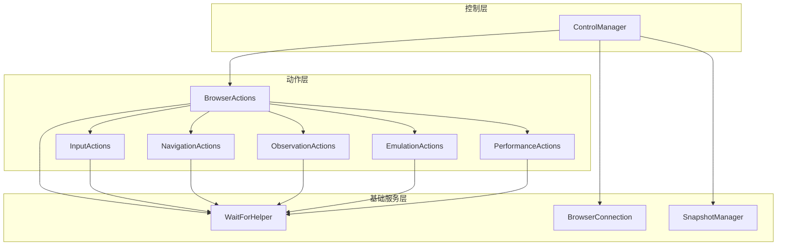
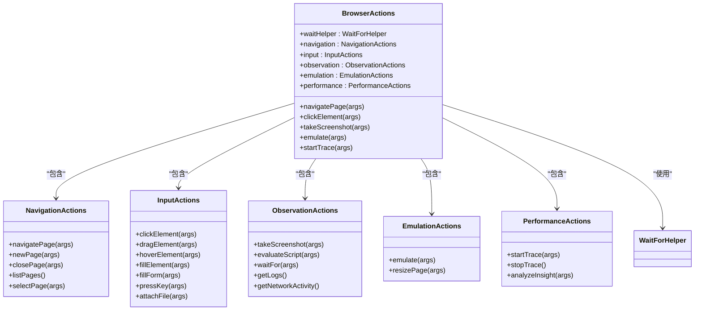
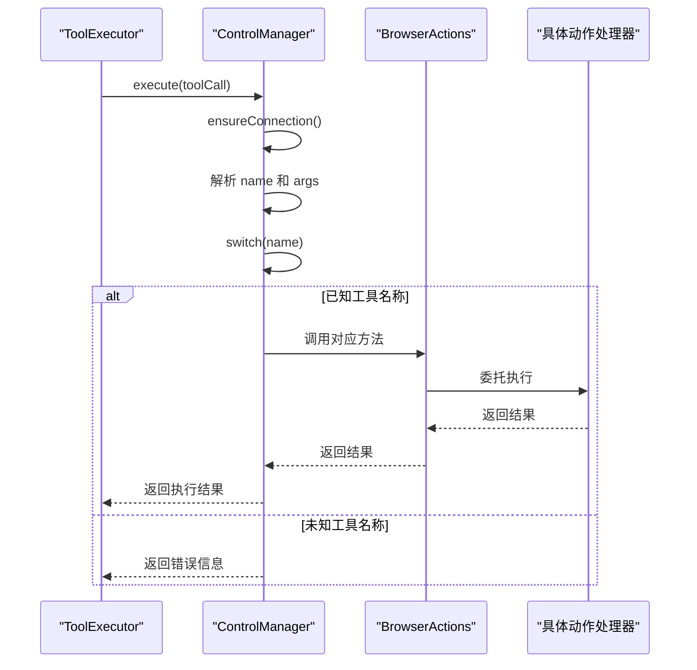
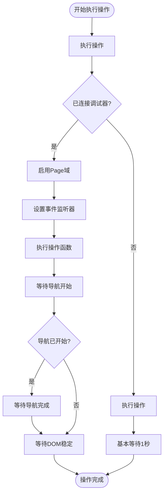
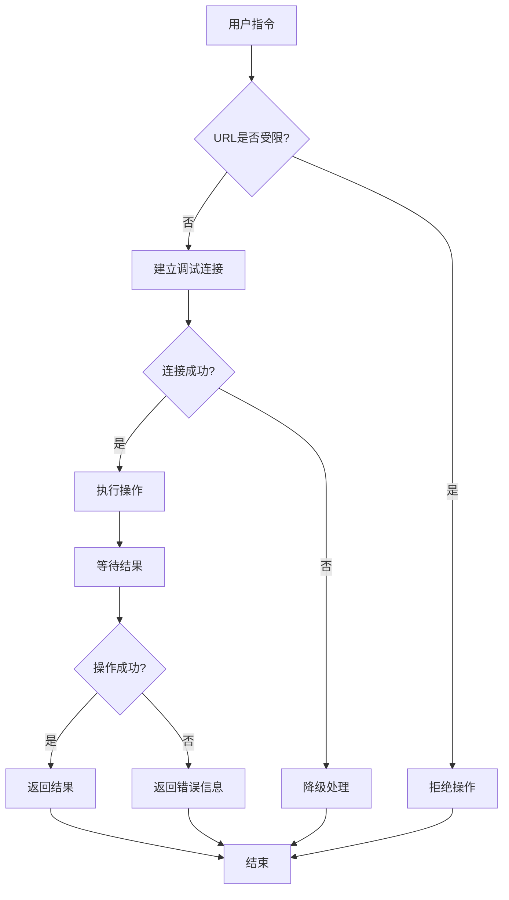

# 浏览器控制

<cite>
**本文档引用的文件**  
- [actions.js](file://background/control/actions.js)
- [control_manager.js](file://background/managers/control_manager.js)
- [wait_helper.js](file://background/control/wait_helper.js)
- [base.js](file://background/control/actions/base.js)
- [navigation.js](file://background/control/actions/navigation.js)
- [input.js](file://background/control/actions/input.js)
- [observation.js](file://background/control/actions/observation.js)
- [emulation.js](file://background/control/actions/emulation.js)
- [performance.js](file://background/control/actions/performance.js)
- [mouse.js](file://background/control/actions/input/mouse.js)
- [keyboard.js](file://background/control/actions/input/keyboard.js)
- [file.js](file://background/control/actions/input/file.js)
- [connection.js](file://background/control/connection.js)
- [snapshot.js](file://background/control/snapshot.js)
- [tool_executor.js](file://background/handlers/session/prompt/tool_executor.js)
</cite>

## 目录
1. [简介](#简介)
2. [核心架构](#核心架构)
3. [BrowserActions 外观模式](#browseractions-外观模式)
4. [ControlManager 分发机制](#controlmanager-分发机制)
5. [WaitForHelper 等待逻辑](#waitforhelper-等待逻辑)
6. [自然语言指令示例](#自然语言指令示例)
7. [安全模型与权限管理](#安全模型与权限管理)

## 简介
本系统通过自然语言指令实现浏览器自动化控制，支持页面导航、表单填写、元素交互等操作。系统基于 Chrome DevTools 协议（CDP）构建，通过外观模式聚合多个动作模块，并由控制管理器统一调度执行。

## 核心架构
系统采用分层架构设计，包含控制层、动作层、连接层和快照管理层。控制管理器作为核心协调者，负责建立调试连接、管理会话状态并分发工具调用请求至具体动作处理器。

**图示来源**
- [control_manager.js](file://background/managers/control_manager.js#L11-L16)
- [actions.js](file://background/control/actions.js#L13-L23)
- [wait_helper.js](file://background/control/wait_helper.js#L8-L11)
- [connection.js](file://background/control/connection.js#L8-L10)
- [snapshot.js](file://background/control/snapshot.js#L9-L11)

## BrowserActions 外观模式
`BrowserActions` 类作为外观模式的实现，聚合了导航、输入、观察、仿真和性能等多个动作模块，为上层提供统一的接口。

### 动作模块聚合
- **导航模块**：处理页面跳转、新标签页、关闭页面等操作
- **输入模块**：封装点击、拖拽、悬停、填写、按键等用户交互
- **观察模块**：支持截图、脚本执行、文本等待等观察性操作
- **仿真模块**：提供网络条件、CPU节流、地理位置等环境仿真
- **性能模块**：实现性能追踪和分析功能

**图示来源**
- [actions.js](file://background/control/actions.js#L13-L54)
- [navigation.js](file://background/control/actions/navigation.js#L5-L61)
- [input.js](file://background/control/actions/input.js#L8-L62)
- [observation.js](file://background/control/actions/observation.js#L5-L200)
- [emulation.js](file://background/control/actions/emulation.js#L13-L82)
- [performance.js](file://background/control/actions/performance.js#L6-L74)

**本节来源**
- [actions.js](file://background/control/actions.js#L3-L54)

## ControlManager 分发机制
`ControlManager` 是系统的核心控制器，负责接收工具调用请求并分发到相应的动作处理器。

### 请求分发流程
1. 确保与当前标签页建立调试连接
2. 解析工具调用名称和参数
3. 根据工具名称匹配对应的动作处理器
4. 执行具体操作并返回结果
5. 处理异常情况并提供错误信息

**图示来源**
- [control_manager.js](file://background/managers/control_manager.js#L11-L158)
- [tool_executor.js](file://background/handlers/session/prompt/tool_executor.js#L4-L48)

**本节来源**
- [control_manager.js](file://background/managers/control_manager.js#L43-L158)

## WaitForHelper 等待逻辑
`WaitForHelper` 类负责处理操作间的等待逻辑，确保操作的稳定性和可靠性。

### 等待策略
- **导航检测**：监听页面导航事件，等待导航完成
- **DOM稳定**：使用 MutationObserver 检测 DOM 变化，确保页面稳定
- **超时控制**：根据 CPU 和网络倍数动态调整等待时间
- **降级处理**：在无法建立调试连接时提供基本等待

**图示来源**
- [wait_helper.js](file://background/control/wait_helper.js#L8-L148)

**本节来源**
- [wait_helper.js](file://background/control/wait_helper.js#L8-L148)

## 自然语言指令示例
系统支持通过自然语言指令实现各种浏览器自动化操作。

### 页面导航示例
- "打开 https://www.example.com"
- "后退一页"
- "刷新当前页面"
- "新建标签页并访问 https://www.google.com"

### 表单填写示例
- "在搜索框中输入 '人工智能'"
- "填写表单：用户名=张三，密码=123456"
- "点击登录按钮"
- "上传文件到附件区域"

### 元素交互示例
- "将文件A拖拽到文件夹B"
- "悬停在用户头像上"
- "按下回车键"
- "等待页面出现 '登录成功' 文本"

**本节来源**
- [navigation.js](file://background/control/actions/navigation.js#L6-L31)
- [input.js](file://background/control/actions/input.js#L16-L48)
- [observation.js](file://background/control/actions/observation.js#L98-L123)

## 安全模型与权限管理
系统实现了多层次的安全控制机制，确保浏览器操作的安全性。

### 权限控制
- **受限URL检查**：禁止对 chrome://、edge://、about: 等系统页面进行操作
- **调试连接验证**：确保只有在有效标签页上才能建立调试连接
- **操作范围限制**：所有操作仅限于当前浏览器窗口和标签页
- **用户确认机制**：敏感操作需要用户明确指令

### 安全特性
- **沙箱环境**：在独立的背景页中执行所有自动化操作
- **最小权限原则**：仅请求必要的浏览器权限
- **错误处理**：完善的异常捕获和错误报告机制
- **状态隔离**：每个会话的状态相互隔离，避免交叉影响

**图示来源**
- [control_manager.js](file://background/managers/control_manager.js#L20-L37)
- [connection.js](file://background/control/connection.js#L60-L119)

**本节来源**
- [control_manager.js](file://background/managers/control_manager.js#L20-L37)
- [connection.js](file://background/control/connection.js#L60-L119)