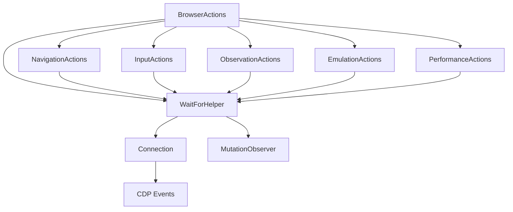
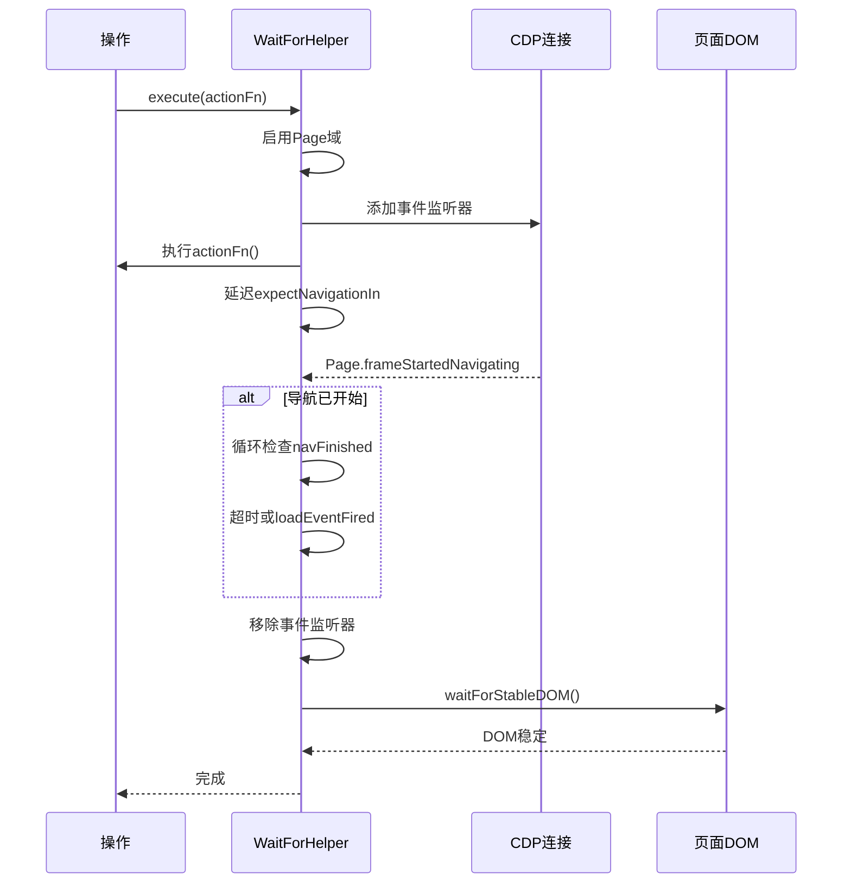
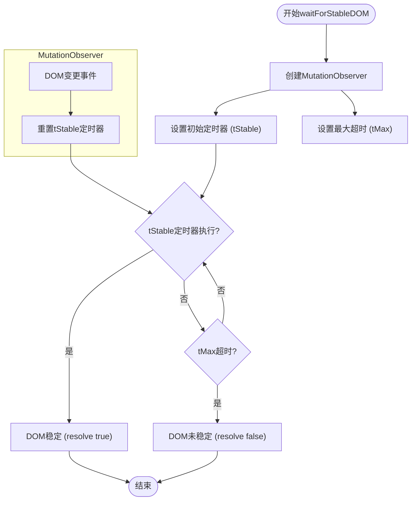

# 等待机制

<cite>
**本文档引用的文件**  
- [wait_helper.js](file://background/control/wait_helper.js)
- [actions.js](file://background/control/actions.js)
- [base.js](file://background/control/actions/base.js)
- [observation.js](file://background/control/actions/observation.js)
- [navigation.js](file://background/control/actions/navigation.js)
- [mouse.js](file://background/control/actions/input/mouse.js)
- [keyboard.js](file://background/control/actions/input/keyboard.js)
- [emulation.js](file://background/control/actions/emulation.js)
- [connection.js](file://background/control/connection.js)
- [performance.js](file://background/control/actions/performance.js)
</cite>

## 目录
1. [引言](#引言)
2. [等待机制架构](#等待机制架构)
3. [WaitForHelper 核心实现](#waitforhelper-核心实现)
4. [等待条件类型与检测逻辑](#等待条件类型与检测逻辑)
5. [WaitHelper 与 BrowserActions 协同工作](#waithelper-与-browseractions-协同工作)
6. [典型使用场景](#典型使用场景)
7. [参数配置最佳实践](#参数配置最佳实践)
8. [性能影响与优化](#性能影响与优化)
9. [结论](#结论)

## 引言

等待机制是确保浏览器自动化操作时序正确性的核心组件。在动态网页环境中，操作（如点击、导航）可能触发异步事件（如页面跳转、AJAX加载、DOM更新），若后续操作在这些事件完成前执行，将导致元素定位失败或数据不一致。本系统通过 `WaitForHelper` 类实现了智能等待策略，结合 Chrome DevTools Protocol (CDP) 事件监听与 DOM 变更观察，确保每个操作后页面达到稳定状态，从而保障自动化流程的可靠性。

## 等待机制架构

等待机制的架构围绕 `WaitForHelper` 类构建，该类被集成到各个操作模块中，形成统一的等待策略。`BrowserActions` 作为外观模式的门面，为所有操作模块（导航、输入、观察等）提供共享的 `WaitHelper` 实例，确保了等待逻辑的一致性。



**图表来源**
- [actions.js](file://background/control/actions.js#L14-L23)
- [wait_helper.js](file://background/control/wait_helper.js#L8-L12)

**本节来源**
- [actions.js](file://background/control/actions.js#L13-L23)
- [wait_helper.js](file://background/control/wait_helper.js#L8-L12)

## WaitForHelper 核心实现

`WaitForHelper` 类是等待机制的核心，它通过 `execute` 方法封装了操作执行后的等待流程。该流程分为四个阶段：执行操作、检测导航、等待导航完成、等待DOM稳定。

### 执行与等待流程



**图表来源**
- [wait_helper.js](file://background/control/wait_helper.js#L40-L90)

**本节来源**
- [wait_helper.js](file://background/control/wait_helper.js#L8-L90)

### 超时参数配置

`WaitForHelper` 的超时参数根据CPU和网络倍率动态调整，以适应不同的性能测试场景。

| 参数 | 默认值 | 描述 | 计算公式 |
| :--- | :--- | :--- | :--- |
| `stableDom` | 3000 * cpu | DOM稳定最大等待时间 | CPU倍率影响 |
| `stableDomFor` | 100 * cpu | 无变更即稳定的持续时间 | CPU倍率影响 |
| `expectNavigationIn` | 200 * cpu | 操作后检测导航启动的等待时间 | CPU倍率影响 |
| `navigation` | 15000 * network | 导航完成最大等待时间 | 网络倍率影响 |

**本节来源**
- [wait_helper.js](file://background/control/wait_helper.js#L24-L33)

## 等待条件类型与检测逻辑

系统支持多种等待条件，每种条件对应不同的检测逻辑。

### 导航等待

通过监听 CDP 的 `Page.frameStartedNavigating` 和 `Page.loadEventFired` 事件来检测导航。操作执行后，系统会短暂等待（`expectNavigationIn`），如果检测到导航开始，则进入循环等待，直到 `loadEventFired` 事件触发或超时。

### DOM稳定等待

使用 `MutationObserver` API 监听 `document.body` 及其子树的变更。当发生变更时，会重置一个计时器（`stabilityDuration`）。只有当计时器成功执行（即在 `stabilityDuration` 内无任何变更），才认为DOM稳定。同时设置一个最大安全超时（`timeout`），防止页面永远不进入稳定状态。



**图表来源**
- [wait_helper.js](file://background/control/wait_helper.js#L97-L138)

**本节来源**
- [wait_helper.js](file://background/control/wait_helper.js#L97-L138)

### 文本出现等待

`ObservationActions` 模块提供了 `waitFor` 方法，用于等待特定文本在页面中出现。该方法通过在页面上下文中执行一个异步脚本，循环检查 `document.body.innerText` 是否包含目标文本，直到超时或找到文本。

**本节来源**
- [observation.js](file://background/control/actions/observation.js#L98-L127)

## WaitHelper 与 BrowserActions 协同工作

`BrowserActions` 类在构造时会创建一个共享的 `WaitForHelper` 实例，并将其传递给所有子操作模块。这种设计确保了整个自动化流程中等待策略的一致性。

### 协同工作流程

1.  **初始化**：`BrowserActions` 构造函数创建 `WaitForHelper` 实例。
2.  **传递**：`WaitForHelper` 实例作为参数传递给 `NavigationActions`、`InputActions` 等。
3.  **调用**：子模块在执行具体操作时，调用 `this.waitHelper.execute()` 来包装操作函数。

例如，在 `clickElement` 操作中，物理点击事件和JS回退逻辑都被 `waitHelper.execute()` 包裹，确保点击后自动等待导航和DOM稳定。

**本节来源**
- [actions.js](file://background/control/actions.js#L16-L22)
- [mouse.js](file://background/control/actions/input/mouse.js#L24-L47)

## 典型使用场景

### 等待动态内容加载后点击

这是最常见的场景。当点击一个按钮后，页面会通过AJAX加载新内容，新内容中的元素在加载完成前是不可见的。

```javascript
// 1. 点击按钮，触发加载
await browserActions.input.clickElement({ uid: "btn-load-data" });

// 2. 等待新内容中的文本出现
await browserActions.observation.waitFor({ text: "数据加载完成", timeout: 10000 });

// 3. 点击新出现的元素
await browserActions.input.clickElement({ uid: "btn-process-data" });
```

在此流程中，第一步的 `clickElement` 内部已通过 `WaitForHelper` 确保了操作的原子性。第二步显式等待目标文本，第三步才安全执行。

**本节来源**
- [mouse.js](file://background/control/actions/input/mouse.js#L7-L50)
- [observation.js](file://background/control/actions/observation.js#L98-L127)

## 参数配置最佳实践

### 超时设置

-   **`timeout` (DOM稳定)**：默认3秒通常足够。对于复杂SPA应用，可适当增加至5-10秒。
-   **`stabilityDuration`**：默认100毫秒。对于快速动画，可设为200-300毫秒；对于静态页面，可降低至50毫秒以加快速度。
-   **`navigation`**：默认15秒。对于已知的慢速网络，应通过 `emulate` 方法设置网络倍率，`WaitForHelper` 会自动延长超时。

### 轮询间隔

-   **`waitFor` 文本等待**：轮询间隔为200毫秒，平衡了响应速度和性能。
-   **`waitForStableDOM`**：内部使用 `MutationObserver`，是事件驱动的，无需轮询，性能开销极低。

**本节来源**
- [wait_helper.js](file://background/control/wait_helper.js#L24-L33)
- [observation.js](file://background/control/actions/observation.js#L110)

## 性能影响与优化

### 高频率检测的影响

-   **`waitFor` 文本等待**：高频率的 `Runtime.evaluate` 调用会增加CDP通信开销和页面JS执行负担，可能导致页面卡顿。
-   **`MutationObserver`**：现代浏览器对此API优化良好，其性能开销远低于传统的轮询方式，是推荐的DOM变更检测方案。

### 优化方法

1.  **优先使用事件驱动**：尽可能利用CDP事件（如导航事件）和 `MutationObserver`，避免轮询。
2.  **合理设置超时**：避免设置过长的超时，防止测试流程无谓等待。
3.  **使用精确选择器**：在 `waitFor` 中，等待特定、唯一的文本，避免因等待过于宽泛的内容而导致误判或长时间等待。
4.  **结合网络条件模拟**：使用 `emulate` 方法模拟慢速网络时，`WaitForHelper` 会自动调整 `navigation` 超时，无需手动干预。

**本节来源**
- [wait_helper.js](file://background/control/wait_helper.js#L19-L33)
- [emulation.js](file://background/control/actions/emulation.js#L35-L45)

## 结论

本系统的等待机制通过 `WaitForHelper` 类实现了高效、可靠的同步策略。它结合了CDP事件监听和 `MutationObserver`，能够智能地处理导航和DOM变更，确保操作时序的正确性。通过与 `BrowserActions` 的深度集成，该机制为所有自动化操作提供了统一的等待保障。合理配置超时参数并遵循最佳实践，可以在保证稳定性的同时，最大限度地减少对页面性能的影响。