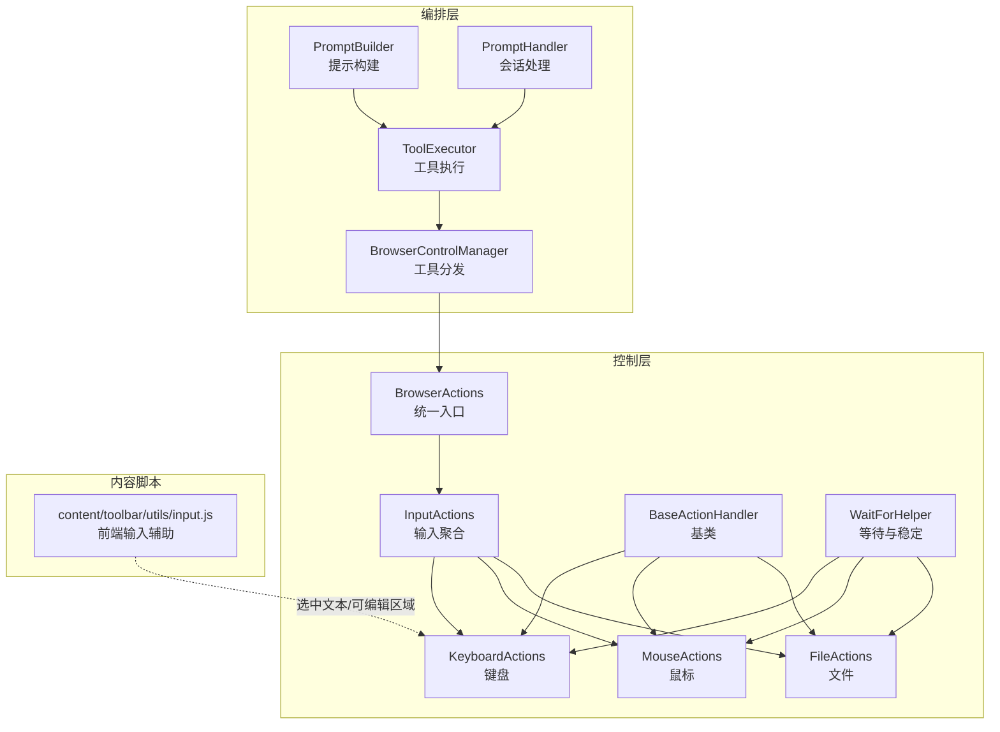
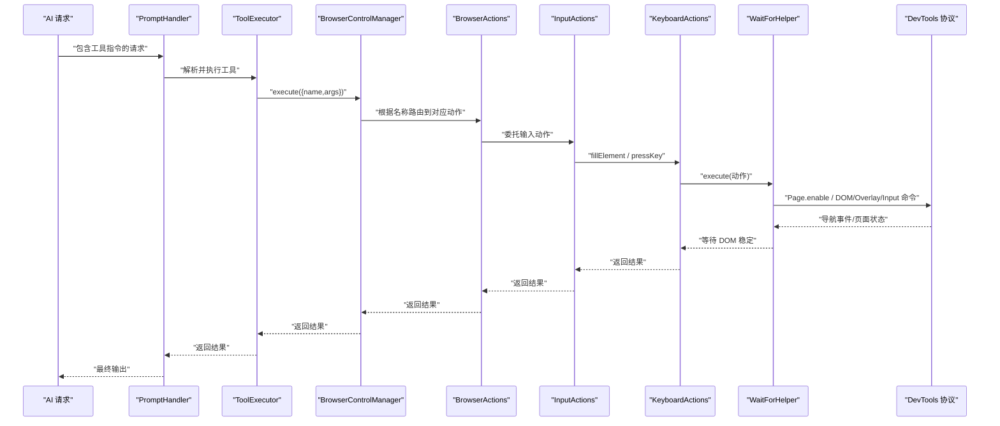
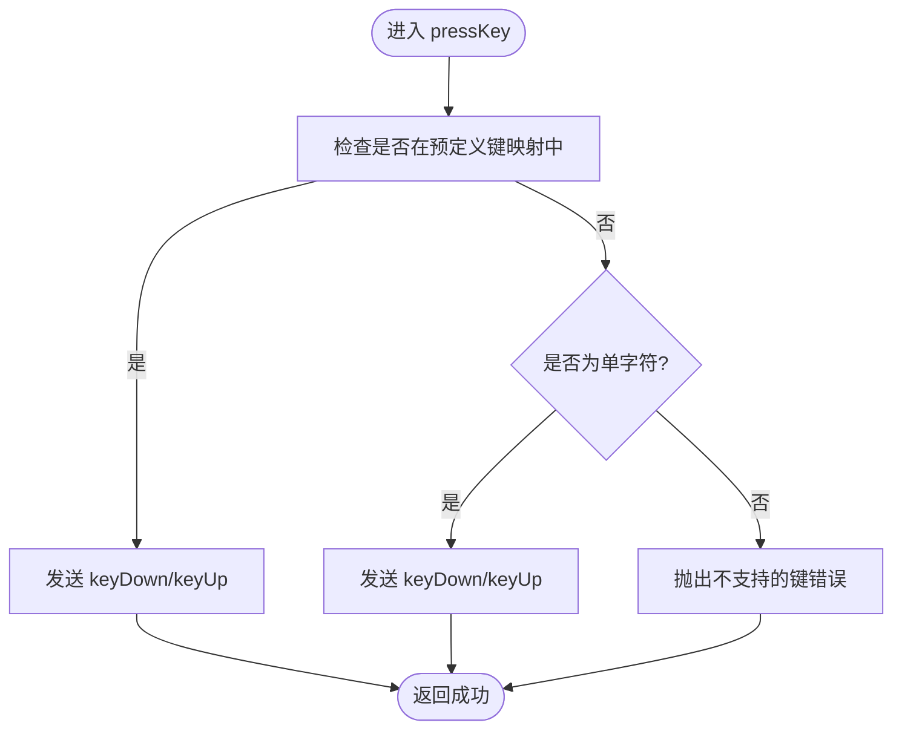
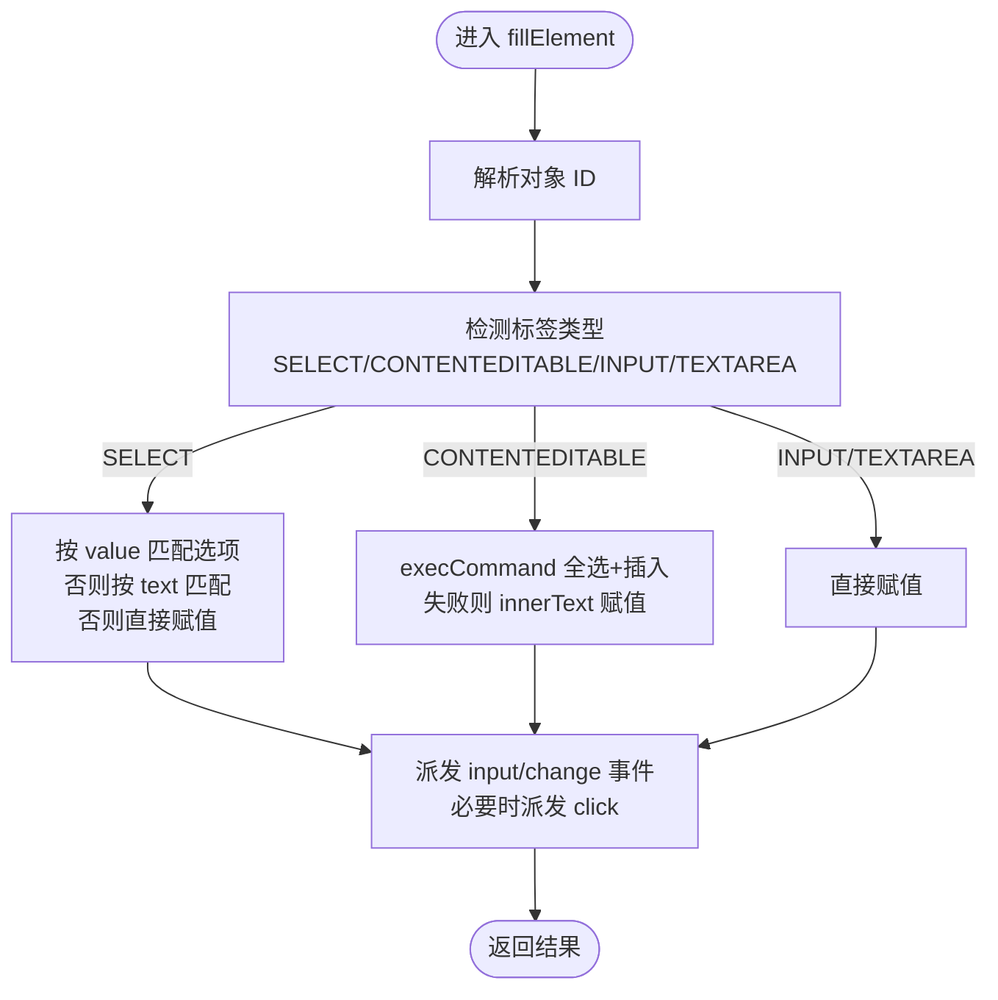
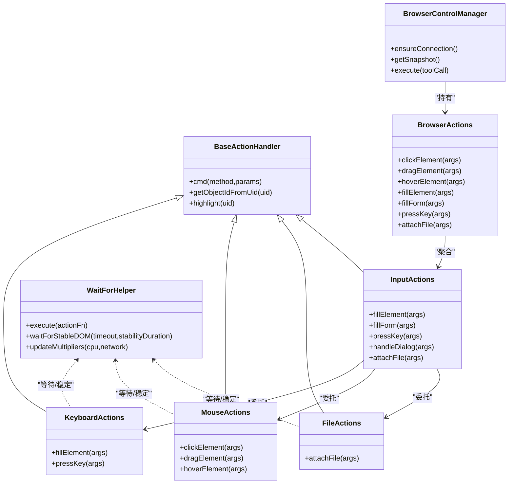

# 输入控制

<cite>
**本文引用的文件列表**
- [keyboard.js](file://background/control/actions/input/keyboard.js)
- [input.js](file://background/control/actions/input.js)
- [mouse.js](file://background/control/actions/input/mouse.js)
- [file.js](file://background/control/actions/input/file.js)
- [base.js](file://background/control/actions/base.js)
- [actions.js](file://background/control/actions.js)
- [wait_helper.js](file://background/control/wait_helper.js)
- [control_manager.js](file://background/managers/control_manager.js)
- [tool_executor.js](file://background/handlers/session/prompt/tool_executor.js)
- [builder.js](file://background/handlers/session/prompt/builder.js)
- [prompt_handler.js](file://background/handlers/session/prompt_handler.js)
- [input.js](file://content/toolbar/utils/input.js)
</cite>

## 目录
1. [简介](#简介)
2. [项目结构](#项目结构)
3. [核心组件](#核心组件)
4. [架构总览](#架构总览)
5. [详细组件分析](#详细组件分析)
6. [依赖关系分析](#依赖关系分析)
7. [性能考量](#性能考量)
8. [故障排查指南](#故障排查指南)
9. [结论](#结论)
10. [附录](#附录)

## 简介
本文件聚焦于浏览器输入控制能力，系统性解析键盘与表单输入操作的实现原理，涵盖以下要点：
- press_key、fill、fill_form 和 handle_dialog 等输入工具的工作流程
- BrowserActions 如何通过 DevTools 协议（CDP）模拟真实用户键盘事件与表单填写行为
- 基于 AI 指令的自动化示例：自动填充登录表单、触发快捷键操作
- 特殊字符与组合键支持机制
- 输入延迟与事件序列优化策略

## 项目结构
输入控制位于后台模块的“控制”子系统中，采用分层设计：
- 基类与通用能力：BaseActionHandler 提供连接、等待、节点解析与高亮等通用能力
- 输入动作聚合：InputActions 聚合鼠标、键盘、文件三类输入动作
- 行为编排：BrowserActions 作为统一入口，向外部暴露导航、观察、输入、仿真、性能等能力
- 等待与稳定性：WaitForHelper 统一处理导航检测与 DOM 稳定性等待
- 控制编排：BrowserControlManager 负责连接、快照与工具调用分发
- AI 集成：PromptBuilder、ToolExecutor、PromptHandler 将输入控制纳入 AI 工具链

图表来源
- [actions.js](file://background/control/actions.js#L13-L54)
- [input.js](file://background/control/actions/input.js#L8-L14)
- [keyboard.js](file://background/control/actions/input/keyboard.js#L5-L74)
- [mouse.js](file://background/control/actions/input/mouse.js#L5-L70)
- [file.js](file://background/control/actions/input/file.js#L5-L29)
- [base.js](file://background/control/actions/base.js#L5-L34)
- [wait_helper.js](file://background/control/wait_helper.js#L8-L90)
- [control_manager.js](file://background/managers/control_manager.js#L11-L16)
- [tool_executor.js](file://background/handlers/session/prompt/tool_executor.js#L4-L47)
- [builder.js](file://background/handlers/session/prompt/builder.js#L5-L43)
- [prompt_handler.js](file://background/handlers/session/prompt_handler.js#L33-L61)
- [input.js](file://content/toolbar/utils/input.js#L3-L133)

章节来源
- [actions.js](file://background/control/actions.js#L13-L54)
- [input.js](file://background/control/actions/input.js#L8-L14)
- [base.js](file://background/control/actions/base.js#L5-L34)
- [wait_helper.js](file://background/control/wait_helper.js#L8-L90)
- [control_manager.js](file://background/managers/control_manager.js#L11-L16)
- [tool_executor.js](file://background/handlers/session/prompt/tool_executor.js#L4-L47)
- [builder.js](file://background/handlers/session/prompt/builder.js#L5-L43)
- [prompt_handler.js](file://background/handlers/session/prompt_handler.js#L33-L61)
- [input.js](file://content/toolbar/utils/input.js#L3-L133)

## 核心组件
- KeyboardActions：封装键盘按键与元素值注入，支持 SELECT、CONTENTEDITABLE、INPUT/TEXTAREA 的差异化处理，并派发 input/change 等事件以驱动前端框架监听器
- InputActions：输入聚合器，提供 fillElement、fillForm、pressKey、handleDialog、attachFile 等接口；内部复用 KeyboardActions 与 MouseActions 的稳健逻辑
- MouseActions：封装点击、拖拽、悬停，优先使用 CDP Input.dispatchMouseEvent，失败时回退到 JS 模拟
- FileActions：封装文件附件，基于 DOM.setFileInputFiles
- BaseActionHandler：提供 cmd 发送命令、节点对象解析、可视化高亮等通用能力
- WaitForHelper：统一处理导航开始/完成检测与 DOM 稳定等待，支持 CPU/网络倍数调整
- BrowserActions：对外门面，聚合导航、输入、观察、仿真、性能等能力
- BrowserControlManager：连接、快照与工具分发的编排者
- PromptBuilder/ToolExecutor/PromptHandler：将输入控制接入 AI 工具链

章节来源
- [keyboard.js](file://background/control/actions/input/keyboard.js#L5-L74)
- [input.js](file://background/control/actions/input.js#L8-L61)
- [mouse.js](file://background/control/actions/input/mouse.js#L5-L70)
- [file.js](file://background/control/actions/input/file.js#L5-L29)
- [base.js](file://background/control/actions/base.js#L5-L34)
- [wait_helper.js](file://background/control/wait_helper.js#L8-L90)
- [actions.js](file://background/control/actions.js#L13-L54)
- [control_manager.js](file://background/managers/control_manager.js#L11-L16)
- [tool_executor.js](file://background/handlers/session/prompt/tool_executor.js#L4-L47)
- [builder.js](file://background/handlers/session/prompt/builder.js#L5-L43)
- [prompt_handler.js](file://background/handlers/session/prompt_handler.js#L33-L61)

## 架构总览
下图展示了从 AI 指令到浏览器输入的实际调用链路，以及关键事件序列与等待策略。

图表来源
- [prompt_handler.js](file://background/handlers/session/prompt_handler.js#L33-L61)
- [tool_executor.js](file://background/handlers/session/prompt/tool_executor.js#L4-L47)
- [control_manager.js](file://background/managers/control_manager.js#L43-L157)
- [actions.js](file://background/control/actions.js#L13-L54)
- [input.js](file://background/control/actions/input.js#L8-L61)
- [keyboard.js](file://background/control/actions/input/keyboard.js#L5-L74)
- [wait_helper.js](file://background/control/wait_helper.js#L40-L90)

## 详细组件分析

### 键盘输入：press_key
- 支持的键位：预定义映射覆盖 Enter、Backspace、Tab、Escape、Delete、方向键、PageUp/PageDown、End/Home、Space 等
- 字符输入：单字符键按字符键值发送 keyDown/keyUp
- 事件序列：先 keyDown，再 keyUp，确保与真实用户输入一致
- 错误处理：不支持的键抛出错误并返回友好信息

图表来源
- [keyboard.js](file://background/control/actions/input/keyboard.js#L76-L114)

章节来源
- [keyboard.js](file://background/control/actions/input/keyboard.js#L76-L114)

### 表单输入：fill 与 fill_form
- fillElement：
  - 支持 SELECT：优先按 value 匹配，其次按可见文本匹配，最后回退到直接赋值
  - 支持 CONTENTEDITABLE：优先使用 execCommand 全选+插入文本，失败时回退到 innerText
  - 支持 INPUT/TEXTAREA：直接赋值
  - 派发 input/change 事件，必要时派发 click 事件以触发特定 select 的监听器
- fillForm：
  - 接收 elements 数组，逐项校验 { uid, value }，复用 fillElement 并收集结果

图表来源
- [keyboard.js](file://background/control/actions/input/keyboard.js#L7-L74)

章节来源
- [keyboard.js](file://background/control/actions/input/keyboard.js#L7-L74)
- [input.js](file://background/control/actions/input.js#L22-L44)

### 对话框处理：handle_dialog
- 使用 Page.handleJavaScriptDialog 接受或拒绝弹窗，支持传入 promptText
- 若无弹窗或调用失败，返回错误提示

章节来源
- [input.js](file://background/control/actions/input.js#L50-L60)

### 鼠标输入：click/drag/hover
- clickElement：
  - 优先使用 CDP Input.dispatchMouseEvent，计算元素中心坐标，先移动再按下/抬起，支持双击
  - 失败时回退到 JS 模拟，派发 mousedown/mouseup/click
- dragElement：
  - 计算起点与终点，分步发送 mouseMoved，形成拖拽轨迹，每步延时以模拟真实速度
- hoverElement：
  - 移动到元素中心，等待 DOM 稳定（用于 tooltip、菜单等）

章节来源
- [mouse.js](file://background/control/actions/input/mouse.js#L7-L70)
- [mouse.js](file://background/control/actions/input/mouse.js#L72-L119)
- [mouse.js](file://background/control/actions/input/mouse.js#L121-L145)

### 文件附件：attach_file
- 通过 DOM.setFileInputFiles 设置文件路径数组，需先启用 DOM 域
- 返回成功/失败信息

章节来源
- [file.js](file://background/control/actions/input/file.js#L7-L29)

### 前端输入辅助：content/toolbar/utils/input.js
- InputManager：
  - capture：捕获当前选中的 INPUT/TEXTAREA 或 CONTENTEDITABLE
  - insert：在选区范围内插入/替换文本，派发 input 事件
  - 支持范围替换与光标定位，兼容 textarea/input 与 contenteditable

章节来源
- [input.js](file://content/toolbar/utils/input.js#L3-L133)

## 依赖关系分析

图表来源
- [base.js](file://background/control/actions/base.js#L5-L34)
- [keyboard.js](file://background/control/actions/input/keyboard.js#L5-L74)
- [mouse.js](file://background/control/actions/input/mouse.js#L5-L70)
- [file.js](file://background/control/actions/input/file.js#L5-L29)
- [input.js](file://background/control/actions/input.js#L8-L61)
- [actions.js](file://background/control/actions.js#L13-L54)
- [wait_helper.js](file://background/control/wait_helper.js#L8-L90)
- [control_manager.js](file://background/managers/control_manager.js#L11-L16)

章节来源
- [base.js](file://background/control/actions/base.js#L5-L34)
- [keyboard.js](file://background/control/actions/input/keyboard.js#L5-L74)
- [mouse.js](file://background/control/actions/input/mouse.js#L5-L70)
- [file.js](file://background/control/actions/input/file.js#L5-L29)
- [input.js](file://background/control/actions/input.js#L8-L61)
- [actions.js](file://background/control/actions.js#L13-L54)
- [wait_helper.js](file://background/control/wait_helper.js#L8-L90)
- [control_manager.js](file://background/managers/control_manager.js#L11-L16)

## 性能考量
- 导航与 DOM 稳定性等待
  - WaitForHelper 在动作前后检测 Page.frameStartedNavigating/Page.loadEventFired，避免过早断言 DOM 状态
  - 通过 MutationObserver 等待稳定窗口，防止因异步更新导致的竞态
- CPU/网络倍数调整
  - 通过 updateMultipliers 调整等待超时，适配仿真环境下的 CPU 限速与网络延迟
- 鼠标拖拽步进
  - dragElement 分步发送 mouseMoved，步长与延时可调，平衡真实感与性能
- 事件派发
  - fillElement 明确派发 input/change 事件，减少前端框架监听缺失导致的二次等待

章节来源
- [wait_helper.js](file://background/control/wait_helper.js#L19-L34)
- [wait_helper.js](file://background/control/wait_helper.js#L40-L90)
- [mouse.js](file://background/control/actions/input/mouse.js#L103-L112)

## 故障排查指南
- “节点未找到”
  - 现象：getObjectIdFromUid 抛错或高亮失败
  - 原因：快照未更新或 UID 不正确
  - 处理：先调用 take_snapshot，确认 UID 来源
- “无弹窗但报错”
  - 现象：handle_dialog 返回错误提示
  - 原因：当前页面无弹窗或权限受限
  - 处理：确认弹窗存在后再调用，或在受限页面禁用该工具
- “输入无效或未触发框架监听”
  - 现象：fillElement 成功但前端无响应
  - 原因：未派发 input/change 或目标为特殊控件
  - 处理：确认已派发事件；对于 select，尝试点击以触发监听
- “拖拽未生效”
  - 现象：dragElement 返回错误
  - 原因：起止点无 box model 或坐标异常
  - 处理：确保元素可见且可滚动至视图；检查 from_uid/to_uid 正确性
- “受限页面无法连接”
  - 现象：execute 返回“受限 URL”
  - 原因：chrome://、about: 等页面禁止附加
  - 处理：切换到可访问页面

章节来源
- [base.js](file://background/control/actions/base.js#L25-L34)
- [input.js](file://background/control/actions/input.js#L50-L60)
- [mouse.js](file://background/control/actions/input/mouse.js#L72-L119)
- [control_manager.js](file://background/managers/control_manager.js#L20-L31)

## 结论
本输入控制系统以 BrowserActions 为统一入口，通过 InputActions 聚合键盘、鼠标、文件三类输入能力，并借助 WaitForHelper 实现稳定的导航与 DOM 等待。其核心优势在于：
- 以 DevTools 协议模拟真实用户输入，保证与前端框架的兼容性
- 针对不同输入类型（select/contenteditable/input/textarea）采用差异化策略
- 将输入控制无缝接入 AI 工具链，支持通过自然语言指令自动填充登录表单、触发快捷键与处理弹窗

## 附录

### AI 指令示例：自动填充登录表单
- 步骤
  1) 获取页面结构：调用 take_snapshot
  2) 定位用户名/密码输入框与提交按钮：使用 fill_form 传入 { uid, value } 列表
  3) 触发提交：clickElement 或 pressKey(Enter)
  4) 处理弹窗：handle_dialog(accept=true)
- 注意事项
  - 确保每个元素都有有效 uid
  - 对 select 类型可传入 value 或 text
  - 对 contenteditable 场景可先选中文本再插入

章节来源
- [input.js](file://background/control/actions/input.js#L22-L44)
- [keyboard.js](file://background/control/actions/input/keyboard.js#L7-L74)
- [mouse.js](file://background/control/actions/input/mouse.js#L7-L70)
- [input.js](file://background/control/actions/input.js#L50-L60)

### 特殊字符与组合键支持机制
- 特殊字符：单字符键通过 text/key 参数发送，遵循浏览器原生行为
- 组合键：当前键盘模块未内置组合键（如 Ctrl/Cmd+C）的组合序列；如需组合键，请结合 click/hover 等动作配合使用，或在上层逻辑中拆分为多步操作

章节来源
- [keyboard.js](file://background/control/actions/input/keyboard.js#L94-L114)

### 输入延迟与事件序列优化策略
- 等待策略
  - 使用 WaitForHelper.execute 包裹动作，自动等待导航与 DOM 稳定
  - waitForStableDOM 通过 MutationObserver 等待稳定窗口，避免过早断言
- 事件序列
  - fillElement 明确派发 input/change；select 额外派发 click
  - pressKey 严格按 keyDown/keyUp 顺序
- 性能权衡
  - dragElement 的步进延时可按需调整
  - CPU/网络倍数可根据仿真强度动态调整

章节来源
- [wait_helper.js](file://background/control/wait_helper.js#L40-L90)
- [keyboard.js](file://background/control/actions/input/keyboard.js#L60-L68)
- [keyboard.js](file://background/control/actions/input/keyboard.js#L98-L105)
- [mouse.js](file://background/control/actions/input/mouse.js#L103-L112)